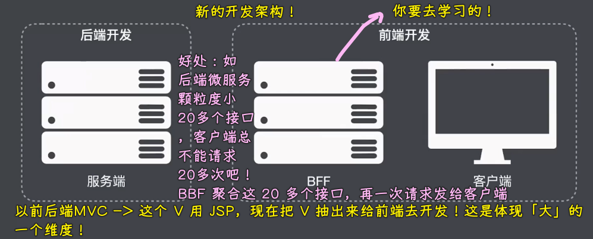
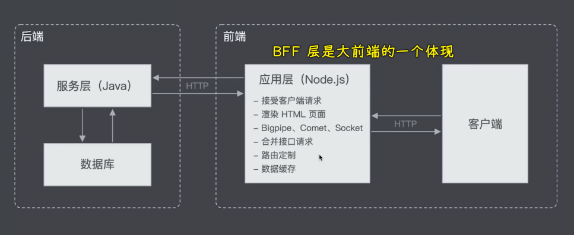
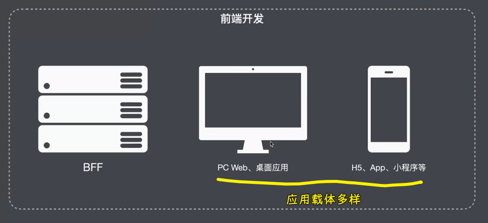
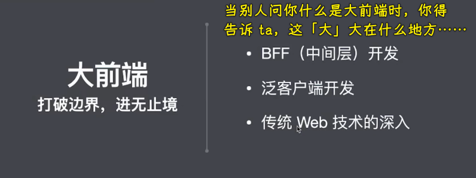
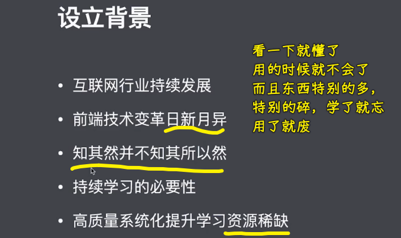
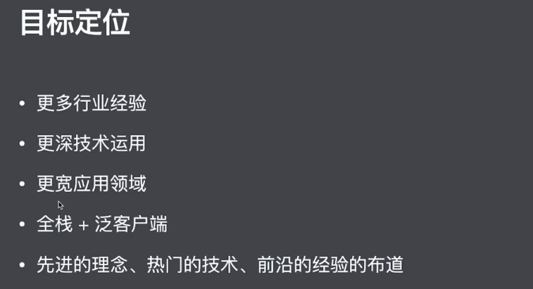
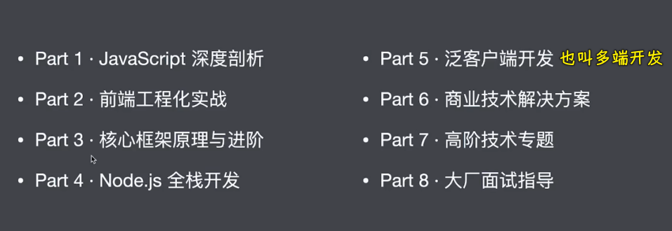

### ✍️ Tangxt ⏳ 2021-04-22 🏷️ 开班典礼

# 01-大前端高薪训练营开班典礼

## ★内容概要

## ★zce 老师为啥投身教育行业？

一些开发者对技术没追求，对技术的态度够用就行？不学新技术？

老师的看法：

- 坚信 -> 每个新技术的出现都会有它对应的价值！
- 老技术固然稳定，但并不一定适用于当下这么一个环境！

一些开发者对技术的态度与老师的认知矛盾了

老师在工作里边推行一些新技术和新方案的时候 -> 总会遇到特别大的阻力！ -> 于是，这就需要做大量的培训工作……

为了做一些优秀方案的构造 -> 老师把工作重心转向企业培训 -> 帮助企业更加方便、更加快捷地用上适合它们的技术方案

但这种形式，其影响是很有限的…… -> 加入 IT 教育领域！ -> 专攻前端领域的技术研发和教学 -> 希望可以通过技术影响到更多的人！

让自己觉得自豪和感到有意义的事儿 -> 通过自身的技术教学有慢慢影响到这个行业以及很多的开发者……

## ★zce 眼中的大前端

1）概述

很多人都在称呼这个行业为「大前端」，但是很多人并不能说明白这个「大前端」的「大」，「大」在什么地方……

之所以称之为大前端 -> 自然是因为它的职责越来越重要，它的战场越来越多样（战场指的是我们所需要开发的应用形式会越来越多样），而且我们应用的体积，即它的规模也会越来越复杂！

知道大前端的概念 -> 意味着你就有了一个持续学习的目标、方向！ -> 大前端会涉及哪些内容，你就去学哪些……

2）具体来看

大前端的第一个维度：把传统那些后端应用里边属于前端的部分交给前端去做！

一个完整的互联网应用，它一定是包括客户端和服务端这两部分的，而我们传统的认知的是 -> 前端它要做的是客户端的开发，而服务端这块是交给后端开发人员去完成的

但现在的认知是：

具体点的架构图：

第二个维度：互联网应用的形式越来越多样，各种应用的载体，如小程序等 -> 采用前端技术去做！

前端技术会慢慢发展成**纯客户端开发技术**！

有人断言，以后的开发方向，会变成两个方向：

- 端开发：前端考虑各种各样形式的客户端，如小程序、移动端 App 等
- 云开发：开发云服务

以前的前端只考虑 PC 端网站，移动端网站，现在的前端能去做小程序、移动 APP、桌面应用等等这些一系列的客户端形式了！ -> 这些都是现在的前端需要去考虑的东西！

> 第二个「大」，「大」在应用的形式！

---

3）总结

大前端的体现：

> 泛客户端：zce 个人取的名字，表示对各种各样形式的这种客户端的统称！

大前端还有一层隐性的意思——对传统 Web 开发技术的深入，如 10 年之前开发网页应用，需要用到 jQuery 这样的东西，但 10 年过后，我们已经开始有了各种各样的思想、各种各样的框架、各种各样的模式了 -> 其实说白了，就是 Web 开发技术还有继续深入改进的地方，你以为用 jQuery 就能开发一辈子？做梦呢！还有更好地技术方案嘞！

以上就是大前端，具体来看的三个维度！ -> 以后你跟别人聊到大前端的时候，你得清楚地知道这个「大」，大在什么地方？跟别人说「大」要更有底气一点，而不是支支吾吾的……

> 第一个知识点：对大前端有一个统一的认识！

## ★做教育的初衷

拉钩本身是做互联网企业人才服务的！ -> 深耕互联网招聘多年，积攒了很多互联网企业资源

在做企业的人岗匹配这种过程当中，拉钩发现「目前市面上人才的能力体系跟实际企业当中的用人需求实际上是不太匹配的上的！」

这就导致了大部分的企业找不到合适的人才，而很多的人才也找不到适合他们的优秀的企业，所以就有了「**拉钩教育**」这么一个版块了！

通过对大量的互联网公司的用人需求做了深度调研和整理过后，于是拉钩就和上百家互联网公司一起搭建了一套人才能力模型 -> 邀请了很多行业大佬一起精心研发了一系列职场提升的课程和服务 -> 希望帮助更多人找到更适合他们的职业机会！

总之，拉钩做教育的初衷是：

- 解决企业的用人问题以及人才的求职问题

## ★为什么要做大前端进阶训练营？

1）设立背景

前端技术今非昔比，技术变革日新月异！现在的前端开发水特别深，需要了解、掌握的，特别得多，特别得杂！

很多人都处在「知其然并不知其所以然」的状态！ -> 前端很多零零散散的东西，这些东西并不会特别的难，但这些东西就是特别的多，特别的碎，很多人看了一些东西，就觉得这个东西我知道了，那个东西我也知道了，但真正当他们去用的时候就发现「**这也不行，那也不行的**」，这就是所谓的「**知其然并不知其所以然**」

面对种类繁多的知识，日新月异的技术，就导致了我们必须要持续学习才能跟上行业内的发展了！

除此之外，目前市面上这种系统化、高质量的提升自己的学习资源其实也是很少的！

所以就有了这个训练营！

2）目标定位

目标：找到好工作，拿到好报酬！

> 更宽的应用领域 -> 指的是前端技术可以应用在移动端、移动端 APP、小程序、桌面应用等等一系列的这样一种应用形式上！

希望培养的是全栈型或泛客户端开发的这样一种开发人员！

为了满足这个目标，那么训练营会有哪些内容呢？

## ★训练营内容安排

1）概述

分为八大阶段：

- 商业技术解决方案：在企业当中对技术人员的要求，不仅仅是你要掌握一些技术，你还要把一些技术组合到一块形成一整套的方案去解决企业里边所面临的一些实际业务问题！
- 高阶技术专题：包括一些目前有很明显趋势或者即将成为热点的这样一些内容！
- 大厂面试指导
  - 专业技能的提升
  - 面试过程、简历编写

2）具体有哪些东西？

