### ✍️ Tangxt ⏳ 2021-04-25 🏷️ ES6

# 01-1-var、let、const

## ★前言

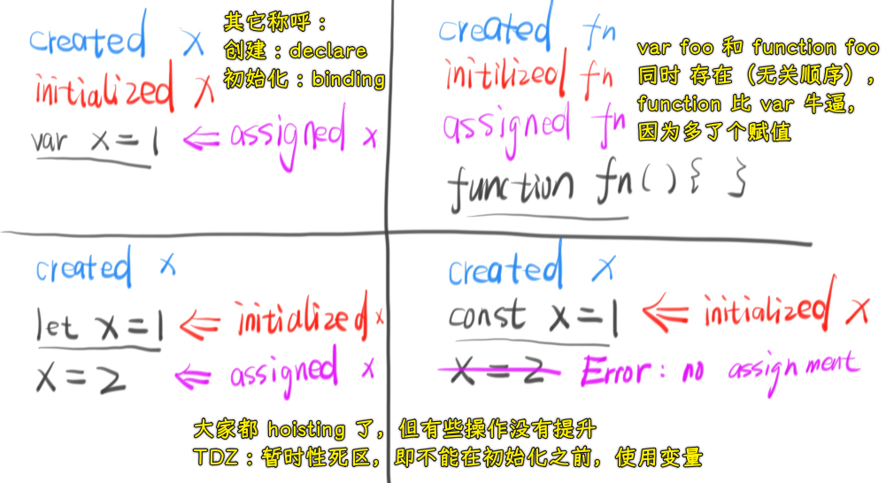

💡：`let x = x`报错之后，再`let x`会报错？

如果 `let x` 的初始化过程失败，那么：

1. x 变量就将永远处于 `created` 状态
2. 你无法再次对 x 进行初始化（初始化只有一次机会，而那次机会你失败了）
3. 由于 x 无法被初始化，所以 x 永远处在暂时死区（也就是盗梦空间里的 limbo）！
4. 有人会觉得 JS 坑，怎么能出现这种情况；其实问题不大，因为此时代码已经报错了，后面的代码想执行也没机会。

> limbo：陷入该状态的人，将长久处于一种毫无秩序的混沌状态。

这是一个可以让变量名凉凉的办法！

---

➹：[我用了两个月的时间才理解 let - 知乎](https://zhuanlan.zhihu.com/p/28140450)

➹：[电影中的 Limbo 解析（盗梦空间）影评](https://movie.douban.com/review/7671979/)

## ★let 与块级作用域

### <mark>1）作用域是什么？</mark>

作用域，顾明思议，指的就是我们代码当中的一个成员，它能够起作用的范围

说白了，就是一个东西只能在这块`x`区域起作用！

### <mark>2）作用域的类型有哪些？</mark>

在 ES2015 之前，ES 里边只有两种类型的作用域：

- 全局作用域
- 函数作用域

而在 ES2015 里边，则又新增了一个：

- 块级作用域

那什么是「块」呢？ -> 指的就是代码里边用`{}`包裹起来的范围

如：

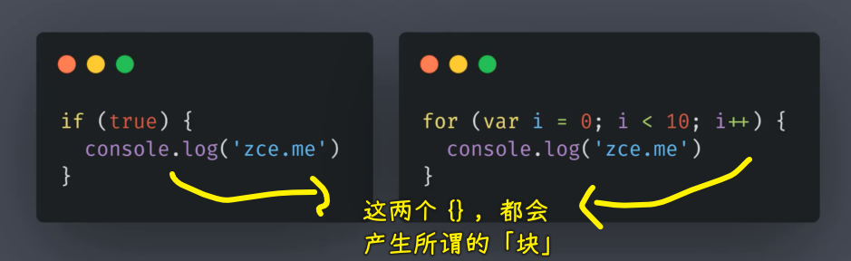

以前的「块」可是没有单独的作用域的，这就导致了我们在「块」中定义的成员，外部也可以访问到

如：

``` js
if (true) {
  var foo = 'zce'
}
console.log(foo) // zce
```

`{}`中定义的变量`foo`，`{}`外边居然能访问到，而这一点对于复杂代码是非常不利的，也是非常不安全的！

### <mark>3）let 与块级作用域搭档</mark>

自打有了块级作用域过后，我们就可以在代码里边通过一个新的关键词`let`去声明变量，以此来让外界不能访问到`{}`里边用`let`声明的变量！

`let`的用法，跟传统的`var`是一样的，只不过用`let`声明的变量，它只能在所声明的这个代码块中被访问到！

``` js
if (true) {
  // var foo = 'zce'
  let foo = 'zce'
}
console.log(foo) // ReferenceError: foo is not defined
```

可以看到，这表明了在块级作用域内用`let`定义的成员，`{}`的外部是无法访问到的！

而这样一个特性是非常适用于我们**声明`for`循环里边的计数器**的

如：

#### <mark>1、内层循环，循环 9 次</mark>

传统的`for`循环如果出现了循环嵌套的情况，那么我们就必须为循环中的计数器设置不同的名称，否则就会出现问题

双层循环嵌套这样写：

``` js
for (var i = 0; i < 3; i++) {
  for (var i = 0; i < 3; i++) {
    console.log(i)
  }
  console.log('内层结束 i = ' + i)
}

// 0
// 1
// 2
// 内层结束 i = 3
```

我们预期打印 9 次（`3×3`的循环），但实际情况却是只打印了 3 次，这双层循环就凉凉了！

究其原因也很简单 -> 外层声明`i`过后，内层再次声明循环变量`i`，而且**这两层都是用`var`声明的**，即`i`并不是块级作用域内的成员，而是全局成员，**内层的`i++`操作，其本质就是在更改全局`i`的值**。内层循环结束过后，全局`i`的值也就成了`3`了，对于外层的`i`，它拿到的值任然是全局当中的`i`，`i`为`3`了，不满足外层循环条件，自然就结束循环了呗！

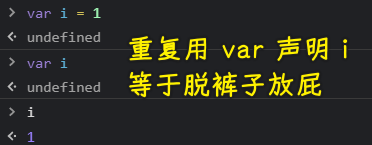

而我们使用`let`的话，就不会有这样的问题了 -> `let`所声明的变量只能在当前循环所在的这个`{}`里边生效，不会对全局搞事情！

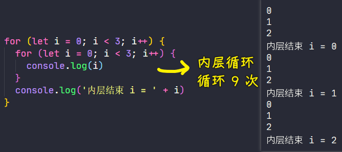

内层循环的`let i`相当于把`i`关进一个盒子当中，让`i++`操作不会影响外部！

你把外部的`let i` 改为`var i`也是可以的：

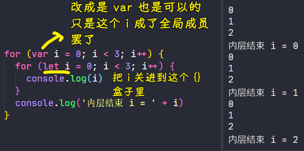

`let`这个关键词解决了循环嵌套当中我们计数器重名导致的问题，但 zce 还是**建议我们一般不要去使用同名的计数器，因为这不利于我们后期再去理解我们的代码**！

#### <mark>2、为元素绑定的事件处理函数需要拿到计数器的值</mark>

除了这个例子以外，还有一个典型的应用场景 -> 就是在循环注册事件时，在事件的处理函数中，我们要去访问循环的这个计数器

以前这样做遇到的问题：

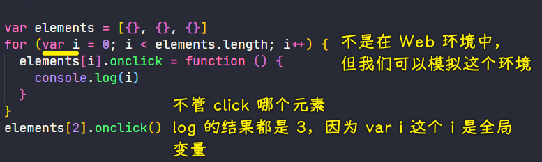

用闭包解决这个问题：

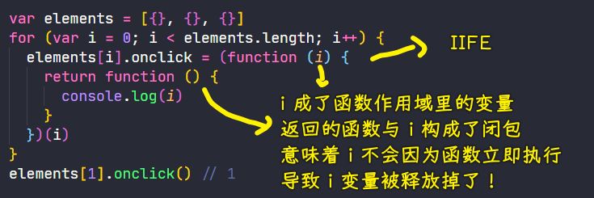

> IIFE：Immediately-invoked Function Expression，立即调用函数表达式

其实闭包也就是借助了函数作用域去摆脱全局作用域所产生的影响

有了块级作用域过后，就不必再这么麻烦了！

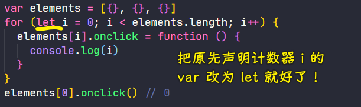

用`let`声明的`i`，`i`只能在`{}`这个块级作用域内被访问到，这样一来，问题就被解决了，当然，**这内部其实也是一种闭包的机制**，因为`onclick`在执行的时候，循环早就已经结束了，而实际的`i`早就已经被销毁掉了，就是因为这个闭包机制，我们才可以拿到那个原本执行循环的时候那个`i`所对应的值！

---

### <mark>4）let 的存在，居然体现了 for 循环的两层作用域</mark>

另外，`for`循环还有一个特别之处，那就是**在`for`循环内部它实际上是有两层作用域的**

你以为有冲突，实际上互不影响：

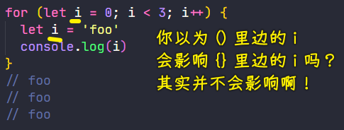

这两个`i`并不在同一个作用域当中，具体点来说，这代码相当于这样（用`if`的方式拆解这个代码）：

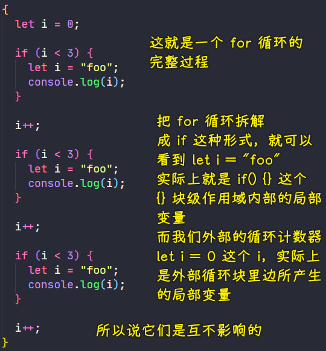

至此，你就应该能够理解为什么说`for`循环有两层嵌套的作用域了 -> **循环体的`i`是内层独立的作用域，外层则是 for 循环本身的作用域**

### <mark>5）在 let 一个变量前，你不能使用这个变量</mark>

除了用`let`搭配`{}`会产生块级作用域限制以外，`let`和`var`还有一个很大的区别就是：**`let`声明是不会出现提升的情况**！

传统的`var`去声明变量都会导致我们这个所声明的变量提升到我们的代码最开始的位置

如：

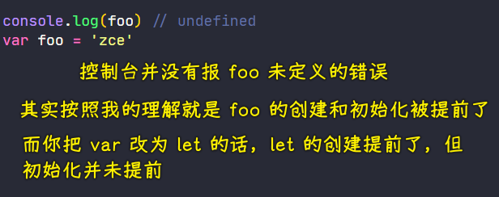

把`var`改成为`let`会报这个错误：

``` js
"ReferenceError: Cannot access 'foo' before initialization"
```

或许，zce 所认为的「提升」指的是「创建+初始化（顺带赋值可选）」的过程

---

zce 的认识：

``` js
console.log(foo) // undefined
var foo = 'zce'
```

没有报错误，意味着`foo`此时已经被声明了，只是还未赋值而已！ -> 而这种现象被叫做「**变量声明的提升**」，就以目前而言，这样一个现象实际上是一个 bug，就像那句话说的一样「**官方的 bug，它不叫 bug，它应该叫特性**」


为了纠正这样一个问题，在 ES2015 中，它的`let`就取消了这样一个所谓的「特性」，它从语法层面就要求我们必须要先声明变量，再去使用变量，否则，你这样写：

``` js
console.log(foo)
let foo = 'zce'
```

就会对`console.log(foo)`这个`foo`报一个`ReferenceError: Cannot access 'foo' before initialization`的错误 -> 引用异常的错误

---

以上就是`let`以及块级作用域`{}`最主要的一些特性了，至于 ES2015 为啥不是在原有的 `var` 基础之上做一些升级，而是定义了一个新的关键词，这其中的原因也很简单 -> 如果你直接升级`var`的话，就会导致很多以前的项目无法正常的工作，所以 ES 就决定使用一个新的关键词——`let`

---

### <mark>6）小结</mark>

- let 声明的成员只会在所声明的块中生效
- let 的应用场景：let 在 for 循环中的表现
  - 循环绑定事件，事件处理函数中获取正确索引
- for 循环会产生两层作用域
- let 修复了变量声明提升现象 -> 其实变量的创建都提升了，只是 let 声明的变量，取消了初始化！

关于 `for` 的两层作用域：

两个测试代码：

代码 1：

``` js
for (let i = 0; i < 3; i++) {
  let i = 1;
  console.log(i);
}
// 1 1 1
```

代码 2：

``` js
for (let i = 0; i < 3; i++) {
  let i = i;
  console.log(i);
}
// let i = i 这个右边 i 报「ReferenceError: Cannot access 'i' before initialization」
```

是这样理解吗？

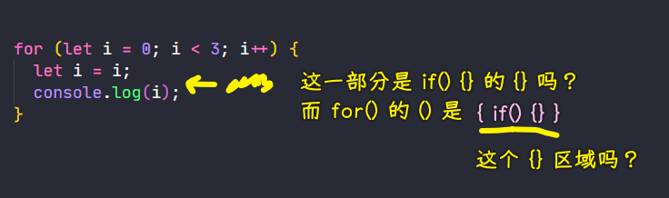

看方方的认识：

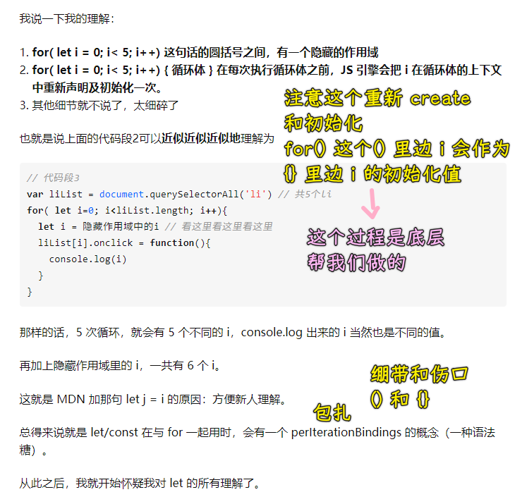

回到测试代码：

- 代码 1：为啥没有报错？ -> 因为每次重新执行`{}`里边的东西，都会把`i`重新声明以及初始化一次
- 代码 2：为啥会报错？ -> 因为这个`i`并不是你所认为的计数器`i`，而是一个未被初始化的变量`i`

如果你没有在循环体`{}`里边`let i`，那么你是可以直接访问`i`的，相当于是这样：

``` js
{
  let i = 0
  {
    console.log(i) // 0
  }
}
```

反之，如果你在循环体`{}`里边写了`let i`，那么就相当于是这样：

``` js
{
  let i = 0
  {
    let i = i // 右边的 i -> Cannot access 'i' before initialization
    console.log(i)
  }
}
```

不管怎样，请不要在循环体`{}`中声明一个与计数器的名字一样的变量！ -> 你这样写了`for(let i = 0;)`，那么`{}`里边就不要出现`let i`这样的变量声明，你可以换个名字，如`let j`

---

## ★const

ES2015 中 还新增了一个 `const` 关键词，它可以用来声明一个只读的恒量或者叫做常量

它的特点：在`let`基础之上多了一个「只读」特性

所谓「只读」指的就是「**变量一旦声明过后，就不能再被修改了**」

如：

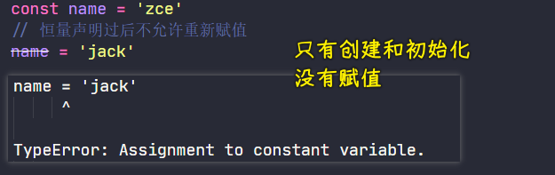

---

在用`const`声明一个变量的同时，必须给上初始值，可不能像`let/var`那样

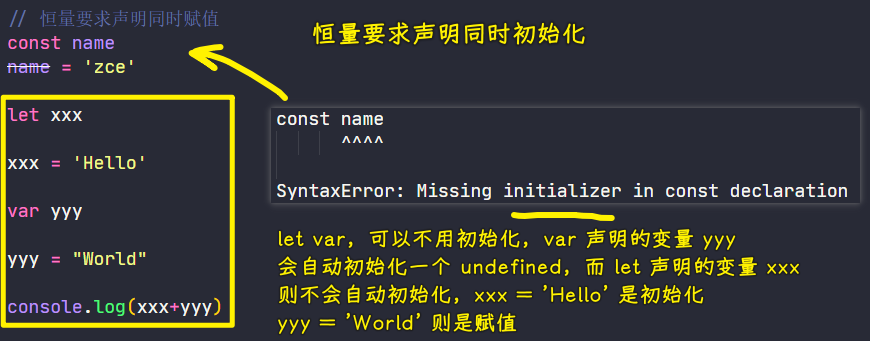

我这样测试了一下：

``` js
let xxx
console.log(xxx)
```

`xxx`居然是`undefined`值……

推翻上图那个`xxx = 'Hello'`是初始化的认识：

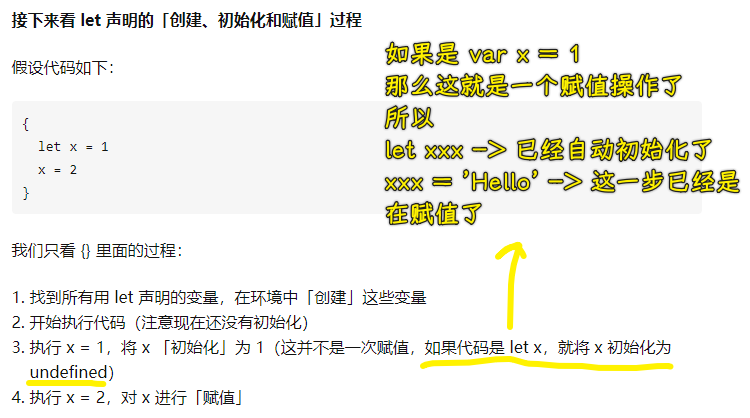

---

const 所声明的成员不能被修改 -> 指的是不允许在变量声明过后，让变量重新指向一个新的内存地址，并不是说不允许我们修改恒量中的属性成员

如：

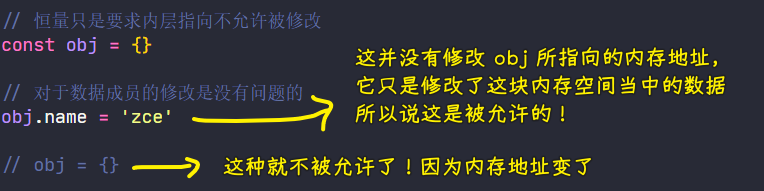

`obj = {}`这种赋值会改变`obj`的内存指向

---

除此之外，`const`的其它特性都跟`let`关键词相同！

至此，我们就了解了 ES2015 中的两个新关键词（let 和 const）……

加上原本的`var`，一共就是三个关键词可以用来声明变量了！

## ★总结

zce 个人的最佳实践：


不用`var` -> 默认全部使用`const` -> 对于一定会被需要修改的值，则使用`let`去声明

按照这种方式去选择的话，**你的代码质量实际上会有明显的提高**，这其中的原因也很简单 -> `var`里边所谓的一些特性都算是我们开发中的一些陋习，如我们先去使用变量，再去声明变量等这种都属于陋习，所以说，我们坚决不用`var`

默认使用`const`原因是因为**它可以让我更明确我们代码中所声明的这些成员会不会被修改**

