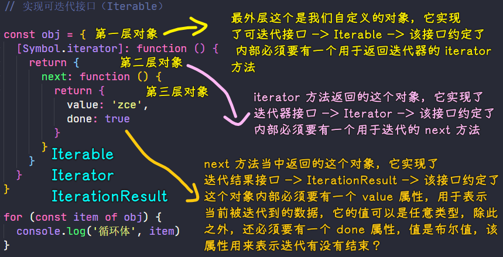

### ✍️ Tangxt ⏳ 2021-05-24 🏷️ es6

# 01-10-for...of 循环、可迭代接口、实现可迭代接口、迭代器模式、生成器、生成器应用

## ★循环、迭代、遍历、递归

> loop、iterate、traversal、recursion，都于重复（repeat）有关，但它们又不是完全存粹地的重复

- 遍历：遍历是对数据结构的一种操作。它是访问数据结构（如数组、链表或任何数据结构）中出现的每个元素的**过程** -> 爷爷去玩具大厦遍历玩具店集合为孙子买最好的玩具，做法可有从 1 楼到三楼这样的顺序去买，也可以有先去二楼再去三楼最后再到一楼去买，总之不管怎么逛，只要保证每家店都去过一次、不重复去，就完成了整个遍历的过程了！ -> **依次**对集合中的每个元素**做且仅做**一次访问
- 循环：是遍历的一种手段 -> 从容器里边一次又一次**连续不断地**拿元素 -> 不断地重复操作 -> 爷爷去 A 店为孙子买玩具，买回去一个，孙子说不喜欢，爷爷再去 A 店买，买回来了，孙子又说不喜欢……如此循环……直到孙子说喜欢 -> **每次去买玩具的目标、行为都一样，这叫循环**
- 迭代：是遍历的一种手段 -> 从容器里边一次又一次**非要间断地**拿元素 -> 存在变化地重复操作 -> 爷爷去**小卖铺**为孙子买玩具，买回去一个，孙子说不喜欢，询问得知，孙子喜欢「乐高的玩具」，于是爷爷去了**大超市**买，买回去后，孙子又说不喜欢，再次询问得知「孙子喜欢乐高玩具中最贵的那个玩具」，于是爷爷就去了**奢侈品商店**给他买了乐高限量版玩具，拿回家后孩子很满意 -> **每次去买玩具都跟上一次不一样，或是有了新的目标，或是缩小了搜寻范围，这叫迭代**
- 递归：自己调用自己 -> 生成它的代码是迭代，分形的效果是递归 -> 先递后归 -> 面前有 1000 个爷爷手工制作的玩具，爷爷往这中间挑了 500 个认为孙子可能喜欢的，爸爸从这 500 个里边，挑了 50 个认为儿子可能喜欢的，儿子从 50 个里边挑了一个自己最喜欢的，儿子告诉爸爸「我要几个，叫爷爷寄过来」，爸爸告诉爷爷「您孙子喜欢那个机器猫玩具」 -> **都是为了缩小范围，找到合适的玩具**

➹：[「递归」和「迭代」有哪些区别？ - CyrusCao 的回答 - 知乎](https://www.zhihu.com/question/20278387/answer/109266159)

➹：[js 迭代和遍历有什么区别？ - 知乎](https://www.zhihu.com/question/39854900)

➹：[What is traversing? - Quora](https://www.quora.com/What-is-traversing)

➹：[xdmala/02.md ppambler/xdmala](https://github.com/ppambler/xdmala/blob/dc00620a2e986a64edc6d14d28412fbab7eeba40/12-%E7%A2%8E%E7%89%87%E7%9F%A5%E8%AF%86/02.md)

➹：[基本计算规则 vs 程序 vs 机器？](https://ppambler.github.io/icourse163/freshman/01-%E8%AE%A1%E7%AE%97%E6%9C%BA%E4%B8%93%E4%B8%9A%E5%AF%BC%E8%AE%BA/01-%E8%AE%A1%E7%AE%97%E6%9C%BA%E3%80%81%E8%AE%A1%E7%AE%97%E4%B8%8E%E8%AE%A1%E7%AE%97%E6%80%9D%E7%BB%B4/04-%E4%BA%BA%E8%AE%A1%E7%AE%97%E4%B8%8E%E6%9C%BA%E5%99%A8%E8%87%AA%E5%8A%A8%E8%AE%A1%E7%AE%97-%E4%B8%8B.html)

## ★for...of 循环

1）概述

在 ES 中，遍历数据有很多种方法

比如：

1. 最基本的`for`循环 -> 它比较适用于去遍历普通的数组
2. `for...in`循环 -> 它比较适合去遍历键值对
3. 一些函数式的遍历方法（一些对象的遍历方法） -> 数组对象的`forEach`方法

这些各种各样遍历数据的方式都会有一定的局限性

所以 ES2015 借鉴了很多其它的语言，引入了一种全新的遍历方式——`for...of`循环

**这种循环方式以后会作为遍历所有数据结构的统一方式**

换句话说，只要你明白`for...of`内部的工作原理，那你就可以使用这种循环去遍历任何一种自定义的数据结构

在介绍`for...of`原理之前，先来了解`for...of`的基本用法

2）基本用法

> `for...of`：for...of
> 
> `for...of`：for...in

💡：定义一个数组，通过 `for...of` 去遍历一下这个数组当中的每一个元素

``` js
const arr = [100, 200, 300, 400]

for (const item of arr) {
  console.log(item)
}

// 100
// 200
// 300
// 400

// 把 of 改为 in ，那么 log 就是
// 0
// 1
// 2
// 3
```

不同于传统的 `for...in` 循环，`for...of` 循环拿到的是数组当中的每一个元素，而不是对应的下标

而这种循环方式就可以取代我们之前常用的数组实例当中的`forEach`方法，而且相比于`forEach`方法，`for...of` 可以使用`break`关键词随时去终止循环，而`forEach`方法是无法去终止遍历的（也就是说无法跳出循环）

``` js
// for...of 循环可以替代 数组对象的 forEach 方法

const arr = [100, 200, 300, 400]

arr.forEach(item => {
  console.log(item)
})

// 100
// 200
// 300
// 400

for (const item of arr) {
  console.log(item)
  if (item > 100) {
    break
  }
}

// 100
// 200
```

以前我们为了能够随时终止遍历，我们必须要去使用数组实例的`some`方法或者是`every`方法

- 在`some`方法的回调函数当中返回`true`
- 在`every`方法的回调函数当中返回`false`

都可以去终止遍历！

``` js
// forEach 无法跳出循环，必须使用 some 或者 every 方法

const arr = [100, 200, 300, 400]

// arr.forEach() // 不能跳出循环

arr.some((item)=>{
  console.log(item)
  if(item > 100) {
    return true
  }
  // return item > 100
})
console.log(arr)
console.log('---')
arr.every((item)=>{
  console.log(item)
  if(item > 100) {
    return false
  }
  // return true
})
console.log(arr)

// 100
// 200
// [ 100, 200, 300, 400 ]
// ---
// 100
// [ 100, 200, 300, 400 ]
```

> `every`方法不返回，也就是返回`undefined` -> `falsy`值 -> 终止循环，如果你返回一个`true`，那么这就表示继续下一轮循环
> 
> 这两个方法都没有副作用！

而`forEach`的回调函数当中，无论返回`true`还是`false`，这都无法去终止遍历！

而这个 `for...of` 当中，我们直接就可以使用`break`关键词去随时终止循环了！

除了数组可以被我们的 `for...of` 去遍历，一些伪数组对象也是可以直接使用 `for...of` 去遍历的

比如：

- 在函数当中的`arguments`对象
- 在 DOM 操作时，一些元素节点的列表
- ……

遍历这些东西都跟普通的数组遍历没有任何的区别……

💡：遍历 ES2015 新增的 Set/Map 对象？

遍历 Set 对象：

``` js
// 遍历 Set 与遍历数组相同

// 通过一个数组去初始化 Set 当中的一些初始数据
const s = new Set(['foo', 'bar'])

// 用 for...of 循环遍历这个 Set
for (const item of s) {
  console.log(item)
}

// foo
// bar
```

遍历 Set 跟遍历数组没啥区别，每次迭代所拿到都是当前元素本身

---

遍历 Map 对象：

``` js
// 遍历 Map 可以配合数组解构语法，直接获取键值

// 创建 Map 对象
const m = new Map()

// 设置键值
m.set('foo', '123')
m.set('bar', '345')

// 遍历 Map 对象
// 每次遍历都会得到一个数组，而且这个数组当中总是两个成员
// 这两个成员分别是当前被遍历的键和值
// 遍历的是一个键值结构，一般在循环体当中都需要用到键和值，因此它是以数组的形式来提供键和值的！
for (const item of m) {
  console.log(item)
}

// [ 'foo', '123' ]
// [ 'bar', '345' ]

// 配合数组的解构语法，直接拿到这个数组当中的键和值
// 这样一来，在遍历 Map 对象时就可以使用对应的键值了
// 而这也是遍历 Map 和遍历数组之间的细微差异……
for (const [key, value] of m) {
  console.log(key, value)
}

// foo 123
// bar 345
```

💡：遍历最普通的对象？

``` js
// 普通对象不能被直接 for...of 遍历

// 定义一个普通对象，并随意添加一些属性
const obj = { foo: 123, bar: 456 }

// 遍历这个 obj 对象
for (const item of obj) {
  console.log(item)
}

// TypeError: obj is not iterable
```

可以看到报错了 -> `obj`对象是不可被迭代的

我们之前说过 `for...of` 可以作为遍历所有数据结构的统一方式，然现在通过实验发现，它连最基本的普通对象都没有办法去遍历，所以这究竟是为什么呢？


## ★可迭代接口

> Iterable

之前说到，`for...of` 是 ES2015 中最新推出的一种循环语法，它是一种遍历所有数据结构的统一方式


但经过我们的实际尝试，我们发现它只能够去遍历数组之类的数据结构，而对于普通对象，如果直接去遍历它，那就会报一个错误

所以这究竟是 zce 说错了？还是有什么特殊原因呢？

1）原因

ES 中能够用于去表示有结构的数据类型越来越多了，从最早的数据和对象，到现在新增的 Set、Map，而且我们开发者还可以组合使用这些类型去定义一些符合自己业务需求的数据结构

为了提供一种统一的遍历方式，ES2015 就提出了一个叫做「Iterable」接口 -> 其意思就是「可迭代的」


如果你不太理解编程语言当中的「接口」概念，那么你可以把它理解成一种规格标准，如在 ES 中，任意一种数据类型，它都有`toString`方法，而这就是因为它们都实现了统一的规格标准

而在编程语言当中，更专业的说法就是它们都实现了统一的接口

而所谓的**可迭代接口就是一种可以被 `for...of` 循环统一遍历访问的规格标准**，换言之，只要这个数据结构它实现了可迭代接口，那么它就能够被 `for...of` 循环去遍历


这意味着我们之前所尝试的那些能够直接被 `for...of` 循环去遍历的数据类型，它都已经在内部实现了这个接口

> 其实就是你遵守了「Iteration protocols」，那么你就拥有了什么能力…… -> 有两种协议：「iterable protocol 」、「iterator protocol」

脱离掉 `for...of` 循环的表象 -> 看看这个叫做「Iterable」的接口到底约定了哪些内容……

2）Iterable 接口所约定的内容

💡：如何在 VSCode 里边使用浏览器的控制台？

为啥要这样做？ -> 因为在浏览器的控制台当中可以更容易的看到对象内部的结构

如何切换 -> `Help -> Toggle Developer Tools`

VSCode 本身就是一个运行在浏览器核当中的一个 Web 应用，所以这个开发者工具跟 Chrome 里边的开发者工具是完全相同的！ 而我们之所以不用浏览器，是因为避免浏览器和编辑器来回切换！

💡：打印一下可以被 `for...of` 循环遍历的几种不同类型的数据？

它们都实现了相同的规格标准，那它们的内部肯定会一些共同的属性


数组对象本身没啥属性，就一个`length`，而它的原型对象上有很多属性，其中有个叫`Symbol(Symbol.iterator)`的属性，该属性的名字叫做`iterator`，根据这个名字，似乎跟我们所说的「迭代」有点关系 -> 它的值是一个函数

用同样地姿势查找，发现`Set`对象、`Map`对象也有一个相同的迭代器方法

根据这两个理由：

1. 这三个可以直接被 `for...of` 循环遍历的对象当中都有这么一个方法
2. 这个方法的名字叫`iterator`

我们可以基本确定，**Iterable 接口约定的就是我们对象当中必须要去挂载一个叫做`iterator`的方法**

话说，这个方法到底是干什么的呢？

💡：定义一个数组，手动调用它的`iterator`方法，看看它返回的到底是个啥？

这个方法成员的名字是一个全局的`Symbol`常量，可以直接通过`Symbol`的`iterable`属性直接拿到 -> 拿到后就直接调用呗！


这个「数组的迭代器对象」当中有一个`next`方法，手动调用这个这个`next`方法，看看它到底是干嘛的：


我们定义一个`iterator`变量去接收返回的迭代器对象，然后调用这个迭代器对象的`next`方法 -> `iterator.next()`

此时这个方法返回的又是一个对象`{value: "foo", done: false}` -> 这个对象当中有两个成员，分别是`value`和`done`，而且`value`当中的值就是数组当中的第一个元素，而`done`值是一个`false`

我们再调用迭代器的`next`方法 -> 结果得到也是一个相同结构的对象，只不过此时`value`当中值变成了数组当中的第二个元素，而`done`值还是一个`false`

……

从调用`next`所返回的结果来看，我们可以想到在这个迭代器当中，其**内部应该是维护了一个数据指针，我们每调用一次`next`，这指针都会往后移一位**，而`done`属性的作用应该就是**表示内部所有的数据是否全部被遍历完了**

---

根据以上尝试，我们推断出实现 Iterable 接口的数据类型的一些特点，至此，我们可以总结出：

- 所有可以直接被 `for...of` 循环遍历的数据类型，它都必须要实现这个叫做 Iterable 的接口 -> 即这个数据的内部必须要挂载一个叫`iterable`的方法
- 这个`iterable`方法需要返回一个带有`next`方法的对象，我们不断调用这个`next`方法就可以实现对内部所有数据的遍历

3）测试 Set 对象

> 把上边的尝试落实到 `Set` 对象，看看上边的结论是否正确

``` js
// 迭代器（Iterator）

// 新建一个 Set 对象，并且初始化一些基本的值
const set = new Set(['foo', 'bar', 'baz'])

// 调用这个 set 对象 iterator 方法，得到这个对象的迭代器
const iterator = set[Symbol.iterator]()

// 通过迭代器的 next 方法去迭代 set 当中的数据
// 多次调用 next 
console.log(iterator.next())

// { value: 'foo', done: false }
// { value: 'bar', done: false }
// { value: 'baz', done: false }
// { value: undefined, done: true }
```

可以看到 `set` 中的数据确实被正常遍历了，而这也就进一步证实了我们上边推断的是正确的

而这其实就是 `for...of` 循环内部的工作原理

`for...of` 循环内部就是按照我们这里的`next`执行过程实现了遍历，其实我们也可以使用`while`循环来实现相同的遍历

``` js
const set = new Set(['foo', 'bar', 'baz'])

const iterator = set[Symbol.iterator]()

while (true) {
  const current = iterator.next()
  if (current.done) {
    break // 迭代已经结束了，没必要继续了
  }
  console.log(current.value)
}

// foo
// bar
// baz
```

## ★实现可迭代接口

> Iterable

了解 `for...of` 循环的内部原理过后，你就应该能够理解为啥说「`for...of` 循环可以作为遍历所有数据结构的统一方式」了

因为它内部就是去调用被遍历对象的`iterator`方法，以此来得到一个迭代器，从而去遍历内部所有的数据

而这也就是 Iterable 接口所约定的内容，换句说话，只要我们的对象也实现了 Iterable 接口，那我们就可以实现使用 `for...of` 循环去遍历我们自己的对象

1）实现 Iterable 接口

在 ES 中，实现一个 Iterable 接口，实际上就是在一个对象当中去挂载一个 `iterator` 方法，然后在这个方法当中去返回一个迭代器对象

``` js
// 实现可迭代接口（Iterable）

// 在 obj 对象上添加 iterator 成员，成员名称即 Symbol.iterator，这是 Symbol 类型提供的一个常量
// 所以我们需要使用计算属性名的方式定义到字面量当中
const obj = {
  // 这个成员的值是一个函数
  [Symbol.iterator]: function () {
  // 在这个 iterator 方法内部，我们需要返回一个实现了迭代器接口的对象，即在这个对象中需要提供一个 next 方法用于实现向后迭代的逻辑
    return {
      next: function () {
        // 在 next 返回内部需要返回一个迭代结果对象
        // 这个对象需要有两个成员，分别是 value 和 done
        // 在这里我们先使用固定值，让语法能够通过
        return {
          value: 'zce',
          done: true
        }
      }
    }
  }
}
```

在测试这个`obj`对象之前，先梳理一下这几个对象之间的关系，以及它们各自的作用

`obj`一共有三层对象：



我们要实现的接口：

- Iterable：`[Symbol.iterator]` -> 对象属性，值是函数
- Iterator：`next` -> 对象属性，值是函数
- IterationResult：`value、done` -> 都是对象属性，前者的值是任意类型，后者的值则是布尔类型

对于 Iterable、Iterator、IterationResult 这三者，请不要把它们给弄混了

总之，整个对象叫做`Iterable`，中间这个带有`next`方法对象叫做`Iterator`，而最里边的这个对象叫做`IterationResult`

搞明白这三者之间的关系过后，再来测试一下我们能否使用 `for...of` 循环去遍历这个`obj`对象

测试：

``` js
for (const item of obj) {
  console.log('循环体', item)
}
```

结果没有报错 -> 这意味着我们所实现的这个可迭代接口能够被 `for...of` 循环直接去遍历

还有这啥也没有输出啊！ -> 我们的循环体并没有被执行，这个原因很简单，因为我们写死了`next`方法所返回的结果，内部第一次调用`next`，所返回的结果当中的`done`属性的值，即`true` -> 表示我们的循环已经结束了，那我们的循环体自然也就不会再执行了…… -> 简单来说，就是先看`done`的值，再决定是否`next`一下，`next`的调用意味着搞一轮循环……

可简单看成是这样：

``` js
const arr = []

const iterator = arr[Symbol.iterator]()

while (true) {
  const current = iterator.next()
  console.log(current) // { value: undefined, done: true }
  if (current.done) {
    break // 迭代已经结束了，没必要继续了
  }
  // for of 的循环体
  {
    console.log(current.value)
  }
}
```

💡：修改`obj`对象，让 `for...of` 循环真正起到可肉眼观察的作用？

``` js
const obj = {
  // 1. 添加一个数组，用于存放一些值得去被遍历的数据
  store: ['foo', 'bar', 'baz'],

  [Symbol.iterator]: function () {
    // 3. 需要维护一个下标，让它默认等于 0
    let index = 0
    
    // 4. next 函数中的 this 并不是 obj 对象，所以需要定义一个 self 去接收一下当前的对象
    const self = this

    return {
      // 2. 在 next 方法当中去迭代一些数据
      next: function () {
        const result = {
          // 5. 数据
          value: self.store[index],
          // 6. 数组长度
          done: index >= self.store.length
        }
        // 7. 让指针往后移一位
        index++
        // 8. 最后返回这个结果
        return result
      }
    }
  }
}

for (const item of obj) {
  console.log('循环体', item)
}

// 循环体 foo
// 循环体 bar
// 循环体 baz
```

可以看到这个`obj`对象被正常遍历了，话说，这到底有啥用呢？即**实现迭代器的目的到底是干什么**？

## ★迭代器模式
