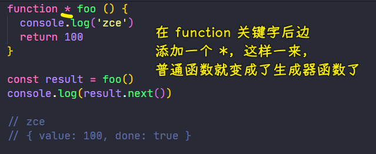
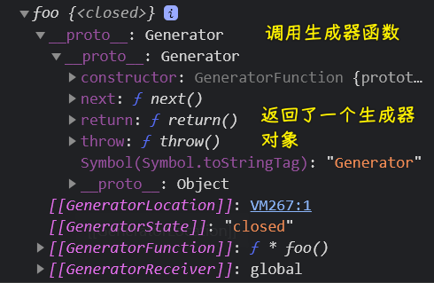

### ✍️ Tangxt ⏳ 2021-05-27 🏷️ es6

# 01-11-生成器、生成器应用

## ★生成器

> Generator

在 ES2015 中，还新增了一种生成器函数，英文叫做「Generator」

引入这样一个新特性的目的 -> 为了能够在复杂的异步代码中减少回调函数嵌套所产生的问题，从而去提供更好的异步编程解决方案


1）了解生成器函数的语法以及它的基本应用

声明一个普通函数是这样的：

``` js
function foo() {
  console.log('zce')
  return 100
}
```

而定义一个生成器函数则是这样的：



如果不加`*`，调用`foo`函数，那么就会打印`zce`，返回一个`100`，而如果加`*`了，调用`foo`函数，并没有像普通函数一样，而是返回了一个生成器对象

``` js
console.log(result) // Object [Generator] {}
```



可以看到，这个生成器对象跟迭代器对象一样，在原型上也有一个`next`方法

当我们`result.next()`，此时，函数体才开始执行，而且`next`的返回值与迭代器的`next`返回值也有相同的结构，即也是一个`value`和一个`done` -> `foo`函数的返回值被放到`value`属性当中了！ -> 为啥会这样呢？ -> 因为**生成器对象它其实也实现了`iterator`接口，即迭代器接口协议**


