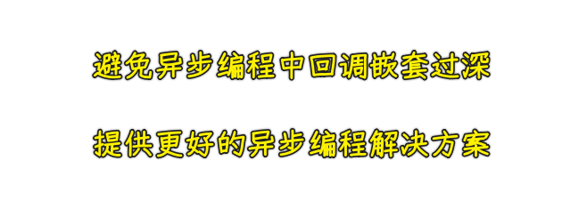
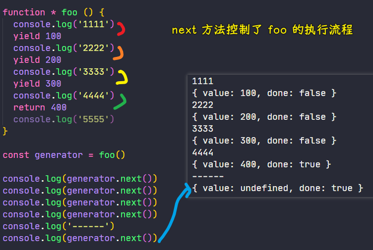

### ✍️ Tangxt ⏳ 2021-05-27 🏷️ es6

# 01-11-生成器、生成器应用

## ★生成器

> Generator

在 ES2015 中，还新增了一种生成器函数，英文叫做「Generator」

引入这样一个新特性的目的 -> 为了能够在复杂的异步代码中减少回调函数嵌套所产生的问题，从而去提供更好的异步编程解决方案



1）了解生成器函数的语法以及它的基本应用

声明一个普通函数是这样的：

``` js
function foo() {
  console.log('zce')
  return 100
}
```

而定义一个生成器函数则是这样的：


如果不加`*`，调用`foo`函数，那么就会打印`zce`，返回一个`100`，而如果加`*`了，调用`foo`函数，并没有像普通函数一样，而是直接返回了一个生成器对象

``` js
console.log(result) // Object [Generator] {}
```


> 生成器对象有个`GeneratorState`，如果还可以迭代完（`done`为`true`即迭代完了），那么它的值就是`'suspended'`，反之，迭代完，则是`'closed'`

可以看到，这个生成器对象跟迭代器对象一样，在原型上也有一个`next`方法

当我们`result.next()`，此时，函数体才开始执行，而且`next`的返回值与迭代器的`next`返回值也有相同的结构，即也是一个`value`和一个`done` -> `foo`函数的返回值被放到`value`属性当中了！ -> 为啥会这样呢？ -> 因为**生成器对象它其实也实现了`iterator`接口，即迭代器接口协议**

回过头来看，按照上边的使用，根本就看不出生成器函数的作用

因为生成器函数在实际使用的时候，一定会配合一个叫`yield`的关键词去使用！

`yield`关键词它与`return`关键词非常类似，但是又有很大的不同

💡：使用了`yield`，生成器函数才是真的好用？

``` js
function * foo () {
  console.log('1111')
  // 用 yield 关键词取代 return -> 返回一个 100
  yield 100
  // yield 不会结束掉这个方法的执行，所以可以以此类推继续 log 然后 yield
  console.log('2222')
  yield 200
  console.log('3333')
  yield 300
}

const generator = foo()

console.log(generator.next()) // 第一次调用，函数体开始执行，遇到第一个 yield 暂停
console.log(generator.next()) // 第二次调用，从暂停位置继续，直到遇到下一个 yield 再次暂停
console.log(generator.next()) // ……
console.log(generator.next()) // 第四次调用，已经没有需要执行的内容了，所以直接得到 undefined

// 1111
// { value: 100, done: false }
// 2222
// { value: 200, done: false }
// 3333
// { value: 300, done: false }
// { value: undefined, done: true }
```


如果你`return`了，那么就会这样：



---

通过这样的尝试，慢慢地你可以发现生成器函数其中的一些特点，总结一下就是：

- 生成器函数会自动帮我们返回一个生成器对象`generator`
- 调用这个`generator`对象的`next`方法才会让这个`foo`函数的函数体开始执行
- 执行过程中遇到了`yield`关键词，那么函数的执行就会被暂停下来，而且`yield`后边的值将会作为`next`的结果返回
- 如果再次调用`next`，那么函数就会从暂停的位置继续开始执行 -> 周而复始 -> 一直到这个`foo`函数完全结束，而`next`所返回的`done`的值也就变成了`true`

以上就是生成器函数的基本用法了！ -> 它最大的特点就是「惰性执行」，即抽一下就动一下 -> 陀螺


> `next`一下，就返回一个结果给你！

## ★生成器应用


