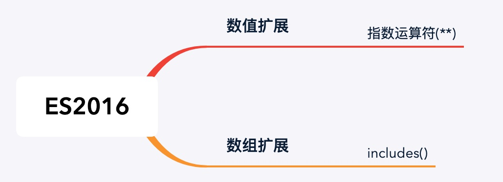
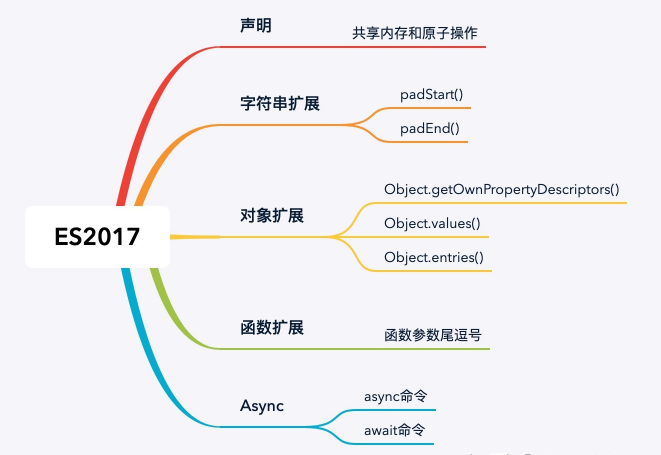
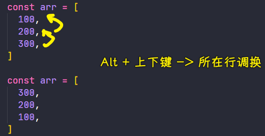
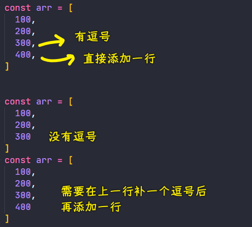
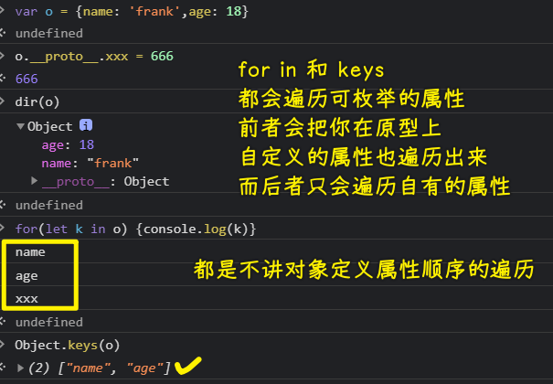
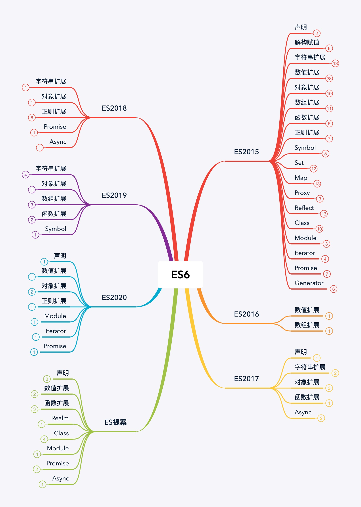
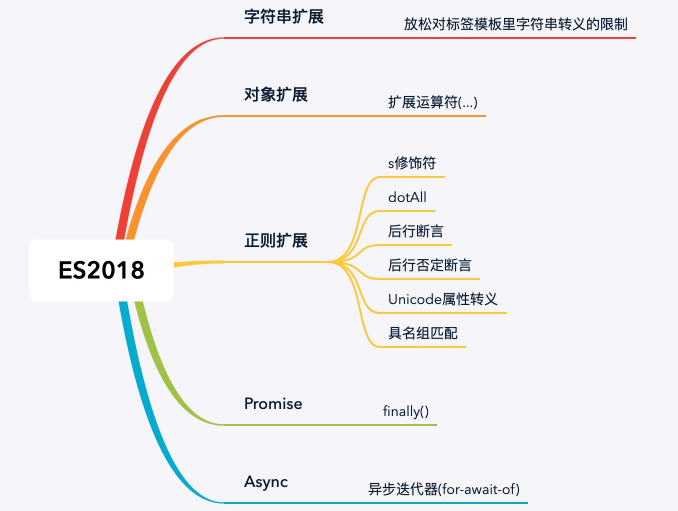
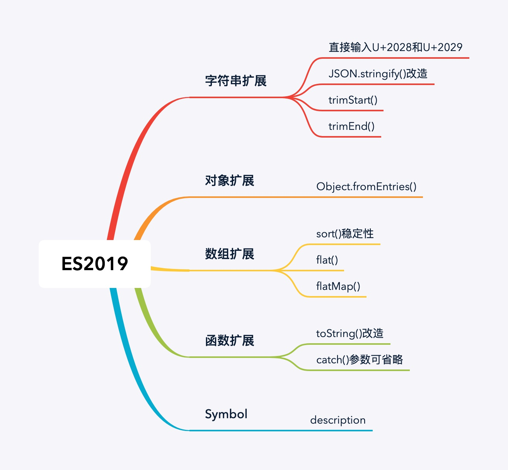
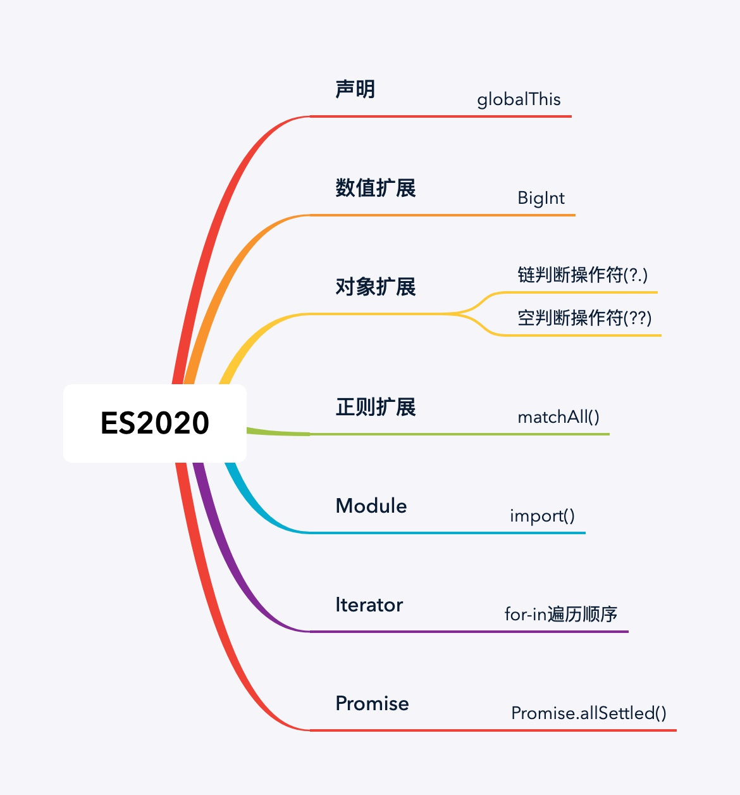
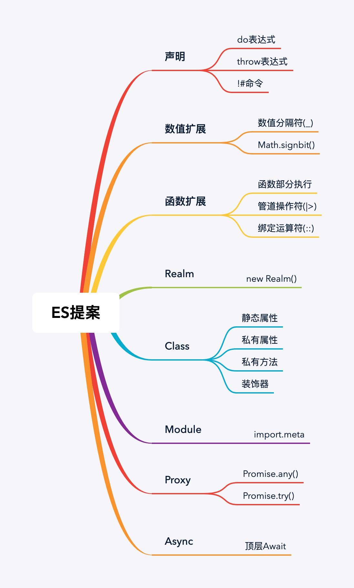

### ✍️ Tangxt ⏳ 2021-05-30 🏷️ es6

# 01-12-ES Modules、ES2016 概述、ES2017 概述

## ★ES Modules


ES Modules 是 ES2015 当中标准化的一套语言层面的模块化规范 -> 这个知识点会在模块化开发的课程中详细介绍 -> 会把它跟 CommonJS 以及其它的一些标准做一个统一的对比

## ★ES2016 概述



ES2016 发布于 2016 年 6 月，与 ES2015 相比，ES2016 只是一个小版本，它仅包含两个小功能

### <mark>1）数组的`includes`方法</mark>

这个方法让我们去**检查数组当中是否包含指定元素变得更加简单**！

在这之前，如果我们需要去检查某个数组当中是否存在某个指定的元素，我们就必须要使用数组对象的`indexOf`方法去实现

该方法可以帮助我们找到元素在数组当中所对应的下标，在没有找到指定元素的情况下，它会返回一个`-1`

然而这种方式去判断是否存在某一个元素也会存在一个问题，那就是它不能去查找数组当中的`NaN`

``` js
const arr = ['foo', 1, NaN, false]

// 找到返回元素下标
console.log(arr.indexOf('foo'))
// 找不到返回 -1
console.log(arr.indexOf('bar'))
// 无法找到数组中的 NaN
console.log(arr.indexOf(NaN))

// 0
// -1
```

现在有了`includes`方法过后，我们就可以直接去判断数组当中是否存在某一个指定的元素了 -> `includes`直接返回一个布尔值去表示存在或者是不存在，而且`includes`方法相对于`indexOf`，它还可以用来去查找`NaN`这样的数值

``` js
// Array.prototype.includes

const arr = ['foo', 1, NaN, false]

// 直接返回是否存在指定元素
console.log(arr.includes('foo'))
// 能够查找 NaN
console.log(arr.includes(NaN))

// true
```

### <mark>2）指数运算符</mark>

除了`includes`以外，ES2016 另外一个新功能就是多了一个「指数运算符」

以前我们需要去进行指数运算，我们需要借助与`Math`对象当中的`pow`方法来去实现

如：求 2 的 10 次方

``` js
// 2 是底数，10 是指数
console.log(Math.pow(2, 10)) // 1024
```

而在 ES2016 中新增的指数运算符，它就是语言本身的运算符，就像是我们之前所使用的`+-*/`运算符一样

这个指数运算符使用起来也非常简单，直接就是 -> 一个基数然后两个`**`，后边再跟上指数

``` js
// 指数运算符
console.log(2 ** 10) // 1024
```

这种新的运算符对于数学密集型的应用是一个很好的补充，不过，在我们日常的应用开发过程当中，很少会用到指数运算符

## ★ES2017 概述



ES2017 是 ECMAScript 标准的第八个版本，它发布于 2017 年的 6 月

与 ES2015 相比，ES2017 也是一个小版本的更新，当然，它同样带来了一些非常有用的新功能

### <mark>1）对 Object 对象的三个扩展方法</mark>

#### <mark>1、`Object.values`</mark>

这个方法与之前 ES5 的`Object.keys`方法非常类似，但是`keys`方法返回的是对象当中所有键（自身可枚举的属性键）组成的一个数组，而`values`则是返回这个对象当中所有的值所组成的一个数组

``` js
const obj = {
  foo: 'value1',
  bar: 'value2'
}
console.log(Object.keys(obj)) // [ 'foo', 'bar' ]
console.log(Object.values(obj)) // [ 'value1', 'value2' ]
```

#### <mark>2、`Object.entries`</mark>

> entries：条目、项

该方法是以数组的形式返回对象当中所有的键值对，这使得我们可以直接去使用`for...of`循环去遍历我们的普通对象

``` js
const obj = {
  foo: 'value1',
  bar: 'value2'
}

console.log(Object.entries(obj)) // [ [ 'foo', 'value1' ], [ 'bar', 'value2' ] ]

// 把 obj 对象转化成一种数组形式的结构
for (const [key, value] of Object.entries(obj)) {
  console.log(key, value)
}

// foo value1
// bar value2
```

除此以外，因为`Map`的构造函数需要的就是这种格式的数组，所以我们可以借助于`entries`方法将一个对象转化成一个`Map`类型的对象

``` js
console.log(new Map(Object.entries(obj))) // Map(2) { 'foo' => 'value1', 'bar' => 'value2' }
```

#### <mark>3、`Object.getOwnPropertyDescriptors`</mark>

这个方法用来帮助我们获取对象当中属性的完整描述信息，自从 ES5 过后，我们就可以为对象定义`get`或`set`属性了

然而，这种`get`和`set`属性是不能够直接通过`Object.assign`方法去完全复制的

如：

``` js
const p1 = {
  firstName: 'Lei',
  lastName: 'Wang',
  // 为外界提供一个只读属性
  get fullName () {
    return this.firstName + ' ' + this.lastName
  }
}

console.log(p1.fullName) // Lei Wang
p1.fullName = '666'
// 修改 fullName 没有变化
console.log(p1.fullName) // Lei Wang

const p2 = Object.assign({}, p1)
p2.firstName = 'zce'
console.log(p2) // { firstName: 'zce', lastName: 'Wang', fullName: 'Lei Wang' }
```

可以看到拿的并不是我们期望的`zce Wang`，而是 `p1` 里边的 `Lei Wang`

为啥会这样呢？ -> 这是因为`Object.assign`在复制时，它只是把`fullName`当作是一个普通的属性去复制了，所以才会出现这种情况！

于是，在这种情况下，我们就可以使用`Object.getOwnPropertyDescriptors`方法去获取对象当中属性的完整描述信息

然后我们再使用`Object.defineProperties`方法去将这个描述信息定义到一个新的对象当中

这样一来，我们对于这种`get`、`set`类型的属性就可以做到一个复制了！

``` js
const p1 = {
  firstName: 'Lei',
  lastName: 'Wang',
  get fullName () {
    return this.firstName + ' ' + this.lastName
  }
}

const descriptors = Object.getOwnPropertyDescriptors(p1)
console.log(descriptors)
const p2 = Object.defineProperties({}, descriptors)
p2.firstName = 'zce'
console.log(p2.fullName)
console.log(p2)

// {
//   firstName: {
//     value: 'Lei',
//     writable: true,
//     enumerable: true,
//     configurable: true
//   },
//   lastName: {
//     value: 'Wang',
//     writable: true,
//     enumerable: true,
//     configurable: true
//   },
//   fullName: {
//     get: [Function: get fullName],
//     set: undefined,
//     enumerable: true,
//     configurable: true
//   }
// }
// zce Wang
// { firstName: 'zce', lastName: 'Wang', fullName: [Getter] }
```

可以看到，改变`p2`的`firstName`值，它的`fullName`也会跟着一起发生变化！

这就是`getOwnPropertyDescriptors`的一个意义了！ -> 它主要配合我们 ES5 所新增的这种`get`、`set`去使用！

### <mark>2）字符串填充方法</mark>

另外，ES2017 还新增了两个字符串填充方法

分别是：

- `String.prototype.padStart`
- `String.prototype.padEnd`

它们在功能上也非常简单，但是它却特别实用

如：它可以为我们的数字前边添加导零

> 前导零是一种显示数字前面的`0`的一种格式 -> 为了更好地记录和排序 -> 如 `999,999.999` 格式，对于一个没有那么大的数字，如`222.660`，那么就会自动在前边添加`0`以对齐格式 -> `000,222.660`

或者我们也可以用这种方法来去对齐我们输出的字符串长度

如：

``` js
// 定义一个对象 -> 对象当中的属性名有长有短 -> 属性的值是一个数字，数字的位数也各不相同
const books = {
  html: 5,
  css: 16,
  javascript: 128
}

// 如果直接去遍历输出这些数据，那控制台显示得就非常的乱了！
for (const [name, count] of Object.entries(books)) {
  console.log(name, count)
}

// html 5
// css 16
// javascript 128

// 为了不乱，更适合的方式我们就使用字符串的`padding`方法去将我们输出的这些文本做一个对齐
for (const [name, count] of Object.entries(books)) {
  // 将 name 通过 padEnd 去固定为 16 个字符长度
  // 对于空白的位置，我们使用中划线去填充
  // 用竖线分割
  // 对于 count -> 它是一个数字 -> 把它转化为字符串 -> 调用它的 padStart 方法为前面添加导 0 -> 把数字保留三位长度即可
  console.log(`${name.padEnd(16, '-')}|${count.toString().padStart(3, '0')}`)
}

// html------------|005
// css-------------|016
// javascript------|128
```

这两个方法的效果总结一下就是：

- 用给定的字符串去填充目标字符串的开始或结束位置，直到这个字符串拿到指定长度为止

### <mark>3）在函数参数中添加尾逗号</mark>

除此之外，ES2017 还一个非常小的变化，那就是它允许我们函数的参数列表最后一位去添加一个结束的尾逗号

``` js
function foo (
  bar,
  baz,
) {

}

```

这是一个非常小的变化，这个变化的原因其实也很简单

就像是很多人去定义数组或对象时，最后一个元素后边都会去添加一个逗号`,`，而这里的原因其实是一样的

如：

定义一个数组，在数组的最后一位我们去添加一个逗号

``` js
const arr = [
  100,
  200,
  // 添加一个逗号
  300,
]
```

尽管在执行层面，这个地方去添加逗号或不添加逗号是没有任何差异的，但是很多人都会这么样去使用，因为这样去用有两个好处

首选第一个就是「如果我想重新去排列这个数组当中元素的顺序」，因为每行后边都有逗号，即它们格式是一致的，所以我们调整起来就非常容易了 -> VSCode `Alt 上下键`



第二个原因就是「如果我们修改了数组当中元素的个数」，这个时候我们只需要新建一行就行了，然后把元素放到新的一行就可以了



最后一行没有逗号，那么在添加新元素，得先添加一个逗号，再添加新元素 -> 这样对于源代码来讲，就需要修改两行了

所以说，我们在结束位置去添加一个逗号可以**让源代码管理工具更精确地定位到我们代码当中实际发生变化的位置** -> 这个点实际上都是我们写了大量代码过后才会有的一个深刻的体会！

总之，这个尾逗号本身就是一个非常小的变化，它并不影响任何实际功能层面的东西

考虑到以上这两个优势，所以越来越多的人开始使用尾逗号这种形式

而 ES2017 只是允许我们在定义函数和调用函数的参数位置使用尾逗号罢了 -> 目的都是一样的，它并没有任何实际意义功能的变化

### <mark>4）Async/Await</mark>

最后一个点，也是非常重要的一个点，那就是 ES2017 当中标准化的一个最重要的功能就是 `Async` 函数，那它在去配合`Await`关键词就会彻底解决了异步编程中回调函数嵌套过深所产生的问题，这使得我们的代码变得更加简洁易读！

它本质上就是使用`Promise`的一种语法糖而已 -> 这样一个特性会专门放到「异步编程」课程当中专门去详细介绍！

## ★了解更多

➹：[1.5 万字概括 ES6 全部特性（已更新 ES2020) - 知乎](https://zhuanlan.zhihu.com/p/87699079)

➹：[学不动系列：从 es2016-es2019 - 知乎](https://zhuanlan.zhihu.com/p/59096242)

➹：[ES2020 新特性](https://juejin.cn/post/6844904080955932679)

➹：[JavaScript ES2019 中的 8 个新功能-InfoQ](https://www.infoq.cn/article/ytp*fxkic6jfp0tsywy8)

➹：[[译] ES2018（ES9）的新特性](https://juejin.cn/post/6844903622870827022#heading-5)

## ★总结

💡：`for...in`和`keys`的区别？



`values`返回值的里边的顺序与使用`for...in`循环的顺序相同，即任意序

💡：ES6+？



> 关于新特性的学习最好还是按照这个套路去学：「之前的做法有什么问题」 -> 用了什么方案 -> 提出「现在用了新特性的做法」

💡：ES2015？


💡：ES2016？

- `includes`：数组当中是否包含某个元素？ -> 即便你是`NaN`我也能够断定你有没有这个元素
- `**`：指数运算

💡：ES2017？

- `Object.entries()`：`Object.keys`和`Object.values`的结合体 -> 自身、可枚举属性、键值对、任意序、返回值是一个数组，其中每个元素都是`[key,value]`
- String padding：为 `String` 新增的两个实例方法
  - `padStart`：字符串的首添加其它字符串 -> 类似数组的`unshift`
  - `padEnd`：字符串的尾添加其它字符串 -> 类似数组的`push`
- `Object.getOwnPropertyDescriptors(obj)`：返回指定对象上一个个自有属性对应的属性描述符，包括`Symbol`类型的属性 -> 不加`s`，参数有俩`(obj,prop)`，如果对象上没有指定的这个属性，那么就返回`undefined`
- JSON 不支持尾逗号 -> `JSON.stringify([1,2,])` -> `"[1,2]"`

💡：ES2018？



对象扩展：

- 扩展运算符 (`...`)：转换对象为用逗号分隔的参数序列 (`{ ...obj }`，相当于 `rest/spread 参数`的逆运算）

> 扩展应用

* 克隆对象：`const obj = { __proto__: Object.getPrototypeOf(obj1), ...obj1 }`
* 合并对象：`const obj = { ...obj1, ...obj2 }`
* 转换字符串为对象：`{ ..."hello" }` -> `{0: "h", 1: "e", 2: "l", 3: "l", 4: "o"}`
* 转换数组为对象：`{ ...[1, 2] }` -> `{0: 1, 1: 2}`
* 与对象解构赋值结合：`const { x, ...rest/spread } = { x: 1, y: 2, z: 3 }`（不能复制继承自原型对象的属性）
* 修改现有对象部分属性：`const obj = { x: 1, ...{ x: 2 } }` -> `{x: 2}`

Rest：

``` js
let { x, y, ...z } = { x: 1, y: 2, a: 3, b: 4 };
x; // 1
y; // 2
z; // { a: 3, b: 4 }
```

Spread：

``` js
let n = { x, y, ...z };
n; // { x: 1, y: 2, a: 3, b: 4 }
```

---

Promise：

- `finally()`：指定不管最后状态如何都会执行的回调函数 -> 避免同样的语句需要在`then()`和`catch()`中各写一次的情况

``` js
fetch('https://demo.com/endpoint')
.then(res => {
  // ...
})
.catch(err => {
  // ...
})
.finally(() => {
  // do sth no matter success or failure
})
```

💡：ES2019？



对象扩展：

- `Object.fromEntries()`：返回以键和值组成的对象 (`Object.entries()`的逆操作）

``` js
let obj = { name: "zce", age: 18, hobby: ['打 LOL'] };
console.log(Object.entries(obj));
console.log(Object.fromEntries(Object.entries(obj)));

let o = Object.fromEntries(Object.entries(obj))
console.log(obj === o)
console.log(obj.hobby === o.hobby)

// [ [ 'name', 'zce' ], [ 'age', 18 ], [ 'hobby', [ '打 LOL' ] ] ]
// { name: 'zce', age: 18, hobby: [ '打 LOL' ] }
// false
// true
```

---

- `flat()`：扁平化数组，返回新数组 -> `let arr = [1,[1,2,[3,4]],2,3,4]` -> `arr.flat().flat()` -> `[1, 1, 2, 3, 4, 2, 3, 4]` -> 默认只会处理一层，即参数为`1` -> `arr.flat(2)`就是两次`flat`操作
- `flatMap()`：相当于先 `map()` 再 `flat()` -> 也可以看做是`flat`每个返回值，再`map`

``` js
var arr1 = [1, 2, 3, 4];

arr1.map(x => [x * 2]); 
// [[2], [4], [6], [8]]

arr1.flatMap(x => x * 2);
// [2, 4, 6, 8]

arr1.flatMap(x => [x * 2]);
// [2, 4, 6, 8]

// 只会将 flatMap 中的函数返回的数组 “压平” 一层
arr1.flatMap(x => [[x * 2]]);
// [[2], [4], [6], [8]]
let arr = ["今天天气不错", "", "早上好"]

arr.map(s => s.split(""))
// [["今", "天", "天", "气", "不", "错"],[""],["早", "上", "好"]]

arr.flatMap(s => s.split(''));
// ["今", "天", "天", "气", "不", "错", "", "早", "上", "好"]
```

💡：ES2020？



对象扩展：

- 链判断操作符 (`?.`)：是否存在对象属性（不存在返回`undefined`且不再往下执行）
  * 对象属性：`obj?.prop`、`obj?.[expr]`
  * 函数调用：`func?.(...args)`
- 空判断操作符 (`??`)：是否值为`undefined`或`null`，是则使用默认值

``` js
// ?. -------------------

const adventurer = {
  name: 'Alice',
  cat: {
    name: 'Dinah'
  }
};

const dogName = adventurer.dog?.name;
console.log(dogName);
// expected output: undefined

console.log(adventurer.someNonExistentMethod?.());
// expected output: undefined

// ?? -------------------

const foo = null ?? 'default string';
console.log(foo);
// expected output: "default string"

const baz = 0 ?? 42;
console.log(baz);
// expected output: 0
```

💡：ES 提案？



Class：

* 静态属性：使用`static`定义属性，该属性不会被实例继承，只能通过类来调用
* 私有属性：使用`#`定义属性，该属性只能在类内部访问
* 私有方法：使用`#`定义方法，该方法只能在类内部访问
* 装饰器：使用`@`注释或修改类和类方法
