### ✍️ Tangxt ⏳ 2021-04-26 🏷️ 解构

# 01-2-数组的解构、对象的解构

## ★前言

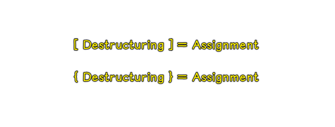

> The **destructuring assignment** syntax is a JavaScript expression that makes it possible to unpack values from arrays, or properties from objects, into distinct variables.

基础认识：

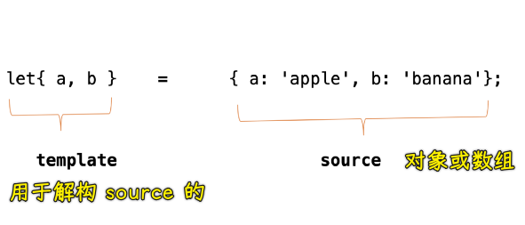

形象认识：


资料参考：

- [ES6-对象解构与数组解构 - 简书](https://www.jianshu.com/p/a8f74b29d0d1)
- [深入的理解数组和对象的解构赋值](https://juejin.cn/post/6844904119342202888)
- [JavaScript’s Destructuring Assignment](https://javascript.plainenglish.io/javascripts-destructuring-assignment-6d2c7db9bea8)
- [A Pocket Guide to Destructuring Assignment in ES6](https://codeburst.io/a-pocket-guide-to-destructuring-assignment-in-es6-f89c172a00b9)

## ★数组的解构

> Destructuring

ES2015 新增了从数组或者对象中获取指定元素的一种快捷方式，这是一种新的语法，被称之为「解构」

1）How to use

这里有一个数组`arr`，其中有三个不同的数值，以前我们需要去这个数组中获取指定的元素，我们需要通过索引去访问对应的值，然后把访问过后的结果放到一个变量当中：

``` js
const arr = [100, 200, 300]

const foo = arr[0]
const bar = arr[1]
const baz = arr[2]
console.log(foo, bar, baz) // 100 200 300
```

而现在，我们可以使用解构的方式去快速提取数组当中指定的成员，具体用法就是「把以前定义变量名的地方修改为一个数组的方括号`[]`，`[]`里边的内容就是我们需要提取出来的数据所存放的变量名，JS 内部会根据这些变量名所出现的位置去分配数组当中所对应位置的数值」

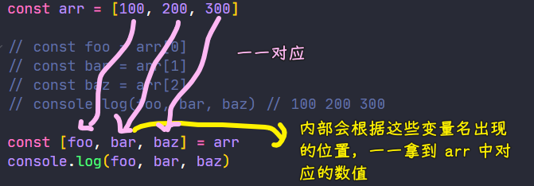

---

其它例子：

我们可以提前声明变量，也可以在解构赋值时顺带声明变量：

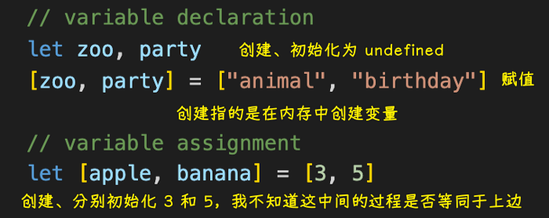

可以从变量那里提取值，也可以从函数那里提取值：

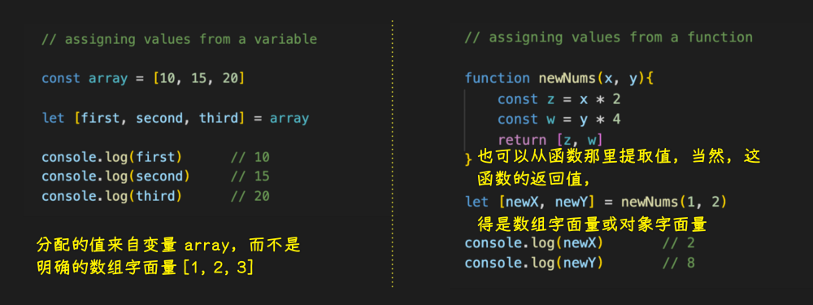

2）Skipping variables

如果我们**只想获取其中某个位置所对应的成员**，如我们只想获取第三个成员，那就把前两个成员给删掉，但是这需要保留所对应的逗号，以确保解构位置的格式与我们数组`arr`是一致的，这样一来，就能够提取到指定位置的成员

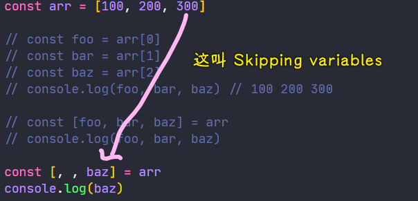

3）Assigning multiple values to a single variable

除此之外，我们还可以在「解构」位置的变量名之前去添加三个`.` -> 表示**提取从当前位置开始往后的所有成员**，最终所有的结果都会放到一个**数组**当中，需要注意的是，这种三个`.`的用法，只能在我们解构位置的最后一个成员上使用

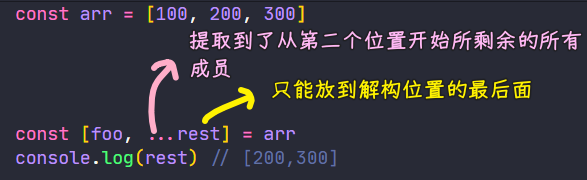

> 这种姿势叫「rest pattern」 -> 其中用到了`...`（spread operator），`...`跟着的变量`rest`必须是解构分配中最后一个变量，因为这个变量会被分配得到`arr`里边所有剩余的值……

总之，它是被用来解决这个问题的：

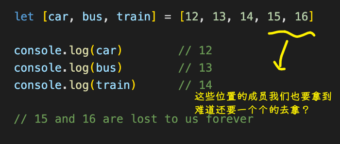

另外，如果解构位置的成员个数小于被解构的数组长度，那就会按照从前到后的顺序去提取，而多出来的成员则不会被提取

反之，如果解构位置的成员大于数组的长度，那么我们提取到就是`undefined`了 -> 这跟我们访问数组当中一个不存在的下标是一样的

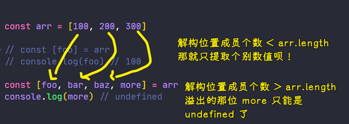

4）Assigning default values

如果你需要给提取到的成员设置默认值 -> 这种语法同样也能支持

只需要在解构位置的变量名后边跟上`=`，然后再写上一个默认值

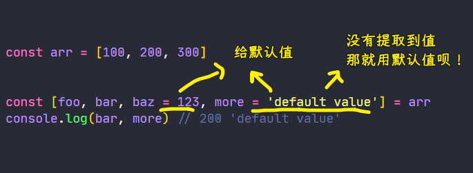

这样一来，如果解构位置的变量没有提取到数组当中对应的成员，那这变量得到的就是我们给的默认值！

注意，如果`arr`有`undefined`值，那解构位置对应的变量的值就是默认值 -> 这一点就像解构位置里的变量个数大于数组长度时，那些溢出的变量所提取到的值都是`undefined`一样

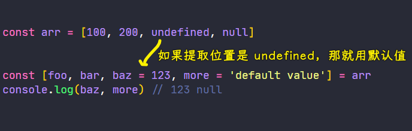

5）小结

以上，就是数组解构当中的一些基本的用法，这种新语法在很多场合上都会给我们带来很多的便捷

如：拆分一个字符串，然后获取拆分后指定的位置

- 传统的做法 -> 需要用到临时变量去做一个中间的过渡
- 通过解构 -> 可以大大简化这一个过程，使之变得更加的简单

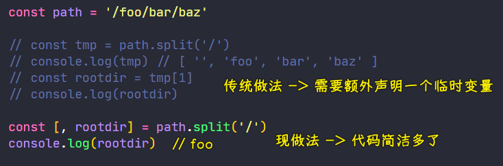

如：利用数组解构交换变量值

``` js
let a = 100
let b = 20

[a,b] = [b,a]
console.log(a,b) // 20 100
```

一些叫法：

- 解构：左边叫解构位置（模板），右边叫解构对象（解构源，如`[]`、`{}`）
  - 左边对右边的动作叫「提取」
  - 模板里的变量，叫成员，解构源里的元素也叫成员

## ★对象的解构


