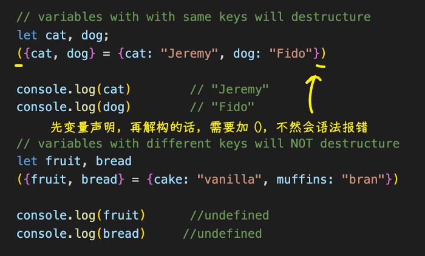
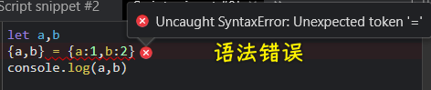
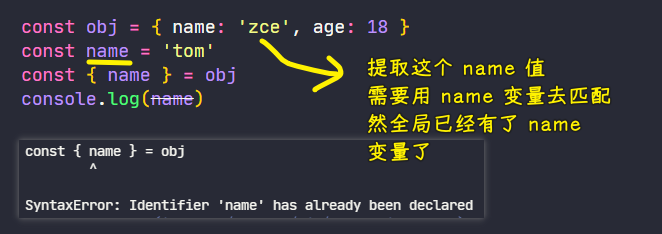
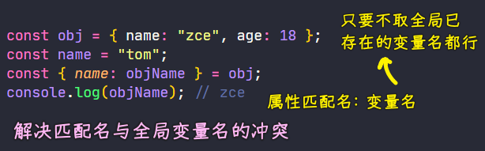
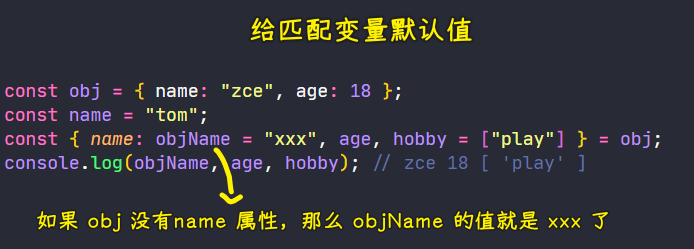
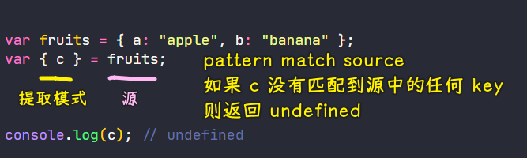
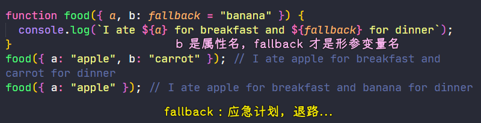
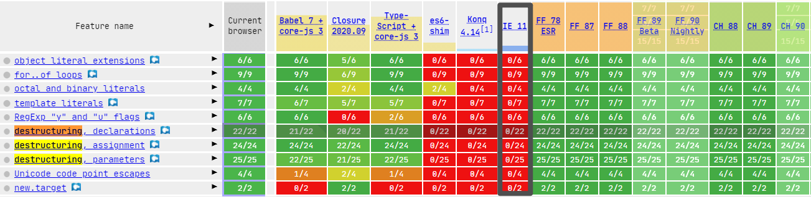

### ✍️ Tangxt ⏳ 2021-04-26 🏷️ 解构

# 01-2-数组的解构、对象的解构

## ★前言


> The **destructuring assignment** syntax is a JavaScript expression that makes it possible to unpack values from arrays, or properties from objects, into distinct variables.

基础认识：


形象认识：


> 如果你把图中那两个人看作是`let [man,woman]`，那么`man`和`woman`就是在提取图中的信息

参考资料：

- [ES6-对象解构与数组解构 - 简书](https://www.jianshu.com/p/a8f74b29d0d1)
- [深入的理解数组和对象的解构赋值](https://juejin.cn/post/6844904119342202888)
- [JavaScript’s Destructuring Assignment](https://javascript.plainenglish.io/javascripts-destructuring-assignment-6d2c7db9bea8)
- [A Pocket Guide to Destructuring Assignment in ES6](https://codeburst.io/a-pocket-guide-to-destructuring-assignment-in-es6-f89c172a00b9)

## ★数组的解构

> Destructuring

ES2015 新增了**从数组或者对象中获取指定元素**的一种快捷方式，这是一种新的语法，被称之为「**解构**」

### <mark>1）How to use</mark>

这里有一个数组`arr`，其中有三个不同的数值，以前我们需要去这个数组中获取指定的元素，我们需要通过索引去访问对应的值，然后把访问过后的结果放到一个变量当中：

``` js
const arr = [100, 200, 300]

const foo = arr[0]
const bar = arr[1]
const baz = arr[2]
console.log(foo, bar, baz) // 100 200 300
```

而现在，我们可以使用解构的方式去快速提取数组当中指定的成员，具体用法就是「把以前定义变量名的地方修改为一个数组的方括号`[]`，`[]`里边的内容就是我们需要提取出来的数据所存放的变量名，JS 内部会根据这些变量名所出现的位置去分配数组当中所对应位置的数值」


---

其它例子：

我们可以提前声明变量，也可以在解构赋值时顺带声明变量：


可以从变量那里提取值，也可以从函数那里提取值：


### <mark>2）Skipping variables</mark>

如果我们**只想获取其中某个位置所对应的成员**，如我们只想获取第三个成员，那就把前两个成员给删掉，但是这需要保留所对应的逗号，以确保解构位置的格式与我们数组`arr`是一致的，这样一来，就能够提取到指定位置的成员


### <mark>3）Assigning multiple values to a single variable</mark>

除此之外，我们还可以在「解构」位置的变量名之前去添加三个`.` -> 表示**提取从当前位置开始往后的所有成员**，最终所有的结果都会放到一个**数组**当中，需要注意的是，这种三个`.`的用法，只能在我们解构位置的最后一个成员上使用


> 这种姿势叫「rest pattern」 -> 其中用到了`...`（spread operator），`...`跟着的变量`rest`必须是解构分配中最后一个变量，因为这个变量会被分配得到`arr`里边所有剩余的值……

总之，它是被用来解决这个问题的：


另外，如果解构位置的成员个数小于被解构的数组长度，那就会按照从前到后的顺序去提取，而多出来的成员则不会被提取

反之，如果解构位置的成员大于数组的长度，那么我们提取到就是`undefined`了 -> 这跟我们访问数组当中一个不存在的下标是一样的


### <mark>4）Assigning default values</mark>

如果你需要给提取到的成员设置默认值 -> 这种语法同样也能支持

只需要在解构位置的变量名后边跟上`=`，然后再写上一个默认值


这样一来，如果解构位置的变量没有提取到数组当中对应的成员，那这变量得到的就是我们给的默认值！

注意，如果`arr`有`undefined`值，那解构位置对应的变量的值就是默认值 -> 这一点就像解构位置里的变量个数大于数组长度时，那些溢出的变量所提取到的值都是`undefined`一样


### <mark>5）小结</mark>

以上，就是数组解构当中的一些基本的用法，这种新语法在很多场合上都会给我们带来很多的便捷

如：拆分一个字符串，然后获取拆分后指定的位置

- 传统的做法 -> 需要用到临时变量去做一个中间的过渡
- 通过解构 -> 可以大大简化这一个过程，使之变得更加的简单


如：利用数组解构交换变量值

``` js
let a = 100
let b = 20

[a,b] = [b,a]
console.log(a,b) // 20 100
```

一些叫法：

- 解构：左边叫解构位置（模板），右边叫解构对象（解构源，如`[]`、`{}`）
  - 左边对右边的动作叫「提取」
  - 模板里的变量，叫成员，解构源里的元素也叫成员

💡：关于 `foo、bar、baz` 变量名？

这三个名字经常被用作变量名 -> 类似`xxx`这样，不在乎变量存储的内容，只是为了演示一个概念

>  每当我听到“ foo”，“ bar”，或者“ baz”的用法时，我就对演讲者失去了尊重。不像过去的编译器鼓励使用短变量名（如 a1、 a2 和 a3) 来节省空间，现代的编译器支持长的、高度描述性的名称，因此没有什么借口来延续这种晦涩的、过度使用的约定。当你考虑到 FUBAR 这个缩写背后的含义时，IMHO（In My Humble Opinion，恕我直言），“foo/bar” 的相似性使得它继续被引用成为一种粗糙和不成熟的做法

> Foo 这个词起源于 20 世纪 30 年代的一个无意义的词，军事术语 FUBAR 出现于 20 世纪 40 年代。.. ... foo fighter 这个词在二战中被盟军飞行员**用来描述各种不明飞行物或神秘的空中现象**。在编程环境中首次使用印刷术语出现在 1965 年版的麻省理工学院技术工程新闻中。

总之，它们三都是无意义的代名词，就像中文里的「张三、李四、王五」这样…… -> `foo bar baz = 无名氏 = 甲乙丙丁张三李四小明小张` -> `Foobar = Fubar = fucked up beyond all recognition（搞得面目全非）`

➹：[Foobar - Wikipedia](https://en.wikipedia.org/wiki/Foobar)

➹：[terminology - Meaning of foo, bar, baz, etc - Stack Overflow](https://stackoverflow.com/questions/34212049/meaning-of-foo-bar-baz-etc)

➹：[foo 到底是什么意思？ - 知乎](https://www.zhihu.com/question/34512213)

➹：[程序语言（如 C/C++）教材中为什么经常使用 foo 和 bar 作为函数或者变量的名字？ - 知乎](https://www.zhihu.com/question/19691869)

## ★对象的解构

在 ES2015 里边除了数组可以被解构以外，对象同样也可以被解构！

不过，**对象的解构是需要根据属性名去匹配提取的，而不是位置**！ -> 这是因为数组中的元素，它是有下标的，即它是有顺序规则的，而对象里边的成员可没有一个固定的次序，所以说对对象可不能按照位置去提取

### <mark>1）How to use</mark>

定义一个`obj`对象：

``` js
const obj = { name: 'zce', age: 18 }
```

解构它里边的成员，就是在以前的变量名位置使用一个对象字面量`{}` -> 在`{}`里边同样也是用来存放提取数据的变量名 -> 不过，这里的变量名，还有一个很重要的作用，就是去匹配解构对象中的成员，从而去提取指定成员中的值！

如`const { name } = obj`这个`name`就是提取了`obj`对象里边的`name`属性的值，然后放到一个叫`name`的变量当中！

注意：



不然就报错：



> 不加`()`，浏览器会将`{}`解析为代码块，而不是解构

### <mark>2）特点</mark>

解构对象的其它特点，基本上跟解构数组是完全一致的！

如：

- 没有匹配到成员，也会返回`undefined`
- 也可以设置默认值，如果解构对象有这个成员属性，但其值是`undefined`，那么同解构数组一样，变量的值就是自己设置的默认值，如果是`null`，那就提取`null`值！
- ……

只不过，在对象当中还有一个特殊的情况，我们知道如果要提取`obj`的`name`值，那么必须得用`name`变量去匹配才能提取出来，可假如全局已经存在了`name`变量了呢？

如：



可以看到，这**冲突不可避免**啊！

这个时候，我们就可以用「**重命名**」的方式去解决这个问题

具体的语法就是，在解构位置的成员名后边加上一个英文冒号`:`，然后跟上一个新的名称 -> `const { name: objName } = obj` -> 这个`{}`里边有两个名称，`:`的左边实际上是用来去匹配`obj`里边的`name`属性名，以此来提取对应的值，而`:`的右边就是我们最终提取到的值所放入的那个变量的名称 -> 这样一来我们就可以任意起一个变量名称了，也就不会再有冲突的情况出现了



如果还需要同时去**添加默认值**，那就在`:`后边的变量名的后边再继续跟上`=`，然后再去设置对应的默认值



### <mark>3）应用场景</mark>

解构对象的应用场景，相较于解构数组而言，那就更多了。不过大部分场景下，也都是**为了简化我们的代码**

如代码当中大量用到了`console`对象中`log`方法，那么我们就可以先把这个方法单独地解构出来，然后再去使用这个独立的`log`方法……

``` js
const { log } = console;
log("foo");
log("bar");
log("123");
```

这样一来，简化了我们代码的编写，二来呢？代码整体的体积也会减少很多

## ★补充

💡：原始获取对象属性时的写法

需要不停地声明变量来获取：

``` js
const obj = {
  name: "zce",
  age: 18,
};

const name = obj.name;
const age = obj.age;
console.log(name, age); //zce 18
```

💡：`const { name, age } = obj`的其它读法？

先声明变量 `name` 和 `age`，然后在对象 `obj` 中寻找同名属性，最后将属性值赋值给变量 `name` 和 `age`

💡：解构是可以嵌套的

``` js
let subscribers = [
  {
    company: "Google",
    employee: {
      name: "John Doe",
      email: "johndoe@example.com",
      age: 27,
    },
  },
  {
    company: "Microsoft",
    employee: {
      name: "Mark Lukas",
      email: "marklukas@example.com",
      age: 40,
    },
  },
];

subscribers.forEach((subscriber) => {
  let {
    employee: { name, email },
  } = subscriber;

  console.log(`Emailing ${name}<${email}>`);
  // Emailing John Doe<johndoe@example.com>
  // Emailing Mark Lukas<marklukas@example.com>
});
```

> 先解构第一层的`employee`，再解构第二层的`name`和`email`

💡：也可以解构字符串，因为它们是可迭代的，任何可迭代的东西都是可以被解构的

> Destructuring works for arrays, objects and anything iterable. You can selectively extract the values you want from objects even strings.

解构可以用于数组、对象和任何可迭代的东西。你可以有选择地从对象甚至字符串中**提取所需的值**。

``` js
let fruits = "fruits";
let [a, b, c, d, e, f] = fruits;
console.log(a); // f
console.log(b); // r
console.log(c); // u
console.log(d); // i
console.log(e); // t
```

💡：在「Swapping variable values」中，临时变量被叫做「value holder」或者「第三个变量」

``` js
let a = "apple";
let b = "banana";
[a, b] = [b, a];
console.log(a); //banana
console.log(b); //apple
```

💡：所谓的跳过变量值？

在解构时，可以用逗号跳过不需要的值

``` js
let fruits = [
  "apple",
  "banana",
  "carrot",
  "Dewberries",
  "Eggfruits",
  "Farkleberry",
];

//skip "apple"
let [, b, c] = fruits;
console.log(b); // banana
console.log(c); // carrot

//skip "apple","banana" and "carrot"
let [, , , d] = fruits;
console.log(d); // Dewberries
```

💡：Rest operator

Rest 操作符由三个点 (`...`) 表示，并允许将迭代对象（iterables ）**折叠**（collapsed）成**单个元素数组**。可以使用 rest 操作符提取所需的值，并将其余的值合并为一个数组。

``` js
let fruits = [
  "apple",
  "banana",
  "carrot",
  "Dewberries",
  "Eggfruits",
  "Farkleberry",
];
let [a, b, ...others] = fruits;
console.log(a); // apple
console.log(b); // banana
console.log(others); // [ 'carrot', 'Dewberries', 'Eggfruits', 'Farkleberry'
```

💡：Multiple return values（多个返回值）

与 Go 不同，JavaScript 本身不支持多个返回值。但我们可以利用解构赋值来模拟多个返回值。

``` js
function getFruits() {
  return ["apple", "banana", "carrot"];
}
let [a, b, c] = getFruits();
console.log(a); // apple
console.log(b); // banna
console.log(c); // carrot
```

`getFruits()`就像是返回了多个值一样……

💡：Default destructuring value

> If the extracting pattern does not match any key in the "source", `undefined` will be returned.



作为选择，你可以指定一个默认值：

``` js
let fruits = [
  "apple",
  "banana",
  "carrot",
  "Dewberries",
  "Eggfruits",
  "Farkleberry",
];

//set default
var { c = "carrot" } = fruits;
console.log(c); // carrot

let { a, b = 1 } = {};
console.log(a); // undefined
console.log(b); // 1
```

> 大佬给的例子还是巧妙啊！ -> 很多时候，我们也许拿到了一个空对象！

也可以在参数（arguments）中指定默认值



> parameters：形式参数 vs arguments：实际参数 -> 如果不成对出现，直接翻译成参数即可，因为这个时候区分形参实参不是特别重要

➹：[编程中，parameter、argument 翻译成什么中文最好？ - 知乎](https://www.zhihu.com/question/24155012)

## ★总结

- 解构赋值 -> 可以为我们节省几行代码，以此来减轻打字负担
- 并非所有浏览器都支持解构赋值，如果你需要支持像 IE11 这样的老浏览器，那么你可以借助像 Babel 这样的编译器。

查看浏览器是否支持解构赋值？ -> [ECMAScript 6 compatibility table](http://kangax.github.io/compat-table/es6/)


