### ✍️ Tangxt ⏳ 2021-04-26 🏷️ 模板字符串

# 01-3-模板字符串、带标签的模板字符串、字符串的扩展方法

## ★模板字符串字面量

> Template literals (Template strings)

在 ES2015 中，还增强了定义字符串的方式

传统定义字符串的方式需要通过**单引号或者是双引号**来表示，而在 ES2015 中就新增了一种叫做「**模板字符串**」（早期 ES2015 的称呼，现在叫「模板字面量」）的方式 -> 它需要使用**反引号**去标识，即键盘当中`1`左边那个键

直接这样使用：

``` js
// 反引号包裹
const str = `hello es2015, this is a string`
```

跟普通字符串的使用没啥区别！

如果我们需要在内容当中使用反引号，那么我们同样也可以使用`\`去转义它：

``` js
const str = `hello es2015, this is a \`string\``
console.log(str) // hello es2015, this is a `string`
```

相比于普通字符串，这种模板字符串的方式，它多了一些非常有用的新特性

如：

传统的字符串不支持换行：


如果需要换行得用显示的`\n`换行符来搞：


而在最新的模板字符串当中，它是可以支持多行字符串的，即我们可以在字符串当中直接敲个回车：


这一点**对于我们输出 HTML 字符串是非常方便的**

---

其次，模板字符串当中还支持通过**插值表达式**的方式在字符串中去嵌入所对应的数值 -> 语法是`${}`

如：


相比于之前字符串拼接的方式要方便多了，而且也更直观一点 -> 不容易写错！

总之，`${}`这个`{}`里边的内容就是标准 JavaScript，这意味着这`{}`里边，**不仅可以嵌入变量，还可以嵌入任何标准的 JS 语句**，而这语句的返回值最终会被输出到我们的字符串当中的那个插值表达式所存在的位置

💡：插入一个对象字面量？


相当于执行了这个`({}).toString()`

💡：`\`和`\n`的读法？

反斜线（`\`）是转义字符，用来表达字符串中的特殊字符，或将其后跟的字符解释为其本身 -> 也就是说`\`可以叫转义字符 -> 不过，似乎叫「用来转义的字符」比较好！

如`\n`，`\`让`n`这个普通字符转义成了特殊字符`newline`，而有意义的`'`，你`\'`就会让`'`转译成特殊字符`单引号` -> 其实它们就是相当于在字符串中输入一个回车字符、单引号字符罢了，只是这种输入形式很奇葩罢了！不像我们平时在纸上写字那样

转义字符（Escape character）的百度百科定义：

> 所有的 ASCII 码都可以用“`\`”加数字（一般是 8 进制数字）来表示。而 C 中定义了一些字母前加"`\`"来**表示常见的那些不能显示的 ASCII 字符**，如`\0`,`\t`,`\n` 等，就称为转义字符，因为后面的字符，都不是它本来的 ASCII 字符意思了。

➹：[转义字符 - MaxCompute - 阿里云](https://help.aliyun.com/document_detail/27869.html)

➹：[转义字符_百度百科](https://baike.baidu.com/item/%E8%BD%AC%E4%B9%89%E5%AD%97%E7%AC%A6)

## ★模板字符串标签函数

> Tagged templates

模板字符串还有一个更高级的用法，就是在定义模板字符串之前去添加一个标签，而这个标签实际上就是一个特殊的函数 -> 添加了这个标签就是在调用这个函数

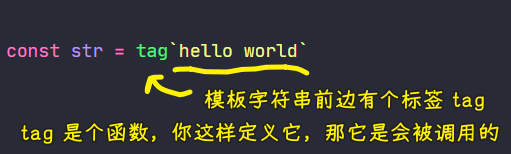

例子：尝试用`console.log`作为模板字符串的标签

``` js
const str = console.log`hello world` // [ 'hello world' ]
```

其执行结果就是`log`了一个数组

话说，这里为啥会打印了一个数组出来了呢？

我们尝试自己定义一个使用标签函数的模板字符串 -> 使用标签函数前先定义一个函数（也可以后边定义，但为了更好的编码习惯，还是先定义再使用）

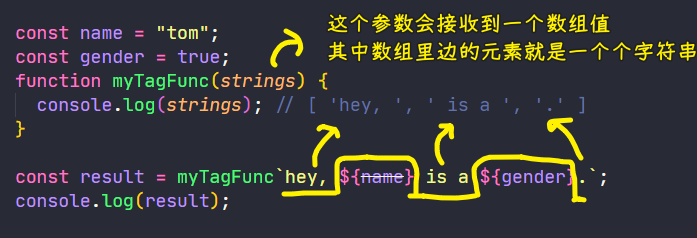

`strings`这个数组里边的元素就是被`${}`分割过后的结果！ -> 在模板字符串当中可能会有嵌入的表达式，如果有，那就按照这些表达式分割过后那些**静态的内容**作为数组的一个个元素……

标签函数除了可以接收到这个数组以外，还可以接收到所有在这个模板字符串当中出现的**表达式的返回值** -> 如上图这个例子中`name`和`gender`这两个插值

接收`name`和`gender`的值：

``` js
const name = "tom";
const gender = true;
function myTagFunc(strings, name, gender) {
  console.log(strings); // [ 'hey, ', ' is a ', '.' ]
  console.log(typeof gender); // boolean
  console.log(name, gender); // tom true
}

const result = myTagFunc`hey, ${name} is a ${gender}.`;
console.log(result); // undefined
```

`myTagFunc`函数内部的返回值，就是我们的这个带标签的模板字符串所对应的返回值

为了返回正常的内容，我们返回模板字符串拼接过后的结果：

``` js
const name = "tom";
const gender = true;
function myTagFunc(strings, name, gender) {
  return strings[0] + name + strings[1] + gender + strings[2]
}

const result = myTagFunc`hey, ${name} is a ${gender}.`;
console.log(result); // hey, tom is a true.
```

这种标签函数的作用实际上就是**对我们的模板字符串进行加工**，如`gender`输出的结果是`true`或者`false`，那我们可以在这个`myTagFunc`函数里边对这个`gender`进行加工 -> 这样可以**让返回的结果更适合用户阅读**

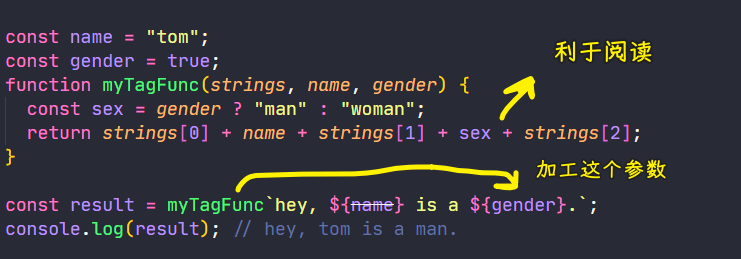

利用这个标签函数特性，我们可以去实现，如「文本的多语言化 -> 翻译成中文、英文等」、「检查模板字符串当中是否存在不安全的一些字符」之类的一些需求 -> 甚至，你还可以使用这种特性来去实现一个小型的模板引擎

## ★字符串的扩展方法

在 ES2015 里边，还为字符串对象提供了一系列的扩展方法

了解几个非常常用的方法：

- includes()
- startsWith()
- endsWith()

这三个方法是一组方法 -> 可以让我们**更方便地去判断字符串当中是否包含指定的内容**

例子：

定义一个字符串：

``` js
const message = 'Error: foo is not defined.'
```

假设这个字符串是程序运行当中得到的错误消息，那么我们想要知道**这个字符串是否以`Error`开头**，那么我们就可以使用`startsWith`方法去判断：

``` js
const message = "Error: foo is not defined.";

console.log(message.startsWith("Error")); // true
```

同理，判断**这个字符串是否以`.`结尾**，那么我们就可以使用`endsWith`方法：

``` js
const message = "Error: foo is not defined.";

console.log(message.endsWith(".")); // true
```

如果我们需要明确知道**这个字符串的中间是否包含某个内容**，如这个字符当中是否包含`foo`，那我们就可以使用`includes`方法：

``` js
const message = "Error: foo is not defined.";

console.log(message.includes("foo")); // true
```

相比于之前我们使用的`indexOf`或者是正则去判断，ES2015 提供的这样一组方法会让我们的字符串查找便捷很多！

## ★补充

### <mark>1）字符串模板的使用场景</mark>

#### <mark>1、在 Vue 中写一个模板</mark>

以前：

你可以这样写：

``` js
var html = "<ul>"
         + "  <li>This is list item 1</li>"
         + "  <li>This is list item 2</li>"
         + "</ul>";
```

也可以这样写：

``` js
var html = [
  "<ul>",
  "  <li>This is list item 1</li>",
  "  <li>This is list item 2</li>",
  "</ul>"
].join("");
```

现在：

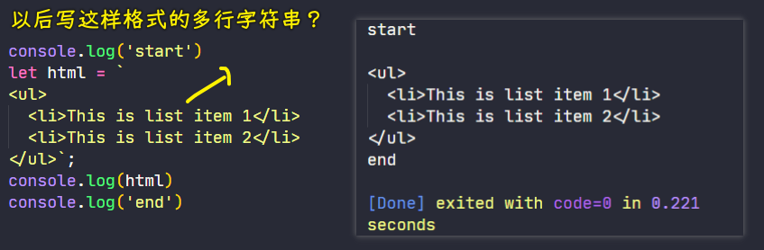

> 为了保持缩进，我们在开头添加了一个新行

---

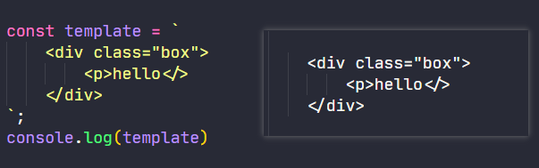

#### <mark>2、像写 JSX 一样</mark>

> 字符串模板 -> 可以嵌套使用，也可以使用三元表达式

``` js
let word = "world";
let str = `hello, ${word.split("").map(c => `(${c})`).join("")}`;
// hello, (w)(o)(r)(l)(d)
```

> 这代码很伤眼……话说你喜欢短代码？还是可读性好的代码？ -> 如果简洁的代码有一半过于聪明，那么这对于代码长期的可维护性来说可能不是很好

``` html
<!DOCTYPE html>
<html lang="zh-Hans">
  <head>
    <meta charset="utf-8" />
    <title>01-template-strings</title>
    <style>
      .todoList {
        width: 300px;
        border: 1px solid #b0e2ff;
        border-radius: 3px;
      }
      .userName {
        padding: 10px 0 10px 10px;
        background: #b0e2ff;
      }
      .date {
        padding: 5px 0 5px 10px;
        background: #b0e2ff;
      }
    </style>
  </head>
  <body>
    <script>
      const Frank = {
        name: "Frank",
        date: "2021-04-27",
        todos: [
          {
            item: "go to store",
            completed: false,
          },
          {
            item: "go to store",
            completed: true,
          },
          {
            item: "go to store",
            completed: true,
          },
        ],
      };
      function renderTodos(todos) {
        return `
        <ul>
          ${todos
            .map(
              (todo) => `
              <li>
                ${todo.item} ${todo.completed ? "√" : "×"}
              </li>`
            )
            .join("")}
        </ul>
        `;
      }
      const template = `
        <div class="todoList">
          <div class="userName">${Frank.name}</div>
          <div class="list">
          ${renderTodos(Frank.todos)}
          </div>
          <div class="date">${Frank.date}</div>
        </div>
      `;
      document.body.innerHTML = template;
    </script>
  </body>
</html>
```

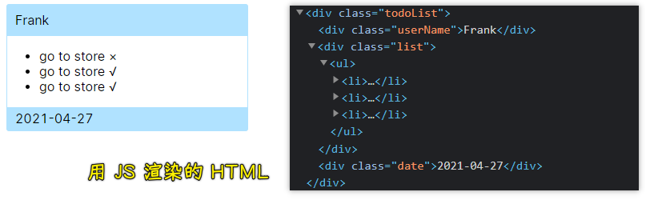

#### <mark>3、高亮文本</mark>

``` html
<!DOCTYPE html>
<html lang="zh-Hans">
  <head>
    <meta charset="utf-8" />
    <title>02-highlight</title>
    <style>
      .highLight {
        padding: 2px 5px;
        background: #b0e2ff;
      }
    </style>
  </head>
  <body>
    <script>
      function highLight(strings, ...values) {
        const highLighted = values.map(
          (value) => `<span class="highLight">${value}</span>`
        );

        let str = "";

        strings.forEach(
          (string, i) => (str += `${string}${highLighted[i] || ``}`)
        );

        return str;
      }

      const user = "Asher";
      const topic = "Learn to use es6";
      const sentence = highLight`<p>${user} has commented on your topic ${topic}</p>`;
      document.body.innerHTML = sentence;
    </script>
  </body>
</html>
```

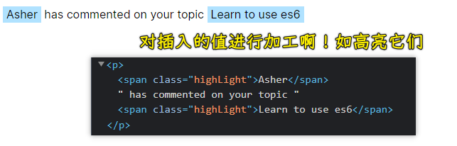

#### <mark>4、过滤用户输入</mark>

``` html
<!DOCTYPE html>
<html lang="zh-Hans">
  <head>
    <meta charset="utf-8" />
    <title>03-filter-input</title>
    <style>
      .comment-text {
        padding: 10px;
        width: 350px;
        height: 150px;
        border: 1px solid #b0e2ff;
        border-radius: 3px;
      }
      button {
        display: block;
        margin: 10px 0 20px;
        padding: 10px 15px;
        background: #b0e2ff;
        border: 1px solid #b0e2ff;
        border-radius: 3px;
        color: #333;
        cursor: pointer;
      }
      .userName {
        padding-bottom: 15px;
        border-bottom: 1px solid #ccc;
        color: #f08080;
        font-size: 18px;
      }
      .comentCotent {
        padding: 15px 0;
      }
    </style>
  </head>
  <body>
    <div class="box">
      <form class="add-comment">
        <textarea class="comment-text"></textarea>
        <button>Post Comment</button>
      </form>
      <div class="comment"></div>
    </div>

    <script type="text/javascript">
      const addCommentForm = document.querySelector(".add-comment");
      const textarea = document.querySelector(".comment-text");
      const comment = document.querySelector(".comment");
      const user = "Asher";

      function filter(strings, ...values) {
        //这里可以写上过滤需求
        //敏感词过滤
        let strArray = ["sb", "ghs"];
        // str = str.replace(/垃圾/g,"**")
        let res = values[1];
        strArray.forEach((value) => {
          // new RegExp('ab+c', 'i');
          let reg = new RegExp(`${value}`, "g");
          console.log(reg);
          let rep = "";
          let i = 0;
          while (i < value.length) {
            rep += "*";
            i++;
          }
          res = res.replace(reg, rep);
        });
        console.log(res);
        return res;
      }
      addCommentForm.addEventListener("submit", function (evt) {
        evt.preventDefault();
        const newComment = textarea.value.trim();
        if (newComment) {
          comment.innerHTML = filter`
                  <div class="userName">${user}</div>
                  <div class="comentCotent">${textarea.value}</div>
              `;
          textarea.value = "";
        }
      });
    </script>
  </body>
</html>
```

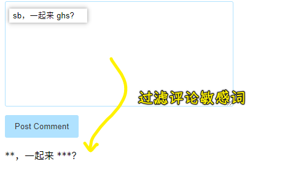

➹：[HTML JS 写 过滤敏感词_我的咖啡厅的博客-CSDN 博客](https://blog.csdn.net/weixin_45451197/article/details/104686904)

➹：[js 实现敏感词过滤算法_小黎也的专栏-CSDN 博客](https://blog.csdn.net/sdfedsee/article/details/108271829)

#### <mark>5、为字符串里边加点缀</mark>

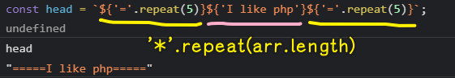

#### <mark>6、右对齐显示字符串</mark>

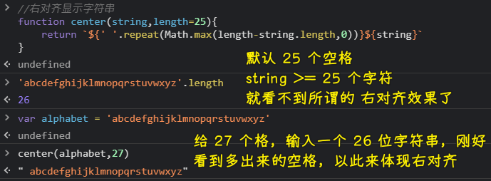

#### <mark>7、过滤 HTML 字符串，防止用户输入恶意内容</mark>

``` js
var sender = '<script>alert("abc")</script>'; // 恶意代码
var message = SaferHTML`<p>${sender} has sent you a message.</p>`;

function SaferHTML(templateData) {
  var s = templateData[0];
  for (var i = 1; i < arguments.length; i++) {
    var arg = String(arguments[i]);

    // Escape special characters in the substitution.
    s += arg.replace(/&/g, "&amp;").replace(/</g, "&lt;").replace(/>/g, "&gt;");

    // Don't escape special characters in the template.
    s += templateData[i];
  }
  return s;
}

console.log(message)
```

过滤结果：

``` html
<p>&lt;script&gt;alert("abc")&lt;/script&gt; has sent you a message.</p>
```

#### <mark>8、让多行字符串，一行化</mark>

使用`common-tags`这个库（提供了很多标签函数）：

``` js
import { oneLine } from "common-tags";

oneLine`
  foo
  bar
  baz
`;
// "foo bar baz"
```

> 写 CSS 的时候，让多行 CSS 一行化！

#### <mark>9、多语言转换（国际化处理）</mark>

> i18n（其来源是英文单词 internationalization 的首末字符 i 和 n，18 为中间的字符数）是“国际化”的简称。 在资讯领域，国际化 (i18n) 指让产品（出版物，软件，硬件等）无需做大的改变就能够适应不同的语言和地区的需要。 对程序来说，在不修改内部代码的情况下，能根据不同语言及地区显示相应的界面。 -> 「首字母+字母个数+尾字母」（对应那三个字符串方法） -> I18n 是 internationalization，g11n 是 globalization， K8s 是 Kubernetes

``` js
i18n`Welcome to ${siteName}, you are visitor number ${visitorNumber}!`;
// "欢迎访问 xxx，您是第 xxxx 位访问者！"
```

#### <mark>10、styled-components</mark>

``` js
const Button = styled.button`
  background-color: papayawhip;
  border-radius: 3px;
  color: palevioletred;
`
```

#### <mark>11、翻转单词</mark>

``` js
// zip -> 把传给标签函数的参数压缩到一起……
function zip(a, b) {
  let acc = [];
  for (let i = 0, l = Math.max(a.length, b.length); i < l; i++) {
    acc.push([a[i], b[i]]);
  }
  return acc;
}
function reverseWords(strings, ...args) {
  let numArgs = args.length;
  return zip(strings, args)
    .map(([literal, val], idx) => `${literal}${idx < numArgs ? val : ""}`)
    .join(" ")
    .split(/\s+/)
    .map((_, idx, arr) => arr[arr.length - idx - 1])
    .join(" ");
}
let foxColor = "brown";
let dogEnergy = "lazy";
let s = reverseWords`The quick ${foxColor} fox jumped over the ${dogEnergy} dog`;
// "dog lazy the over jumped fox brown quick The"

console.log(s);
```

#### <mark>12、SQL 语句</mark>

SQL 注入是一个常见的问题ーー有很多不好的例子是串联变量而不是绑定变量

错误的做法：

``` js
// BAD, BAD, VERY BAD, DON'T EVER DO THIS, EVER, EVER, EVER!
// PLEASE, I'M BEGGING YOU: DO NOT USE!
let lastName = "Smith";
let sql = `SELECT * FROM PEOPLE WHERE LAST_NAME = ${lastName}`;
```

正确的做法：

``` js
// ? -> 表示将在哪里替换项
let sql = `SELECT * FROM PEOPLE WHERE LAST_NAME = ?`;
let binds = [lastName];
```

``` js
function zip(a, b) {
  let acc = [];
  for (let i = 0, l = Math.max(a.length, b.length); i < l; i++) {
    acc.push([a[i], b[i]]);
  }
  return acc;
}

function sql(strings, ...args) {
  let numArgs = args.length;
  return zip(strings, args).reduce(
    (acc, [literal, arg], idx) => {
      acc.sql += literal;
      if (idx < numArgs) {
        acc.sql += "?";
        acc.binds.push(arg);
      }
      return acc;
    },
    { sql: "", binds: [] }
  );
}

let salary = 60000;
let companyId = 1234;

let preparedSql = sql`
SELECT employeeId
  FROM employees
 WHERE companyId = ${companyId}
   AND annualSalary > ${salary}
`;

console.log(preparedSql.sql);
console.log(preparedSql.binds);
```

执行结果：

``` html

SELECT employeeId
FROM employees
WHERE companyId = ?
 AND annualSalary > ?

[ 1234, 60000 ]
```

难到是把这两个值交给后端去处理？ -> 后端会去校验`salary`、`companyId`的值是否合理？

### <mark>2）技巧</mark>

一种快速查看函数有哪些参数的`debugger`方式：

``` js
function highLight(...values) {
  debugger;
}
const user = "Asher";
const topic = "Learn to use es6";
const sentence = highLight`${user} has commented on your topic ${topic}`;
```

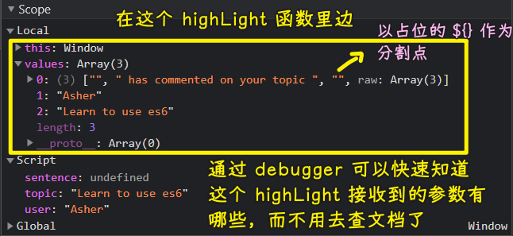

## ★了解更多

➹：[ES6-字符串模板 - 简书](https://www.jianshu.com/p/417087f879c7)

➹：[ES6-字符串函数 - 简书](https://www.jianshu.com/p/2a7c5c0aa6b2)

➹：[我对模版字符串中标签模板的思考 - SegmentFault 思否](https://segmentfault.com/a/1190000022448354)

➹：[The magic behind 💅 styled-components - Max Stoibers Blog](https://mxstbr.blog/2016/11/styled-components-magic-explained/)

➹：[common-tags - npm](https://www.npmjs.com/package/common-tags)

➹：[i18n - npm](https://www.npmjs.com/package/i18n)

➹：[I18n g11n K8s i22y 这样的缩写起源于何处？ - 知乎](https://www.zhihu.com/question/39756710)

➹：[ES2015 Template Literals. “Template literal” may sound strange…](https://medium.com/@photokandy/es2015-template-literals-eddf051ed8ee)

➹：[incaseofstairs.com/six-speed/](http://incaseofstairs.com/six-speed/)

## ★总结

- 多行字符串保留了空格，如果直接插入到 DOM 中，看不到明显的效果，如果你在控制台打印文本，就能看到明显的空格了！ -> 字符串模板里的字符都是一个个明确的字符啊！
- interpolation（插值）语法：`${...}` -> `{}`内的任何内容都会被计算，这意味着模板字符串是非常强大的，因为我们可以计算任意表达式 -> 从技术上讲，这个特性叫做「expression interpolation」（表达式插值）显然更好！
- 从技术讲，expression interpolation 等同于「concatenation」（连接、串联） -> 当你连接其它静态字符串时，你需要考虑这整个连接结果的安全性…… -> 会有「DOM injection attack」、SQL 注入的风险
- Tagged Template Literals：这个特性非常有用，或许这种语法需要一点时间才能适应，但一旦习惯了它，你就会发现它的牛逼之处了！ -> 语法`function tagFn(strings:Array[String], parm1:any, parm2:any, ...) {}`
- 字符串选择（模板字符串相较于常规字符串，性能会有少许不同，但影响也并不大）：
  - 如果你认为这个字符串最终可能需要插值，或者说你的代码需要跨行、需要使用标签函数 -> 那么就有模板字符串呗！
  - 否则，就用常规字符串！
  - 注意：如果有非常复杂的表达式插值，为了代码更容易阅读和理解，请使用短表达式……

💡：表达式的种类？(JS 表达式粒度的执行逻辑）

表达式有：

- Primary Expression：最小粒度的表达式，如字面量、变量、`this`、`()`
- Member Expression：成员访问/属性访问表达式，如`a.b`、`a[b]`
- New Expression：New 运算符表达式，如`new Foo`
- Call Expression：调用访问表达式，如`fn()`、`super()`、带标签的模板字符串（这也是一种特殊的函数调用方式）
- Update Expression：更新表达式，如`a++`、`++a`
- Unary Expression：一元表达式（常规操作/类型转换），如`delete a.b`、`typeof a`、`void a`、`await a`、`+a`、`!a`
- 计算表达式
  - Additive Expression: 加减法表达式，如`a+b`、`a-b`
  - Multiplicative Expression：乘法表达式，如`a*b`
  - Exponental Expression：乘方表达式，如`a**b`
- 关系 & 逻辑表达式
  - 关系表达式：用到关系运算符，如`instance`和`in` -> `a instanceof b`（a 跟 b 的关系？a 是 b 的实例吗？）、`a in b`（b 中有 a 属性吗？）、`a > b`（a 比 b 大吗？）
  - 逻辑表达式：`a && b`、`a || b` -> 都是短路

两个或多个表达式在一起使用，那这组合起来的表达式，将会按照什么样的顺序进行计算呢？

JS 世界给了这些表达式的执行优先级规则：

``` html
第一梯队：属性访问，成员变量
第二梯队：new
第三梯队：后置计算
第四梯队：前置计算（一元运算符，typeOf, instanceof, void, await）
```

> `()`的优先级是最高的，为了不去记忆优先级，你可以加`()`

关于赋值表达式优先级（这个赋值最常用）：

* 赋值右结合（右关联）
* 逗号取值后置逻辑

``` js
/* 赋值右结合（右关联）*/
a = b = c = d // 等同于：a = (b = (c = d))

/* 逗号取值后置 */
a = (1, 2, 3) // a: 3
```

➹：[JavaScript 表达式 - 知乎](https://zhuanlan.zhihu.com/p/226089184)

➹：[Operator precedence - JavaScript - MDN](https://developer.mozilla.org/en-US/docs/Web/JavaScript/Reference/Operators/Operator_Precedence)