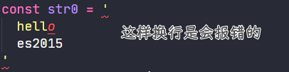
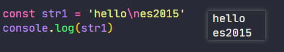
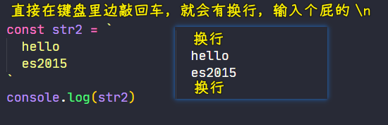
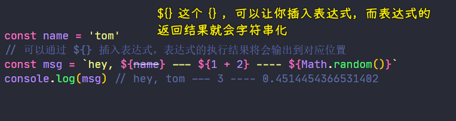
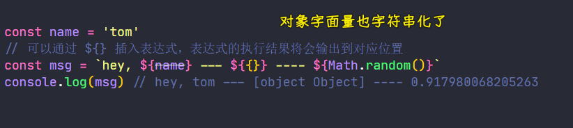

### ✍️ Tangxt ⏳ 2021-04-26 🏷️ 模板字符串

# 01-3-模板字符串、带标签的模板字符串、字符串的扩展方法

## ★模板字符串字面量

> Template literals (Template strings)

在 ES2015 中，还增强了定义字符串的方式

传统定义字符串的方式是需要通过**单引号或者是双引号**来表示，而在 ES2015 中就新增了一种叫做「**模板字符串**」（早期 ES2015 的称呼，现在叫「模板字面量」）的方式 -> 它需要使用**反引号**去标识，即键盘当中`1`左边那个键

直接这样使用：

``` js
// 反引号包裹
const str = `hello es2015, this is a string`
```

跟普通字符串的使用没啥区别！

如果我们需要在内容当中使用反引号，那么我们同样也可以使用`\`去转义它：

``` js
const str = `hello es2015, this is a \`string\``
console.log(str) // hello es2015, this is a `string`
```

相比于普通字符串，这种模板字符串的方式，它多了一些非常有用的新特性

如：

传统的字符串不支持换行：



如果需要换行得用显示的`\n`换行符来搞：



而在最新的模板字符串当中，它是可以支持多行字符串的，即我们可以在字符串当中直接输入换行符：



这一点对于我们输出 HTML 字符串是非常方便的

---

其次，模板字符串当中还支持通过插值表达式的方式在字符串中去嵌入所对应的数值 -> 语法是`${}`

如：



相比于之前字符串拼接的方式要方便多了，而且也更直观一点 -> 不容易写错！

总之，`${}`这个`{}`里边的内容就是标准 JavaScript，这意味着这`{}`里边，**不仅可以嵌入变量，还可以嵌入任何标准的 JS 语句**，而这语句的返回值最终会被输出到我们的字符串当中的那个插值表达式所存在的位置

💡：插入一个对象字面量？



相当于执行了这个`({}).toString()`

💡：`\`和`\n`的读法？

反斜线（`\`）是转义字符，用来表达字符串中的特殊字符，或将其后跟的字符解释为其本身 -> 也就是说`\`可以叫转义字符 -> 不过，似乎叫「用来转义的字符」比较好！

如`\n`，`\`让`n`这个普通字符转义成了特殊字符`newline`，而有意义的`'`，你`\'`就会让`'`转译成特殊字符`单引号` -> 其实它们就是相当于在字符串中输入一个回车字符、单引号字符罢了，只是这种输入形式很奇葩罢了！不像我们平时在纸上写字那样

转义字符（Escape character）的百度百科定义：

> 所有的 ASCII 码都可以用“`\`”加数字（一般是 8 进制数字）来表示。而 C 中定义了一些字母前加"`\`"来**表示常见的那些不能显示的 ASCII 字符**，如`\0`,`\t`,`\n` 等，就称为转义字符，因为后面的字符，都不是它本来的 ASCII 字符意思了。

➹：[转义字符 - MaxCompute - 阿里云](https://help.aliyun.com/document_detail/27869.html)

➹：[转义字符_百度百科](https://baike.baidu.com/item/%E8%BD%AC%E4%B9%89%E5%AD%97%E7%AC%A6)

## ★带标签的模板字符串


