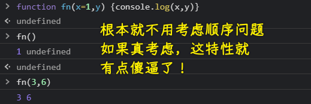
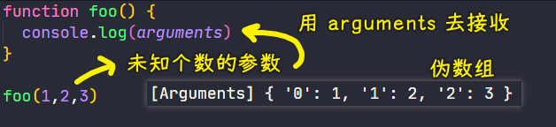
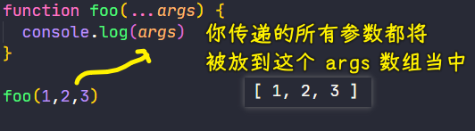

### ✍️ Tangxt ⏳ 2021-04-28 🏷️ es6

# 01-4-参数默认值、剩余参数、展开数组

> Default parameters、Rest parameters、Spread

在 ES2015 里边，为函数的形参列表扩展了一些非常有用的新语法，接下来就分别来看一下这些新语法！

## ★参数默认值

以前我们想要为函数中的参数去定义默认值，我们需要在函数体中通过逻辑代码来实现

很多人喜欢用短路运算的方式来设置默认值 -> 然这是一个很容易犯错的地方

如：

``` js
function foo (enable) {
  enable = enable || true
  console.log('foo invoked - enable: ')
  console.log(enable) // true
}

foo()
```

这个例子中，你不传参数，`enable`就取默认值`true`了，可你传了一个`false`参数呢？ -> `foo(false)` -> `enable`还是默认值`true`

所以，正确的姿势是：

``` js
function foo (enable) {
  // 短路运算很多情况下是不适合判断默认参数的，例如 0 '' false null
  // enable = enable || true
  enable = enable === undefined ? true : enable
  console.log('foo invoked - enable: ')
  console.log(enable)
}
```

为什么这样写？ -> 因为参数默认值的定义就是 -> **在我们没有传递实际参数时所使用的一个值**

既然我们没有传递实参，那`enable`得到的就是`undefined` -> 所以我们要判断的是`enable`是否为`undefined` -> 当然，如果你传个`undefined`，那就当我没说…

---

有了参数默认值这个新功能过后，这一切就变得简单得多了！

语法描述：在形参的后边通过`=`去设置一个默认值 -> `function x(xxx = true){}`

``` js
function foo (enable = true) {
  console.log('foo invoked - enable: ')
  console.log(enable)
}
// foo() or foo(undefined) -> enable 取的值是默认值
```

这里设置的默认值只会在我们调用`foo`时**没有传递实参**，或者**实参传递的是一个`undefined`值**时才会被使用！

注意，如果有多个参数的话，那带有默认值的这种形参，一定要出现在我们参数列表的最后 -> 因为我们的参数是按照次序传递的，如果带有默认值这种参数不在最后的话，那我们的默认值将无法正常工作

> 经过我测试，是不需要考虑顺序的，不然，这种限制也太傻逼了吧！ -> 这又不是`function foo(x, ...rest, y)` -> `Rest parameter must be last formal parameter`



## ★剩余参数

在 ES 中，很多方法都可以传递任意个数的参数，如`console`对象的`log`方法，它就可以接收任意个数的参数，并且最终会把这些参数打印到同一行当中

``` js
console.log(1,2,3) // 1 2 3
```

那对于未知个数的参数呢？

以前我们都是使用 ES 所提供的`arguments`对象去接收，而`arguments`实际上是一个伪数组



在 ES2015 当中，新增了一个`...`的操作符，而这种操作符有两个作用，而在这里我们需要用到的就是它的`rest`作用，即「剩余操作符」

- 语法：在函数的形参前面加上`...` -> `function foo(...args) {}`
- 作用：这个形参`args`会以数组的形式去接收**从当前这个参数位置开始往后所有的实参** -> 这种姿势可以取代以前通过`arguments`对象去接收无限参数的这样一种操作



由于这是接收剩余所有的参数，所以这种操作符它只能够出现在我们**形参的最后一位**，而且**只可以使用一次**

- `function foo(first, ...args){}` ✔
- `function foo(...args, second){}` ❌
- `function foo(...args, ...args2){}` ❌

## ★展开数组


