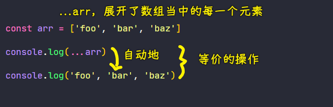
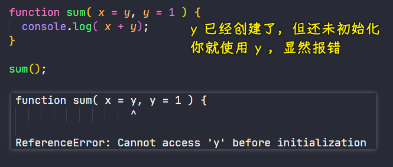
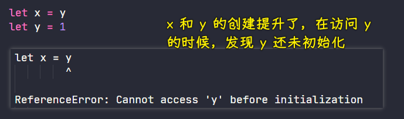
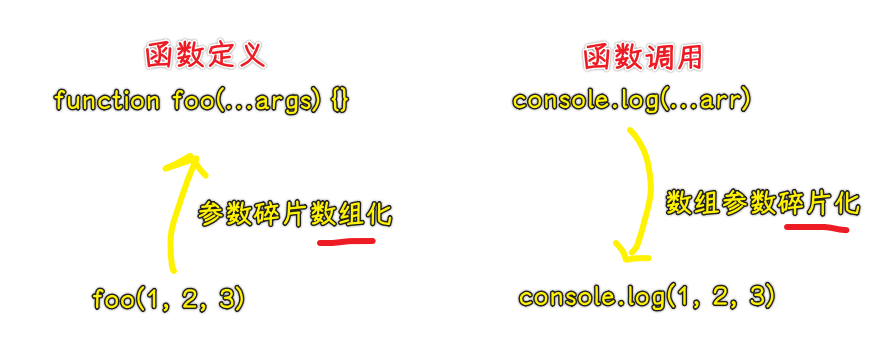

### ✍️ Tangxt ⏳ 2021-04-28 🏷️ es6

# 01-4-参数默认值、剩余参数、展开数组

> Default parameters、Rest parameters、Spread

在 ES2015 里边，为函数的形参列表扩展了一些非常有用的新语法，接下来就分别来看一下这些新语法！

## ★参数默认值

以前我们想要为函数中的参数去定义默认值，我们需要在函数体中通过逻辑代码来实现

很多人喜欢用短路运算的方式来设置默认值 -> 然这是一个很容易犯错的地方

如：

``` js
function foo (enable) {
  enable = enable || true
  console.log('foo invoked - enable: ')
  console.log(enable) // true
}

foo()
```

这个例子中，你不传参数，`enable`就取默认值`true`了，可你传了一个`false`参数呢？ -> `foo(false)` -> `enable`还是默认值`true`

所以，正确的姿势是：

``` js
function foo (enable) {
  // 短路运算很多情况下是不适合判断默认参数的，例如 0 '' false null
  // enable = enable || true
  enable = enable === undefined ? true : enable
  console.log('foo invoked - enable: ')
  console.log(enable)
}
```

为什么这样写？ -> 因为参数默认值的定义就是 -> **在我们没有传递实际参数时所使用的一个值**

既然我们没有传递实参，那`enable`得到的就是`undefined` -> 所以我们要判断的是`enable`是否为`undefined` -> 当然，如果你传个`undefined`，那就当我没说…

---

有了参数默认值这个新功能过后，这一切就变得简单得多了！

语法描述：在形参的后边通过`=`去设置一个默认值 -> `function x(xxx = true){}`

``` js
function foo (enable = true) {
  console.log('foo invoked - enable: ')
  console.log(enable)
}
// foo() or foo(undefined) -> enable 取的值是默认值
```

这里设置的默认值只会在我们调用`foo`时**没有传递实参**，或者**实参传递的是一个`undefined`值**时才会被使用！

注意，如果有多个参数的话，那带有默认值的这种形参，一定要出现在我们参数列表的最后 -> 因为我们的参数是按照次序传递的，如果带有默认值这种参数不在最后的话，那我们的默认值将无法正常工作

> 经过我测试，是不需要考虑顺序的，不然，这种限制也太傻逼了吧！ -> 这又不是`function foo(x, ...rest, y)` -> `Rest parameter must be last formal parameter`


## ★剩余参数

在 ES 中，很多方法都可以传递任意个数的参数，如`console`对象的`log`方法，它就可以接收任意个数的参数，并且最终会把这些参数打印到同一行当中

``` js
console.log(1,2,3) // 1 2 3
```

那对于未知个数的参数呢？

以前我们都是使用 ES 所提供的`arguments`对象去接收，而`arguments`实际上是一个伪数组


在 ES2015 当中，新增了一个`...`的操作符，而这种操作符有两个作用，而在这里我们需要用到的就是它的`rest`作用，即「剩余操作符」

- 语法：在函数的形参前面加上`...` -> `function foo(...args) {}`
- 作用：这个形参`args`会以数组的形式去接收**从当前这个参数位置开始往后所有的实参** -> 这种姿势可以取代以前通过`arguments`对象去接收无限参数的这样一种操作


由于这是接收剩余所有的参数，所以这种操作符它只能够出现在我们**形参的最后一位**，而且**只可以使用一次**

- `function foo(first, ...args){}` ✔
- `function foo(...args, second){}` ❌
- `function foo(...args, ...args2){}` ❌

## ★展开数组

`...`操作符除了可以用来收集剩余数据这种 Rest 用法，它还有一种 Spread 用法！ -> 它的意思就是「展开」

这个起到展开作用的操作符（可叫做展开操作符），它的用途有很多，在这里我们先来了解其中一个用途

### <mark>1）与函数相关的数组参数展开</mark>

有这样一个数组：

``` js
const arr = ['foo', 'bar', 'baz']
```

我们想要把数组当中的每一个成员按照次序传递给`console.log`方法

最笨的办法自然就是通过下标一个一个地去找到数组当中的每一个元素，然后分别传到`console.log`方法当中去

如：

``` js
console.log(
  arr[0],
  arr[1],
  arr[2],
) // foo bar baz
```

然而，如果数组当中的元素个数是不固定的，那这一个个传的姿势就行不通了，所以我们就必须要换一种方式去搞

以前我们面对这样一种情况，我们一般都是使用函数对象的`apply`方法去调用函数 -> 因为这个姿势可以以数组的形式去接收我们的实参列表

所以这可以有：

``` js
console.log.apply(console, arr) // foo bar baz
```

> `log`方法是`console`对象调用的，所以`apply`的第一个参数`this`指向是`console`对象本身，而第二个参数就是我们需要传递的实参列表的这样一个数组

在 ES2015 当中，就没有必要这么麻烦了，我们可以直接去调用`console`对象的`log`方法，然后通过`...`操作符来展开我们这个数组参数

``` js
console.log(...arr)
```

这里的`...`操作符就会自动把数组当中的每一个成员按照次序传递到参数列表当中 -> 这样一来，就大大简化了我们需要的操作！



## ★补充

### <mark>1）Passing Parameter as Default Values</mark>

``` js
function sum(x = 1, y = x,  z = x + y) {
  console.log( x + y + z );
}

sum(); // 4
```

> `x`的默认值是`1`，`y`的默认值是`x`参数的值，而`z`的默认值则是`x`参数值和`y`参数值之和

注意，如果你倒着来是会报错的，如：



这类似于：



### <mark>2）Passing Function Value as Default Value</mark>

``` js
const sum = () => 15;

const calculate = function (x, y = x * sum()) {
  return x + y;
};

const result = calculate(10);
console.log(result); // 160
```

> `10`被传递给了`calculate()`函数，`x`变成`10`，而`y`变成了`150`（`sum`函数的返回值是`15`）

## ★了解更多

➹：[Named and Optional Arguments in JavaScript](https://medium.com/dailyjs/named-and-optional-arguments-in-javascript-using-es6-destructuring-292a683d5b4e)

➹：[How to set default parameter values in JavaScript](https://flaviocopes.com/how-to-set-default-parameter-values-javascript/)

➹：[JavaScript Default Parameters](https://www.programiz.com/javascript/default-parameters)

➹：[Be careful when using `||` to set default values in JavaScript](https://www.codereadability.com/javascript-default-parameters-with-or-operator/)

➹：[What is a Default Parameter in a JavaScript function? – Dhananjay Kumar](https://debugmode.net/2017/09/19/easy-javascript-part-3-what-is-a-default-parameter-in-a-function/)

## ★总结

- 在编写函数时，JavaScript 的参数默认值是非常有用的 -> 当你调用函数时，如果缺少参数，那么参数默认值特性允许你给函数参数赋一个默认值，而不是让它`undefined`！
- 剩余参数 -> 函数定义 -> 用一个数组接收函数调用时所传递的不定个数实参 -> 破镜重圆
- 展开数组 -> 函数调用 -> 把数组当中的元素一个个手动地传给元素？还不如借助`...`来自动地一个个传参呢！ -> 覆水难收


