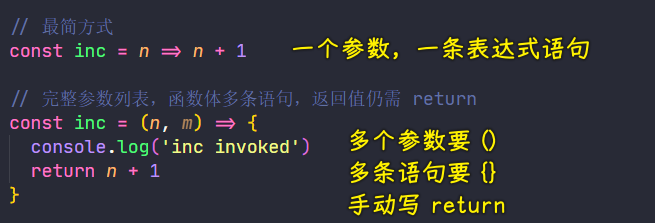

### ✍️ Tangxt ⏳ 2021-05-05 🏷️ es6

# 01-5-箭头函数、箭头函数与 this

> Arrow functions

## ★箭头函数

在 ES2015 当中，还简化了函数表达式定义的方式，它允许我们使用等号大于号（`=>`）这种类似箭头的符号来去定义函数

这种函数一来简化了函数的定义，二来它多了一些新的特性

接下来，就具体来看一下！

### <mark>1）语法</mark>

传统我们去定义一个函数表达式，我们需要通过`function`关键字去定义：

``` js
function inc (number) {
  return number + 1
}
```

而现在我们可以使用 ES2015 的箭头函数来去定义一个完全相同的函数：

``` js
// 最简方式
const inc = n => n + 1
```

此时，你会发现，相比于普通的函数，箭头函数确实大大简化了我们所定义函数的这样一些相关的代码

需要注意的是：


这个连体字体叫「Fira Code」 -> 这让等号大于号显示成了类似箭头的样子 -> 这不会影响你的代码

这种字体**推荐安装**，因为它可以对我们代码当中很多操作符会有更好的展示

---

回过头来看，箭头函数这种语法：

- `=>`的左边实际上是参数列表，如果有多个参数，可以使用圆括号的方式去定义，如`(n,m) => n+m`
- `=>`的右边实际上是函数体，如果**只有一句表达式**，也不带`{}`的话，那么这个表达式的执行结果就会作为这个箭头函数的返回值返回，如果你需要在函数体**执行多条语句**，那么这就需要花括号`{}`去包裹了（与用传统方式定义函数表达式一样），需要注意的是，一旦你使用了`{}`过后，那函数的返回值就得你手动通过`return`关键字去返回了



---

详细点：


它的局限性：


---

使用箭头函数最主要的变化就是「极大地简化了我们回调函数的编写」

如：

定义一个都是数字的数组：

``` js
const arr = [1, 2, 3, 4, 5, 6, 7]
```

我们想要筛选出这个数组当中所有的奇数，那么我们就可以使用数组对象的`filter`方法，然后传入一个包含筛选逻辑的函数：

``` js
arr.filter(function (item) {
  // 没有余数是 0，即为 falsy
  return item % 2
})
```

对于传入的这个函数，我们再使用箭头函数来复现一下：

``` js
// 常用场景，回调函数
arr.filter(i => i % 2) // [ 1, 3, 5, 7 ]
```

可以看到，对比普通函数和箭头函数之间的写法，你会发现，使用箭头函数会**让我们的代码更简短，而且更易懂**

## ★箭头函数与 this

相比于普通函数，箭头函数还有一个很重要的变化，那就是「**箭头函数不会改变 this 指向**」，接下来，具体来看一下这个变化

我们定义一个`person`对象：

``` js
const person = {
  name: 'tom',
  sayHi: function () {
    console.log(`hi, my name is ${this.name}`)
  }
}

person.sayHi() // hi, my name is tom
```

可以看到，`name`的值被打印出来，这里的`this`指向就是`sayHi`的调用者`person`对象！

把`sayHi`方法改为箭头函数的形式：

``` js
const person = {
  name: 'tom',
  sayHi: () => {
    console.log(`hi, my name is ${this.name}`)
  }
}

person.sayHi() // hi, my name is undefined
```

可以看到，此时打印出来的`name`值是`undefined` -> 这就是箭头函数跟普通函数之间最重要的区别 -> 为啥会这样呢？-> 那是因为在箭头函数当中它是没有`this`的机制，所以说它是不会改变`this`的指向的！换言之，**在箭头函数的外边`this`是什么，那我们在箭头函数里边拿到的`this`就是什么，而这是任何情况下都不会发生改变的！**

基于上一个代码，添加`sayHiAsync`方法（这是一个普通的函数）：

``` js
const person = {
  name: 'tom',
  sayHi: () => {
    console.log(`hi, my name is ${this.name}`)
  },
  sayHiAsync: function () {
    // 给 setTimeout 传一个普通的函数表达式，叫「callback」
    setTimeout(function () {
      console.log(this.name)
    }, 1000)
  }
}

person.sayHiAsync() // undefined
```

为啥打印的是`undefined`呢？因为`callback`没办法拿到当前作用域里边的`this`啊！-> `callback`这个函数在`setTimeout`里边最终会放到全局对象上被调用，所以说`callback`里边是拿不到当前这个作用域里边的`this`对象，而拿到的是全局对象（浏览器执行拿到的是`window`对象，node 环境执行拿到的是`Timeout`的实例对象）

很多时候，我们为了解决这样一个问题，我们会定义一个`_this`变量去保存我们当前作用域当中`this`，借助于闭包这样一个机制，然后在`callback`里边使用这个`_this`，我们就可以拿到我们所期望的`name`值：

``` js
const person = {
  name: 'tom',
  sayHi: () => {
    console.log(`hi, my name is ${this.name}`)
  },
  sayHiAsync: function () {
    const _this = this
    setTimeout(function () {
      console.log(_this.name)
    }, 1000)
  }
}

person.sayHiAsync() // tom
```

然而，如果我们使用的是箭头函数，那就没有必要这么麻烦了 -> 因为在箭头函数当中，`this`始终指向的都是当前作用域里边的`this`，所以以后但凡你的代码当中需要使用`_this`这种情况，都可以使用箭头函数来去避免


## ★补充

### <mark>1）箭头函数不适用于方法的意思？</mark>

传统例子：

``` js
var obj = {
  count: 10,
  doSomethingLater: function () {
    setTimeout(function () {
      // the function executes on the window scope
      this.count++;
      console.log(this.count);
    }, 300);
  },
};

obj.doSomethingLater(); // console prints "NaN", because the property "count" is not in the window scope.
```

箭头函数例子：

``` js
var obj = {
  count: 10,
  doSomethingLater: function () {
    // of course, arrow functions are not suited for methods
    setTimeout(() => {
      // since the arrow function was created within the "obj", it assumes the object's "this"
      this.count++;
      console.log(this.count);
    }, 300);
  },
};

obj.doSomethingLater(); // 11
```

不适用方法指的是，对象的方法一般都会用到`this`去获取对象上的其它数据！还有箭头函数是在`obj`内部创建的，可不是在`setTimeout`里边！

## ★了解更多

➹：[Arrow function expressions - JavaScript - MDN](https://developer.mozilla.org/en-US/docs/Web/JavaScript/Reference/Functions/Arrow_functions)

## ★总结

- 使用了箭头函数让你少写了很多代码
- 箭头函数不适用于作为对象的方法，很多时候用于`callback`，尤其适用于数组的那几个`filter`、`map`、`reduce`等这样的 API
- 不要想着用`call/apply/bind`去绑定箭头的函数的`this`，箭头函数压根就不会理它，箭头函数的`this`指向根据箭头函数创建的位置的作用域来确定！
- 箭头函数没有`arguments`
- 箭头函数不能`new`，如果`new`了，就会报错 -> 总之，箭头函数不能用作构造函数
- 箭头函数没有`prototype`属性
- ……


