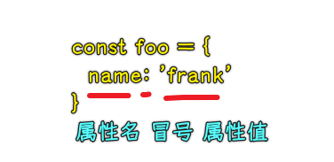
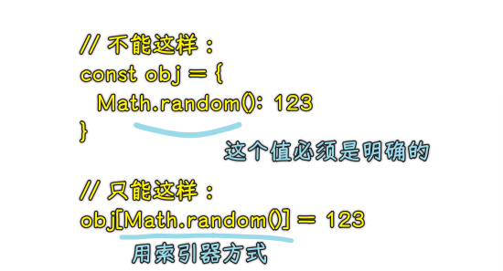
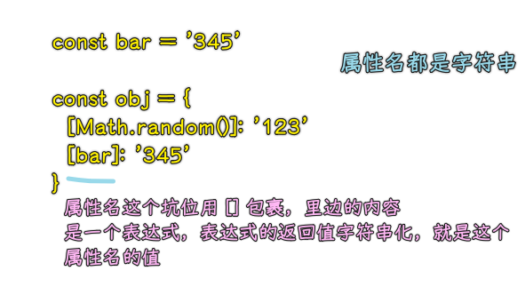
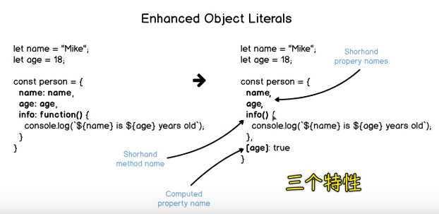

### ✍️ Tangxt ⏳ 2021-05-06 🏷️ es6

# 01-6-对象字面量的增强、Object.assign、Object.is

> Enhanced object literals、对象扩展方法

## ★对象字面量的增强

对象是我们在 ES 当中最常用的数据结构，在 ES2015 里边，它**升级了我们对象字面量的语法**

传统的对象字面量的语法：



必须得在`{}`用键值对语法，即便是变量，你也得写成这样：

``` js
const bar = 345
const obj = {
  foo: 123,
  bar: bar
}
```

1）Shorthand property names

而现在，如果变量名与我们要添加到对象当中的这个属性名是一致的话，那么我们就可以省略掉`:`以及后边的这个变量名了：

``` js
const obj = {
  // bar: bar
  bar
}
```

这两种方式是完全等价的

2）Shorthand method names

除此之外，如果我们需要为对象添加普通的方法，那么传统的做法就是（**方法名+冒号+函数表达式**）：

``` js
const obj = {
  method1: function() {}
}
```

那么现在，我们就可以省略掉`:`和`function`了：

``` js
const obj = {
  method1() {}
}
```

而这两种方式同样是完全等价的！

不过需要注意的是，这种方法的背后实际上就是普通的`function`，也就是说`method1`里边的`this`指向当前对象-> `obj.method1()`-> `this === obj`

3）Computed property names

对象字面量还有一个很重要的变化，那就是「**它可以使用表达式的返回值作为对象的属性名**」

以前我们需要为对象添加一个动态的属性名，我们就只能在**对象声明过后**，通过**索引器**的方式，即用`[]`去动态添加：



我们不能在属性名这个坑位，使用`Math.random()`，因为属性名必须是明确的值或者是一个符合变量名规范的一个名称 -> 正确的做法是，在`obj`声明过后，通过索引器的方式动态添加这样的属性！

而在 ES2015 过后，对象字面量的属性名直接就可以通过`[]`直接去使用动态的值 -> 这样一个特性叫做「**计算属性名**」

具体用法：把属性名的位置用一对方括号给它包起来，而在这个方括号里边就可以使用任意表达式了 -> 这个表达式的执行结果将会作为这个属性的属性名



一般我们都是这样使用动态属性名的：

``` js
const ran = Math.random()
const obj = { [ran]: 345 }
obj[ran] // 345
```

4）小结



## ★Object.assign

