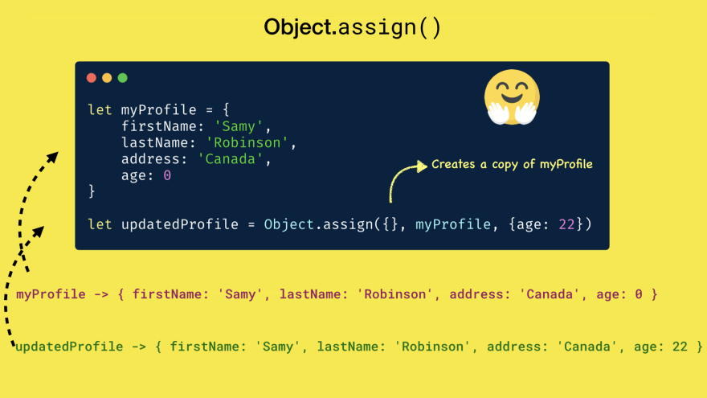
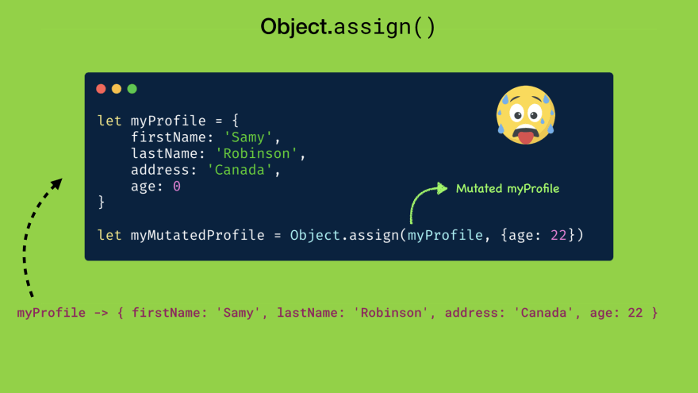
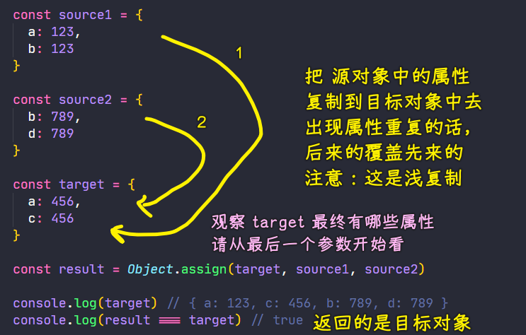
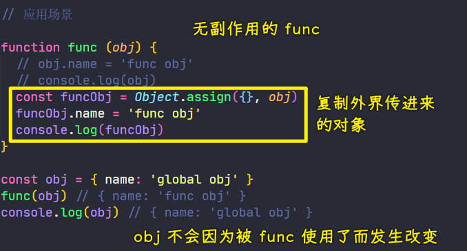
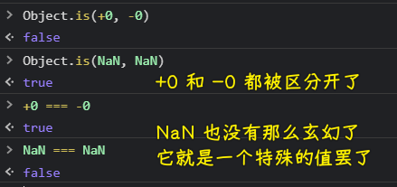

### ✍️ Tangxt ⏳ 2021-05-06 🏷️ es6

# 01-6-对象字面量的增强、Object.assign、Object.is

> Enhanced object literals、对象扩展方法

## ★对象字面量的增强

对象是我们在 ES 当中最常用的数据结构，在 ES2015 里边，它**升级了我们对象字面量的语法**

传统的对象字面量的语法：


必须得在`{}`用键值对语法，即便是变量，你也得写成这样：

``` js
const bar = 345
const obj = {
  foo: 123,
  bar: bar
}
```

### <mark>1）Shorthand property names</mark>

而现在，如果变量名与我们要添加到对象当中的这个属性名是一致的话，那么我们就可以省略掉`:`以及后边的这个变量名了：

``` js
const obj = {
  // bar: bar
  bar
}
```

这两种方式是完全等价的

### <mark>2）Shorthand method names</mark>

除此之外，如果我们需要为对象添加普通的方法，那么传统的做法就是（**方法名+冒号+函数表达式**）：

``` js
const obj = {
  method1: function() {}
}
```

那么现在，我们就可以省略掉`:`和`function`了：

``` js
const obj = {
  method1() {}
}
```

而这两种方式同样是完全等价的！

不过需要注意的是，这种方法的背后实际上就是普通的`function`，也就是说`method1`里边的`this`指向当前对象-> `obj.method1()`-> `this === obj`

### <mark>3）Computed property names</mark>

对象字面量还有一个很重要的变化，那就是「**它可以使用表达式的返回值作为对象的属性名**」

以前我们需要为对象添加一个动态的属性名，我们就只能在**对象声明过后**，通过**索引器**的方式，即用`[]`去动态添加：


我们不能在属性名这个坑位，使用`Math.random()`，因为属性名必须是明确的值或者是一个符合变量名规范的一个名称 -> 正确的做法是，在`obj`声明过后，通过索引器的方式动态添加这样的属性！

而在 ES2015 过后，对象字面量的属性名直接就可以通过`[]`直接去使用动态的值 -> 这样一个特性叫做「**计算属性名**」

具体用法：把属性名的位置用一对方括号给它包起来，而在这个方括号里边就可以使用任意表达式了 -> 这个表达式的执行结果将会作为这个属性的属性名


一般我们都是这样使用计算属性名的：

``` js
const ran = Math.random()
const obj = { [ran]: 345 }
obj[ran] // 345
```

### <mark>4）小结</mark>


## ★Object.assign & Object.is

在 ES2015 中，为 Object 对象提供了一些扩展方法，在这里我们就看几个最主要的方法！

### <mark>1）Object.assign</mark>





这个方法可以「**将多个源对象中的属性复制到一个目标对象中**」

如果对象之间有相同的属性，那么源对象中的属性会覆盖掉目标对象中的属性

> 对象字面量有一个特性，如果属性名出现重复，那么后边写的覆盖前边写的！

这里所说的源对象和目标对象，其实都是普通对象，只不过用处不同罢了！ -> **我们是从源对象里边取，然后往目标对象中放**

例子：

定义一个源对象`source1`：

``` js
const source1 = {
  a: 123,
  b: 123
}
```

定义一个目标对象`target`：

``` js
const target = {
  a: 456,
  c: 456
}
```

有了这两个对象过后，我们就可以使用`Object.assign`方法去合并它们了

`Object.assign`方法支持传入任意个数的对象，其中第一个参数就是我们的目标对象，即`target` -> 返回值正是目标对象



以上就是`assign`这个方法的作用了，简单来说就是「用后边对象中的属性去覆盖第一个对象」 -> 非常简单的说！

这个方法特别常用，很多时候我们都可以使用它去复制一个对象

如：

定义一个接收对象参数的函数，其中函数内部会修改这个对象参数的属性：

``` js
function func(obj) {
  obj.name = 'func obj'
  console.log(obj)
}
const obj = { name: 'global obj' }
func(obj)
console.log(obj)
```

这样一来，外界的`obj`对象也会同时发生变化了！ -> 因为传给函数的对象`obj`与外界的对象`obj`是指向同一个内存地址，即是同一个数据

如果我们只希望在函数的内部修改传进来的对象（让`func`无副作用），那么我们就可以使用`Object.assign`方法去把这个对象复制到一个**全新的空对象**上边：



除此之外，这个方法还可以为`options`对象参数去设置默认值 -> 这也是一个非常常见的应用场景！

> 浅复制（只复制引用值，像要深层次的复制，可以借助`JSON.parse(JSON.stringify(obj))`来搞）、只能复制自有属性、不可枚举的属性不能复制（是否允许`for...in`） -> 该方法涉及到数据不可变理念 -> 它的简写方式可以用`...`（`assign`会触发`setters`，而展开运算符则不会触发）

### <mark>2）Object.is</mark>

ES2015 还为 Object 对象新增了一个`is`方法 -> 用来去判断两个值是否相等

在此之前，在 ES 中，判断两个值是否相等，我们可以使用两个`=`号这样的相等运算符`==`或者是三个`=`号的严格相等运算符

这两者之间的区别：

- `==`：比较之前自动转换数据类型 -> 这会导致`0 == false`等这种情况下是成立的
- `===`：严格去对比两者之间的数值是否相同 -> `0 === false` -> 类型不同，所以它们俩不会严格相等 -> 然而，它**也有两个特殊情况**
  - 对于数字`0`的正负，它是没有办法区分的，即`+0 === -0`这样比较时，其所返回的结果是`true`，当然，这对于我们应用开发来讲，这种问题其实我们根本就不需要关心！只要当我们去处理一些特殊的数学问题时，才会有这种情况出现
  - `NaN === NaN`或`NaN == NaN`这样比较时，是不相等的，以前，认为`NaN`是一个非数字，即**它有无限种可能**，所以说这两个`NaN`是不相等的，但在今天看来，`NaN`实际上就是一个特别的值，所以说两个`NaN`，它应该是完全相等的

所以在 ES2015 中就**提出了一种新的同值比较的算法**

我们可以使用`Object`对象全新的`is`方法来解决全等的这两种特数情况：

``` js
Object.is(+0, -0)
Object.is(NaN, NaN)
```



不过，一般情况下，我们根本不会用到这个`is`方法，大多数时候，我们建议大家还是使用严格相等运算符，也就是三个等号`===`

## ★补充

### <mark>1）计算属性之一个很酷的用法</mark>

``` js
var name = "make";
var i = 0;
const laptop = {
  [name + ++i]: "Apple",
  [name + ++i]: "Dell",
  [name + ++i]: "HP",
};

console.log(laptop.make1); //"Apple"
console.log(laptop.make2); //"Dell"
console.log(laptop.make3); //"HP"
```

## ★了解更多

➹：[Object initializer - JavaScript - MDN](https://developer.mozilla.org/zh-TW/docs/Web/JavaScript/Reference/Operators/Object_initializer)

➹：[ES6-对象字面量的扩展 - 简书](https://www.jianshu.com/p/a69eb63e6549)

➹：[Careful use of Object.assign in JavaScript - DEV Community 👩‍💻👨‍💻](https://dev.to/deekshasharma25/careful-use-of-object-assign-in-javascript-jp7)

➹：[Object-Assign-Deep/objectAssignDeep.js at master · saikojosh/Object-Assign-Deep](https://github.com/saikojosh/Object-Assign-Deep/blob/master/objectAssignDeep.js)

➹：[Object.assign() - JavaScript - MDN](https://developer.mozilla.org/en-US/docs/Web/JavaScript/Reference/Global_Objects/Object/assign)

➹：[Object.prototype.propertyIsEnumerable() - JavaScript - MDN](https://developer.mozilla.org/en-US/docs/Web/JavaScript/Reference/Global_Objects/Object/propertyIsEnumerable)

➹：[Enhanced Object Literals in ES6 - DEV Community](https://dev.to/sarah_chima/enhanced-object-literals-in-es6-a9d)

➹：[JavaScript Bible 17. ES6 Enhanced Object Literals_哔哩哔哩 （゜-゜）つロ 干杯~-bilibili](https://www.bilibili.com/video/BV1z4411n7Tp?p=3)

➹：[ES2015 系列（二） 理解 Object.assign - CNode 技术社区](https://cnodejs.org/topic/56c49662db16d3343df34b13)

## ★总结

- 对于对象字面量，你可以：
  - 使用简短的属性名
  - 使用简单的方法名
  - 让属性是动态的，可计算的
- `Object.assign`：浅拷贝一个对象、不可变数据理念 -> `{...obj}`
- `Object.is`：不常用，它的出现是为了解决`===`的两个特殊情况：`+0 === -0`、`NaN === NaN`或`NaN == NaN`
