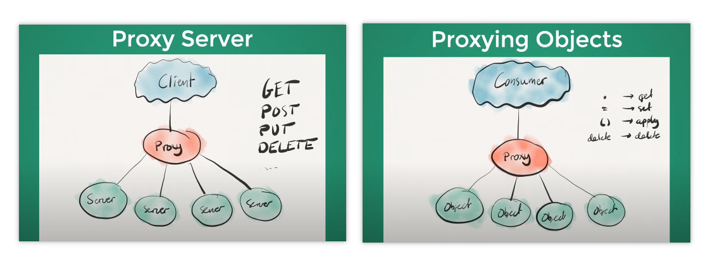
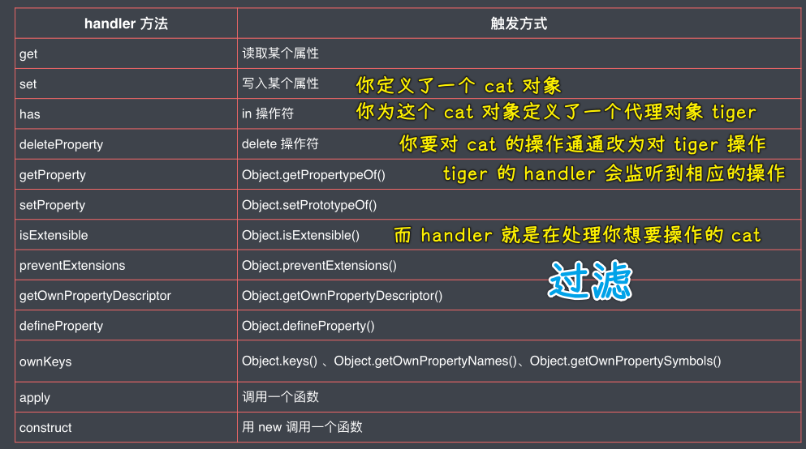
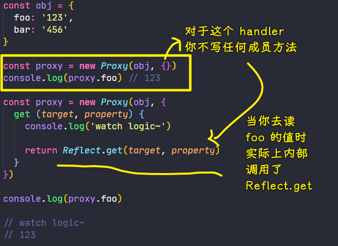
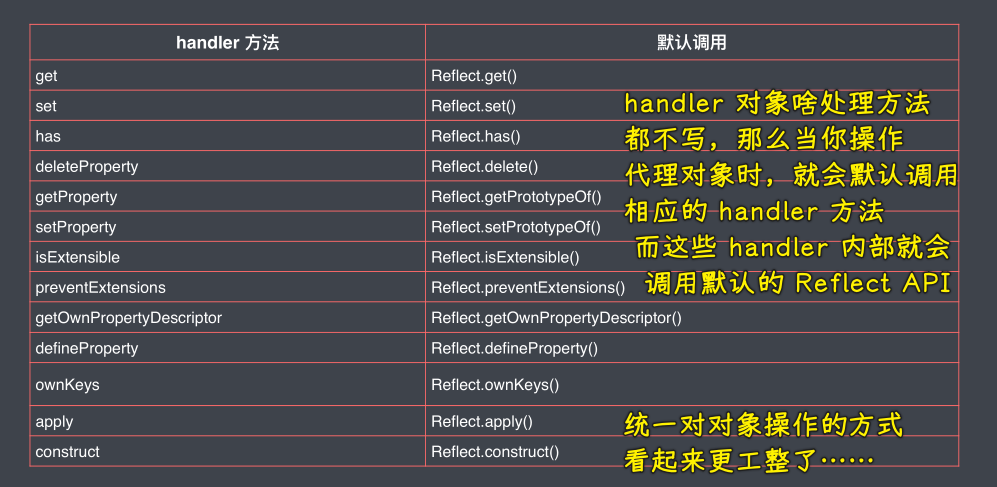
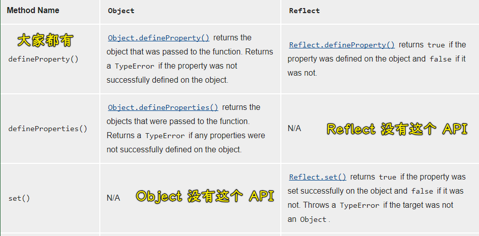
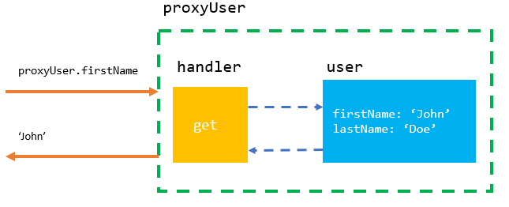

### ✍️ Tangxt ⏳ 2021-05-10 🏷️ es6

# 01-7-Proxy、Proxy vs defineProperty、Reflect


> Kitten sees a tiger in its reflection

## ★Proxy

> 代理对象

### <mark>1）概述</mark>

如果我们想要监视某个对象中的属性读写，那么我们可以使用 ES5 所提供的`Object.defineProperty`这样的方法来去为我们的对象添加属性，这样一来就可以捕获到我们对象当中属性的读写过程

这种方法其实应用得非常广泛，在 Vue3.0 以前的版本就是使用这样一个方法来去实现**数据响应**的，从而完成双向数据绑定

而在 ES2015 当中，全新设计了一个叫做「Proxy」的类型！ -> 它就是专门用来为对象设置访问代理器

如果你不理解什么叫做「代理」，那么你可以把它想象成「门卫」即可！也就是说，不管你进去拿东西，还是往里边放东西，都必须要经过这样一个代理 -> 通过「Proxy」，就可以轻松监视到对象的读写过程！

或者这样理解代理：


再或者这样：



相比于`Object.defineProperty`，**`Proxy`的功能要更为强大，使用起来也更为方便**

next：如何去使用 Proxy？

### <mark>2）使用</mark>

定义一个 `person` 对象：

``` js
const person = {
  name: 'zce',
  age: 20
}
```

通过`new Proxy`的方式来去为`person`创建一个代理对象：

``` js
const personProxy = new Proxy()
```

`Proxy`这个构造函数：

- 第一个参数就是我们需要代理的目标对象 -> `target`
- 第二个参数也是一个对象 -> 可以把它称之为代理的处理对象 -> `handler`（定义哪些操作将被拦截，以及重新定义对对象默认行为的操作）
  - 可以通过 `get` 方法监视我们对目标对象属性的访问
    - 最简单的使用姿势，就是只接收两个参数：`target`（所代理的目标对象）、`property`（外部所访问的这个属性的属性名）
    - 该方法的返回值：该值将会作为外部去访问我们这个属性所得到的结果
  - 通过`set`方法来监视我们对象当中设置属性这么一个过程

#### <mark>1、测试 `get` 方法</mark>


`get`方法监听到了属性的读取，也知道是哪个属性在搞事情！除此之外，我们得到的结果也确实是 `get` 的返回值！

这个方法内部的正常逻辑，它应该是这样的：

> 判断代理目标对象当中是否存在 `prop` 这个属性，如果存在就返回对应的值，反之，则返回 `undefined`，或者是一个默认值 `'default'`

``` js
const person = {
  name: 'zce',
  age: 20
}

const personProxy = new Proxy(person,{
  get(target,prop,receiver) {
    return prop in target ? target[prop] : 'default'
    // console.log(target,prop,receiver)
    // return 666
  }
})

console.log(personProxy.name) // 'zce'
```

此时，你可以看到，这个`name`属性被正常输出了！

如果你访问的是一个不存在的属性，如 `personProxy.xxx`，那么其所输出的结果就是默认值`'default'`了！

#### <mark>2、测试 `set` 方法</mark>

这个方法默认接收三个参数：

- target：代理目标对象
- prop：我们要写入的属性名称
- value：我们要写入的属性值

通过代理对象，为 `person` 写入一个 `gender` 属性：


`set`方法内部正常的逻辑：

> 为代理目标设置指定的属性，在此之前，我们可以对数据进行校验！

``` js
const personProxy = new Proxy(person, {
  // 监视属性读取
  get (target, property) {
    return property in target ? target[property] : 'default'
    // console.log(target, property)
    // return 100
  },
  // 监视属性设置或创建
  set (target, property, value) {
    if (property === 'age') {
      if (!Number.isInteger(value)) {
        throw new TypeError(`${value} is not an int`)
      }
    }

    target[property] = value
    // console.log(target, property, value)
  }
})

personProxy.age = 100
```

如果你这样设置一个不正常的值：

``` js
personProxy.age = '666'
```

那么就会抛出错误：


💡：使用 `set` 方法一般需要返回一个 `true`，用于指示这个操作成功了？

> 使用 `Proxy`，你可以很容易地验证传递给对象的值。

``` js
let validator = {
  set: function(obj, prop, value) {
    if (prop === 'age') {
      if (!Number.isInteger(value)) {
        throw new TypeError('The age is not an integer');
      }
      if (value > 200) {
        throw new RangeError('The age seems invalid');
      }
    }

    // The default behavior to store the value
    obj[prop] = value;

    // Indicate success
    return true;
  }
};

const person = new Proxy({}, validator);

person.age = 100;
console.log(person.age); // 100
person.age = 'young';    // Throws an exception
person.age = 300;        // Throws an exception
```

---

以上就是 `Proxy` 的一些基本用法，之后`Proxy`会用得越来越多，如 Vue3.0 就使用 `Proxy` 去实现内部的数据响应了

## ★Proxy 对比 defineProperty

了解了 Proxy 的基本用法过后，接下来就深入探索一下相比于`Object.defineProperty`，Proxy 到底有哪些优势！

首先，最明显的优势在于 Proxy 要更为强大一些，而这个「强大」具体体现在`Object.defineProperty`它**只能够监视到对象属性的读取或者是写入 -> 读写**

而 Proxy 它可以监视到很多`Object.defineProperty` 监视不到的行为 -> 换句话说「**Proxy 能够监视到更多对象操作**」，如`delete`操作、对对象当中方法的调用等等……

### <mark>1）优势 1：Proxy 可以监视读写以外的操作</mark>

``` js
// 优势 1：Proxy 可以监视读写以外的操作 
// --------------------------

const person = {
  name: 'zce',
  age: 20
}

// 为 person 对象定义一个 Proxy 对象
// 在 Proxy 对象的处理对象当中额外添加了一个 deleteProperty 方法
// 该方法会在外部对当前这个 person 对象进行 delete 操作时自动执行！
// 该方法同样接收两个参数 -> 代理目标对象 + 你要删除的这个属性的名称
const personProxy = new Proxy(person, {
  deleteProperty (target, property) {
    // 输出一个消息
    console.log('delete', property)
    // 使用 delete 操作，删除掉目标信息
    delete target[property]
  }
})

// 外部操作：直接通过 delete 去删除这个代理对象当中的 age 属性
delete personProxy.age
console.log(person)

// delete age
// { name: 'zce' }
```

可以看到，Proxy 它确实能够做到 `Object.defineProperty` 不能做到的事情！

当然，除了 `delete` 这个操作以外，还有很多其它的对象操作都能够被监视到，如：



> 这个表格里边的内容有很完善的介绍，你可以单独去做一些测试！

### <mark>2）优势 2：Proxy 更好的支持数组对象的监视 </mark>

以往，我们想要通过`Object.defineProperty`去监视数组的操作 -> 最常见的一种方式就是通过**重写数组的操作方法** -> 这也是 vue 里边所使用的方式

大体的思路是这样的：

> 通过自定义的方法去覆盖掉数组原型对象上的`push`、`shift`之类的一些方法，以此来去劫持对这个方法调用的过程 -> 具体的实现，vuejs 源码剖析课程里边有专门介绍到

回过头来，话说，如何使用 Proxy 对象去对数组进行监视呢？

1. 定义一个 `list` 数组
2. 为这个 `list` 数组定义一个 Proxy 对象 `listProxy`
3. 在这个 Proxy 对象的处理对象上
   1. 添加一个`set`方法 -> 监视数据的写入
4. 测试 -> `listProxy.push(666)`

``` js
// 优势 2：Proxy 可以很方便的监视数组操作 
// --------------------------

const list = []

const listProxy = new Proxy(list, {
  set (target, property, value) {
    console.log('set', property, value)
    target[property] = value
    return true // 表示设置成功
  }
})

listProxy.push(100)
// set 0 100
// set length 1

listProxy.push(100)
// set 1 100
// set length 2
```

`property`是数组的下标，`value`则是下标所对应的值

可以看到 Proxy 内部会自动根据 `push` 操作自动推算出它应该所处的下标 -> 说白了，就是能自动推算出你要操作的是哪个下标！

同理，数组的其它一些操作方式，都是类似的！

以上就是 Proxy 对数组一个监视了！ -> 可以看到它的功能还是非常强大的！ -> 这一点，如果放到 `Object.defineProperty` 上去搞的话就会特别的麻烦！

### <mark>3）优势 3：Proxy 是以非侵入的方式监管了对象的读写</mark>

Proxy 相比于`Object.deleteProperty`还有一点优势，那就是「Proxy」它是以非侵入的方式监管了整个对象的读写，换句话说，就是「**一个已经定义好的对象，我们不需要对对象本身去做任何的操作就可以监视到它内部成员的读写了**」

``` js
// 优势 3：Proxy 不需要侵入对象 
// --------------------------

// Proxy 方式更为合理
const person2 = {
  name: 'zce',
  age: 20
}

const personProxy = new Proxy(person2, {
  get (target, property) {
    console.log('get', property)
    return target[property]
  },
  set (target, property, value) {
    console.log('set', property, value)
    target[property] = value
  }
})

personProxy.name = 'jack'

console.log(personProxy.name)
```

而`Object.deleteProperty`这种姿势，就要求我们必须要通过特定的方式单独去定义对象当中那些需要被监视的属性，因此，对于一个已经存在的对象而言，我们想要去监视它的属性，那就需要去做很多额外的操作了

``` js
const person = {}

Object.defineProperty(person, 'name', {
  get () {
    console.log('name 被访问')
    return person._name
  },
  set (value) {
    console.log('name 被设置')
    person._name = value
  }
})
Object.defineProperty(person, 'age', {
  get () {
    console.log('age 被访问')
    return person._age
  },
  set (value) {
    console.log('age 被设置')
    person._age = value
  }
})

person.name = 'jack'

console.log(person.name)
```

如何体会到这个优势？ -> 在大量使用`Object.deleteProperty`的过程中，去慢慢体会 Proxy 的这个「非侵入」优势！

> Proxy 姿势，这代码显然要写得更少！

## ★Reflect

> 统一的对象操作 API

Reflect 是 ES2015 中提供的一个全新的内置对象，如果按照 Java 或 C# 这类语言的说法，那 **Reflect 属于一个静态类**，也就是说，它不能通过 `new` 方式去构建一个实例对象，只能去调用这个静态类当中的一些静态方法，而这一点对于大家而言显然并不陌生，因为在 JS 中的 `Math`也是这样的……

- `new Reflect()` ❌
- `Reflect.get()` ✔️

**Reflect 内部封装了一系列对对象的底层操作**，具体提供了一共 **14** 个静态方法！，其中有一个已经被废弃掉了，所以现在，只剩下 **13** 个了！

仔细去查看 Reflect 文档，你会发现这 13 个方法的方法名与 Proxy 对象当中的那个处理对象里边的方法成员是完全一致的！

其实，**Reflect 成员方法就是 Proxy 处理对象里边的那些方法内部的默认实现**

这句话看起来不太好理解，但如果你看了一些例子，你也就能够明白了！

### <mark>1）代码</mark>

1. 定义一个`obj`对象
2. 为`obj`对象，定义一个 Proxy 对象 -> `proxy` -> 我们知道在`handler`（Proxy 的处理对象）里边可以添加不同的方法成员，来去监听对象所对应的操作，可如果我们没有去添加具体的处理方法呢？如`get、set`方法都不写，那它内部的这些`get、set`到底是怎样执行的呢？
3. 测试：在外界访问这个代理对象`proxy`当中的属性 -> `proxy.foo`

其实，Proxy 内部默认实现的逻辑就是调用了 Reflect 对象当中所对应的方法



简单来说，你在`handler`里边你不写任何的成员方法，那么当你对代理对象：

- 读取某个属性`proxy.xxx` -> 你看不见的内部会触发`get`方法 -> 你看不见的`get`内部会返回`Reflect.get()`的返回值
- 写入某个属性`proxy.xxx = 666` -> 内部触发`Reflect.set()`
- ……

所以，这也就表明了我们在实现自定义`get`、`set`等这样的逻辑时，更标准的做法是：

1. 先去实现自己所需要的监视逻辑 -> `console.log('watch logic~')`（模拟监视逻辑）
2. 最后再去返回通过 Reflect 中对应的方法的一个调用结果 -> `return Reflect.get(target, property)`（访问我们当前这个目标对象里边对应的属性）

### <mark>2）Reflect 的价值所在</mark>

Reflect 的用法其实非常简单，在 MDN 上已经有了非常清晰的介绍，但是大多数人接触到这个 Reflect 对象的第一个感觉就是「**为什么要有 Reflect 这样一个对象？**」 -> 也就是说，它的价值具体体现在什么地方？

zce 个人认为：

> Reflect 对象最大的意义就是「它统一提供了一套用于操作对象的 API」

为啥这样说？

因为在此之前，我们去操作对象时，有可能会使用`Object`对象上的一些方法，也有可能使用的是像`delete`、`in`等这样的操作符，而这些**对于新手来说，实在是太乱了，并没有什么规律**，而 Reflect 对象就很好地解决了这样的一个问题！ -> 也就是，它**统一了对象的操作方式**！

举几个简单的例子，来看一下 Reflect 的牛逼之处

例子：

``` js
const obj = {
  name: 'zce',
  age: 18
}

console.log('name' in obj)
console.log(delete obj['age'])
console.log(Object.keys(obj))
// true
// [ 'name' ]

console.log(Reflect.has(obj, 'name'))
console.log(Reflect.deleteProperty(obj, 'age'))
console.log(Reflect.ownKeys(obj))
// true
// [ 'name' ]
```

按照传统的方式：

- 如果我们需要去判断这个`obj`对象是否存在某个属性，那就需要使用`'name' in obj`这样一种语句 -> 需要用到`in`操作符
- 如果需要去删除这个`obj`的`age`属性，那就需要使用`delete`语句 -> `delete obj['age']`
- 如果需要去获取对象中所有的属性名，那就需要使用`Object.keys(obj)`这样一个方法
- ……

可以看到，我们同样都是去**操作**一个对象，但是我们一会儿需要用操作符的方式（如`in、delete`），一会儿又需要用到某一个对象当中的方法（如`Object.keys()`）

而换作现在，Reflect 对象就提供了一个统一的方式：

- 判断这个对象当中是否存在某一个属性，我们可以使用 -> `Reflect.has(obj, 'name')`
- 去删除对象当中的某一个属性 -> `Reflect.deleteProperty(obj, 'age')`
- 去获取对象当中所有的属性名 -> `Reflect.ownKeys(obj)`

可以看到这样一种使用体验，更为合理一点，当然，这只是 zce 的个人感悟

总之，这种使用体验，需要自己多多去体会

需要注意的一点是，以前那种对象的操作方式也是可以使用的，但是 **ES 官方希望经过一段时间的过渡过后，以后的标准当中，就会把之前的那些方法给它废弃掉**，所以就现在而言，这 13 个方法你就应该去了解，以及它们各自所取代的用法！ -> 这些内容在 MDN 上有完整的描述！



> `Reflect.enumerate(object)`这个 API 被废弃了

### <mark>3）Object vs Reflect</mark>

`Object`与`Reflect`的关系是交集的，即：



## ★补充

一个简单 Proxy 例子：

``` js
const user = {
  firstName: "John",
  lastName: "Doe",
  email: "john.doe@example.com",
};
const handler = {
  get(target, property) {
    console.log(`Property ${property} has been read.`);
    return target[property];
  },
};
const proxyUser = new Proxy(user, handler);
console.log(proxyUser.firstName);
console.log(proxyUser.lastName);

// Property firstName has been read.
// John
// Property lastName has been read.
// Doe
```

主要看图：



## ★了解更多

➹：[Proxy - JavaScript - MDN](https://developer.mozilla.org/en-US/docs/Web/JavaScript/Reference/Global_Objects/Proxy)

➹：[Reflect - JavaScript - MDN](https://developer.mozilla.org/en-US/docs/Web/JavaScript/Reference/Global_Objects/Reflect)

➹：[Comparing Reflect and Object methods - JavaScript - MDN](https://developer.mozilla.org/en-US/docs/Web/JavaScript/Reference/Global_Objects/Reflect/Comparing_Reflect_and_Object_methods)

➹：[JavaScript Proxy Explained Clearly By Practical Examples](https://www.javascripttutorial.net/es6/javascript-proxy/)

➹：[A practical guide to Javascript Proxy - by Thomas Barrasso - Bits and Pieces](https://blog.bitsrc.io/a-practical-guide-to-es6-proxy-229079c3c2f0)

➹：[JavaScript Proxy Object Explained](https://areknawo.com/javascript-proxy-object-explained/)

➹：[Scala: Proxy Design Pattern - DZone Java](https://dzone.com/articles/scala-proxy-design-pattern)

➹：[深入理解 ES6 第 12 章-代理（Proxy）和反射（Reflection）API - 吴秋雨的博客 - qiuyu Blog](https://helloqiuyu.com/2019/01/19/es6-set-map-proxy/)

➹：[基于 ES6 的 Proxy ，100 行代码实现一个 XMLHttpRequest 的拦截核心 ajax-proxy](https://juejin.cn/post/6844903984327557134)

➹：[如何判断一个对象的某个属性是可写的？ · Issue #19 · akira-cn/FE_You_dont_know](https://github.com/akira-cn/FE_You_dont_know/issues/19)

➹：[JavaScript Metaprogramming - ES6 Proxy Use and Abuse - Eirik Langholm Vullum - YouTube](https://www.youtube.com/watch?v=opf7xX-whIw)

➹：[探究数据绑定（2）ES6 Proxy - Deng's Blog](http://objcer.com/2017/10/31/Data-Binding-with-ES6-Proxies/)

➹：[ES6 Reflect API Tutorial](http://qnimate.com/es6-reflect-api-tutorial/)

## ★总结

- 代理：🐱 和 🐅，访问 🐅，改 🐱
- 再也不想使用 `Object.defineProperty` 了
- 用 Reflect API 来操作对象吧！