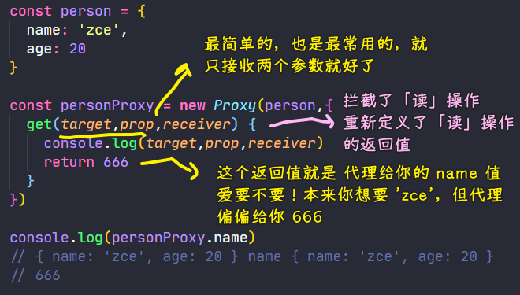
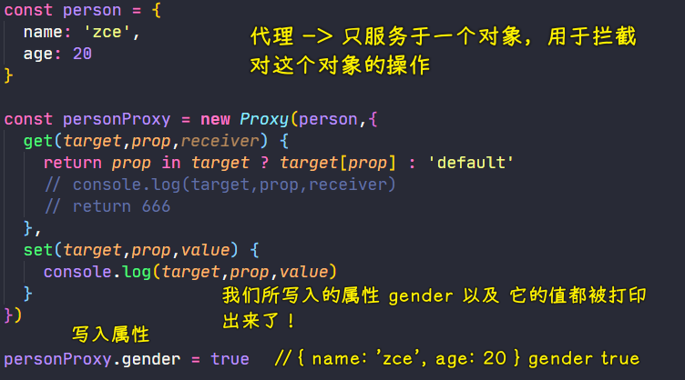
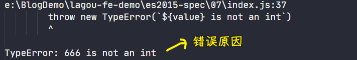

### ✍️ Tangxt ⏳ 2021-05-10 🏷️ es6

# 01-7-Proxy、Proxy vs defineProperty、Reflect


> Kitten sees a tiger in its reflection

## ★Proxy

> 代理对象

1）概述

如果我们想要监视某个对象中的属性读写，那么我们可以使用 ES5 所提供的`Object.defineProperty`这样的方法来去为我们的对象添加属性，这样一来就可以捕获到我们对象当中属性的读写过程

这种方法其实应用得非常广泛，在 Vue3.0 以前的版本就是使用这样一个方法来去实现**数据响应**的，从而完成双向数据绑定

而在 ES2015 当中，全新设计了一个叫做「Proxy」的类型！ -> 它就是专门用来为对象设置访问代理器

如果你不理解什么叫做「代理」，那么你可以把它想象成「门卫」即可！也就是说，不管你进去拿东西，还是往里边放东西，都必须要经过这样一个代理 -> 通过「Proxy」，就可以轻松监视到对象的读写过程！

或者这样理解代理：


相比于`Object.defineProperty`，**`Proxy`的功能要更为强大，使用起来也更为方便**

next：如何去使用 Proxy？

2）使用

定义一个 `person` 对象：

``` js
const person = {
  name: 'zce',
  age: 20
}
```

通过`new Proxy`的方式来去为`person`创建一个代理对象：

``` js
const personProxy = new Proxy()
```

`Proxy`这个构造函数：

- 第一个参数就是我们需要代理的目标对象 -> `target`
- 第二个参数也是一个对象 -> 可以把它称之为代理的处理对象 -> `handler`（定义哪些操作将被拦截，以及重新定义对对象默认行为的操作）
  - 可以通过 `get` 方法监视我们对目标对象属性的访问
    - 最简单的使用姿势，就是只接收两个参数：`target`（所代理的目标对象）、`property`（外部所访问的这个属性的属性名）
    - 该方法的返回值：该值将会作为外部去访问我们这个属性所得到的结果
  - 通过`set`方法来监视我们对象当中设置属性这么一个过程

1、测试 `get` 方法



`get`方法监听到了属性的读取，也知道是哪个属性在搞事情！除此之外，我们得到的结果也确实是 `get` 的返回值！

这个方法内部的正常逻辑，它应该是这样的：

> 判断代理目标对象当中是否存在 `prop` 这个属性，如果存在就返回对应的值，反之，则返回 `undefined`，或者是一个默认值 `'default'`

``` js
const person = {
  name: 'zce',
  age: 20
}

const personProxy = new Proxy(person,{
  get(target,prop,receiver) {
    return prop in target ? target[prop] : 'default'
    // console.log(target,prop,receiver)
    // return 666
  }
})

console.log(personProxy.name) // 'zce'
```

此时，你可以看到，这个`name`属性被正常输出了！

如果你访问的是一个不存在的属性，如 `personProxy.xxx`，那么其所输出的结果就是默认值`'default'`了！

2、测试 `set` 方法

这个方法默认接收三个参数：

- target：代理目标对象
- prop：我们要写入的属性名称
- value：我们要写入的属性值

通过代理对象，为 `person` 写入一个 `gender` 属性：



`set`方法内部正常的逻辑：

> 为代理目标设置指定的属性，在此之前，我们可以对数据进行校验！

``` js
const personProxy = new Proxy(person, {
  // 监视属性读取
  get (target, property) {
    return property in target ? target[property] : 'default'
    // console.log(target, property)
    // return 100
  },
  // 监视属性设置或创建
  set (target, property, value) {
    if (property === 'age') {
      if (!Number.isInteger(value)) {
        throw new TypeError(`${value} is not an int`)
      }
    }

    target[property] = value
    // console.log(target, property, value)
  }
})

personProxy.age = 100
```

如果你这样设置一个不正常的值：

``` js
personProxy.age = '666'
```

那么就会抛出错误：



💡：使用 `set` 方法一般需要返回一个 `true`，用于指示这个操作成功了？

> 使用 `Proxy`，你可以很容易地验证传递给对象的值。

``` js
let validator = {
  set: function(obj, prop, value) {
    if (prop === 'age') {
      if (!Number.isInteger(value)) {
        throw new TypeError('The age is not an integer');
      }
      if (value > 200) {
        throw new RangeError('The age seems invalid');
      }
    }

    // The default behavior to store the value
    obj[prop] = value;

    // Indicate success
    return true;
  }
};

const person = new Proxy({}, validator);

person.age = 100;
console.log(person.age); // 100
person.age = 'young';    // Throws an exception
person.age = 300;        // Throws an exception
```

---

以上就是 `Proxy` 的一些基本用法，之后`Proxy`会用得越来越多，如 Vue3.0 就使用 `Proxy` 去实现内部的数据响应了

## ★Proxy 对比 defineProperty

