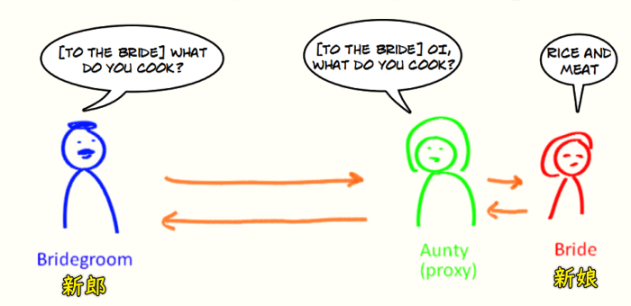

### ✍️ Tangxt ⏳ 2021-05-10 🏷️ es6

# 01-7-Proxy、Proxy vs defineProperty、Reflect


> Kitten sees a tiger in its reflection

## ★Proxy

> 代理对象

1）概述

如果我们想要监视某个对象中的属性读写，那么我们可以使用 ES5 所提供的`Object.defineProperty`这样的方法来去为我们的对象添加属性，这样一来就可以捕获到我们对象当中属性的读写过程

这种方法其实应用得非常广泛，在 Vue3.0 以前的版本就是使用这样一个方法来去实现**数据响应**的，从而完成双向数据绑定

而在 ES2015 当中，全新设计了一个叫做「Proxy」的类型！ -> 它就是专门用来为对象设置访问代理器

如果你不理解什么叫做「代理」，那么你可以把它想象成「门卫」即可！也就是说，不管你进去拿东西，还是往里边放东西，都必须要经过这样一个代理 -> 通过「Proxy」，就可以轻松监视到对象的读写过程！

或者这样理解代理：



相比于`Object.defineProperty`，**`Proxy`的功能要更为强大，使用起来也更为方便**

next：如何去使用 Proxy？

2）使用

定义一个 `person` 对象：

``` js
const person = {
  name: 'zce',
  age: 20
}
```

通过`new Proxy`的方式来去为`person`创建一个代理对象：

``` js
const personProxy = new Proxy()
```

`Proxy`这个构造函数的第一个参数就是我们需要代理的目标对象


