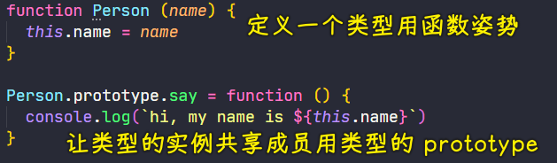
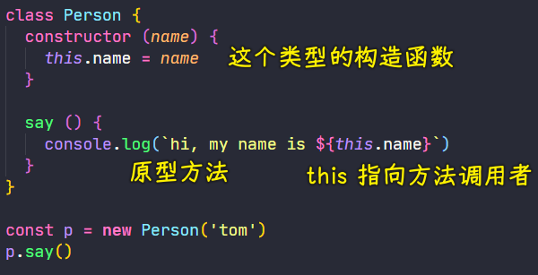
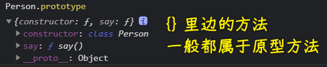
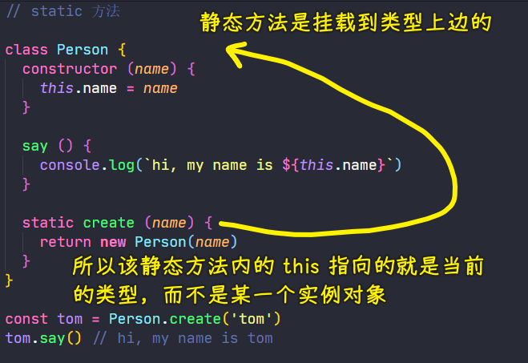
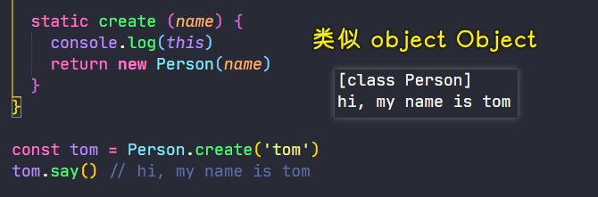
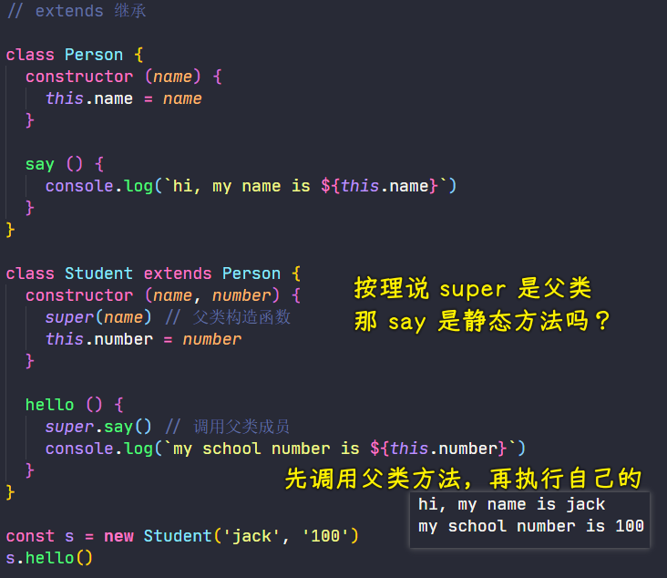

### ✍️ Tangxt ⏳ 2021-05-20 🏷️ es6

# 01-8-Promise、class 类、静态方法、类的继承

## ★Promise

Promise 同样也是 ES2015 当中提供的一个内置对象，它提供了一种全新的异步编程解决方案！


它通过**链式调用**的方式，**解决了我们在传统 JS 的异步编程过程当中回调函数嵌套过深的问题**

关于 Promise 的细节有很多内容，在这里就不做详细介绍了，在后边的 JS 异步编程课程当中会专门针对 Promise 进行更详细地分析

在这里做简短介绍的目的是**为了让你对 ES2015 新增的所有的特性有一个系统化的认识**

## ★class 类

> classes

在 ES6 之前，ES 中都是通过定义函数以及函数的原型对象来去实现的类型

如：定义一个`Person`类型

1. 先去定义一个`Person`函数，作为这个类型的构造函数，在构造函数中我们可以通过`this`去访问当前的实例对象
2. 如果我们需要在这个类型所有的实例之间去共享一些成员，我们可以借助于函数对象的`prototype`，也就是原型去实现



自从 ES2015 开始，我们就可以使用一个叫做`class`关键词来去声明一个类型，而这种独立定义类型的语法，相比较之前函数的方式要更容易理解，结构也会更加清晰一点

通过 `class` 来去复现一下刚刚的`Person`类型 

具体来看一下语法：

1. 首先是 `class` 关键词
2. 然后后边跟上类型名称，如`Person`
3. 最后再跟上一对花括号

``` js
class Person {}
```

这样就定义了一个`Person`的类型了

这种语法与一些老牌面向对象语言当中的`class`是非常类似的！



如果我们需要在构造函数当中做一些额外的逻辑，那我们可以在`{}`里边添加一个`constructor`方法，而这个方法就是当前我们这个类型的构造函数，在这个构造函数里边，我们同样可以使用`this`去访问当前类型的实例对象

如果我们想要为这个类型去定义一些实例方法，我们只需要在这个类型里边添加对应的方法成员就可以了，如添加一个`say`方法（`say`方法里边通过`this`去拿到当前我们这样一个实例对象）

一个`Person`类型定义好后，我们同样可以使用`new`关键词去创建一个`Person`类型的实例，然后去调用这个实例里边所提供的`say`方法 -> 最终结果也是我们所期望的！



💡：添加自有属性和方法？

``` js
class A {
  name = 'zce'
  sayArrow = () => {
    console.log(this)
  }
  sayFunction = function() {
    console.log(this)
  }
}

let a = new A()
a.sayArrow() // this -> a
a.sayFunction() // this -> a
console.log(a)

// A {
//   name: 'zce',
//   sayArrow: [Function: sayArrow],
//   sayFunction: [Function: sayFunction]
// }
```

定义自有方法时，用箭头函数就好了！

## ★静态方法

> static、静态成员

在我们类型当中的方法，一般分为：

- 实例方法
- 静态方法

实例方法是啥？ -> 就是需要通过这个类型构造的实例对象去调用

而静态方法呢？ -> 直接通过类型本身去调用

以前我们实现静态方法，就是直接在构造函数对象上去挂载方法以此来实现 -> 为啥这样实现呢？ -> 因为在 JS 当中，函数也是对象啊！它也可以去添加一些方法成员！

而在 ES2015 中，就多了一个专门用来去添加静态方法（静态成员）的关键词 -> 叫做「`static`」

接下来就看看`static`具体的用法

1. 给`Person`类型添加一个叫`create`的静态方法 -> 用于去创建`Person`类型的实例
2. 调用静态方法，直接通过类型，然后点`.`就可以了 -> `Person.create()`



`this`指向：



## ★类的继承

> extends

继承是面向对象中一个非常重要的特性，通过继承这种特性，我们就能够**抽象出相似类型之间重复的地方**

在 ES2015 之前，大多数情况我们都会使用原型的方式去实现继承

而在 ES2015 中，它实现了一个专门用于类型继承的关键词——`extends`

其用法，当然也非常简单

例子：



定义一个`Student`类型，让它继承`Person` -> `class Student extends Person {}`

这样一来，`Student`类型当中，就会拥有`Person`类型里边所有的成员了！

在`Student`类型的构造函数当中去接收两个参数 -> 分别是`name`和`number`（学号）

`name`参数在父类当中也需要用到，所以我们就用到了`super`对象，该对象始终指向父类，调用它就是调用了父类的构造函数 -> `super(name)`

再对`Student`类型定义一些自己所特有的成员 -> 如`hello`方法 -> 在这个`hello`方法里边，我们同样可以使用`super`对象去访问父类当中的成员 -> 如调用父类里边的`say`方法 -> `super.say()`

这`Student`类型定义完成过后，我们通过`Student`类型去创建一个对象

``` js
const s = new Student('jack', '100')
s.hello()
```

以上就是我们在`class`当中使用`extends`关键词所实现的继承了，它**相比于原型继承，要更方便一点，也更清楚一点**

> `super(name)`相当于`Person.constructor.call(this,name)`
> 
> 可以把`super`当作是一个普通对象来用 -> 即可以调用父类方法 -> 在父类方法里边找东西 -> 注意`super`不能当作变量来使用，因为它是个关键词啊！

## ★总结

- Promise -> ⼀种更优的异步编程解决⽅案
- class 类 -> 相较于传统姿势，它创建类型以及添加原型方法要简单多了！
- 类的继承 -> `extends` -> 找出类型之间重复的地方，然后继承这个类型，搭配`super`使用（注意，`this`用于它之后，因为需要先完成父类属性的构建，再完成子类属性的构建） -> 可以通过`super`调用父类方法，把`super`当作是个`{}`来使用就好了…… -> 类可近似看成是构造函数

