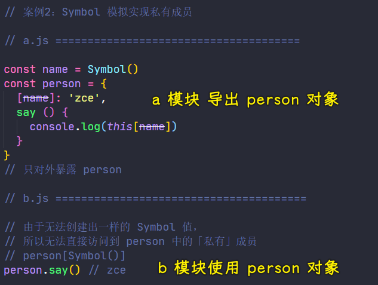

### ✍️ Tangxt ⏳ 2021-05-21 🏷️ es6

# 01-9-Set、Map、Symbol、Symbol 补充

## ★Set

### <mark>1）概述</mark>

在 ES2015 中提供了一个全新的数据结构——`Set`

你可以把它理解为「集合」

它与传统的数组非常类似，不过`Set`内部的成员是不允许重复的，也就是说每一个值在同一个`Set`当中都是唯一的！

`Set`它是一个类型，所以我们可以用它来构造一个实例，而构造出来的实例，可以用来存放不重复的数据

### <mark>2）简单使用</mark>

``` js
const s = new Set()
```

我们通过`new Set()`实例的`add`方法去往集合当中添加一些数据，由于`add`方法会返回集合对象本身，所以我们可以链式调用这样来添加多个数据：

``` js
s.add(1).add(2).add(3).add(2)
```

如果添加了之前已经存在的数据，那么所添加的这个值就会被忽略掉！


💡：数学里边的集合？


➹：[集合符号](https://www.shuxuele.com/sets/symbols.html)

### <mark>3）几个常用的 API</mark>

💡：想要遍历当前集合当中的数据？

用两种姿势可以做到：

- 使用集合对象的`forEach`方法
- 使用 ES2015 所提供的 `for...of...`循环 -> 这是个新语法，也可以去遍历普通的数组


💡：获取当前整个集合的长度？

通过`size`属性去获取整个集合的长度 -> 这与数组当中的`length`有着相同的道理！

``` js
console.log(s.size) // 4
```

💡：判断当前集合当中是否存在某一个特定的值？

``` js
console.log(s.has(100)) // false
console.log(s.has(2)) // true
```

存在就返回`true`，不然，则返回`false`

💡：删除当前集合当中的某一个值？

``` js
console.log(s) // Set(4) { 1, 2, 3, 4 }
console.log(s.delete(3)) // true
console.log(s) // Set(3) { 1, 2, 4 }
console.log(s.delete(100)) // false
```

删除成功就返回一个`true`

💡：清除当前集合当中的全部内容？

``` js
console.log(s) // Set(3) { 1, 2, 4 }
console.log(s.clear()) // undefined
console.log(s) // Set(0) {}
```

> 加「当前」意味着这些都是`Set`实例的方法

### <mark>4）应用场景</mark>

这种叫`Set`的数据结构，最常见的应用场景就是用来**为数组中的元素去重**

定义一个有重复元素的数组：

``` js
const arr = [1, 2, 1, 3, 4, 1]
```

如果你想要去掉重复的元素，那么最简单的方式，就是通过`new Set`的方式加工一下这个数组：

``` js
// Set 的构造函数可以接收一个数组，而数组里边的元素会作为这个 Set 实例的初始值 -> 重复的值自动会被忽略掉

// new Set(arr)

// 去重后还想再得到一个数组，有这两种常用姿势：

// const result = Array.from(new Set(arr))
const result = [...new Set(arr)]

console.log(result)
```

- `Array.from` -> ES2015 中新增的一个 API，可以把 `Set` 实例转化为数组
- `...`这个展开操作符就不多说了 -> 在一个空的数组当中，展开这个`Set`实例，这样一来集合里边的成员就会作为这个空数组里边的成员了

### <mark>5）WeakSet</mark>

* 弱引用版本 `WeakSet`
* `WeakSet` 只能存储普通对象，不支持遍历，也没有`size`，因为无法确定自己的成员是否已经被回收了……
* 与`Set`的差异就是 `Set` 中会对所使用到的数据产生引用，即便这个数据在外面被消耗，但是由于 `Set` 引用了这个数据，所以依然不会回收
* 而 `WeakSet` 的特点就是不会产生引用，一旦数据销毁，就可以被回收，所以不会产生内存泄漏问题。

``` js
let myWeakSet = new WeakSet();
let obj = {};
myWeakSet.add(obj)
console.log(myWeakSet.has(obj)); // true

// break the last reference to the object we created earlier
obj = 5;

// false because no other references to the object which the weakset points to
// because weakset was the only object holding a reference it released it and got garbage collected
console.log(myWeakSet.has(obj)); // false
```

➹：[javascript - What's the difference between ES6 Set and WeakSet? - Stack Overflow](https://stackoverflow.com/questions/43319924/whats-the-difference-between-es6-set-and-weakset)

➹：[第 4 题：介绍下 Set、Map、WeakSet 和 WeakMap 的区别？ · Issue #6 · Advanced-Frontend/Daily-Interview-Question](https://github.com/Advanced-Frontend/Daily-Interview-Question/issues/6)

## ★Map

### <mark>1）Map 为啥会出现？</mark>

ES2015 中，还多了一个叫`Map`的数据结构

这种结构与 ES 中的对象非常类似 -> 本质上，它们都是键值对集合！

但是这种普通对象结构里边的这个「键」，只能是字符串类型，所以当我们存放一些复杂结构的数据时会有些问题！

也许你会有这样的疑惑：也可以用其它数据类型作为对象的键啊？谁说不可以的？

比如：

1. 定义一个对象
2. 为这个对象添加一些键值


可以看到添加各种类型的键，语法上行得通的！但，从把所有「键」都打印出来的结果来看，那些各种类型的键都被转化为了字符串，换句话说：

> 如果给这个对象添加的键不是字符串，那内部就会将这个数据的`toString`结果作为「键」

而知道这样一个特点过后，你就应该能够发现问题了，如：

你要用对象存储每个学生的考试成绩，用学生对象作为键的话，那么不管你用啥学生对象作为对象的键，这键的`toString`的结果都是一样的，这样一来，自然就没有办法做到区分了！甚至，你还可以手动写一个`'[object Object]'`作为键，以此来获取对应的值 -> 毕竟普通对象的`toString`结果就是这样一个字符串

所以这就是问题了！

因此，在 ES2015 中的`Map`结构就是为了解决这样一个问题的！

`Map`才能算是严格意义上的键值对集合，**用来去映射两个任意类型数据之间的对应关系**

### <mark>2）用法</mark>

它的用法非常简单

``` js
// 通过 Map 构造函数创建一个 Map 实例
const m = new Map()

const tom = { name: 'tom' }

// 使用这个 m 实例的 set 方法去存数据
m.set(tom, 90)

// 可以看到键是任意类型的数据 -> 不要担心这键会转化成字符串
console.log(m) // Map(1) { { name: 'tom' } => 90 }

// 获取其中的数据，可以使用 get 方法
console.log(m.get(tom)) // 90

// m.has() // 判断某一个键是否存在
// m.delete() // 删除掉某个键
// m.clear() // 清空所有的键值

// 遍历整个 Map 实例中所有的键值
// 使用实例对象的 forEach 方法就好了
// 参数 1 是被遍历的「值」，参数 2 则是被遍历的「键」
m.forEach((value, key) => {
  console.log(value, key) // 90 { name: 'tom' }
})
```

以上就是 Map 的数据结构了，它与对象最大的区别就是它可以用任意类型的数据作为「键」，而对象它实际上只能够使用字符串作为键！

### <mark>3）WeakMap</mark>

* 弱引用版本 WeakMap
* 差异就是 Map 中会对所使用到的数据产生引用
* 即便这个数据在外面被消耗，但是由于 Map 引用了这个数据，所以依然不会回收
* 而 WeakMap 的特点就是不会产生引用，
* 一旦数据销毁，就可以被回收，所以不会产生内存泄漏问题。

## ★Symbol

> 一种全新的原始数据类型

在 ES2015 之前，对象的属性名都是字符串，而字符串是有可能会重复的，那如果重复的话，就会产生冲突

### <mark>1）场景 1：扩展对象，属性名冲突问题</mark>


在`shared.js`里边定义一个用于存放数据缓存的对象：

``` js
// shared.js
const cache = {}
```

我们约定这个对象是全局共享的

在`a.js`里边，尝试往`cache`这个缓存里边放入一个内容 -> 键是`'foo'`，值是一个随机数（为啥用随机数？因为我们只关心「键」的问题件）

``` js
// a.js
cache['a_foo'] = Math.random()
```

在`b.js`当中，假设又往`cache`里边写入一个新的内容，如果这时的我们不知道`cache`对象之前已经存在一个叫`'foo'`的键，也去使用`'foo'`作为键去存放另外一个数据，那此时就会产生冲突了！

``` js
// b.js
cache['b_foo'] = '123'
```

或许你会认为这种情况是刻意捏造的，但事实情况下，现如今我们大量使用第三方模块，**很多时候都会需要去扩展第三方模块中提供的一些对象**，那么此时的你是不知道这个对象当中是否会存在某一个指定的键，如果你贸贸然（不加思考）地直接去扩展，这就有可能会产生冲突的问题了

以前解决这种问题，最好的方式就是「**约定**」

如约定`a.js`里边放入的缓存键都以`a_`开头，而`b.js`则以`b_`开头 -> 这样一来，就不会再产生冲突了

但是，**约定的方式只是规避（设法躲开）了问题，并不是彻底解决了这个问题**

如果在这样一个过程当中，有人不准守约定，那么这个问题仍然会存在

### <mark>2）Symbol 诞生了</mark>

ES2015 为了解决这种类型的问题，它提供了一种全新的原始数据类型——`Symbol`

Symbol 翻译过来的意思，叫做「符号」

它的作用就是表示一个独一无二的值

💡：`Symbol`确实是一个全新的数据类型

``` js
const s = Symbol()
console.log(s) // Symbol()
console.log(typeof s) // symbol
```

通过`Symbol`函数创建一个`Symbol`类型的数据，而这种数据的`typeof`结果就是`symbol` -> 这也就表示了它确实是一个全新的类型

💡：`Symbol` 类型的值是独一无二的

这种类型最大的特点就是独一无二，也就是说我们通过`Symbol`函数创建的每一个值都是唯一的，它永远不会重复

``` js
// 两个 Symbol 永远不会相等
console.log(
  Symbol() === Symbol()
) // false
```
💡：`Symbol` 描述文本

考虑到在开发过程中的调试，`Symbol`函数允许我们传入一个字符串作为这个值的描述文本 -> 这对于我们多次使用`Symbol`的情况，就可以在控制台当中区分出到底哪一个是对应的`Symbol`值

``` js
// Symbol 描述文本
console.log(Symbol('foo'))
console.log(Symbol('bar'))
console.log(Symbol('baz'))

// Symbol(foo)
// Symbol(bar)
// Symbol(baz)
```

💡：使用 `Symbol` 为对象添加两个不重复的键

从 ES2015 开始，对象就可以直接使用`Symbol`类型的值作为属性名了，也就是说现在对象的属性名可以是两种类型：

- `String`
- `Symbol`


创建一个对象，使用`Symbol`值作为它的键，以此来为对象添加两个成员：

``` js
// 使用 Symbol 为对象添加 用不重复的键
const obj = {}
obj[Symbol()] = '123'
obj[Symbol()] = '456'
console.log(obj) // { [Symbol()]: '123', [Symbol()]: '456' }
```

> 如果`Symbol()`被转化成字符串的话，那么后者会覆盖前者，所以，对象的属性名确实分为了两种类型

由于 `Symbol`的值是独一无二的，所以我们就不用去担心属性可能会产生冲突的问题了

💡：在计算属性名中使用`Symbol`

我们也可以使用「计算属性名」的方式，直接在对象字面量当中使用`Symbol`作为对象的属性名，而结果也是相同的！

``` js
// 也可以在计算属性名中使用
const obj = {
  [Symbol()]: 123
}
console.log(obj) // { [Symbol()]: 123 }
```

### <mark>3）案例 2：Symbol 模拟实现私有成员</mark>

另外，`Symbol`除了可以用来去避免对象属性名重复产生的问题，我们还可以借助这种类型的特点去模拟实现对象的私有成员



创建一个`a.js`文件 -> 在这个文件里边对外暴露一个对象

以前我们定义私有成员，都是靠约定来搞，如用下划线`_`开头，就是表示私有成员，约定外界不允许访问对象当中`_`开头的成员

而现在有了`Symbol`过后，我们就可以使用`Symbol`来创建私有成员的属性名了，而在这个对象的内部，我们可以使用创建属性时的`Symbol`，去拿到对应的属性成员

在外部文件`b.js`当中，由于无法再去创建一个完全相同的`Symbol`，所以我们也就无法直接访问到这个成员，只能去调用这个对象当中普通名称的成员，进而间接访问了这个`name`成员

这样一来就实现了所谓的「私有成员」!

---

以上就是`Symbol`的一些用法和一些典型的场景

这种类型的值，目前最主要的作用就是为对象去添加一个独一无二的属性标识符


截止到 ES2019 标准，ES 一共定义了 6 种原始数据类型，加上 `Object` 类型，一共是 7 种数据类型，而在未来还会新增一个叫「`BigInt`」的原始数据类型，用于去存放更长的数字，只不过目前这个类型还处在`stage-4`阶段，预计在下一个版本就能正式被标准化，到时候，一共就是 8 种数据类型了！


> 目前 2021-05-21，而 ES2020 已经出了，所以 `BigInt` 也就有了！因此，现在有人问你「JS 中，有几种数据类型？」 -> 你回答 8 种就好了！

## ★Symbol 补充

`Symbol` 在使用上还有一些我们值得注意的地方

### <mark>1）唯一性</mark>

``` js
console.log(
  Symbol() === Symbol(), // false
  Symbol('foo') === Symbol('foo') // false
)
```

每次通过`Symbol`函数去创建的值 -> 一定是一个唯一的值

不管我们传入的描述文本是不是相同的，每次去调用`Symbol`函数而得到的结果都是全新的一个值

### <mark>2）Symbol 全局注册表</mark>

如果我们需要在全局去复用一个相同的`Symbol`值，那我们可以使用全局变量的方式去实现或者是使用`Symbol`类型提供的一个静态方法去实现

具体就是使用`Symbol`里边的`for`方法：

``` js
const s1 = Symbol.for('foo')
const s2 = Symbol.for('foo')
console.log(s1 === s2) // true
```

该方法可以接收一个字符串作为参数 -> 相同的字符串，一定会返回相同的`Symbol`类型的值

这个方法的内部维护了一个全局的注册表，为我们的字符串和`Symbol`值提供了一个一一对应的关系

需要注意的是，在这个方法内部维护的是字符串和`Symbol`值之间的对应关系，也就是说**如果我们传入的不是字符串，那么这个方法内部也会自动把它转化成字符串**

``` js
console.log(
  Symbol.for(true) === Symbol.for('true')
) // true
```

这会导致我们传入布尔值的`true`和传入字符串的`'true'` -> 结果拿到的都是一样的，**这一点是尤其需要注意的**！

### <mark>3）内置 Symbol 常量 </mark>

在 `Symbol` 类型当中还提供了很多内置的`Symbol`常量，用来去作为内部方法标识，而这些标识符可以让自定义对象去实现一些 JS 当中内置的接口

比如：

``` js
// Symbol 常量
console.log(Symbol.iterator) // Symbol(Symbol.iterator)
console.log(Symbol.hasInstance) // Symbol(Symbol.hasInstance)

const obj1 = {}
console.log(obj1.toString()) // [object Object]

const obj = {
  [Symbol.toStringTag]: 'XObject'
}
console.log(obj.toString()) // [object XObject]
```

我们把`[object Object]`叫做对象的`toString`标签，如果我们想要自定义这个对象的`toString`标签，那我们就可以在这个`obj`对象里边添加一个特定的成员来去标识了 -> 考虑到如果使用字符串去添加这种标识符就有可能跟内部的一些成员产生重复，所以 ES 要求我们使用 `Symbol` 值去实现这样一个接口 -> 在`obj`里边添加一个`Symbol.toStringTag`属性，让它等于`'XObject'`（为字符串值才会生效）

结果这个`obj`对象的`toString`标签就是我们自定义的`'XObject'`了

这里的`toStringTag`就是一个内置的`Symbol`常量，**这种`Symbol`在之后为对象去实现迭代器时会经常用到**！

💡：它的意义？

我们这样写：

``` js
class ValidatorClass {}

Object.prototype.toString.call(new ValidatorClass()); // "[object Object]"
```

默认得到的就是`"Object"`标签

而用了`toStringTag`：

``` js
class ValidatorClass {
  get [Symbol.toStringTag]() {
    return 'Validator';
  }
}

Object.prototype.toString.call(new ValidatorClass()); // "[object Validator]"
```

就可以得到自定义的`'Validator'`标签了

其它用途：

``` js
// toStringTag 在所有的 DOM 原型对象上都是可用的
let test = document.createElement('button');
test.toString(); // Returns [object HTMLButtonElement]
test[Symbol.toStringTag];  // Returns HTMLButtonElement
```

目前已经在用的：

``` js
Object.prototype.toString.call(new Map());       // "[object Map]"
Object.prototype.toString.call(function* () {}); // "[object GeneratorFunction]"
Object.prototype.toString.call(Promise.resolve()); // "[object Promise]"
// ... and more
```

> 这种`toString`标签，可以让我们明确知道这个实例具体是啥类型，而不是大众化的`Object`

### <mark>4）Symbol 属性名获取</mark>

``` js
const obj = {
  [Symbol()]: 'symbol value',
  foo: 'normal value'
}

for (var key in obj) {
  console.log(key)
}
console.log(Object.keys(obj))
console.log(JSON.stringify(obj))

console.log(Object.getOwnPropertySymbols(obj))

// foo
// [ 'foo' ]
// {"foo":"normal value"}
// [ Symbol() ]
```

使用`Symbol`值作为对象的属性名：

- 这个属性通过传统的`for...in`循环是无法拿到的
- 使用`Object.keys`方法也是获取不到这样的`Symbol`类型的属性
- 通过`JSON.stringify`去序列化我们的对象为一个 JSON 字符串，这其中的`Symbol`属性也会被忽略掉

可以看到，这些特性都使得我们的`Symbol`类型的属性 -> **特别适合作为对象的私有属性**

当然，想要获取这种类型的属性也不是完全没有办法的 -> 使用`Object.getOwnPropertySymbols`方法就可以拿到 -> 这个方法类似于`Object.keys`，`Object.keys`它只能获取到对象中所有的**字符串属性**，而`Object.getOwnPropertySymbols`方法它获取到的**全是`Symbol`类型的属性**

## ★了解更多

➹：[Set 和 Map 数据结构 - ECMAScript 6 入门](https://es6.ruanyifeng.com/#docs/set-map)

➹：[JavaScript ES2021 最值得期待的新特性解析-InfoQ](https://www.infoq.cn/article/7z8hm5ae1qbgm7ywzj2s)

➹：[JavaScript ES2021 最值得期待的 5 个新特性解析 - SegmentFault 思否](https://segmentfault.com/a/1190000039744750)

➹：[Symbol.toStringTag - JavaScript - MDN](https://developer.mozilla.org/en-US/docs/Web/JavaScript/Reference/Global_Objects/Symbol/toStringTag#tostringtag_available_on_all_dom_prototype_objects)

## ★总结

- Set、Map -> 两种全新的数据结构
  - Set -> 集合 -> 没有重复的成员 -> 数组去重
  - Map -> 真正意义上的键值对 -> 键可以是任意类型
- Symbol -> 值的独一无二、私有属性、`toString`标签
