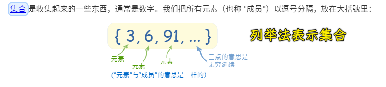

### ✍️ Tangxt ⏳ 2021-05-21 🏷️ es6

# 01-9-Set、Map、Symbol、Symbol 补充

## ★Set

1）概述

在 ES2015 中提供了一个全新的数据结构——`Set`

你可以把它理解为「集合」

它与传统的数组非常类似，不过`Set`内部的成员是不允许重复的，也就是说每一个值在同一个`Set`当中都是唯一的！

`Set`它是一个类型，所以我们可以用它来构造一个实例，而构造出来的实例，可以用来存放不重复的数据

2）简单使用

``` js
const s = new Set()
```

我们通过`new Set()`实例的`add`方法去往集合当中添加一些数据，由于`add`方法会返回集合对象本身，所以我们可以链式调用这样来添加多个数据：

``` js
s.add(1).add(2).add(3).add(2)
```

如果添加了之前已经存在的数据，那么所添加的这个值就会被忽略掉！


💡：数学里边的集合？



➹：[集合符号](https://www.shuxuele.com/sets/symbols.html)

3）几个常用的 API

💡：想要遍历当前集合当中的数据？

用两种姿势可以做到：

- 使用集合对象的`forEach`方法
- 使用 ES2015 所提供的 `for...of...`循环 -> 这是个新语法，也可以去遍历普通的数组


💡：获取当前整个集合的长度？

通过`size`属性去获取整个集合的长度 -> 这与数组当中的`length`有着相同的道理！

``` js
console.log(s.size) // 4
```

💡：判断当前集合当中是否存在某一个特定的值？

``` js
console.log(s.has(100)) // false
console.log(s.has(2)) // true
```

存在就返回`true`，不然，则返回`false`

💡：删除当前集合当中的某一个值？

``` js
console.log(s) // Set(4) { 1, 2, 3, 4 }
console.log(s.delete(3)) // true
console.log(s) // Set(3) { 1, 2, 4 }
console.log(s.delete(100)) // false
```

删除成功就返回一个`true`

💡：清除当前集合当中的全部内容？

``` js
console.log(s) // Set(3) { 1, 2, 4 }
console.log(s.clear()) // undefined
console.log(s) // Set(0) {}
```

> 加「当前」意味着这些都是`Set`实例的方法

4）应用场景

这种叫`Set`的数据结构，最常见的应用场景就是用来**为数组中的元素去重**

定义一个有重复元素的数组：

``` js
const arr = [1, 2, 1, 3, 4, 1]
```

如果你想要去掉重复的元素，那么最简单的方式，就是通过`new Set`的方式加工一下这个数组：

``` js
// Set 的构造函数可以接收一个数组，而数组里边的元素会作为这个 Set 实例的初始值 -> 重复的值自动会被忽略掉

// new Set(arr)

// 去重后还想再得到一个数组，有这两种常用姿势：

// const result = Array.from(new Set(arr))
const result = [...new Set(arr)]

console.log(result)
```

- `Array.from` -> ES2015 中新增的一个 API，可以把 `Set` 实例转化为数组
- `...`这个展开操作符就不多说了 -> 在一个空的数组当中，展开这个`Set`实例，这样一来集合里边的成员就会作为这个空数组里边的成员了

5）WeakSet

* 弱引用版本 `WeakSet`
* `WeakSet` 只能存储普通对象，不支持遍历，也没有`size`，因为无法确定自己的成员是否已经被回收了……
* 与`Set`的差异就是 `Set` 中会对所使用到的数据产生引用，即便这个数据在外面被消耗，但是由于 `Set` 引用了这个数据，所以依然不会回收
* 而 `WeakSet` 的特点就是不会产生引用，一旦数据销毁，就可以被回收，所以不会产生内存泄漏问题。

``` js
let myWeakSet = new WeakSet();
let obj = {};
myWeakSet.add(obj)
console.log(myWeakSet.has(obj)); // true

// break the last reference to the object we created earlier
obj = 5;

// false because no other references to the object which the weakset points to
// because weakset was the only object holding a reference it released it and got garbage collected
console.log(myWeakSet.has(obj)); // false
```

➹：[javascript - What's the difference between ES6 Set and WeakSet? - Stack Overflow](https://stackoverflow.com/questions/43319924/whats-the-difference-between-es6-set-and-weakset)

➹：[第 4 题：介绍下 Set、Map、WeakSet 和 WeakMap 的区别？ · Issue #6 · Advanced-Frontend/Daily-Interview-Question](https://github.com/Advanced-Frontend/Daily-Interview-Question/issues/6)

## ★Map

1）Map 为啥会出现？

ES2015 中，还多了一个叫`Map`的数据结构

这种结构与 ES 中的对象非常类似 -> 本质上，它们都是键值对集合！

但是这种普通对象结构里边的这个「键」，只能是字符串类型，所以当我们存放一些复杂结构的数据时会有些问题！

也许你会有这样的疑惑：也可以用其它数据类型作为对象的键啊？谁说不可以的？

比如：

1. 定义一个对象
2. 为这个对象添加一些键值


可以看到添加各种类型的键，语法上行得通的！但，从把所有「键」都打印出来的结果来看，那些各种类型的键都被转化为了字符串，换句话说：

> 如果给这个对象添加的键不是字符串，那内部就会将这个数据的`toString`结果作为「键」

而知道这样一个特点过后，你就应该能够发现问题了，如：

你要用对象存储每个学生的考试成绩，用学生对象作为键的话，那么不管你用啥学生对象作为对象的键，这键的`toString`的结果都是一样的，这样一来，自然就没有办法做到区分了！甚至，你还可以手动写一个`'[object Object]'`作为键，以此来获取对应的值 -> 毕竟普通对象的`toString`结果就是这样一个字符串

所以这就是问题了！

因此，在 ES2015 中的`Map`结构就是为了解决这样一个问题的！

`Map`才能算是严格意义上的键值对集合，**用来去映射两个任意类型数据之间的对应关系**

2）用法

它的用法非常简单

``` js
// 通过 Map 构造函数创建一个 Map 实例
const m = new Map()

const tom = { name: 'tom' }

// 使用这个 m 实例的 set 方法去存数据
m.set(tom, 90)

// 可以看到键是任意类型的数据 -> 不要担心这键会转化成字符串
console.log(m) // Map(1) { { name: 'tom' } => 90 }

// 获取其中的数据，可以使用 get 方法
console.log(m.get(tom)) // 90

// m.has() // 判断某一个键是否存在
// m.delete() // 删除掉某个键
// m.clear() // 清空所有的键值

// 遍历整个 Map 实例中所有的键值
// 使用实例对象的 forEach 方法就好了
// 参数1 是被遍历的「值」，参数2 则是被遍历的「键」
m.forEach((value, key) => {
  console.log(value, key) // 90 { name: 'tom' }
})
```

以上就是 Map 的数据结构了，它与对象最大的区别就是它可以用任意类型的数据作为「键」，而对象它实际上只能够使用字符串作为键！

3）WeakMap

* 弱引用版本 WeakMap
* 差异就是 Map 中会对所使用到的数据产生引用
* 即便这个数据在外面被消耗，但是由于 Map 引用了这个数据，所以依然不会回收
* 而 WeakMap 的特点就是不会产生引用，
* 一旦数据销毁，就可以被回收，所以不会产生内存泄漏问题。

## ★Symbol


