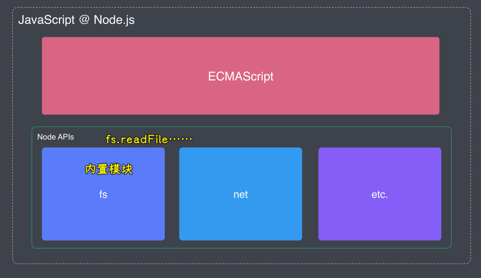

### ✍️ Tangxt ⏳ 2021-04-23 🏷️ ES6+

# 01-ECMAScript 新特性

## ★学习目标

* JavaScript vs. ECMAScript
* 块级作用域、模板字符串
* 对象与数组的解构、rest 操作符
* 函数进阶（箭头函数、默认参数）
* 对象和数组的扩展用法
* Proxy、Reflect、Map、Set、Symbol
* for...of、迭代器模式、生成器函数
* ES Modules 模块系统
* ES2016 - ES2020（ES7 - ES11）特性一览
* 新特性编译工具（Babel）的使用
* 新特性的 Polyfill：CoreJS 标准库

## ★课程介绍

> 介绍 ECMAScript 以及这几年发布的新特性 -> ES6+

### <mark>1）为啥要聊 ECMAScript？</mark>

目前，一个合格的前端开发对 ES6 都会比较熟悉，可为啥 zce 还要再次聊起 ECMAScript 呢？

原因很简单：

第一点：

> zce 在面试的时候，看到**很多开发者根本就没弄明白语言和平台之间的关系**！


以 JavaScript 为例，话说，我们日常编写的代码，到底哪些是属于语言层面的，哪些又属于平台层面的呢？

对于这个点，**很多人都是乱的**，也许，你会说「我不了解这些，可我还不是照样写代码？」

事实上，在 Node.js 这个平台越来越重要的今天，搞明白这个点，对你整体的提高是极其必要的！ -> 随着你接触的越多，你会慢慢地发现搞明白这一点是真得很有必要啊！

第二点：

> 市面上，关于 ECMAScript 这块内容的资料相对也比较零散哈！而且每个开发人员对 ES 的理解和掌握程度都不尽相同！


第三点：

> 在这整个高阶课程里边，会重度依赖这些内容 -> 也就是说，你只要用到了 JavaScript 开发项目，就得用到 ES6+

---

所以，zce 认为在提升过程中，先去系统化的学习 ECMAScript 以及它的一些新特性是很有必要的！


这些内容对你去写出更现代化的、更高质量的代码也会有很大的帮助

### <mark>2）这个模块具体的内容安排</mark>


内容比较简单，主要有：

1. 搞明白 ECMAScript 与 JavaScript 之间到底是啥关系？弄明白语言和平台之间的联系……
2. 详细介绍 ECMAScript 2015 -> 即 ES6 里边具体出现了哪些新特性以及这些新特性出现的背景或者是优势 -> 当然，2016、2017 等也会介绍到 -> 其中部分重点内容，可能涉及到的东西会比较多，如 Promise、ES Modules，而这些内容会作为专题去详细介绍，比较它们涉及到的东西很多……

总之，我们的目标是：**整体对 ECMAScript 的新特性有一个完整的认识，建立一个完整的知识体系**

## ★ECMAScript 概述


### <mark>1）ECMAScript 就是 JavaScript 的语言本身</mark>

ECMAScript 它**也是一门脚本语言**，一般把它缩写为「ES」。通常我们会把它看作 JavaScript 的标准化规范，但实际上 JavaScript 是 ECMAScript 的扩展语言！

因为在 ECMAScript 当中，ECMAScript 它**只提供了最基本的语法**，通俗点来说，就是约定了我们的代码该如何编写，如怎么去定义变量和函数、怎么去实现分支、循环之类的语句等，总之，ECMAScript 它只是**停留在语言层面**，并**不能直接用来去完成我们业务中的实际功能开发**。

而我们经常使用的 JavaScript，它实现了 ECMAScript 这种语言的标准，并且在这个基础之上做了一些扩展，使得我们可以在浏览器环境当中去操作 DOM 和 BOM，在 Node 环境当中去做读写文件之类的一些操作

总之，在浏览器环境当中的 JavaScript，它就等于 ECMAScript 加上 Web 所提供的 API，也就是我们经常所说的 DOM 和 BOM 了！


而在 Node 环境当中所使用的 JavaScript，它实际就等于是 ECMAScript 加上 Node 所提供的一系列 API，如像`fs`、`net`等这样的内置模块所提供的 API



所以说，**JavaScript 这种语言本身指的就是 ECMAScript**。

### <mark>2）不叫 ES6，而是叫 ES2015</mark>

随着这些年 Web 这种应用模式深入地发展，从 2015 年开始 ES 就保持着每年一个大版本的迭代，那伴随着这些新版本的迭代，很多新特性就陆续出现了，这就导致了**现如今的 JavaScript 这门语言的本身也就越来越高级、越来越便捷**了！

截止到目前为止所有的 ECMAScript 标准名称、版本号、发行时间：


在 ES 这些版本里边，ES6 它值得我们单独去了解的内容有很多，因为在这个版本里边，它相对比较特殊，它在上一个版本，也就是 ES5 发布过后，经历了近六年的时间才被完全的标准化，而且这六年的时间也是 Web 发展的黄金时间，所以说在这个版本里边，它包含了很多颠覆式的新功能

也正是因为 ES6 迭代的时间太长，导致发布的内容过多，所以从之后的版本开始，ES 的发布会变得更加频繁，但也更符合我们当下互联网「**小步快跑**」这种精神，而且从 ES2015 过后，ECMAScript 就决定不再按照版本号去命名，而是使用发行年份……由于这样一个决定是在 ES2015 的诞生过程中所产生的，所以当时就已经有很多人习惯了把 ES2015 称之为 **ES6**

> 为什么会有人把 ES2015 称之为 ES6 的情况？

随着 ECMAScript 开始稳固的迭代发展，市面上主流的运行环境也都纷纷跟进，已经开始逐步支持这些最新的特性，所以对于我们使用 JavaScript 的开发者而言，**学习这些新特性那就很有必要了**！

接下来，就从 ES2015 开始去了解这些版本当中所发布的哪些最为核心、最为有用的新特性！

💡：何为「小步快跑，快速迭代」？

这是一种产品研发理念，表示不断用小的给力的动作对产品进行快速更新和变化。 -> 这是在目标不确定情况下去搞的！像是「一次性把事情做对」这种策略，就不适合它了。

> 本质就是产品逐渐更新带动用户逐渐增长（互相带动）！ -> 每一次产品的更新都不是完美的，但这是最合理的！

➹：[“小步快跑，快速迭代”策略的四个适用前提 - 知乎](https://zhuanlan.zhihu.com/p/217281415)

➹：[小步快跑 快速迭代 什么意思_百度知道](https://zhidao.baidu.com/question/480076318.html)

💡：对 ES 标准了解更多？

➹：[TC39 规范制定流程 - 黯羽轻扬](http://www.ayqy.net/blog/tc39-work-flow/)

➹：[「译」ES5, ES6, ES2016, ES.Next: JavaScript 的版本是怎么回事？ - 黄玄的博客 - Hux Blog](https://huangxuan.me/2015/09/22/js-version/)

## ★ES2015 概述


ES2015 也可以叫 ES6，它可以算是新时代 ES 标准的代表版本，因为：

- 相比与上一个版本 ES5.1 的变化比较大
- 从这个 ES6 版本开始，ES 标准命名规则发生变化

总之，ES6 更准确的称呼是 ES2015，但目前有**很多开发者喜欢用 ES6 泛指从 ES5.1 之后所有的新标准**！

在很多资料里边，你可以看到「使用 ES6 的 `async` 和 `await`」之类的说法，但实际上「`async`函数它是 ES2017 标准当中的新特性」，所以，你以后要**注意分辨资料中的 ES6 是特指 ES2015 还是 泛指 ES6+**

ECMAScript 2015 的标准规范长达 26 章，如果可以的话，建议你可以花点时间**简单的过一遍**这个 ES2015 的完整原规格文件！

注意，这个规格文件不是仅仅只介绍了这个版本所引入的新特性，而是包含整个新特性过后所有的原标准规范！

> 说白了，就是「旧的+新的」都在这个规范里边了！

ES 标准规格文件下载：[ECMA-262 - Ecma International](https://www.ecma-international.org/publications-and-standards/standards/ecma-262/)


下载情况：


zce 会重点介绍在 ES2015 标准中所提出的一些比较重要，值得我们单独去了解的新特性，说白了，就是「**重点介绍在 ES5.1 基础之上的变化**」，zce 个人把这些变化简单的归纳为 4 大类：


接下来就来了解一下这些最主要的新特性

## ★ES2015 准备工作

### <mark>1）为什么选择 Node.js 环境？</mark>

由于 zce 只介绍语言本身，并不会涉及到运行环境所提供的 API，所以任何一个支持 ES2015 的环境都是可以让代码跑起来的！

为了有更直观的展示，zce 选择了 Node.js 环境去做具体的尝试，即在这个环境下去运行我们的代码实例！

当然，你也可以直接使用最新的 Chrome 浏览器去运行它们！ -> 都支持 ES2015

### <mark>2）Node.js 的版本选择</mark>

版本选择：[Node.js ES2015/ES6, ES2016 and ES2017 support](https://node.green/)

选择那个支持了绝大多数 ES2015 新特性的版本，包括之后 zce 后边会介绍到 ES2016/2017/2018/2019，zce 此时用的是`v12.13.0`，而这个版本的 node 几乎都**原生支持**（不需要安装插件）了 `ES2015~2019`


### <mark>3）Nodemon</mark>

> 文档：[nodemon - npm](https://www.npmjs.com/package/nodemon)

- 这个小工具的作用：在我们修改完代码过后，会自动重新执行我们的代码！ -> 让 zce 的代码演示变得更加便捷
- 安装：你可以在全局安装该模块，也可以项目里边安装 -> zce 选择项目安装（开发依赖）
- 使用：如何用 `node` 执行脚本，那你就如何用 `nodemon` -> 替换即可
  - `nodemon`在执行完脚本过后并不会立即退出，它会去监视我们所执行的脚本文件，一旦文件发生变化过后（保存之后），`nodemon`就会立即重新执行这个脚本 -> 非常方便的说

测试：

``` bash
mkdir lagou-fe-demo
cd lagou-fe-demo
yarn init -y
yarn add nodemon -D
yarn nodemon let.js
```

为了个人使用方便，我选择全局安装`nodemon`，因为我想二级目录也可以直接用，不然，就得`yarn nodemon xxx/let.js`这样了，而且我也不用输入`yarn`了，直接`nodemon let.js`就好了！

安装：

``` bash
yarn global add nodemon
```

其实只是跑代码示例的话，可以使用「Run Code」插件！
