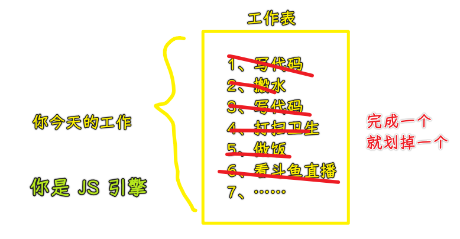

### ✍️ Tangxt ⏳ 2021-06-01 🏷️ asynchronous

# 02-1-概述、同步模式、异步模式、回调函数

## ★概述

众所周知，目前主流的 JS 环境，都是以单线程模式去执行 JS 代码

JS 采用单线程模式工作的原因，这与它最早的设计初衷有关

最早的 JS 就是一门运行在浏览器端的脚本语言，其目的是为了实现页面上的动态交互，而实现页面交互的核心就是 DOM 操作，而这也就确定了它必须使用单线程模型，否则就会出现很复杂的线程同步问题

比如，假设 JS 当中有多个线程同时去工作，其中一个线程修改了某一个 DOM 元素，而另一个线程同时又删除了这个元素，那么此时浏览器就无法明确该以哪个线程的工作结果为准了，所以为了避免这种线程同步的问题，JS 从一开始就被设计为了单线程模式工作，而这也就成为了这门语言最为核心的特性之一

在这里，所谓的单线程指的是：

你可以想象成在浏览器内部，只有一个人按照我们的代码去执行任务，只有一个人意味着它同时只能执行一人任务，而有多个任务的话，就必须得排队等待着一个一个依次被完成……

这种模式最大的优点就是更安全、更简单，而缺点也同样很明显，比如遇到一个特别耗时的任务，那么后边的任务都必须要排队等待这个任务的结束，而这也会导致整个程序的执行会被拖延、出现假死的情况

为了解决耗时任务阻塞执行的这种问题，JS 语言将任务的执行模式分成了两种：

- 同步模式（Synchronous）
- 异步模式（Asynchronous）

我们要重点的了解的是在 JS 中，异步编程相关的一些内容，主要包括以下这么几点：

1. 同步模式和异步模式 -> 表现差异、各自存在的意义
2. JS 单线程如何实现异步模式 -> 也就是事件循环和消息队列
3. 总结一下 JS 当中几种异步编程的方法
4. 着重了解 ES2015 所提供的 Promise 异步编程方案，以及这个过程中牵扯到的宏任务/微任务队列的相关概念
5. 了解 ES2015 里边提供的 Generator 异步编程解决方案以及 ES2017 当中提供的 Async/Await 语法糖，让我们可以写出更扁平的异步代码

## ★同步模式

同步执行模式是什么？

> 指的是代码当中的任务依次执行，后一个任务必须等待前一个任务结束才能够开始执行 -> 程序的执行顺序跟我们代码的编写顺序是完全一致的，总之这种方式会比较简单

在单线程情况下，大多数任务都会以同步模式去执行，注意，这里同步的并不是同时执行，而是**排队执行**

以一段同步代码为例，分析一下它的具体执行过程

第一行代码执行前：

第一行代码开始执行：

遇到函数调用，压入到调用栈当中去执行

弹出调用栈，意味着一个任务结束了 -> 继续往下执行

下两个任务都是函数的声明 -> 不管是函数的声明还是变量的声明，它都不会产生任何的调用，所以代码会继续往地往下走

`foo()` -> `foo`函数的调用：

整段代码执行完毕：

> 似乎可以认为 -> 一条语句就是一个待执行的任务

Call Stack 只是一个更专业的说法，更通俗一点的解释就是 JS 在执行引擎当中维护了一个正在工作的工作表或者说**正在执行的一个工作表**

更准确一点的图：

在这个表里边会记录当前我们正在做的一些事情，当工作表当中所有任务全部被清空过后，那么这一轮的工作（今天的工作）就算是结束了

这是一个纯同步模式下的执行情况，所以这是特别容易的理解，毕竟它的**整个执行过程非常符合我们正常的阅读逻辑或者说是思考逻辑**

不过这种排队执行的机制，它也存在一个很严重的问题，那就是如果其中的某一个任务或者更具体一点来说就是其中的某一行代码，它执行的时间过长，那么它后边的任务就会被延迟，而我们把这种延迟称之为「**阻塞**」

这种「阻塞」对于用户而言就意味着界面会有**卡顿或者叫卡死**，所以就**必须要有异步模式去解决我们程序当中那些无法避免的耗时任务操作**，如浏览器端的 Ajax 操作或者在 Node.js 当中的大文件读写等，而这些都会需要使用到异步模式去执行，从而避免我们的代码被卡死

## ★异步模式

异步执行模式，不同于同步模式的执行方式，异步模式的 API 是不会去等待这个任务的结束才开始执行下一个任务

对于耗时操作，它都是开启过后就立即完后执行下一个任务

耗时任务的后续逻辑，我们一般会通过回调函数的方式去定义，在内部我们这个耗时任务完成过后就会自动执行我们传入的回调函数

异步模式对于 JS 是非常重要的，因为如果没有这种模式的话，我们单线程的 JS 语言就无法同时处理大量耗时任务

而对于开发者而言，单线程模式下面的异步，它最大的难点就是「代码的执行顺序并不会像同步代码一样通用易懂，因为它的执行顺序相对来说会比较跳跃」，简单来说就是：

对于这个问题，很好解决 -> 理解+习惯 -> 即最好的办法就是**多看多练多思考**

分析这段包含异步调用代码在 JS 当中异步执行的过程：

因为有异步调用的过程，这个执行流程相对来说会复杂一点，介绍到的东西会相对多一些

💡：第一行代码执行前

代码整体的执行情况，大致与我们前边所分析的同步模式情况相同，只不过遇到一些异步调用时会有一些差异

首先会加载整体代码 -> 在 Call Stack 加入一个匿名的全局调用 -> 依次执行每行代码

💡：开始执行第一行代码

对于同步代码`console.log()` -> 压栈 -> 执行 -> 打印 -> 执行完，弹栈

💡：遇到第一个异步调用`setTimeout`

`setTimeout`压栈，由于这个函数内部是异步调用的，所以我们需要关心它的内部环境到底做了什么事情，其内部 API 非常简单，就是在内部为`timer1`函数开启了一个倒计时器，单独把`timer1`放到里边去，注意，这里的倒计时器是单独工作的，并不会受我们当前的 JS 线程影响，从我们开始执行过后就已经开始倒数了 -> 倒数完过后会干啥？之后再说

开启一个倒计时器过后，对于`setTimeout`函数来讲，它的调用就已经完成了，所以代码会继续往下执行

💡：遇到第二个`setTimeout`

