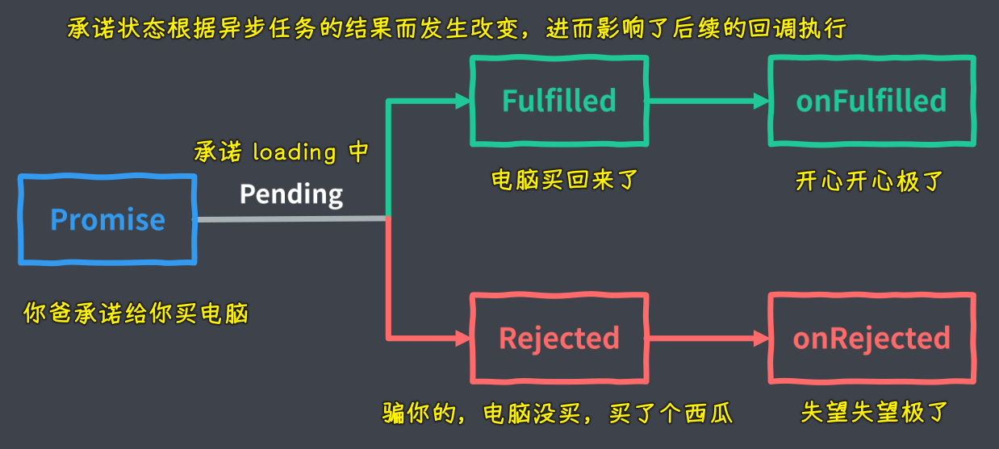

### ✍️ Tangxt ⏳2021-08-18 🏷️ Asynchronous

# 02-2-Promise 概述、基本用法、使用案例、常见误区、链式调用、异常处理、静态方法、并行执行、执行时序

## ★概述

回调函数可以说是 JS 中所有异步编程方式的根基，但是如果我们直接使用传统回调方式去完成复杂的异步流程，那就无法避免大量的回调函数嵌套了

这也就会导致我们常说的回调地狱问题：

为了避免回调地狱的问题，CommonJS 社区率先提出了一种叫做 `Promise` 的规范 -> 目的就是为异步编程提供一种更合理、更强大的统一解决方案

后来在 ES2015 当中被标准化进了 ES 的语言规范

> 爸爸承诺出去给你买一台电脑 -> 门店关门了，没买到就回来了，那这个承诺就变成`Rejected`态了，如果门店没关，买回来了，那这个承诺就变成`Fulfilled`态了 -> 不管是否买回来了，你都会有一个相应的反应，如买了就很开心，没有买就很生气……

所谓的 Promise 实际上就是一个对象，用来表示一个异步任务最终结束过后，它究竟是成功还是失败，就像是内部对外界做出了一个承诺，一开始这个承诺是一种待定的状态，英文叫做「`Pending`」 -> 最终有可能成功，被叫做「`Fulfilled`」，也有可能失败，被叫做「`Rejected`」

形象点来说：

我承诺给你买一件大衣，那此时我就会等待我这个承诺的结果，也就是说我的这个承诺此时是一个「待定」的状态 -> 如果确实我买回来了这件大衣，那这个承诺也就成功了，反之不管什么原因，我没有买回来这件大衣，那这个承诺就是失败了

承诺结束过后 -> 不管这个承诺最终是达成还是失败都会有相对应的反应 -> 比如说我达成了，那你就可能会很感激，那如果我失败了，那你就有可能把我骂一顿

也就是说，在承诺状态明确过后，都会有相对应的任务会被自动执行，而且**这种承诺会有一个很明显的特点，就是一旦明确了结果过后，就不可能再发生改变了** -> 例如，我没有买到大衣，那么这个给你买大衣的承诺就是失败了的，它就不可能再变成成功了，即便说我以后再给你买了，但那也是以后的事情了，对于我们一开始的承诺，它还是失败的

落实到程序上，如你需要我帮你去发送一个 Ajax 请求，那你就可以理解为「我承诺帮你请求一个地址」，而这个请求最终有可能成功，成功那就调用你的`onFulfilled`回调，而如果请求失败的话，我就会去调用你的`onRejected`回调 -> 而这就是 Promise 的一个概念了

## ★基本用法

