### ✍️ Tangxt ⏳2021-08-18 🏷️ Asynchronous

# 02-2-Promise 概述、基本用法、使用案例、常见误区、链式调用、异常处理、静态方法、并行执行、执行时序

## ★概述


回调函数可以说是 JS 中所有异步编程方式的根基，但是如果我们直接使用传统回调方式去完成复杂的异步流程，那就无法避免大量的回调函数嵌套了

这也就会导致我们常说的回调地狱问题：


为了避免回调地狱的问题，CommonJS 社区率先提出了一种叫做 `Promise` 的规范 -> 目的就是为异步编程提供一种更合理、更强大的统一解决方案

后来在 ES2015 当中被标准化进了 ES 的语言规范


> 爸爸承诺出去给你买一台电脑 -> 门店关门了，没买到就回来了，那这个承诺就变成`Rejected`态了，如果门店没关，买回来了，那这个承诺就变成`Fulfilled`态了 -> 不管是否买回来了，你都会有一个相应的反应，如买了就很开心，没有买就很生气…… -> 至于以后买了，那也是另外一个承诺的事儿了，这个承诺已经`Fulfilled`了，那就无法改变了……

所谓的 Promise 实际上就是一个对象，用来表示一个异步任务最终结束过后，它究竟是成功还是失败，就像是内部对外界做出了一个承诺，一开始这个承诺是一种待定的状态，英文叫做「`Pending`」 -> 最终有可能成功，被叫做「`Fulfilled`」，也有可能失败，被叫做「`Rejected`」

形象点来说：

我承诺给你买一件大衣，那此时我就会等待我这个承诺的结果，也就是说我的这个承诺此时是一个「待定」的状态 -> 如果确实我买回来了这件大衣，那这个承诺也就成功了，反之不管什么原因，我没有买回来这件大衣，那这个承诺就是失败了

承诺结束过后 -> 不管这个承诺最终是达成还是失败都会有相对应的反应 -> 比如说我达成了，那你就可能会很感激，那如果我失败了，那你就有可能把我骂一顿

也就是说，在承诺状态明确过后，都会有相对应的任务会被自动执行，而且**这种承诺会有一个很明显的特点，就是一旦明确了结果过后，就不可能再发生改变了** -> 例如，我没有买到大衣，那么这个给你买大衣的承诺就是失败了的，它就不可能再变成成功了，即便说我以后再给你买了，但那也是以后的事情了，对于我们一开始的承诺，它还是失败的

落实到程序上，如你需要我帮你去发送一个 Ajax 请求，那你就可以理解为「我承诺帮你请求一个地址」，而这个请求最终有可能成功，成功那就调用你的`onFulfilled`回调，而如果请求失败的话，我就会去调用你的`onRejected`回调 -> 而这就是 Promise 的一个概念了

## ★基本用法

在代码层面，Promise 实际上是 ES2015 所提供一个的全局类型，我们可以使用它构造出一个 Promise 实例，也就是创建一个新的承诺，这个类型的构造函数它需要接收一个函数作为参数，而这个函数可以理解为一个兑现承诺的逻辑

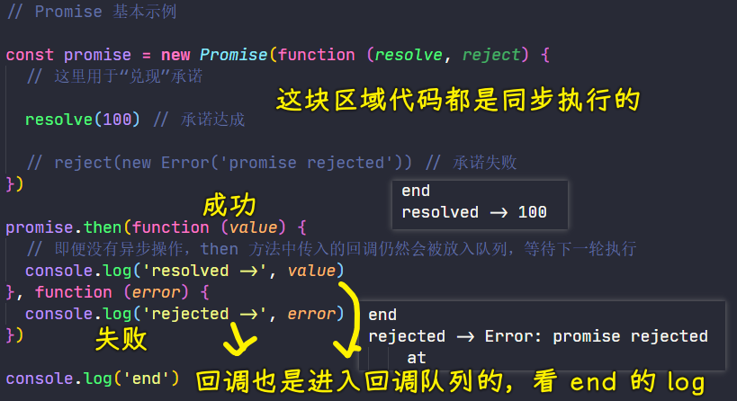

这个函数会在构造 Promise 的过程当中被同步执行，这个函数内部会接收到两个参数，分别是`resolve`和`reject` -> 二者都一个函数

`resolve`函数的作用就是将这个 Promise 对象的状态修改为`Fulfilled`，也就是成功 -> 一般我们将异步任务的操作结果通过`resolve`的参数传递出去

同理，`reject`函数的作用就是这个 Promise 对象的状态修改为`Rejected`，也就是失败 -> 一般我们给`reject`传递的参数是一个错误的对象，用来表示这个承诺它为什么失败，也就是一个理由

我们之前说过，Promise 对象的状态一旦确立过后就不能再被修改了，所以在函数里边只能调用`resolve`或`reject`

Promise 实例创建完过后，我们就可以用它的`then`方法分别去指定`onFulfilled`和`onRejected`回调函数

`then`的参数：

- 第一个是`onFulfilled`函数 -> 也就是承诺成功过后的回调函数
- 第二个是`onRejected`函数 -> 也就是承诺失败过后的回调函数

注意，函数（传给`Promise`的函数参数）当中没有任何的异步操作，`then`方法当中所指定的回调函数 -> 任然会进入到回调队列当中去排队

也就是说函数里边的同步代码执行完了，才会去执行传给`then`的回调函数

对于 Promise，它的回调执行的时序问题是比较特殊的 -> 之后会说到

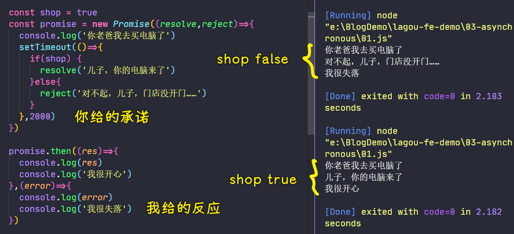

> 我承诺帮你买一台电脑 -> 这个买可能成功，可能失败 -> 买成功，你会开心，没有买到，你会失落

💡：使用`webpack-dev-server`来测试代码？

这样可以让你不用创建一个`index.html`

`package.json`：

``` json
{
  "name": "asynchronous",
  "version": "0.1.0",
  "main": "index.js",
  "author": "zce <w@zce.me> (https://zce.me)",
  "license": "MIT",
  "devDependencies": {
    "html-webpack-plugin": "^3.2.0",
    "webpack": "^4.41.2",
    "webpack-cli": "^3.3.10",
    "webpack-dev-server": "^3.9.0"
  }
}
```

启动一个`server`：

``` bash
yarn webpack-dev-server xxx.js --open
```

💡：`new Error('promise rejected').toString()`的返回值？

`"Error: promise rejected"`

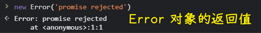

## ★使用案例

使用 Promise 封装 Ajax 请求：

``` js
function ajax (url) {
  return new Promise(function (resolve, reject) {
    var xhr = new XMLHttpRequest()
    xhr.open('GET', url)
    xhr.responseType = 'json'
    xhr.onload = function () {
      if (this.status === 200) {
        resolve(this.response)
      } else {
        reject(new Error(this.statusText))
      }
    }
    xhr.send()
  })
}
```

1. 定义一个`ajax`函数 -> 接收一个`url`参数，用来接收外界需要请求的地址 -> 对外返回一个`Promise`对象，相对于对外作出一个承诺
2. 在这个`Promise`对象的执行逻辑当中，我们就可以使用`XMLHttpRequest`对象去发送一个`ajax`请求
   1. 设置请求方式，以及请求地址
   2. 设置响应类型为`json` -> 这个方式是 HTML5 当中引入的一个新特性，可以让我们在请求完成过后直接拿到一个`json`对象，而不是一个字符串
   3. 为`xhr`注册一个`onload`事件 -> 这个也是 HTML5 当中提供的一个新事件 -> 请求完成过后会触发，也就是传统的`readystate === 4`这个状态才会执行
      1. 判断请求的状态是否是`200`？ -> 如果是意味着请求已经成功了 -> 调用`resolve`，表示我们这个`Promise`已经成功了，传给`resolve`的参数是「请求得到的响应结果」
      2. 不是`200`？ -> 也就是请求失败了 -> 调用`reject`函数，表示`Promise`失败 -> 参数是错误信息对象，其参数是`statusText`
   4. 调用`xhr`的`send`方法开始执行异步请求
3. 至此，`Promise`版本的`ajax`函数就封装好了

测试成功回调：

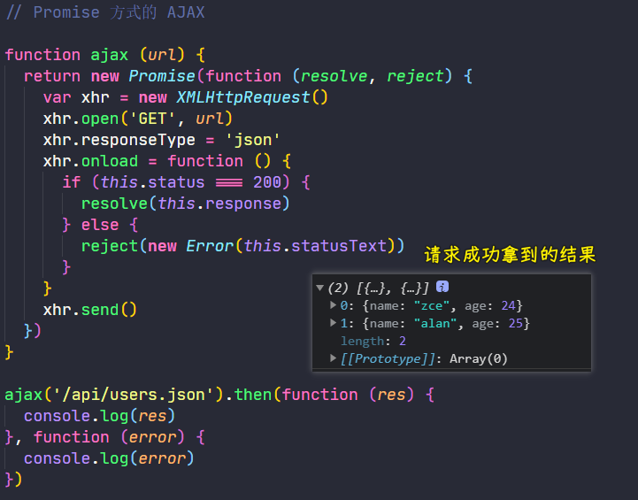

调用`ajax`函数返回一个`Promise`对象 -> 通过这个对象的`then`指定回调 -> 成功回调和失败回调

测试失败回调：

``` js
// 把地址改为是一个不存在的地址
ajax('/api/foo.json').then(function (res) {
  console.log(res)
}, function (error) {
  console.log(error)
})
```

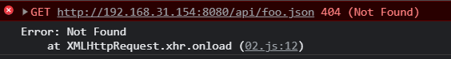

状态文本是指：

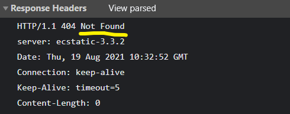

💡：在本地准备一些`json`文件，用来模拟一些 API 接口

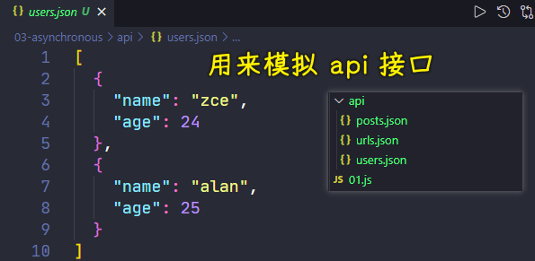

---

以上就是针对于`Promise`的一个基本的应用……

## ★常见误区

通过前边的尝试，我们可以发现，从表象上来看，Promise 的本质也就是使用回调函数的方式去定义我们异步任务结束过后所需要执行的任务。只不过这里的回调函数是通过`then`方法传递进去的，而且`Promise`将我们的回调分成了两种，分别是：

- 成功过后的回调 -> 被叫做`onFulfilled`
- 失败过后的回调 -> 被叫做`onRejected`

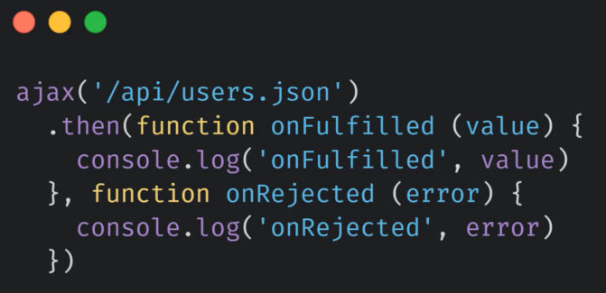

善于思考的你，肯定会想到，既然还是回调函数，那么我们需要**连续串联执行多个异步任务**时，这仍然会出现回调函数嵌套的问题啊！

比如：

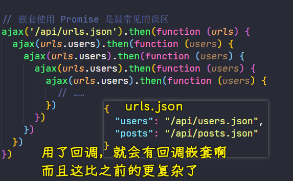

可以看到，这仍然会形成回调地狱，这样使用 Promise 也就没有任何的意义了，而且还增加了额外的复杂度，还不如使用传统的回调方式了

其实这种**嵌套使用的方式**是我们使用 Promise 最常见的误区


而正确的做法实际上是借助于 Promise `then` 方法的链式调用的特点，尽量去保证我们异步任务的**扁平化**


具体怎么操作，请看下边……

## ★链式调用

相比于传统回调函数的方式，Promise 最大的优势就是可以「**链式调用**」

这样就能最大程度的避免回调嵌套

💡：具体代码

`then`方法的作用 -> 为 Promise 对象添加状态明确后的回调函数，它的第一个参数是`onFulfilled`回调，即成功过后的回调，第二个参数则是`onRejected`回调，即失败过后的回调

其中，「失败过后的回调」实际上是可以省略的

`then`方法最大的特点是它的内部也会返回一个`Promise`对象

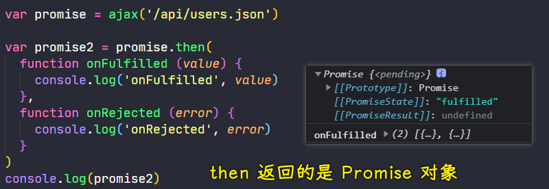

按照以往我们对链式调用的认知，这里返回的`promise2`应该也是`promise`这个对象

然

``` js
console.log(promise2 === promise) // false
```

可以看到它们俩并不是同一个对象啊！ -> 并不是我们以外所熟知的那种在方法内部返回`this`的方式所实现的链式调用 -> **这一点尤其需要注意**

总之，这里的`then`返回一个全新的`Promise`对象 -> 其目的是为了实现「**Promise 链**」，也就是一个承诺结束了过后再去返回一个新的承诺 -> 每个承诺都可以负责一个异步任务，而且相互之间又没有什么影响

这意味着每个`then`方法实际上都是在为上一个`then`方法所返回的`Promise`对象添加状态明确过后的回调

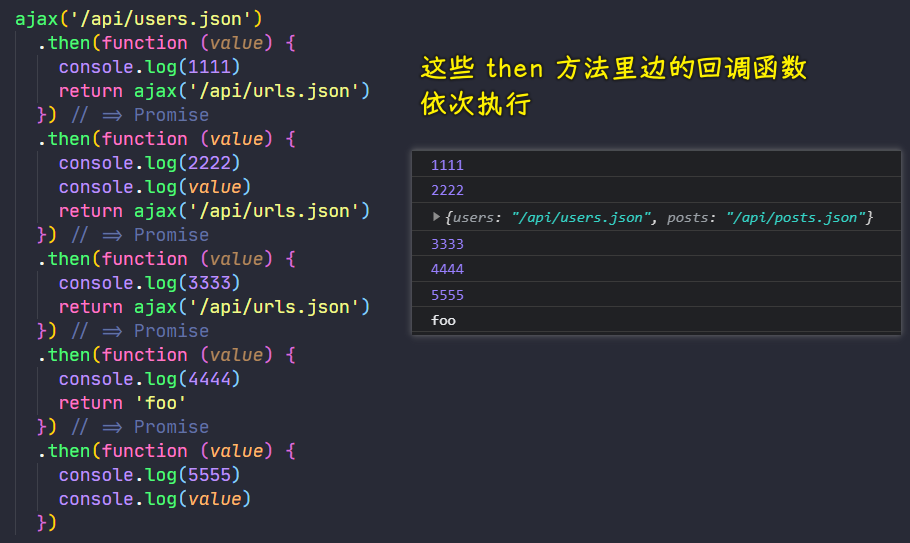

在`then`里边手动返回一个`Promise`对象，等同于这样：

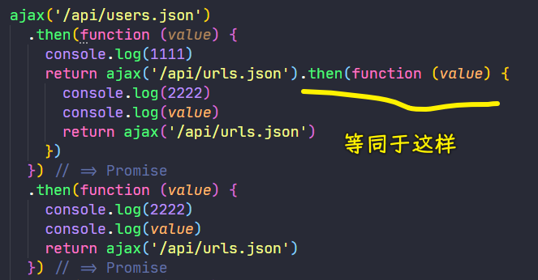

下一个`then`方法实际上就是在为`ajax('/api/urls.json')`这个`Promise`对象去添加状态明确过后的回调，也就是说`ajax('/api/urls.json')`这个`ajax`请求完成过后，会自动执行下一个`then`方法当中的回调 -> 这样一来，我们就可以避免不必要的回调嵌套了 -> 遇到多个连续的任务，那就可以使用这种链式调用的方式来避免回调嵌套，从而尽量保证代码的**扁平化**

如果回调返回的不是`Promise`对象，而是一个普通的值，那么这个值就会作为当前这个`then`方法所返回的那个`Promise`中的值 -> 下一个`then`方法当中，接收的回调参数实际上拿到的就是这个普通的值 -> 如果回调当中没有返回任何值，那默认返回的就是一个`undefined`了

第一次接触这样写回调，可能会有点绕，有点颠覆之前传统写回调的方式

所以在这，我们可以从表象上再去总结一下：

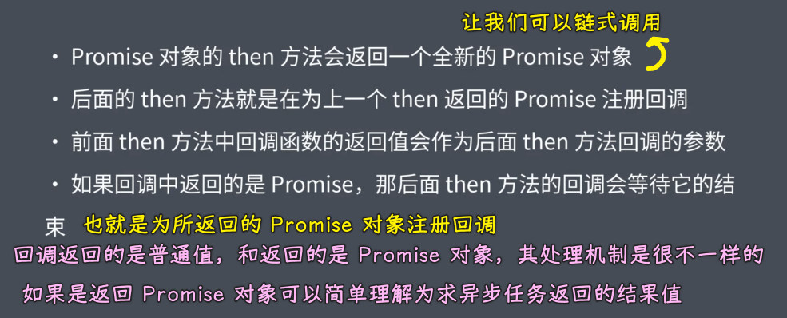

## ★异常处理

