### ✍️ Tangxt ⏳2021-08-18 🏷️ Asynchronous

# 02-2-Promise 概述、基本用法、使用案例、常见误区、链式调用、异常处理、静态方法、并行执行、执行时序

## ★概述


回调函数可以说是 JS 中所有异步编程方式的根基，但是如果我们直接使用传统回调方式去完成复杂的异步流程，那就无法避免大量的回调函数嵌套了

这也就会导致我们常说的回调地狱问题：

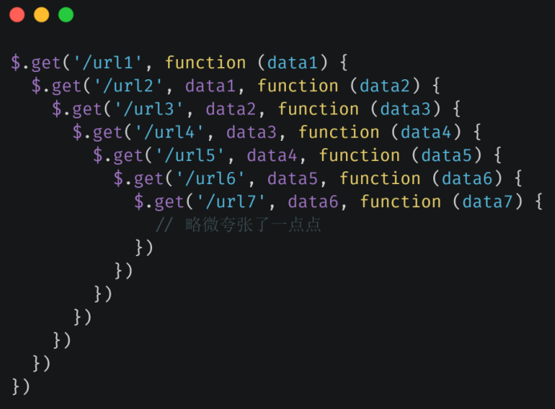

为了避免回调地狱的问题，CommonJS 社区率先提出了一种叫做 `Promise` 的规范 -> 目的就是为异步编程提供一种更合理、更强大的统一解决方案

后来在 ES2015 当中被标准化进了 ES 的语言规范


> 爸爸承诺出去给你买一台电脑 -> 门店关门了，没买到就回来了，那这个承诺就变成`Rejected`态了，如果门店没关，买回来了，那这个承诺就变成`Fulfilled`态了 -> 不管是否买回来了，你都会有一个相应的反应，如买了就很开心，没有买就很生气…… -> 至于以后买了，那也是另外一个承诺的事儿了，这个承诺已经`Fulfilled`了，那就无法改变了……

所谓的 Promise 实际上就是一个对象，用来表示一个异步任务最终结束过后，它究竟是成功还是失败，就像是内部对外界做出了一个承诺，一开始这个承诺是一种待定的状态，英文叫做「`Pending`」 -> 最终有可能成功，被叫做「`Fulfilled`」，也有可能失败，被叫做「`Rejected`」

形象点来说：

我承诺给你买一件大衣，那此时我就会等待我这个承诺的结果，也就是说我的这个承诺此时是一个「待定」的状态 -> 如果确实我买回来了这件大衣，那这个承诺也就成功了，反之不管什么原因，我没有买回来这件大衣，那这个承诺就是失败了

承诺结束过后 -> 不管这个承诺最终是达成还是失败都会有相对应的反应 -> 比如说我达成了，那你就可能会很感激，那如果我失败了，那你就有可能把我骂一顿

也就是说，在承诺状态明确过后，都会有相对应的任务会被自动执行，而且**这种承诺会有一个很明显的特点，就是一旦明确了结果过后，就不可能再发生改变了** -> 例如，我没有买到大衣，那么这个给你买大衣的承诺就是失败了的，它就不可能再变成成功了，即便说我以后再给你买了，但那也是以后的事情了，对于我们一开始的承诺，它还是失败的

落实到程序上，如你需要我帮你去发送一个 Ajax 请求，那你就可以理解为「我承诺帮你请求一个地址」，而这个请求最终有可能成功，成功那就调用你的`onFulfilled`回调，而如果请求失败的话，我就会去调用你的`onRejected`回调 -> 而这就是 Promise 的一个概念了

## ★基本用法

在代码层面，Promise 实际上是 ES2015 所提供一个的全局类型，我们可以使用它构造出一个 Promise 实例，也就是创建一个新的承诺，这个类型的构造函数它需要接收一个函数作为参数，而这个函数可以理解为一个兑现承诺的逻辑


这个函数会在构造 Promise 的过程当中被同步执行，这个函数内部会接收到两个参数，分别是`resolve`和`reject` -> 二者都一个函数

`resolve`函数的作用就是将这个 Promise 对象的状态修改为`Fulfilled`，也就是成功 -> 一般我们将异步任务的操作结果通过`resolve`的参数传递出去

同理，`reject`函数的作用就是这个 Promise 对象的状态修改为`Rejected`，也就是失败 -> 一般我们给`reject`传递的参数是一个错误的对象，用来表示这个承诺它为什么失败，也就是一个理由

我们之前说过，Promise 对象的状态一旦确立过后就不能再被修改了，所以在函数里边只能调用`resolve`或`reject`

Promise 实例创建完过后，我们就可以用它的`then`方法分别去指定`onFulfilled`和`onRejected`回调函数

`then`的参数：

- 第一个是`onFulfilled`函数 -> 也就是承诺成功过后的回调函数
- 第二个是`onRejected`函数 -> 也就是承诺失败过后的回调函数

注意，函数（传给`Promise`的函数参数）当中没有任何的异步操作，`then`方法当中所指定的回调函数 -> 任然会进入到回调队列当中去排队

也就是说函数里边的同步代码执行完了，才会去执行传给`then`的回调函数

对于 Promise，它的回调执行的时序问题是比较特殊的 -> 之后会说到


> 我承诺帮你买一台电脑 -> 这个买可能成功，可能失败 -> 买成功，你会开心，没有买到，你会失落

💡：使用`webpack-dev-server`来测试代码？

这样可以让你不用创建一个`index.html`

`package.json`：

``` json
{
  "name": "asynchronous",
  "version": "0.1.0",
  "main": "index.js",
  "author": "zce <w@zce.me> (https://zce.me)",
  "license": "MIT",
  "devDependencies": {
    "html-webpack-plugin": "^3.2.0",
    "webpack": "^4.41.2",
    "webpack-cli": "^3.3.10",
    "webpack-dev-server": "^3.9.0"
  }
}
```

启动一个`server`：

``` bash
yarn webpack-dev-server xxx.js --open
```

💡：`new Error('promise rejected').toString()`的返回值？

`"Error: promise rejected"`


## ★使用案例

使用 Promise 封装 Ajax 请求：

``` js
function ajax (url) {
  return new Promise(function (resolve, reject) {
    var xhr = new XMLHttpRequest()
    xhr.open('GET', url)
    xhr.responseType = 'json'
    xhr.onload = function () {
      if (this.status === 200) {
        resolve(this.response)
      } else {
        reject(new Error(this.statusText))
      }
    }
    xhr.send()
  })
}
```

1. 定义一个`ajax`函数 -> 接收一个`url`参数，用来接收外界需要请求的地址 -> 对外返回一个`Promise`对象，相对于对外作出一个承诺
2. 在这个`Promise`对象的执行逻辑当中，我们就可以使用`XMLHttpRequest`对象去发送一个`ajax`请求
   1. 设置请求方式，以及请求地址
   2. 设置响应类型为`json` -> 这个方式是 HTML5 当中引入的一个新特性，可以让我们在请求完成过后直接拿到一个`json`对象，而不是一个字符串
   3. 为`xhr`注册一个`onload`事件 -> 这个也是 HTML5 当中提供的一个新事件 -> 请求完成过后会触发，也就是传统的`readystate === 4`这个状态才会执行
      1. 判断请求的状态是否是`200`？ -> 如果是意味着请求已经成功了 -> 调用`resolve`，表示我们这个`Promise`已经成功了，传给`resolve`的参数是「请求得到的响应结果」
      2. 不是`200`？ -> 也就是请求失败了 -> 调用`reject`函数，表示`Promise`失败 -> 参数是错误信息对象，其参数是`statusText`
   4. 调用`xhr`的`send`方法开始执行异步请求
3. 至此，`Promise`版本的`ajax`函数就封装好了

测试成功回调：


调用`ajax`函数返回一个`Promise`对象 -> 通过这个对象的`then`指定回调 -> 成功回调和失败回调

测试失败回调：

``` js
// 把地址改为是一个不存在的地址
ajax('/api/foo.json').then(function (res) {
  console.log(res)
}, function (error) {
  console.log(error)
})
```


状态文本是指：


💡：在本地准备一些`json`文件，用来模拟一些 API 接口


---

以上就是针对于`Promise`的一个基本的应用……

## ★常见误区

通过前边的尝试，我们可以发现，从表象上来看，Promise 的本质也就是使用回调函数的方式去定义我们异步任务结束过后所需要执行的任务。只不过这里的回调函数是通过`then`方法传递进去的，而且`Promise`将我们的回调分成了两种，分别是：

- 成功过后的回调 -> 被叫做`onFulfilled`
- 失败过后的回调 -> 被叫做`onRejected`


善于思考的你，肯定会想到，既然还是回调函数，那么我们需要**连续串联执行多个异步任务**时，这仍然会出现回调函数嵌套的问题啊！

比如：


可以看到，这仍然会形成回调地狱，这样使用 Promise 也就没有任何的意义了，而且还增加了额外的复杂度，还不如使用传统的回调方式了

其实这种**嵌套使用的方式**是我们使用 Promise 最常见的误区


而正确的做法实际上是借助于 Promise `then` 方法的链式调用的特点，尽量去保证我们异步任务的**扁平化**


具体怎么操作，请看下边……

## ★链式调用

相比于传统回调函数的方式，Promise 最大的优势就是可以「**链式调用**」

这样就能最大程度的避免回调嵌套

💡：具体代码

`then`方法的作用 -> 为 Promise 对象添加状态明确后的回调函数，它的第一个参数是`onFulfilled`回调，即成功过后的回调，第二个参数则是`onRejected`回调，即失败过后的回调

其中，「失败过后的回调」实际上是可以省略的

`then`方法最大的特点是它的内部也会返回一个`Promise`对象


按照以往我们对链式调用的认知，这里返回的`promise2`应该也是`promise`这个对象

然

``` js
console.log(promise2 === promise) // false
```

可以看到它们俩并不是同一个对象啊！ -> 并不是我们以外所熟知的那种在方法内部返回`this`的方式所实现的链式调用 -> **这一点尤其需要注意**

总之，这里的`then`返回一个全新的`Promise`对象 -> 其目的是为了实现「**Promise 链**」，也就是一个承诺结束了过后再去返回一个新的承诺 -> 每个承诺都可以负责一个异步任务，而且相互之间又没有什么影响

这意味着每个`then`方法实际上都是在为上一个`then`方法所返回的`Promise`对象添加状态明确过后的回调


在`then`里边手动返回一个`Promise`对象，等同于这样：


下一个`then`方法实际上就是在为`ajax('/api/urls.json')`这个`Promise`对象去添加状态明确过后的回调，也就是说`ajax('/api/urls.json')`这个`ajax`请求完成过后，会自动执行下一个`then`方法当中的回调 -> 这样一来，我们就可以避免不必要的回调嵌套了 -> 遇到多个连续的任务，那就可以使用这种链式调用的方式来避免回调嵌套，从而尽量保证代码的**扁平化**

如果回调返回的不是`Promise`对象，而是一个普通的值，那么这个值就会作为当前这个`then`方法所返回的那个`Promise`中的值 -> 下一个`then`方法当中，接收的回调参数实际上拿到的就是这个普通的值 -> 如果回调当中没有返回任何值，那默认返回的就是一个`undefined`了

第一次接触这样写回调，可能会有点绕，有点颠覆之前传统写回调的方式

所以在这，我们可以从表象上再去总结一下：


> `then`的回调返回了一个`Promise`对象，那么下一个`then`注册的回调就是为这个`Promise`对象而服务的，总之，`then`的回调返回来一个`Promise`实例，那么你就在下一个`then`里边注册相应的回调！


💡：了解`then`的执行机制？

`then`的执行，会把两个回调扔到`promise.then()`这个`promise`的回调队列里边去，当`promise`的异步任务调用成功后，执行`resolve`方法，会把`promise`的状态`PromiseState`改为`fulfilled`，与此同时，把`PromiseResult`的值赋值为那个传给`resolve`方法的值，紧接着调用回调成功队列里边的任务，也就是传给`then`的成功回调

测试代码：

``` js
console.log('******* 第一轮代码 start *******')
const shop = true
const promise = new MyPromise((resolve, reject) => {
  console.log('---------- fn start ------------')
  console.log('你老爸我去买电脑了')
  console.log('启动指令，开启倒计时……')
  setTimeout(() => {
    console.log('******* 第二轮代码 start *******')
    if (shop) {
      console.log('>= 2s 过去了。..')
      console.log(n,'调用 resolve')
      resolve('儿子，你的电脑来了')
    } else {
      reject('对不起，儿子，门店没开门……')
    }
    console.log('******* 第二轮代码 end *******')
  }, 2000)
  console.log('---------- fn end ------------')
})

const xxx = promise.then((res) => {
  console.log('----------then1------------')
  console.log('onFulfilled start')
  console.log(res)
  console.log('我很开心')
  console.log('这个 then 没有返回 Promise')
  console.log('onFulfilled end')
  console.log('----------then1------------')
}, (error) => {
  console.log(error)
  console.log('我很失落')
})
console.log(xxx)
console.log('******* 第一轮代码 end *******')
```

log 日志：

``` html
******* 第一轮代码 start *******
-------构造 Promise 实例 start-------
init status、value 的状态
init 成功态/失败态 回调函数队列
声明 resolve/reject 函数
调用传给 new Promise(fn) 的 fn，两个实参是 resolve、reject
---------- fn start ------------
你老爸我去买电脑了
启动指令，开启倒计时……
---------- fn end ------------
-------构造 Promise 实例 end-------
then 执行开始
判断传入的回调 onFulfilled/onReject 是否是个函数
-------构造 Promise 实例 start-------
init status、value 的状态
init 成功态/失败态 回调函数队列
声明 resolve/reject 函数
调用传给 new Promise(fn) 的 fn，两个实参是 resolve、reject
@@@@@@@ then fn start @@@@@@@
then 返回了一个 Promise，该 Promise 的函数参数开始同步执行
声明一个 fulfilled 函数
声明一个 rejected 函数
判断承诺的状态
为 PENDING 态，把 fulfilled/rejected 加入到 成功/失败 回调队列中…
then 执行结束了，返回了一个 Promise 实例
@@@@@@@ then fn end @@@@@@@
-------构造 Promise 实例 end-------
MyPromise {
  status: 'PENDING',
  value: null,
  reason: null,
  onFulfilledCallbacks: [],
  onRejectedCallbacks: []
}
******* 第一轮代码 end *******
******* 第二轮代码 start *******
>= 2s 过去了。..
1 调用 resolve
resolve start
更改 promise.then() 这个 promise 的状态和结果
遍历 fulfilled 成功回调队列，看看有没有要调用 fulfilled 函数……
有 fulfilled 函数
$$$$$$$$$$$$$$$$$$$$$$$$ fulfilled 执行 $$$$$$$$$$$$$$$$$$$$$$$$
调用 then 的第一个参数 onFulfilled，并且把这个 promise 的结果传给该回调函数
----------then1------------
onFulfilled start
儿子，你的电脑来了
我很开心
这个 then 没有返回 Promise
onFulfilled end
----------then1------------
拿到 onFulfilled 的返回值 p2
如果 p2 是一个 Promise 实例，那就继续 p2.then()，并把下一个 then 的参数 onFulfilled、onReject 作为 p2.then() 的两个实参
如果 p2 不是，那就调用 resolve(p2)
resolve start
更改 promise.then() 这个 promise 的状态和结果
遍历 fulfilled 成功回调队列，看看有没有要调用 fulfilled 函数……
1 没有 fulfilled 函数，调用 resolve 结束
$$$$$$$$$$$$$$$$$$$$$$$$ fulfilled 调用结束 $$$$$$$$$$$$$$$$$$$$$$$$
2 没有 fulfilled 函数，调用 resolve 结束
******* 第二轮代码 end *******
```

提炼知识点：

- 返回一个`Promise`做了什么？
  - 在 `new Promise((resolve,reject)=>{})`实例的过程中，执行了这个`(resolve,reject)=>{}`（闭包），`resolve`和`reject`这两个名字可以随意起
    - `Promise`构造器内部声明了两个函数`resolve`、`reject`
      - `resolve`和`reject`都是同步`API`
      - `resolve` -> 更改`Promise`实例状态：从`PENDING`到`FULFILLED`，以及更改`Promise`实例的结果值（异步任务的结果） -> 遍历成功回调队列，执行`then`的第一个参数
      - `reject` -> 基本同上
- `new Promise((resolve,reject)=>{}).then(success,error).then().then()……`做了什么？
  - `(resolve,reject)=>{}`执行了，`then1`执行了，`then2`执行了，`then3`执行了……
    - `then`的执行做了什么？
      - 返回一个新的`Promise`对象，既然返回，那就会有一个`(resolve,reject)=>{}`被执行 -> 这意味着它与下一个`then`有关联
      - `(resolve,reject)=>{}`主要是把`success`/`error`这两个函数扔到成功回调队列/失败回调队列
      - `p.then(s1,e1)` -> `s1`知道`p`的状态和值
- 异步任务结束了，调用`resolve('data')` -> 主要是执行`success`方法
  - `success`方法返回的不是一个`Promise`实例 -> 那就调用下一个`then`的`success` -> `resolve(result)` -> `resolve`处理的承诺是一个`Pending`状态的新承诺，也就是`then`返回的那个承诺
  - 返回的是一个`Promise`实例 -> 也就是在一个回调里边开启了一个新的承诺（把`then`返回的承诺扔了，下一个`then`里边回调用这个回调返回的新承诺） -> 在这个回调结束前，绑定下一个`then`方法 -> `p.then(resolve,reject)`（完成同步代码的执行） -> 也就是那两个成功回调队列和失败回调队列（这两个队列都持有下一个`then`的对应的回调）


➹：[Promise.then 是如何实现链式调用的](https://juejin.cn/post/6883121706123132936)

➹：[图解 Promise 实现原理（一）—— 基础实现 - 知乎](https://zhuanlan.zhihu.com/p/58428287)

💡：执行时序


## ★异常处理

之前说到，Promise 的结果一旦失败，就会调用我们在`then`方法当中传递的`onRejected`回调函数：


除此之外，如果我们在执行`Promise`的过程当中出现了异常，或者说我们手动抛出了一个异常，那`onRejected`回调也会被执行：


为啥执行`new Promise(fn)`的这个`fn`报错了，就会执行`reject`？


💡：我在用别人写的`MyPromise`发现了 bug？


为什么会这样？ -> 因为在执行`then`的时候，调用了`rejected`：


这意味着调用了`onReject(self.reason)`

总之，这源码是写得有问题的，还有`then`的错误回调是正常执行完后，在下一个`then`的执行居然还是错误回调……


有 bug 的版本：[Promise.then 是如何实现链式调用的](https://juejin.cn/post/6883121706123132936)

正确的版本：[Promise 的源码实现（完美符合 Promise/A+规范） · Issue #2 · YvetteLau/Blog](https://github.com/YvetteLau/Blog/issues/2)

在正确版本下的测试结果：


---

`onRejected`回调是为 Promise 当中的异常去做一些处理，在 Promise 失败了，或者出现异常时，它都会去执行

关于`onRejected`回调的注册，我们还有一个更常见的用法，那就是**使用 Promise 实例的`catch`方法去注册`onRejected`回调**

💡：使用`catch`方法


其实这个`catch`方法是`then`方法的别名，相当于这样：


为啥注册失败回调使用`catch`姿势要更常见一些？ -> 因为这更适合链式调用啊！

具体原因是这样的：


从表象上来看，我们用`catch`方法注册失败回调跟我们在`then`方法当中去注册，其效果是一样的 -> 它们都能捕获到这个`Promise`在执行过程当中的异常

但是，我们仔细去对比这两种方式，其实它们有很大的差异，我们之前说过，每一个`then`返回的都是一个全新的`Promise`对象，这意味着我们后边通过链式调用的姿势调用的这个`catch`，实际上是在给前边`then`方法返回的`Promise`对象去指定失败回调，并不是直接去给第一个`Promise`对象`ajax()`的返回值所指定的！

`catch`在同一个`Promise`链条上，前边`Promise`上的异常就会一直被往后传递，因为这样才能捕获到第一个`Promise`当中的异常

而通过`then`方法的第二个参数去指定的失败回调函数 -> 只是给第一个`Promise`对象所指定的，也就是说它只能捕获到第一个`Promise`的异常


具体在表象上的差异就是，如果我们在`then`方法当中返回了第二个`Promise`，而且这个`Promise`在执行过程当中出现了异常，那么使用`then`的第二个参数注册的失败回调，是捕获不到第二个的 `Promise` 异常的，因为它只是给第一个`Promise`对象注册的失败回调

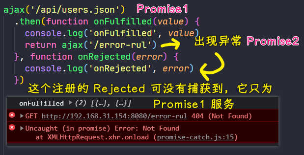

对`catch`姿势再做相同的尝试：


建议：

- 对于在链式调用的情况下，建议使用`catch`姿势指定失败回调，使用`then`指定成功回调这样分开注册 -> 为什么？ -> 因为`Promise`链条上任何一个异常都会被一直向后传递，直至被捕获（被失败回调捕获） -> 这种姿势更像是给整个`Promise`链条注册的失败回调，所以这相对来讲，要更通用一些

除此之外，我们可以在全局对象上，注册一个`unhandledrejection`事件：


代码：


全局捕获姿势，不推荐使用：


因为更合适的方式是：

> 在代码当中明确地去捕获每一个可能发生的异常，而不是丢个全局统一处理

💡：如果错误没有被下一个的`then`的失败回调处理，那就交给下下一个`then`？

换言之，就是`catch`的原理：


> 连续 `then` 意味着连续给承诺……

如果，你在`then`注册了失败回调，也用了`catch`：


回到上边那个截图，你没有用`then`处理错误，那么这个`then`所返回的`Promise`对象就是`rejected`态的，只要你用`onRejected`回调处理了，那么`then`返回的`Promise`对象很有可能就是`fulfilled`态的（`onRejected`回调的执行过程中出现了异常，那么就是`rejected`态，反之，`fulfilled`态 ）

## ★静态方法

在 Promise 类型中还有几个静态方法，也经常会被用到

1）`Promise.resolve()`

- 作用 -> 快速地把一个值转化为一个`Promise`对象
- 例子 -> `Promise.resolve('foo')` -> 返回一个状态为`fulfilled`的`Promise`对象，也就是成功的`Promise`对象 -> 这个`'foo'`字符串会作为这个`Promise`对象所返回的值，即在它的`onFulfilled`回调函数当中拿到的参数就是`'foo'`这个字符串

`Promise.resolve('foo')`这种方式完全等价于我们通过`new`姿势，然后在执行函数当中直接去`resolve`一个`'foo'`字符串

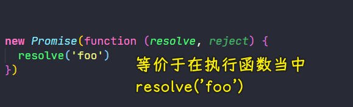

另外，这个`resolve`静态方法如果接收到的是另一个`Promise`对象，那么，这个`Promise`对象会被原样返回

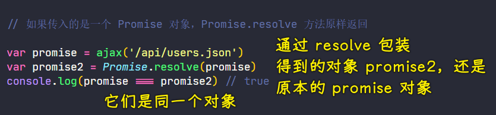

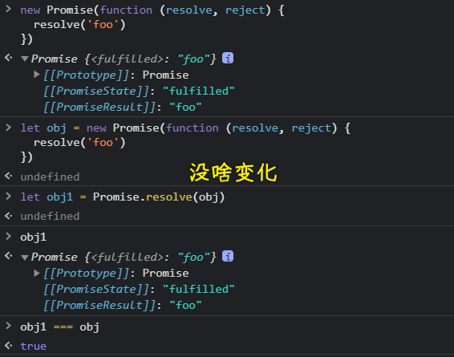

在执行函数里边在异步任务的回调里边`resolve`测试：

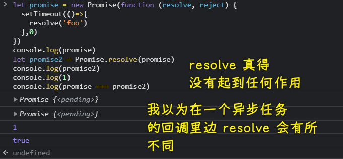

在执行函数里边直接`resolve`测试：

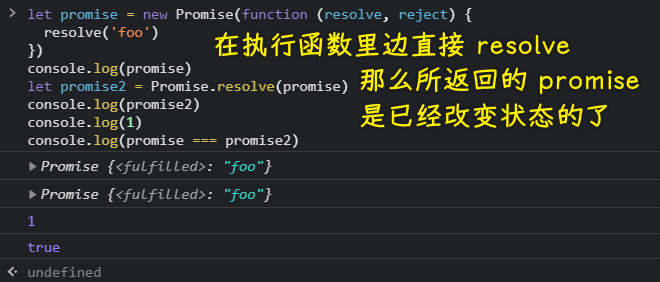

还有一种特殊情况，如果我们传入的是一个对象，而且这个对象也有一个跟`Promise`一样的`then`的方法，也就是说在这个`then`方法当中可以接收到`onFulfilled`和`onRejected`两个回调，我们调用`onFulfilled`传入一个值`'foo'`，而这样一个对象，也可以作为一个`Promise`对象被执行，后边的`then`方法也可以拿到这个`'foo'`值


带有这种`then`方法的对象，可以说是实现了一个叫做`thenable`的接口，也就是说它是一个可以被`then`的对象

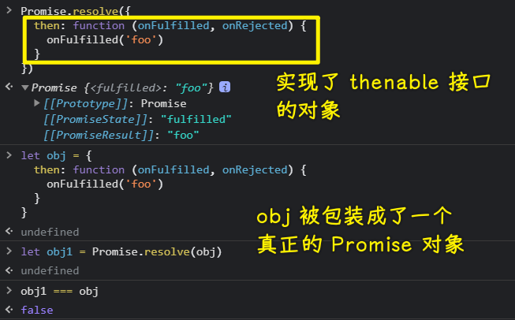

支持这种对象的原因是因为在原生 `Promise` 对象还没有普及之前，很多时候，我们都是使用第三方的库去实现的`Promise`。如果我们现在需要把这种第三方的`Promise`对象转化成原生的`Promise`，那就可以借助`thenable`这种机制了，因为在第三方的`Promise`对象当中也有这样相同的`then`方法，然后我们就可以通过`Promise.resolve`把这第三方`Promise`对象转化成一个原生的`Promise`对象，当然，这一点仅作为了解即可

2）`Promise.reject`

除了`Promise.resolve`方法，还有一个与之对应的`Promise.reject`方法

其作用是快速地去创建一个一定是失败的`Promise`对象，这个方法的参数，相对来说，就没有那么多情况了，因为我们无论传入什么类型的数据，这个传入的参数都会作为这个`Promise`对象失败的理由，也就是失败的原因


3）源码

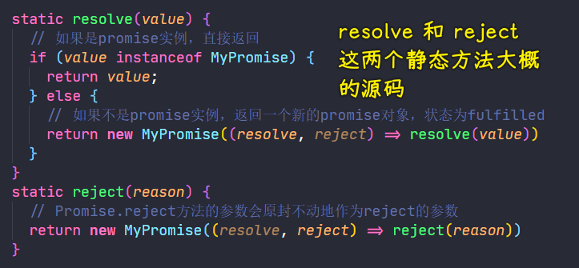

## ★并行执行

1）概述

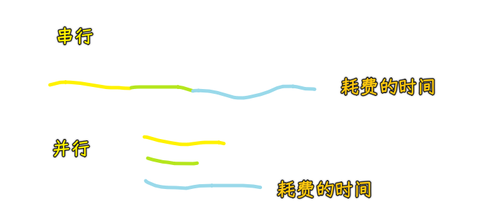

前边介绍的操作都是通过 Promise 去串联执行多个异步任务，也就是一个任务结束过后才去开启下一个任务

这相比于传统回调方式，Promise 它提供了更扁平的异步编程体验，如果我们需要同时并行执行多个异步任务，Promise 也可以提供更为完善的体验

如在页面当中经常涉及到要请求多个接口的情况，如果这些请求相互之间没有什么依赖，那么我们最后的选择就是同时去请求它们，这样就可以避免我们一个一个依次去请求会消耗更多的时间

这种并行请求其实很容易去实现：

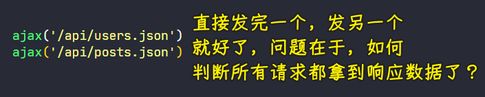

问题：如何判断所有请求都结束了的的那个时机？

传统做法是定义一个计数器，每结束一次请求，就让这个计数器累加一项，直到这个计数器的数量跟我们任务的数量相等时就表示所有的任务都结束了 -> 这种姿势会非法的麻烦，而且我们还需要考虑出现异常的情况

2）`Promise.all()`

在这样一种情况下，使用`Promise`类型的`all`方法就会简单很多了 -> 为啥会简单很多？ -> 因为这个方法可以将多个`Promise`合并为一个`Promise`统一去管理

💡：看看这个`all`方法是如何使用的？

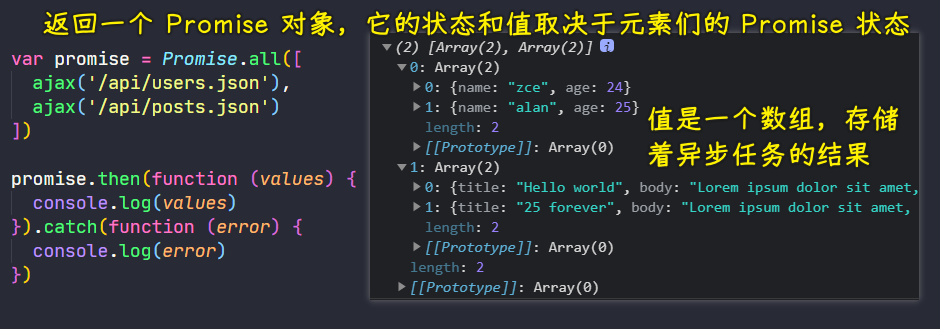

- 参数：接收的是一个数组 -> 数组当中的每一个元素都是一个`Promise`对象
- 我们可以把这些`Promise`对象元素看做是一个个的异步任务
- 返回：返回一个全新的`Promise`对象
- 当内部所有的`Promise`都完成过后，我们所返回的这个全新的`Promise`才会完成，此时这个`Promise`对象拿到的结果就是一个数组，在这个数组里边包含着每一个异步任务执行过后的结果
- 注意：异步任务成功结束了，返回的新`Promise`对象才会成功结束，如果其中有任何一个任务失败了，那么返回的这个新`Promise`对象就会以失败结束

这是一种很好的同步执行多个`Promise`的方式

💡：综合使用一下串联和并行这两种使用姿势


网络请求过程：

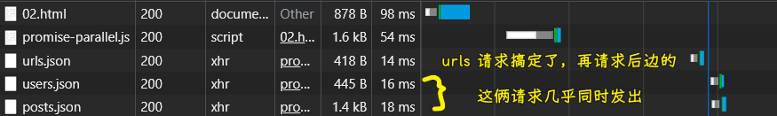

> 网速很慢的情况下，TTFB（Time To First Byte）会很长 -> 发送请求+服务器处理请求+客户端得到一个字节的时间

💡：源码？

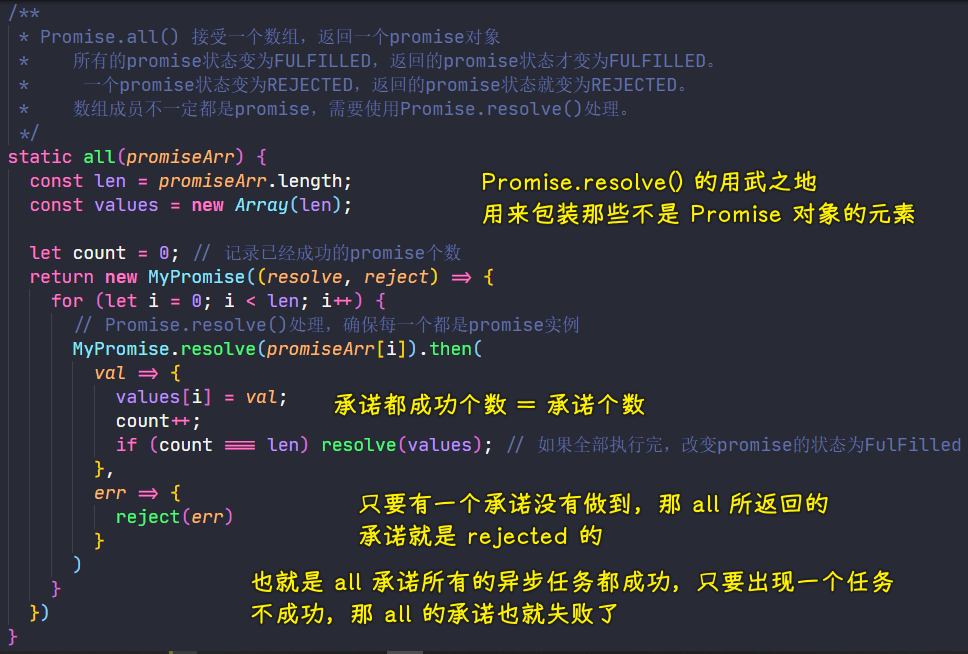

3）`Promise.race()`

另外，`Promise`除了提供一个`all`方法以外，它还提供了一个叫做`race`的方法

这个方法同样可以把多个`Promise`对象组合为一个全新的`Promise`对象，但是与`Promise.all()`有所不同的是 -> `Promise.all()`是等待所有任务结束过后才会结束，而`Promise.race()`是跟着所有任务当中第一个完成的任务一起结束，也就是说，只要有任何一个任务完成了，那我们这个所返回的新的`Promise`对象也就会完成

如：实现 Ajax 请求超时控制的一种姿势

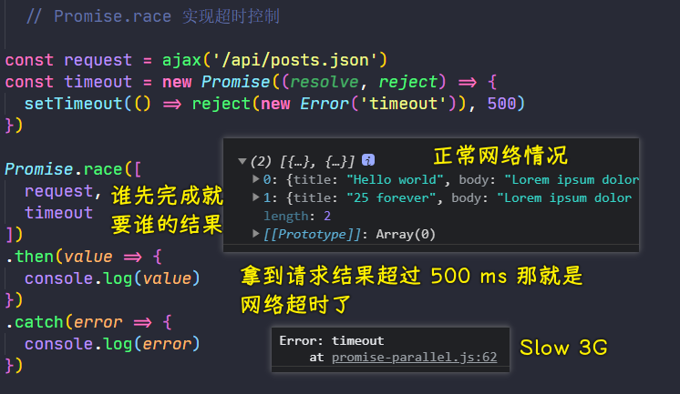

💡：源码？

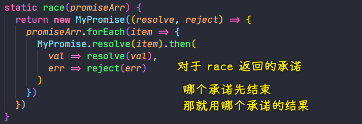

4）小结

介绍了两个可以把多个`Promise`对象组合到一起的方法，分别是：

- `Promise.all`
- `Promise.race`

这两个方法最简单的区别就是：

- `all`会等待所组合的所有的`Promise`都结束，而且是都成功结束，才会成功完成，只要出现一个异步任务不成功，那么就不是成功完成了，也就是这个返回的新`Promise`是`rejected`态！
- `race`只会等待第一个结束的任务

相同点：

- 都返回一个新的`Promise`对象，该对象的状态和结果由异步任务的处理情况决定

## ★执行时序
