### ✍️ Tangxt ⏳ 2021-08-24 🏷️ Asynchronous

# 02-3-Generator 异步方案、Async 函数

## ★前言

### <mark>1）Promise vs Callback</mark>

💡：定义一个`ajax`函数，让它既可以往`then`传回调，又可以往它第二个参数传回调？

``` js
function ajax(url, callback) {
  const executor = (resolve, reject) => {
    var xhr = new XMLHttpRequest()
    xhr.open('GET', url)
    xhr.responseType = 'json'
    xhr.onload = () => {
      if (xhr.status === 200) {
        resolve(xhr.response)
      } else {
        reject(new Error(xhr.statusText))
      }
    }
    xhr.send()
  }

  if (typeof callback === 'function') {
    // support callback
    executor(
      res => callback(null, res),
      err => callback(err)
    )
    return undefined
  }

  return new Promise(executor)
}
```

测试代码：

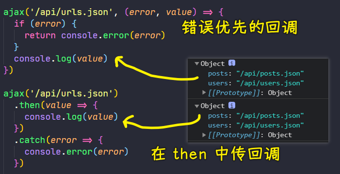

💡：Callback 的问题？

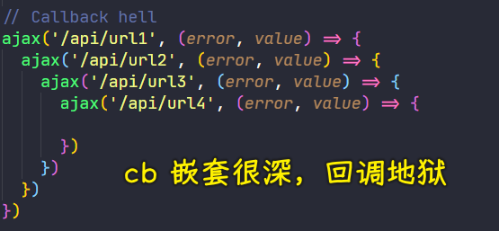

💡：如何解决回到地狱问题？

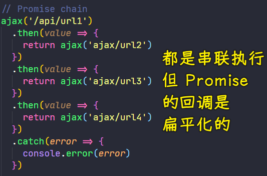

💡：如何解决异步代码不好阅读的问题？

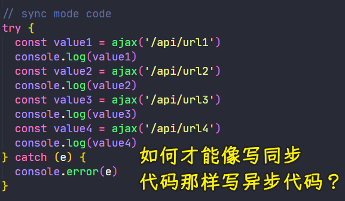

💡：小结

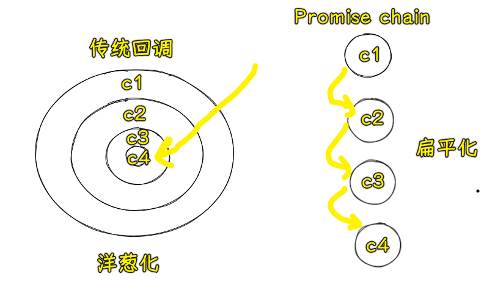

## ★Generator 异步方案（上）

> 回顾 Generator 函数

### <mark>1）概述</mark>

相比于传统的回调姿势，Promise 去处理异步调用最大的优势就是可以通过链式调用解决回调嵌套过深的问题

使用 Promise 处理异步任务的串联执行，它的表现就是一个`then`然后处理一个异步调用，最终整体会形成一个任务的链条，从而实现所有任务的串联执行

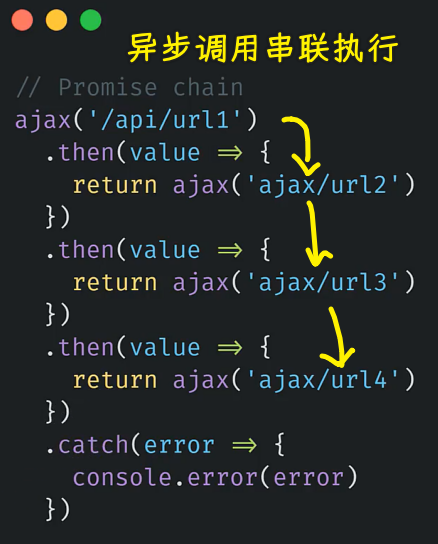

但是，这样写仍然会有大量的回调函数，虽然它们相互之间没有嵌套，但是它们还是没法达到我们传统同步代码的那种可读性

如果是传统同步代码姿势，那我们的代码可能就是这个样子：

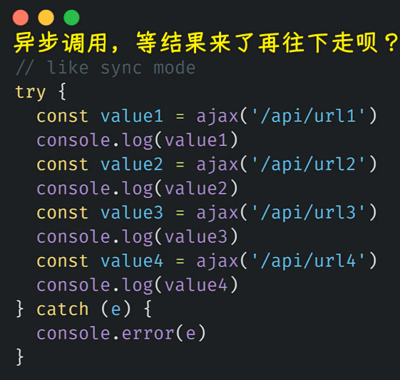

很明显这种方式去写我们的异步代码 -> 它是最简洁，也是最容易阅读和理解的

💡：微任务也是需要排队的？

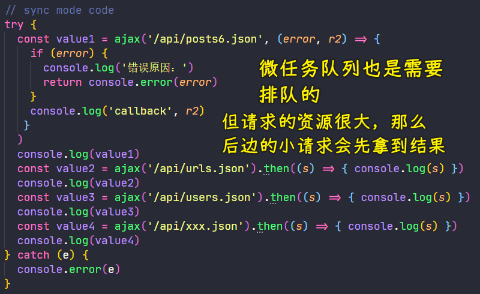

👇：看看两种更优的异步编程写法

### <mark>2）ES2015 提供的 Generator</mark>

之前已经简单了解过生成器函数的语法以及它的一些基本特点，在这里，就简单复习一下

💡：语法

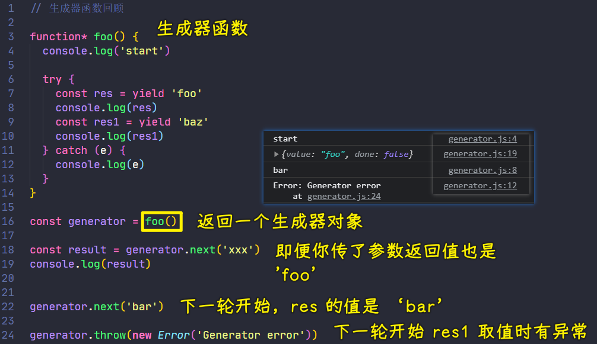

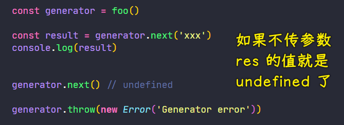

> `next()`有返回值，而`yield`也有返回值，你给`next()`传的参数就是它的返回值，不传就是`undefined`值 -> `yield`相当于是暂停了，`yield`右边的值（站在`yield`这个门前的值）是`{value,done}`里边的`value`值，下一个`next`的参数，相当于是有一个值打破了`yield`这扇门，投入了`res`的怀抱
> 
> `generator.throw`同`next`一样，`res1`求值时，抛了个异常罢了

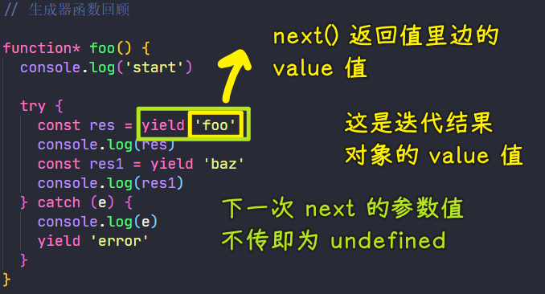

> 如果你给第二个`next`传了一个`new Error('xxx')`错误对象，那么这是不会把错误给抛出的，这会当作是一个普通的错误对象值赋值给`res`

- 首先，在普通函数基础之上多了一个`*`
  - 调用这个生成器函数并不会立即去执行这个函数，而是得到的一个生成器对象
  - 直到我们手动调用这个对象的`next`方法，这个函数的函数体才会开始执行
- 其次，在函数内部可以随时使用`yield`关键词，向外去返回一个值
  - 在`next`方法返回的对象当中去拿到这样一个返回的值，另外，返回的这个对象还有一个`done`属性，用来表示这个生成器是否已经全部执行完了
  - 而且，`yield`关键词并不会像`return`语句一样立即去结束这个函数的执行，它只是暂停这个生成器函数的执行，直到外界下一次调用生成器对象的`next`方法，才会继续从`yield`这个位置往下执行
- 另外，调用`next`方法时，传入了一个参数，如`bar`，那么这个参数会作为`yield`这个语句的返回值 -> 说白了，`yield 'foo'`是有返回值的（相当于是一个表达式），在`yield`的左边可以接收到这个值
- 还有，手动调用生成器对象的`throw`方法，该方法可以在生成器函数内部抛出一个异常 -> 它同`next`一样也会让生成器函数往下执行，不过它的作用是抛出一个异常

💡：`yield` 的意思？

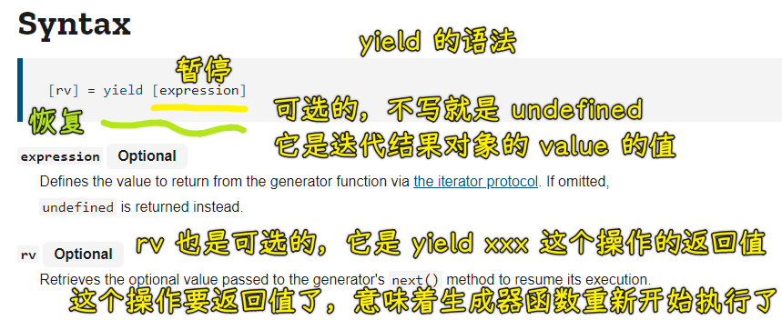

➹：[yield - JavaScript - MDN](https://developer.mozilla.org/en-US/docs/Web/JavaScript/Reference/Operators/yield)

---

理解了生成器函数的特点以及它的执行过程过后，下一步是看看如何使用 Generator 去管理我们的异步流程

## ★Generator 异步方案（中）

> 体验 Generator 函数异步方案

我们完全可以借助于`yield`它可以**暂停生成器函数执行**这样一个特点来去使用生成器函数去实现一个更优的异步编程体验

💡：定义一个`ajax`函数

``` js
function ajax(url) {
  return new Promise((resolve, reject) => {
    var xhr = new XMLHttpRequest()
    xhr.open('GET', url)
    xhr.responseType = 'json'
    xhr.onload = () => {
      if (xhr.status === 200) {
        resolve(xhr.response)
      } else {
        reject(new Error(xhr.statusText))
      }
    }
    xhr.send()
  })
}
```

👇：具体实现姿势

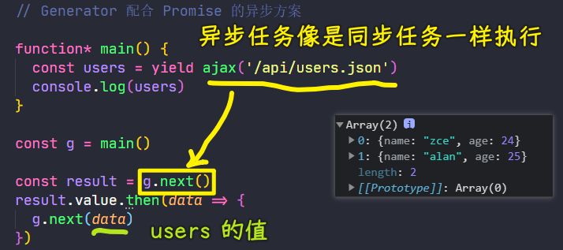

1. 定义一个生成器函数`main`
2. 在`main`里边使用`yield`去返回一个`ajax`调用，也就是返回一个`Promise`对象 -> 接收`yield`语句的返回值，打印这个值
3. 在外界调用`main` -> 得到一个生成器对象 -> 调用这个对象的`next`方法 -> 执行到生成器函数里边第一个`yield`的位置，即会执行第一个`ajax`调用 -> `next`返回对象的`value`就是`ajax`调用所返回的`Promise`对象 -> 通过`then`姿势指定这个`Promise`对象的回调 -> 在`then`的`cb`里边拿到这个`Promise`的执行结果`data` -> 再调用一次`next`，把`data`作为参数传递给`next`，这样一来`main`函数就可以接着继续往下执行了，而且这个`data`会作为当前这个`yield`的返回值，这样我们就可以拿到这个`result`的值了

这样一来，对于`Promise`函数的内部，我们就彻底消灭了`Promise`的回调，有了一种近乎于同步代码的体验

同理，在`main`函数当中，再去添加下一个`yield`操作

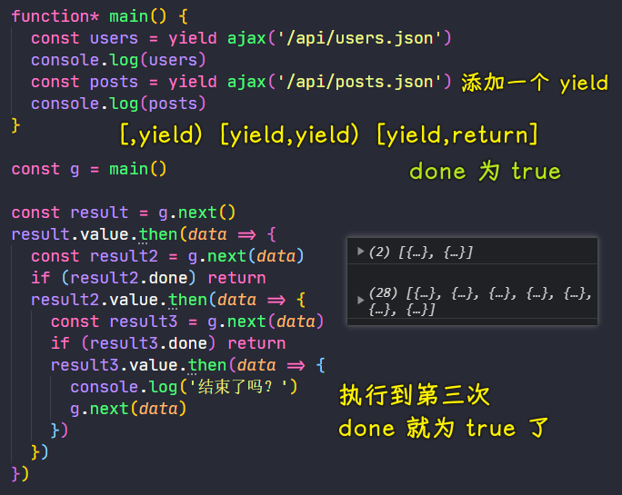

很明显，我们可以使用递归姿势去不断迭代，直到返回结果的`done`属性为`true`，也就是生成器执行结束过后，我们就结束这样一个递归

> 为了让`main`里边的代码同步执行，结果我们在外界又会到了回调地狱……

## ★Generator 异步方案（下）

> 递归执行 Generator 函数

用递归的姿势来实现一个更通用的生成器函数的执行器

💡：做法

用生成器函数完成异步编程：

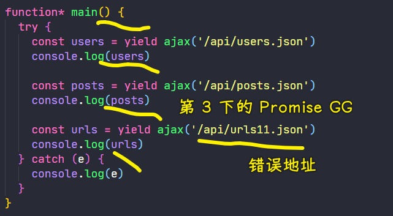

如何让生成器函数里边的代码看似在同步执行？

定义一个关于生成器函数的执行器：

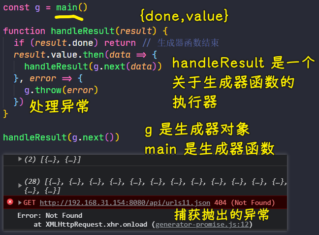

1. 定义一个`handleResult`函数 -> 接收一个`result`参数（`next`方法所返回的`result`对象）
2. 判断`result`的`done`属性是否为`true` -> 生成器是否已经结束了？
   1. 如果结束了，那`handleResult`函数也就没有继续往下执行了，直接`return`就好了
   2. 反之，没有结束，`result`的`value`应该是一个`Promise`对象 -> 使用该对象的`then`方法处理请求结果 -> 在请求回调当中，继续使用`next`，让我们的生成器函数接着往下执行，并且把得到的数据传递给`next` -> `next`方法所返回的又是下一个`result`，同样，再次把它交给`handleResult`进行递归
3. 在外界，我们只需要调用一下`handleResult`，传入第一次`next`的结果就可以了 -> 在`handleResult`的执行过程中，只要生成器不结束，那递归就会一直下去，会把我们生成器函数里边所有的异步调用全部依次执行下去
4. 补充：还要处理`Promise`失败过后的处理逻辑，不然，就会在控制台出现未捕获的异常了
   1. 做法很简单，直接在`Promise`对象的`then`方法中添加一个失败回调就好了 -> 在失败回调里边，调用生成器对象的`throw`方法，让生成器函数继续执行时得到一个异常就可以了 -> 这样，我们就可以在`main`函数的内部通过`try...catch`姿势捕获这样一个异常了，捕获后就`log`它出来

以上这么一个过程，实际上我们就完成了**一个生成器函数的一个执行器**，对于生成器函数的调用逻辑实际上是**完全可以复用**的

所以，我们可以把它封装成一个公共的函数`co`，该函数内部接收一个生成器函数`generator`，该函数内部的执行逻辑就是上述那样对整个生成器函数进行执行

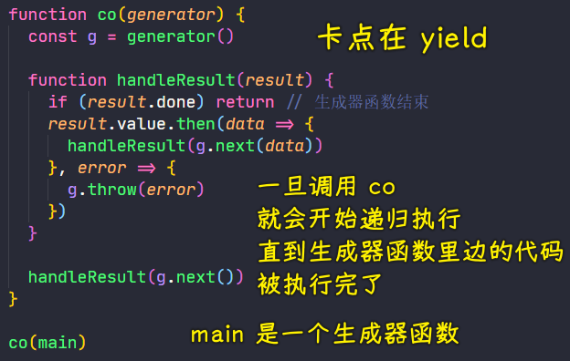

下一次使用生成器函数去完成异步编程的时候，我们就可以使用这个`co`函数了

像这样的生成器函数执行器在社区当中，早就有一个更完善的库了，这个库就叫做`co` -> 你可以自己去尝试使用一下这个 [库](https://github.com/tj/co)

这种`co`的异步方案，实际上在 15 年之前，是特别流行的，后来因为语言本身有了`async/await`过后，这种方案相对来讲就没有那么普及了，不过，使用 Generator 这种姿势最明显的一个变化就是「让我们的异步调用再次回归到扁平化」 -> 这也是我们 JS 异步编程发展过程当中很重要的一步，所以你不仅要了解它的用法，还应该去理解它是如何工作的

> Generator 函数就是一个异步操作的容器。它的自动执行需要一种机制，当异步操作有了结果，能够自动交回执行权。

当然，我们在日后的开发过程当中，我们可能还是会选择最新的`async`和`await`的方式

## ★Async 函数

> 语言层面的异步编程标准


有了 Generator 过后，JS 中的异步编程基本上就已经与同步有类似的体验了，但是使用 Generator 这种异步方案，我们还需要自己手动去编写一个执行器函数，也就是上边定义的那个`co`函数一样，所以这会比较麻烦啊！

而在 ES2017 的标准当中，新增了一个叫做 `Async` 的函数，它同样提供了这种扁平化的异步编程体验，而且它是语言层面标准的异步编程语法，所以使用起来就会更加的方便一点

你可以理解`Async`函数就是生成器函数一种更方便的语法糖，所以在语法上 `Async` 函数跟`Generator`函数是非常类似的，我们只需要把生成器函数修改为一个使用`async`关键词去修饰的普通函数，然后在这函数内部把所有的`yield`关键词给替换成`await`就可以了，至此，这样一个函数就是一个标准的`Async`函数了

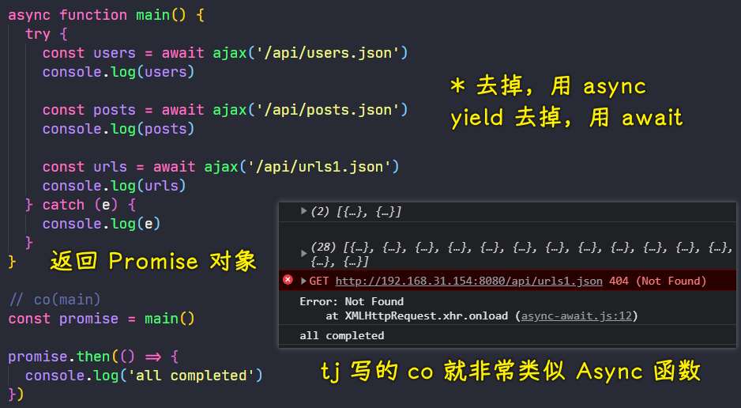

>  `await` 只在异步函数里面才起作用。它可以放在任何异步的，基于 `promise` 的函数之前。它会暂停代码在该行上，直到 `promise` 完成，然后返回结果值。在暂停的同时，其他正在等待执行的代码就有机会执行了。
> 
> 你可以在调用任何返回`Promise`的函数时使用 `await`，包括 Web API 函数。

定义好这个`Async`函数，我们就可以直接在外边去调用这个函数了，执行这个函数，其内部执行过程跟我们写的`Generator`函数是完全一样的，所以它的效果也是完全一致的

相比于`Generator`，`Async`函数最大的好处就是它不需要再去配合一个类似`co`这样的执行器，因为它是**语言层面的标准异步编程语法**，其次`Async`函数，**它可以给我们返回一个`Promise`对象**，而这样就更加利于我们对整体代码进行控制

除此之外，关于`Async`函数，还有一个需要我们注意的点，那就是`Async`函数当中使用的这个`await`关键词，它只能够出现`Async`函数内部，它不能直接在外部，也就是最顶层作用域去使用

不过，关于在最外层直接去使用`await`的功能现在已经在开发了，不久以后就有可能会出现在标准当中，到时候我们去使用`Async`函数就会更加方便一些了

以上，就是我们对`Async`函数的一个基本了解了，如果你了解了生成器的异步方案，那`Async`函数只是在写法上有略微的差异罢了，其他所有的东西都是相同的，所以`Async`函数也没有什么我们值得去深究的东西……

💡：`Async`函数的执行流程？

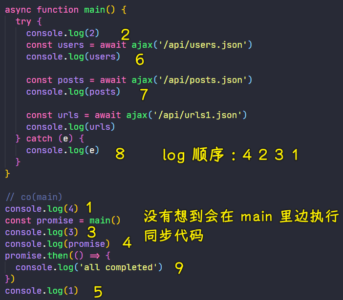

> 其实和之前的`handleResult(g.next())`一样，`Async`函数调用的时候，相当于执行了第一个`next`，也就是第一个`await`之前的代码，也就是发送了一次`ajax`请求

如果你在`Async`函数里边不写`try...catch`，那么就会交给`promise`的失败回调去处理

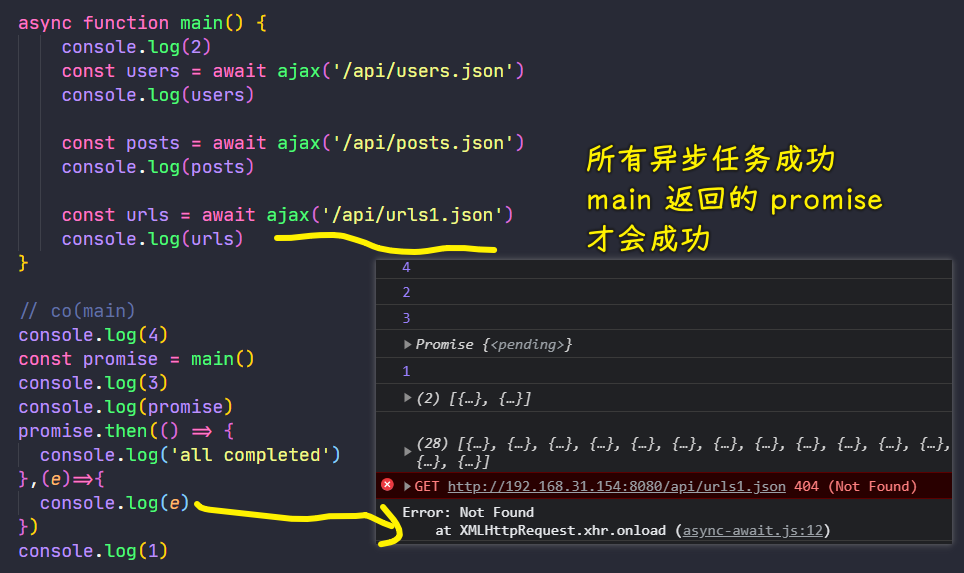

> 建议用`Promise`对象的`catch`方法捕获异常

💡：关于 `Async` 函数性能？

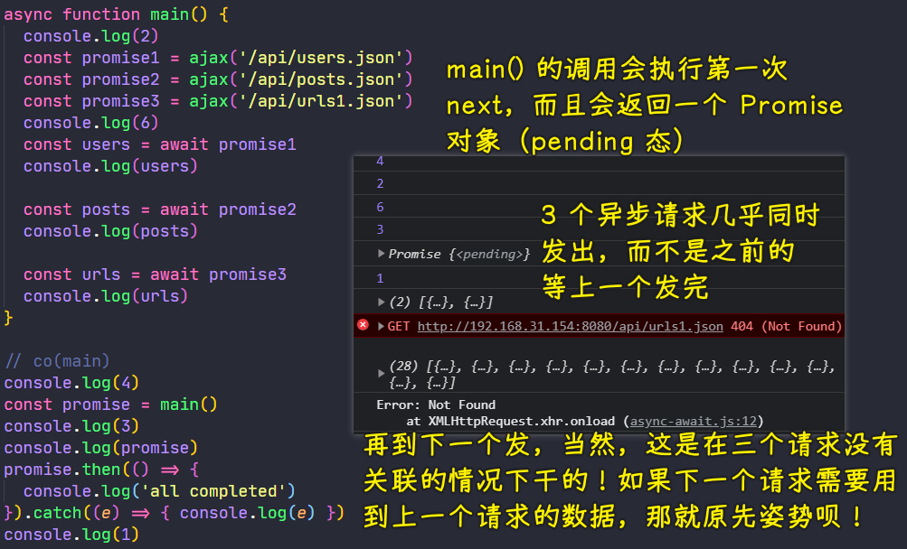

注意，用`Async`写异步代码要比`Promise.then(cb)`那样传回调的姿势性能要好，不建议用 Babel 编译`Async`函数 -> 原因是使得 JavaScript 引擎以更高的性能和更高的内存效率姿势去处理堆栈跟踪（在捕获错误时，`Promise`姿势的报错位置跟踪是很耗性能的）

➹：[Asynchronous stack traces: why await beats Promise#then() · Mathias Bynens](https://mathiasbynens.be/notes/async-stack-traces)

💡：`await`操作符？

`await` 操作符用于等待 `Promise`。它只能在常规 JavaScript 代码中的`Async` 函数中使用；然而，它也可以与 JavaScript 模块一起单独使用。

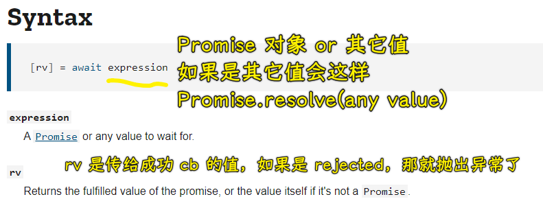

注意，只要有`await`等待的`Promise`返回的`rejected`态，那`Async`函数就不会继续往下走了，而`Async`函数的`Promise`态也就确定为`rejected`态了

`await`不在`Async`函数里边使用，只能在 ES6 模块里边使用，不能用在 CommonJS 模块。这是因为 CommonJS 模块的`require()`是同步加载，如果有顶层`await`，就没法处理加载了

测试代码：

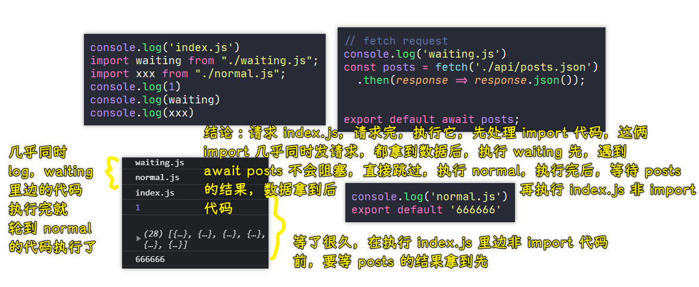

请求情况：


`index.js`会先执行`import`代码，等这两个`import`请求完成并且执行完，也就是这两个模块先`export`完，才会去执行`index.js`里边非`import`的代码

去掉`await`：

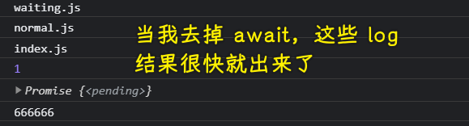

为啥会这样呢？ -> 因为我们快速导出了一个等待态的`Promise`对象啊！

要拿到这个`posts`，我们只需要使用`then`就好了：

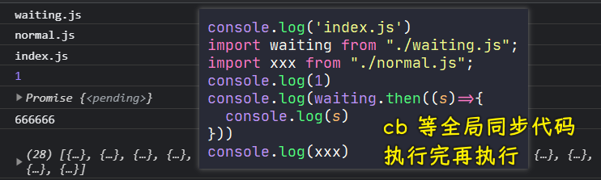

额……出现了特殊情况：

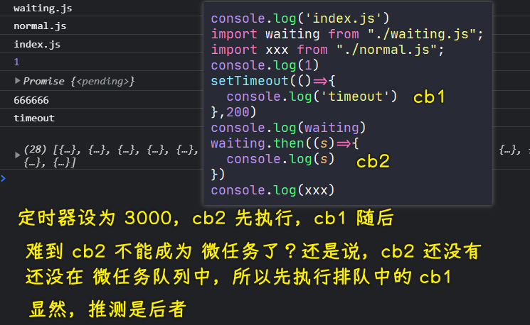

原因：

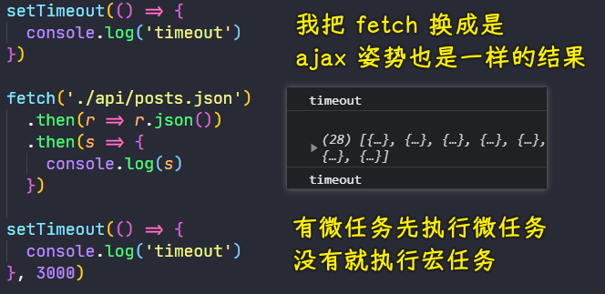

> `ajax`是我们之前封装的`ajax`方法

## ★了解更多

➹：[async 和 await: 让异步编程更简单 - 学习 Web 开发 - MDN](https://developer.mozilla.org/zh-CN/docs/Learn/JavaScript/Asynchronous/Async_await)

➹：[co 函数库的含义和用法 - 阮一峰的网络日志](https://www.ruanyifeng.com/blog/2015/05/co.html)

➹：[await - JavaScript - MDN](https://developer.mozilla.org/en-US/docs/Web/JavaScript/Reference/Operators/await)