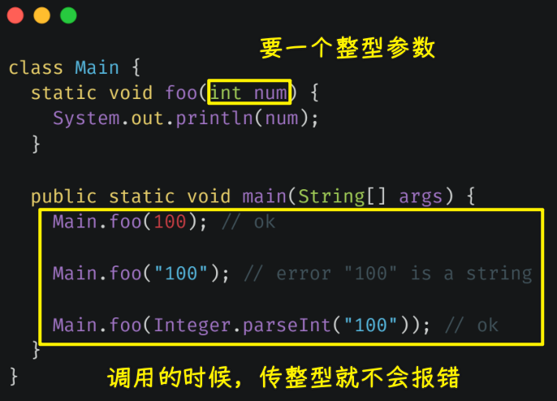
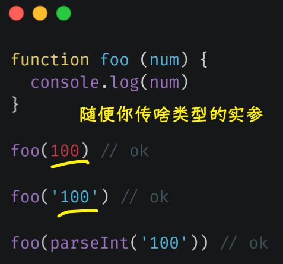
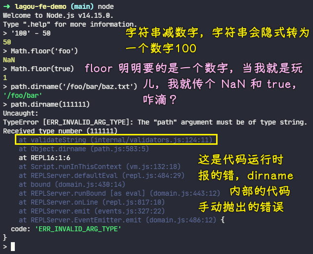
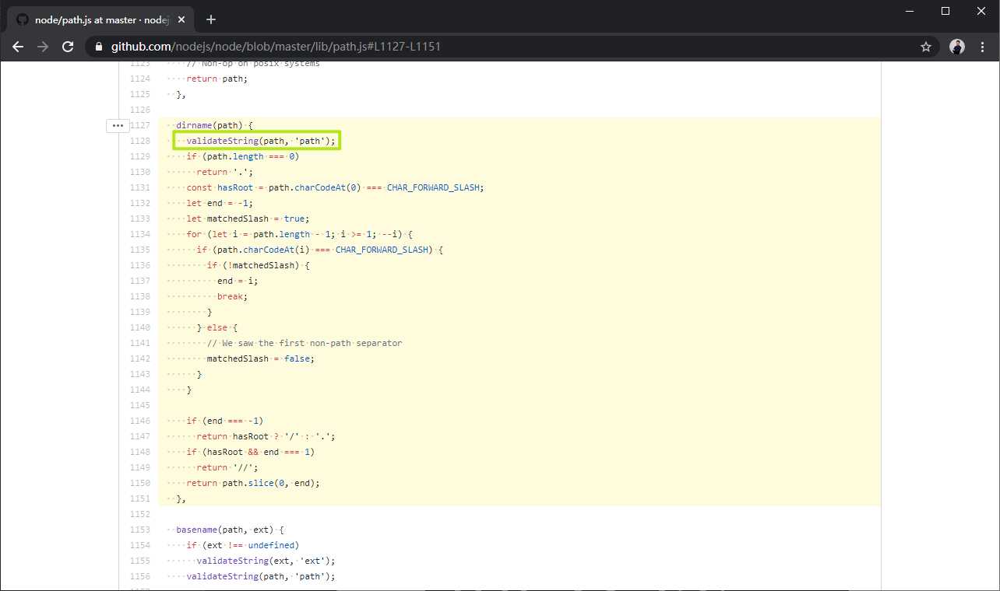
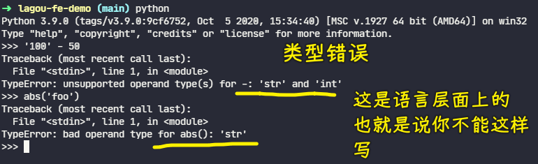

### ✍️ Tangxt ⏳ 2021-08-26 🏷️ TypeScript

# 03-1-课程概述、强类型与弱类型、静态类型与动态类型、JavaScript 类型系统特征、弱类型的问题、强类型的优势

## ★课程概述

TypeScript 是一门基于 JavaScript 之上的编程语言，它重点解决了 JavaScript 的语言自有的类型系统的不足。通过使用 TypeScript 这样一个语言，我们就可以大大提高代码的可靠程度。

虽然说这里的标题只是 TypeScript：

但是我们这里其实要去介绍的内容远不止这些。因为我们这里其实要重点去探讨的是 JavaScript 的自有类型系统的问题，以及如何去借助一些优秀的技术方案去解决这些问题。而 TypeScript  只是在这个过程当中我们会涉及到的一门语言。

**因为 TypeScript 这门语言目前可以说是此类问题的最终极解决方案**，所以说我们也会着重去学习它。除此之外我们也会去介绍一些其他的相关的技术方案。

我将咱们本次的内容大致分为以下这么几个阶段：

- 首先我们去了解一下到底什么是强类型，什么是弱类型，什么是静态类型，什么是动态类型？它们之间到底有什么不一样以及 JavaScript 为什么是弱类型的，还有为什么是动态类型的？
- 然后我们再去一起了解一下 JavaScript 的自有类型系统存在的问题，以及这些问题给我们的开发工作都造成了哪些影响？
- 再往后我们需要去了解一下 Flow 和 TypeScript  这两个最主流的 JavaScript 类型系统方案。其中 Flow 只是一个小工具，它弥补了 JavaScript 的类型系统的不足。而 TypeScript 则是基于 JavaScript 的基础之上的一门编程语言，所以说这相对来讲需要了解的内容会更多一些。

不过也不需要担心， TypeScript 它也属于渐进式的，即便说你什么特性都不知道，你也可以立马按照 JavaScript 的语法去使用它。所以说我们在学习上来讲的话就可以学一点、用一点。

## ★强类型与弱类型

1）概述

在具体介绍 JavaScript 的类型系统的问题之前，我们先来解释两组在区分不同编程语言时经常提及的名词：

- 强类型和弱类型
- 静态类型与动态类型

它们分别是从类型安全和类型检查这两个维度去区分了不同的编程语言。

2）以「类型安全」这个维度来划分强类型和弱类型

首先我们先来看「类型安全」这样一个维度。

从类型安全的角度来说，编程语言分为强类型和弱类型。这种强弱类型的概念最早是 1974 年的时候，美国有两个计算机专家提出的。当时对强类型这样一个概念的定义就是：

> 在语言层面就限制了我们函数的实参类型，它必须要跟形参类型完全相同

例如我们有一个叫做 `foo` 的函数，那它需要接收一个整型的参数。

我们再去调用的时候，就不允许直接去传入一个其他类型的值。我们可以选择在传入之前，先将我们这个值转换成一个整形的数字，然后再去传入。而弱类型则完全相反，它在语言层面并不会去限制我们实参的类型。

即便说我们这个函数需要的参数是整形的一个数字，而我们在调用时仍然可以传入任意类型的数据，语法上是不会报错的。那在运行上有可能会出现问题，但是语法上不会有问题。

由于**这种强弱之分根本不是某一个权威机构的定义**，而且当时这两位计算机的专家他们也没有给出一个具体的规则，所以说这就导致了后人对这种界定方式的细节出现了一些不一样的理解，但是整体上大家的界定方式都是**在描述强类型它是有更强的类型约束，而弱类型语言它几乎没有什么类型上的约束**。

3）划分强弱类型的个人看法

我个人比较同意的一个说法就是：

> 强类型语言当中不允许有任意的隐式类型转换，而在弱类型的语言当中则允许任意的隐式类型数据转换。

1、弱类型例子：JavaScript

例如我们这个地方需要的明明是一个数字，而你往这放一个字符串也是可以的，因为它会做**隐式类型转换**。

我们这里可以打开命令行终端做一些尝试。

我们以 JavaScript 为例，在 JavaScript 当中，它就允许任意的隐式类型转换。

比如我们在代码当中可以直接去尝试使用数学运算符去计算一个字符串和一个数字之间的差，这种用法它并不会报错。那这里的字符串`'100'`，它会自动地被隐式转换为一个数字`100`，然后进行运算。

再比如我们去调用 `Math` 对象的 `floor` 方法，按照道理来说，这个方法它应该接收一个数字，但是我们实际上传入的参数它可以是任意的类型，我们在调用的时候都不会报错。

当然，有人可能会说我们在 JavaScript 当中去调用某些方法时，也会报出类型错误。

例如我们这里使用的是 Node.js 环境。那在这样一个环境当中，我们可以使用 `path` 模块所提供的 `dirname` 方法去获取一个路径当中的文件夹的路径，如果我们传入的不是一个字符串，这里就会爆出一个类型错误。

那难道这就意味着我们 JavaScript 是强类型了吗？答案当然不是。

我们这里所说的强类型是从语言的语法层面就限制了不允许传入不同类型的值。**如果我们传入的是不同类型的值，我们在编译阶段就会报出错误，而不是等到运行阶段再通过逻辑判断去限制**。

在 JavaScript 当中**所有爆出的类型错误都是在代码层面，然后在运行时通过逻辑判断手动抛出的**。

例如我们刚刚所看到这样一个类型的错误，我们就可以在 Node.js 的源码当中看到：

它确实是通过逻辑判断在这个 validate 这个 string 的方法里面去抛出的一个异常，而**不是我们语言或者说语法层面对应的类型限制**。

2、强类型例子：Python

这里我们可以再来看另外一个强类型的例子，那就是 Python。

我们这里也是使用这个 Python 的 REPL （Read-Eval-Print Loop）环境去测试一下。

首先我们先测试一下一个字符串的`'100'`，去减去一个数字`50`。那结果就爆出了一个不允许在字符串和整数之间使用中划线这个运算符，那也就是一个类型的错误。

然后我们再来尝试使用一下 Python 当中一个全局的函数——`ABS`，也就是求绝对值。这个函数它要求我们传入的是一个数字，那我们再尝试传入一个字符串，结果同样是报错的。

需要注意的是，这里的错误它是**从语言层面就报了对应的错误**。

4）总结

这里我们再来总结一下强类型和弱类型这两种类型之间的差异。

强类型它就是不允许有随意的隐式类型转换，而弱类型它是比较随意的，它可以有任意的隐式类型转换。当然了，**这只是我理解的一种强弱类型的界定方式，并不是一个权威的说法，当然，业界也根本没有一个权威的说法，你可以根据你自己的理解去做一个定义**。那至于你可能会想到我们在代码当中，**我们的变量类型可以随时改变这样一个特点，那其实这并不是强弱类型之间的区别**。

我们就拿 Python 来说，它是一门儿强类型的语言，但是它的变量仍然是可以随时改变类型的。那这一点在很多资料当中可能都表述得有一些不太妥当，他们都在说 Python 是一门儿弱类型语言，但这其实不是这样的。

## ★静态类型与动态类型
