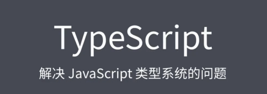

### ✍️ Tangxt ⏳ 2021-08-26 🏷️ TypeScript

# 03-1-课程概述、强类型与弱类型、静态类型与动态类型、JavaScript 类型系统特征、弱类型的问题、强类型的优势

## ★课程概述

TypeScript 是一门基于 JavaScript 之上的编程语言，它重点解决了 JavaScript 的语言自有的类型系统的不足。通过使用 TypeScript 这样一个语言，我们就可以大大提高代码的可靠程度。

虽然说这里的标题只是 TypeScript：



但是我们这里其实要去介绍的内容远不止这些。因为我们这里其实要重点去探讨的是 JavaScript 的自有类型系统的问题，以及如何去借助一些优秀的技术方案去解决这些问题。而 TypeScript  只是在这个过程当中我们会涉及到的一门语言。

**因为 TypeScript 这门语言目前可以说是此类问题的最终极解决方案**，所以说我们也会着重去学习它。除此之外我们也会去介绍一些其他的相关的技术方案。

我将咱们本次的内容大致分为以下这么几个阶段：


- 首先我们去了解一下到底什么是强类型，什么是弱类型，什么是静态类型，什么是动态类型？它们之间到底有什么不一样以及 JavaScript 为什么是弱类型的，还有为什么是动态类型的？
- 然后我们再去一起了解一下 JavaScript 的自有类型系统存在的问题，以及这些问题给我们的开发工作都造成了哪些影响？
- 再往后我们需要去了解一下 Flow 和 TypeScript  这两个最主流的 JavaScript 类型系统方案。其中 Flow 只是一个小工具，它弥补了 JavaScript 的类型系统的不足。而 TypeScript 则是基于 JavaScript 的基础之上的一门编程语言，所以说这相对来讲需要了解的内容会更多一些。

不过也不需要担心， TypeScript 它也属于渐进式的，即便说你什么特性都不知道，你也可以立马按照 JavaScript 的语法去使用它。所以说我们在学习上来讲的话就可以学一点、用一点。

## ★强类型与弱类型

### <mark>1）概述</mark>

在具体介绍 JavaScript 的类型系统的问题之前，我们先来解释两组在区分不同编程语言时经常提及的名词：

- 强类型和弱类型
- 静态类型与动态类型

它们分别是从类型安全和类型检查这两个维度去区分了不同的编程语言。


### <mark>2）以「类型安全」这个维度来划分强类型和弱类型</mark>

首先我们先来看「类型安全」这样一个维度。

从类型安全的角度来说，编程语言分为强类型和弱类型。这种强弱类型的概念最早是 1974 年的时候，美国有两个计算机专家提出的。当时对强类型这样一个概念的定义就是：

> 在语言层面就限制了我们函数的实参类型，它必须要跟形参类型完全相同


例如我们有一个叫做 `foo` 的函数，那它需要接收一个整型的参数。


我们再去调用的时候，就不允许直接去传入一个其他类型的值。我们可以选择在传入之前，先将我们这个值转换成一个整形的数字，然后再去传入。而弱类型则完全相反，它在语言层面并不会去限制我们实参的类型。


即便说我们这个函数需要的参数是整形的一个数字，而我们在调用时仍然可以传入任意类型的数据，语法上是不会报错的。那在运行上有可能会出现问题，但是语法上不会有问题。


由于**这种强弱之分根本不是某一个权威机构的定义**，而且当时这两位计算机的专家他们也没有给出一个具体的规则，所以说这就导致了后人对这种界定方式的细节出现了一些不一样的理解，但是整体上大家的界定方式都是**在描述强类型它是有更强的类型约束，而弱类型语言它几乎没有什么类型上的约束**。


### <mark>3）划分强弱类型的个人看法</mark>

我个人比较同意的一个说法就是：

> 强类型语言当中不允许有任意的隐式类型转换，而在弱类型的语言当中则允许任意的隐式类型数据转换。

#### <mark>1、弱类型例子：JavaScript</mark>

例如我们这个地方需要的明明是一个数字，而你往这放一个字符串也是可以的，因为它会做**隐式类型转换**。

我们这里可以打开命令行终端做一些尝试。

我们以 JavaScript 为例，在 JavaScript 当中，它就允许任意的隐式类型转换。


比如我们在代码当中可以直接去尝试使用数学运算符去计算一个字符串和一个数字之间的差，这种用法它并不会报错。那这里的字符串`'100'`，它会自动地被隐式转换为一个数字`100`，然后进行运算。

再比如我们去调用 `Math` 对象的 `floor` 方法，按照道理来说，这个方法它应该接收一个数字，但是我们实际上传入的参数它可以是任意的类型，我们在调用的时候都不会报错。

当然，有人可能会说我们在 JavaScript 当中去调用某些方法时，也会报出类型错误。

例如我们这里使用的是 Node.js 环境。那在这样一个环境当中，我们可以使用 `path` 模块所提供的 `dirname` 方法去获取一个路径当中的文件夹的路径，如果我们传入的不是一个字符串，这里就会爆出一个类型错误。

那难道这就意味着我们 JavaScript 是强类型了吗？答案当然不是。

我们这里所说的强类型是从语言的语法层面就限制了不允许传入不同类型的值。**如果我们传入的是不同类型的值，我们在编译阶段就会报出错误，而不是等到运行阶段再通过逻辑判断去限制**。

在 JavaScript 当中**所有爆出的类型错误都是在代码层面，然后在运行时通过逻辑判断手动抛出的**。

例如我们刚刚所看到这样一个类型的错误，我们就可以在 Node.js 的源码当中看到：


它确实是通过逻辑判断在这个 validate 这个 string 的方法里面去抛出的一个异常，而**不是我们语言或者说语法层面对应的类型限制**。

#### <mark>2、强类型例子：Python</mark>

这里我们可以再来看另外一个强类型的例子，那就是 Python。


我们这里也是使用这个 Python 的 REPL （Read-Eval-Print Loop）环境去测试一下。

首先我们先测试一下一个字符串的`'100'`，去减去一个数字`50`。那结果就爆出了一个不允许在字符串和整数之间使用中划线这个运算符，那也就是一个类型的错误。

然后我们再来尝试使用一下 Python 当中一个全局的函数——`abs`，也就是求绝对值。这个函数它要求我们传入的是一个数字，那我们再尝试传入一个字符串，结果同样是报错的。

需要注意的是，这里的错误它是**从语言层面就报了对应的错误**。

### <mark>4）总结</mark>

这里我们再来总结一下强类型和弱类型这两种类型之间的差异。

强类型它就是不允许有随意的隐式类型转换，而弱类型它是比较随意的，它可以有任意的隐式类型转换。当然了，**这只是我理解的一种强弱类型的界定方式，并不是一个权威的说法，当然，业界也根本没有一个权威的说法，你可以根据你自己的理解去做一个定义**。那至于你可能会想到我们在代码当中，**我们的变量类型可以随时改变这样一个特点，那其实这并不是强弱类型之间的区别**。


我们就拿 Python 来说，它是一门儿强类型的语言，但是它的变量仍然是可以随时改变类型的。那这一点在很多资料当中可能都表述得有一些不太妥当，他们都在说 Python 是一门儿弱类型语言，但这其实不是这样的。

## ★静态类型与动态类型

除了以类型安全的角度来划分强类型语言和弱类型语言以外。在类型检查的角度，我们还可以将编程语言分为静态类型语言和动态类型语言。

关于静态类型语言和动态类型语言之间的差异并没有什么争议，大家都很统一。

对于静态类型语言最主要的表现就是一个变量声明时它的类型就是明确的，而且在这个变量声明过后，它的类型就不允许再被修改了。


那相反动态类型语言的特点就是在运行阶段才能够明确一个变量的类型，而且变量的类型也可以随时发生变化。


例如我们在 JavaScript 当中，我们通过 `var` 去声明一个叫做 `foo` 的变量，我们先让它等于`100`。那程序运行到这一行时：


才会明确我们这个 `foo` 它的类型是一个 `number`，然后再将它的值修改为一个字符串，而这种用法也是被允许的。

所以我们也可以说在动态类型语言当中，它的变量是没有类型的，而变量当中所存放的值是有类型的。那我们的 JavaScript ，它就是一门标准的动态类型语言。

总的来说：

从类型安全的角度，一般将我们的编程语言分为强类型和弱类型，而两者之间的区别就是**是否允许随意的隐式类型转换**。

从类型检查的角度，一般分为静态类型和动态类型。那它们两者之间的区别就是**是否允许随时去修改变量的类型**。

这张图就描述了一些常见的编程语言在这两个角度下的表现：


那需要要注意的是，这里我们**不要混淆了类型安全和类型检查这两个区分维度**，更**不要认为弱类型就是动态类型，强类型就是静态类型**，这种说法是完全不正确的。

## ★JavaScript 类型系统特征


由于 JavaScript 是一门弱类型，而且是动态类型的语言，那语言本身的类型系统是非常薄弱的，甚至我们也可以说 JavaScript 根本就没有一个类型系统。那这种语言的特征用一个比较流行的词来说就是「**任性**」，因为它几乎没有任何的类型限制。所以说我们 JavaScript 这门语言也是极其灵活多变的，但是在这种灵活多变的表象背后，我们丢失掉的就是类型系统的可靠性。


我们在代码当中每每遇到一个变量，我们都需要去担心它到底是不是我们想要的类型。那整体的感受用另外一个流行的词来说就是「**不靠谱**」。

那可能有人会问为什么 JavaScript 它不能设计成一门强类型的或者说静态类型的这种更靠谱的语言呢？


那这个原因自然跟 JavaScript 的背景有关。


首先在早前根本就没有想到 JavaScript 的应用会发展到今天的这种规模，**最早的 JavaScript 应用它根本不会太复杂，需求都非常简单**，很多时候几百行代码甚至是几十行代码就搞定了。那在这种一眼就能够看到头的这种情况下，**类型系统的限制就会显得很多余或者说很麻烦**。

其次 JavaScript 是一门脚本语言，那脚本语言的特点就是不需要编译，就直接在运行环境当中去运行。换句话说， JavaScript 它是**没有编译环节**的，所以即便把它设计成一个静态类型的语言也没有什么意义，因为静态类型语言需要在编译阶段去做类型检查，而 JavaScript 它根本就没有这样一个环节。

那根据以上这样一些原因，JavaScript 就**选择成为了一门更灵活、更多变的弱类型/动态类型语言**。

放在当时的那样一个环境当中，这并没有什么问题，甚至也可以说这些特点都是 JavaScript 的一大优势。而现如今我们前端应用的规模已经完全不同了，遍地都是一些大规模的应用，那我们 JavaScript 的代码也就会变得越来越复杂，那开发周期也会变得越来越长。那在这种情况下，之前 JavaScript 弱类型、动态类型的这些优势也就自然变成了它的短板。


这个道理其实很好理解，我们打个比方，以前我们只是杀鸡，那用小刀子就可以了，而且小刀子更灵活，更方便。但是我们现在要拿这把小刀去杀牛，那就显得非常吃力了。话说，在这里我们的「吃力」具体到底体现在什么地方呢？那这些我们接下来可以从一些具体的情况当中去体现出来。

## ★弱类型的问题

接下来我们具体来看 JavaScript 这种弱类型的语言在去应对大规模应用开发时有可能会出现的一些常见的问题。当然，我们这里所列举的问题只是冰山一角，不过他们也都能充分反映弱类型的问题。

### <mark>1）异常需要等到运行时才能发现</mark>

首先我们先来看第一个例子，这里我们先去定义一个叫做 `obj` 的对象，然后我们去调用这个 `obj` 的 `foo` 方法：

``` js
const obj = {}

obj.foo()
```

可以很明显看到这个对象当中并不存在这样一个方法，但是在语言的语法层面，这样写是可行的。只是我们把这个代码一旦放到环境当中去运行，就会报出一个错误：


所以这也就是说在 JavaScript 这种弱类型的语言当中，我们就必须要等到运行阶段才能够去发现代码当中的一些类型异常，而且如果这里并不是立即去执行这个 `foo` 方法，而是在某一个特定的时间才去执行，例如我们把它放到一个 `timeout` 的一个回调当中，那程序在刚刚启动运行时，还没有办法去发现这个异常，一直等到这行代码执行了，才有可能去抛出这样一个异常。


因此，如果我们在测试的过程当中没有测试到这一行在回调中的`obj.foo()`代码，那这样一个隐患就会被流到我们的代码当中。

而如果是强类型的语言的话，那我们在这个回调里边直接去调用`obj`对象当中一个不存在的成员，那这里语法上就会报出错误，根本不用等到我们去运行这行代码。

### <mark>2）函数功能可能发生改变</mark>

我们再来看第二个例子，这里我们先去定义一个叫做 `sum` 的函数，那这个函数它接受收两个参数，然后在内部去返回这两个参数的和，那这样一个函数的作用，顾名思义就是去计算这两个数的和。


如果我们调用时传入的是两个数字的话，结果自然是正常的。但是如果我们调用的时候传入的是字符串，那在这种情况下我们这个函数的作用就完全发生了变化，那它会返回我们这两个字符串连接过后的结果。这就是**因为类型不确定所造成的一个最典型的问题**。

可能有人会说我们可以通过自己的约定去规避这样的问题，的确，通过约定的方式是可以规避这种问题，但是你要知道**约定是根本没有任何保障的**，特别是在多人协同开发的情况下，我们根本没有办法保证每个人都能遵循所有的约定，而如果我们使用的是一门儿强类型的语言话，那这种情况就会被彻底避免掉，因为在强类型语言当中，如果我们要求传入的是数字，那你传入的是其他类型的值，在语法上就行不通。

### <mark>3）对象索引器的错误用法</mark>

我们再来看第三个例子，这里我们先去创建一个对象，然后我们通过索引器的语法去给这个对象添加属性。


> `console.log(obj[true])`这样写也是打印`100`的

我们前面也介绍过对象的属性名它只能够是字符串或者是 ES6 所推出的那个 `symbol`，但是由于 JavaScript 是弱类型的，所以说我们可以在索引器当中使用任意类型的值去作为属性，而在它的内部会自动转换成字符串。

例如我们为这个 `obj` 去添加一个`true`的布尔值作为属性名`obj[true] = 100`，那最终这个对象它实际的属性名就是字符串的 `'true'`（`t-r-u-e`），也就是说我们现在使用字符串 `'true'` 也可以取到这样一个值。

那这有什么问题呢？

如果我们**不知道对象属性名会自动转换成字符串的这样一个特点**，那`obj['true']`这个写法你就可能会**感觉很奇怪**，而这种奇怪的根源就是我们用的是一个比较随意的弱类型语言。

如果是强类型语言的话，这种问题也可以彻底避免，因为在强类型的情况下，这里的索引器它明确有类型要求，我们不满足类型要求的这样一个成员，在语法上就行不通。

### <mark>4）总结</mark>

再总结一下这里的三个例子。

在第一个例子当中，因为弱类型的关系，我们程序当中的一些类型异常，它需要等到运行时才能够发现。

而在第二个例子当中，因为弱类型的关系，它类型不明确，就会造成我们函数功能有可能发生改变。

在第三个例子当中，因为弱类型的关系就出现了我们对对象索引器的一种错误的用法。

那综上，弱类型这种语言它的弊端是十分明显的，只是在代码量小的情况下，这些问题我们都可以通过约定的方式去规避，而对于一些开发周期特别长的大规模项目，那这种君子约定的方式仍然会存在隐患，只有在语法层面的强制要求才能够提供更可靠的保障。


所以说，强类型语言的代码在代码可靠程度上是有明显优势的，而使用强类型语言，那就可以**提前消灭一大部分有可能会存在的类型异常**，而不必等到我们在运行过程当中再去慢慢的 debug。

## ★强类型的优势

通过刚刚对 JavaScript 这种弱类型语言弊端的一个分析，我们强类型的优势已经体现出来了。不过关于强类型的优势还远不止这一些，这里我们可以先提前去总结一下。

关于强类型的优势，我们这里可以先总结四个大点。

### <mark>1）强类型代码错误更早暴露</mark>

首先第一点就是错误，它可以更早的暴露。也就是我们可以在编码阶段提前去消灭一大部分有可能会存在的类型异常。因为在编码阶段语言本身就会把这些类型异常给它暴露出来，所以说我们就不用等到运行阶段再去查找这种错误，那这一点在刚刚的几个例子当中就已经充分体现出来了，我们这儿就不用再单独表现了。那后面的案例还会不断的体现这样一点。

### <mark>2）强类型代码更智能，编码更准确</mark>

那第二点就是强类型的代码会更加智能，然后我们的编码也会更加准确一点。这是一个开发者最容易感受到的点，试想一下你为什么需要开发工具的智能提示这样的功能呢？虽然我以前经常说不要去用智能提示，那这只是针对于学习阶段而言的，因为在学习阶段如果过度依赖智能提示，那这样的话就会对我们编码能力的提升没有任何的帮助，但是我们在实际开发时肯定是怎么提高效率怎么来，那智能提示它能够有效地提高我们编码的效率以及编码的准确性，但是我们在实际去编写 JavaScript 的过程当中，你会发现很多时候我们的智能提示它不起作用。

例如我们定义一个 `render` 函数，这个函数它去接收一个 DOM 元素参数，在函数的内部，我们会去调用 `element` 对象当中的一些成员。那这个时候你就会发现智能提示它没有办法准确地提示出来一些有用的内容：


这就是因为开发工具在这里根本就没有办法去推断出这个 `element` 它到底是什么类型的，所以这也就没有办法知道它里面有哪些具体的成员了。

那我们这个时候就只能够凭着记忆当中的一些成员名称去访问这些对象当中的成员。很多时候，我们都会因为单词拼错啦或者是成员名称记错了，就会造成一些问题，例如图中的`innerHtml`它就拼写错了，但是我们这里的编辑器是毫无任何提示的。如果是强类型语言的话，那编辑器它是时时刻刻都知道每一个变量到底是什么类型的，所以说它自然就能够提供出更准确的智能提示，那我们的编码也就会更加准确、更加有效率。

### <mark>3）重构更可靠</mark>

第三点就是使用强类型语言，我们的重构会更加牢靠一点。重构一般是指对我们的代码有一些破坏性的改动，例如我们去删除对象当中的某个成员，或者是修改一个已经存在的成员名称。

例如我们先定义一个 `util` 对象，那在这个对象当中，我们先随意定义了一个工具函数。


假设这个对象在我们这个项目当中，有很多地方都用到了，那我们五个月过后，你突然间发现你之前定义的这个属性名有点草率，你想要把它改成一个更有意义的名称，那这个时候我问你，你敢轻易地去修改吗？肯定不敢，因为 JavaScript 是一个弱类型的语言，我修改了这样一个成员名称过后，由于在很多地方用到的这个名称还是以前的名称，那即便说有错误，你也没有办法立即表现出来。那如果是强类型语言的话，一旦我们的对象属性名发生了变化，那我们再重新编译时就会立即报出错误。那这个时候你就可以轻松定位所有使用到这个成员的地方，然后把它们修改过来。那甚至是有些工具还可以自动的把所有引用到这个对象当中的这个成员的地方自动的给修改过来，所以说这是非常方便的，那这样的话，这也是强类型语言为我们的重构提供了一种更牢靠、更可靠的一种保障。

### <mark>4）减少了代码层面的不必要的类型判断</mark>

第四点就是强类型的语言它会减少我们在代码层面不必要的一些类型判断。


我们还是以 `sum` 函数为例，因为在 JavaScript 当中，它是一个弱类型的语言，所以说这里实际接收到的参数有可能是任意类型的。那么为了保证参数的类型，我们就必须要通过代码去做一些类型的判断。我们可以使用 `typeof` 去分别判断这两个参数是否都是数字？如果不是数字的话，那我们就应该手动抛出一个类型异常错误。如果一切正常的话，那我们就执行求和逻辑。

在这里我们所编写的这一段类型判断的代码，它实际的目的就是为了保证我们拿到的数据类型是我们这里所需要的 `number`，而如果是强类型语言的话，那这一段判断根本是没有任何的意义的，因为不是我们所需要的类型根本就传不进来，只有弱类型语言才会需要这种特殊的类型判断。

### <mark>5）总结</mark>


那以上就是强类型语言的一些典型的优势。当然了，这里我们所有对强类型语言的那些如果都是建立在你有接触过一些强类型语言的基础之上的，如果说你之前没有接触过任何的强类型语言，那可能会没有太多的概念，但那没有关系，我们也可以带着这种所谓的期待，去接着往下做一些深入的探索。
