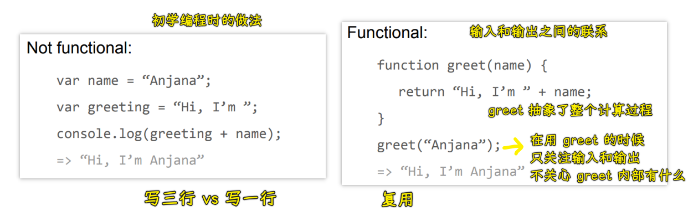
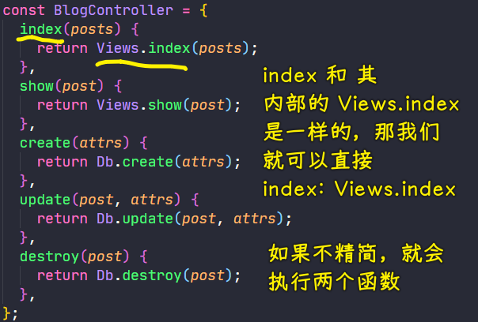

### ✍️ Tangxt ⏳ 2021-06-01 🏷️ functional programming

# 04-1-课程介绍、为什么要学函数式编程？、函数式编程概念、函数是一等公民

## ★课程介绍

> 介绍一下要学习的主要内容

### <mark>1）课程介绍</mark>

* 为什么要学习函数编程以及什么是函数式编程
* 函数式编程一些主要的特性（如纯函数、函数的柯里化、函数组合等）
* 函数式编程的应用场景
* 函数式编程库 Lodash

**函数式编程其实就是利用纯函数来实现一些细粒度的函数，然后再通过函数的组合把这些细粒度的函数组合成功能更强大的函数**

在介绍函数式编程这些特性的过程中 -> 还会介绍一下这些特性的使用场景，以及介绍一些函数式编程常用的一些库，如 Lodash（会介绍这个库的基本使用，还会去模拟 Lodash 当中一些常用的函数）

以上就是这个章节要学习的内容了！

### <mark>2）范式</mark>

What is functional programming?

- a programming paradigm
- a coding style
- a mindset
- a sexy, buzz-wordy trend

> **Paradigm （范式） 是一个领域中主流的行事套路，它包括 philosophy （理念） 和 methods （方法）两部分。**Philosophy （理念） 这个概念很好理解。比如，购物理念就是什么该买，什么不该买，怎么买。环保理念就是什么还保护，什么不该保护，以及怎么保护。时尚理念就是什么是时尚，什么不是，如何时尚。同理，穿衣理念就是什么该穿，什么不该穿，怎么穿。**那么，某事的 philosophy （理念） 就是，做某事，什么该做，什么不该做，以及方式。**理念说完了就是 methods （方法）。**Methods （方法）**就是继方式之后的具体的操作。举个例子：屠宰行业的杀猪的 paradigm （范式）是 3 岁以上的杀 （什么该做），3 岁以下的不杀 （什么不该做），用电击的方法杀 （方式）。具体该如何操作 （方法）。**In sum, paradigm （范式） ＝ philosophy （理念） + methods （方法）＝主流认为什么事该做 ＋ 方式 ＋ 方法**。

范式：范围 + 方式（方法和形式） + 具体操作

➹：[范式（Paradigm）是什么？ - 吴冕的回答 - 知乎](https://www.zhihu.com/question/21629921/answer/120543387) 

➹：[Learning Functional Programming with JavaScript // slidr.io](https://slidr.io/vakila/learning-functional-programming-with-javascript#1)

## ★为什么要学函数式编程？

函数式编程是一个非常古老的概念，它的出现甚至早于第一台计算机的诞生，关于函数式编程的历史，可以通过 [这篇文章](https://zhuanlan.zhihu.com/p/24648375?refer=marisa) 了解一下，它写得比较详细，但也不怎么好懂，当然没看懂也没事，这并不影响你学习函数式编程……

既然函数式编程那么古老，那我们为什么现在还要学习函数式编程呢？

玩笑的说：有这么一个场景，你的同事或者朋友在聊函数式编程，突然问你了解「函数式编程」吗？ -> 如果你不会的话，是不是会感到很尴尬呢？ -> 所以为了这一点，我们也得去学啊！

学习函数式编程的意义：

* 函数式编程是随着 React 的流行受到越来越多的关注 -> 就像当年的 Google Maps 以及 Gmail 带火了 Ajax 一样 -> React 提供的高阶组件使用了高阶函数来实现，而高阶函数就是函数式编程的一个特性，虽然 React 使用了函数式编程的一些特性，但它并不是纯函数式的，另外，React 的一些生态，如 Redux 就使用了函数式编程的一些思想，所以如果你想要更好地学习 React 和 Redux 的话，那就需要了解函数式编程
* Vue 3 也开始拥抱函数式编程 -> 我们都知道 Vue3 对 Vue2 做了很大的重构，而且越来越偏向函数式，这一点我们在使用 Vue3 的 Composition API 的时候可以感受到，而在 Vue2 的源码中也大量的使用了高阶函数

这些流行框架都在趋向于函数式编程，甚至可以这么说，**你可以不学这些框架，但是你就不能不了解函数式编程**，因为这些才是**永远不变**的内容

很多开发者，在学习 JS 之前，可能都了解过面向对象的语言，比如 Java、C# 以及 C++ 等等，所以在学习 JS 的时候，我们也都是从面向对象开始学习的，我们会通过学习原型、原型链以及模拟实现继承的机制来实现面向对象的一些特性，而且在这学习的过程中，还会遇到烦人的`this`，对于这个`this`的使用，肯定会有很多人遇到各种各样的问题，而在使用 JS 模拟面向对象的一些特性的时候，也是非常的痛苦

当然，以后我们可以拥抱函数式编程了，因为拥抱了**函数编程可以抛弃 烦人的 `this`**

使用函数式编程还有一些好处：

* 打包过程中可以更好的利用 tree shaking 过滤无用代码
* 方便测试、方便并行处理

这两点都是由函数式编程的特性来决定的

* 还有很多库可以帮助我们进行函数式开发：lodash、underscore、ramda

这个课程会介绍`lodash`的使用

以上就是关于「为什么学习函数式编程？」的介绍……

💡：Why functional JavaScript？

object-oriented JS gets tricky -> (prototypes? this?!?)

why？

- safer, easier to debug/maintain
- established community

how？

- Do everything with functions：input -> output

## ★函数式编程概念

### <mark>1）什么是函数式编程？</mark>

函数式编程，英文名「Functional Programming」, 缩写是「FP」，我们在看一些文章的时候可能都见到过「FP」的缩写，而这其实就是「函数式编程」的意思

FP 是一种**编程范式**，我们可以认为它是一种编程的风格，它和面向对象是并列的关系。

FP 我们可以认为是**一种思维的模式加上它的实现方法**

我们常听说的编程范式还有面向过程编程、面向对象编程。

面向过程编程，简单解释就是「按照步骤来实现，一步步地来实现我们想要的功能」

而面向对象编程的思维方式是**把现实世界中的事物抽象成程序世界中的类和对象，然后通过封装、继承和多态来演示事物/事件之间的联系**

函数式编程的思维方式则是**把现实世界的事物和事物之间的联系抽象到程序世界中（对运算过程进行抽象）** -> 这句话比较抽象

💡：解释一下上边关于函数式编程的思维方式这句话

首先来解释一下程序的本质：

程序的本质就是**根据输入然后通过某种运算获得到相应的输出，我们程序在开发的过程中会涉及到很多有输入和输出的函数** -> 函数式编程就是**对这些运算过程进行抽象**

而面向对象是抽象现实世界中的事物，FP 就是对运算过程进行抽象 -> 这是这两种编程方式从思维模式上的一种区别

现在假设我们有一个输入`x`，那我们可以通过某种联系来得到结果`y` -> `x -> f（联系、映射） -> y，y = f(x)` -> 这里边的联系`f`就是我们的运算过程，就是我们 FP 中的函数 -> 我们可以通过`y = f(x)`来描述这个运算的过程

💡：关于函数式编程我们要注意的是？

函数式编程中的函数指的不是程序中的函数或者方法，换句话说就是「不是说我们在编程的过程中使用到了函数或者方法就是函数式编程」 -> 我们 FP 中的函数指的其实是数学中的函数，而数学中的函数是用来描述映射关系的，例如数学中的`y = sin(x)`这个函数，这个`sin`就是我们的正弦函数，它是用来描述我们`x`和`y`之间的关系 -> 当`x = 1`，`y`的值也就确定了，也就是说但`x`的值一旦确定了，`y`的值始终是固定的 -> 这一点，在 FP 中也是这样的！

在函数式编程中，我们要求：

- **相同的输入始终要得到相同的输出** -> 这是纯函数的概念

💡：一句话总结 FP

函数式编程就是用来描述数据或者函数之间的映射，或者说 FP 其实就是对运算过程的抽象

### <mark>2）体会函数式编程</mark>

> 通过一段代码来体会一下函数式编程

如果我们要计算两个数的和，并且打印这个结果，那该怎么做呢？ -> 这个问题非常简单

> 我们在求两个数相加的值

初学编程时的做法：

``` js
// 先定义两个数 -> 然后把这两个数相加的结果存储到一个变量中 -> 最后通过 console.log 打印这个变量
// 非函数式
let num1 = 2
let num2 = 3
let sum = num1 + num2
console.log(sum)
```

这一段代码是非函数式的 -> 我们是通过步骤一步一步来实现的，所以这是面向过程的编程方式

回过头来看，如果使用函数式的思想来实现相同的功能，那我们应该怎么做呢？

``` js
// 函数式
function add(n1, n2) {
  return n1 + n2;
}
let sum = add(2, 3);
console.log(sum);
```

要用函数式编程姿势，首先要对运算过程进行抽象，我们要计算两个数的和，首先我们会抽象一个`add`的函数 -> 这个函数会接收两个参数，然后当这个函数执行完毕后会把这个计算结果进行返回 -> 所以我们 FP 中的函数一定要有输入和输出，而且根据相同的输入要有相同的输出

定义完`add`函数之后，我们就可以调用这个`add`函数得到相应的结果了，从而把这个结果给打印出来！

这就是函数式编程的一个思维方式



---

可以看到，当我们**使用函数式编程的时候一定会有一些函数，而这些函数后续可以无数次的重用**，所以 FP 的一个好处就是可以**让代码进行重用**，而且在函数式编程的过程中，**我们抽象出来的函数都是细粒度的函数，而这些函数，我们将来可以重新去把它们组合成功能更强大的函数**

### <mark>3）回顾函数式编程</mark>

FP 其实就是对运算过程的抽象，要注意的是，FP 中的函数指的不是程序中的函数或者方法，而是数学中的函数，即用来描述映射关系的！

FP 要求相同的输入始终要有相同的输出

### <mark>4）映射到底是一个什么概念？</mark>

映射，按照字面上的意思，我们可以想象出是某个物体投射到另一个物体的过程。在数学里，映射它也是一个“投射”的过程。

**映射它的本质就是一种对应关系**

函数是映射的一种特殊情况，即函数只是映射的一种 -> 它表示的是数与数之间的对应关系 -> 函数是实数集到实数集的映射

官方定义+解释：

> 存在一个法则 f（也就是对应关系），
> 使得集合 X 中的每个元素 x（集合 X 中不可剩余 x，要求的是每一个元素。），
> 在集合 Y 中有唯一确定的元素 y 与之对应（如果集合 X 中有 x 找不到与之对应元素的 y，那么就无法构成映射）。

一些叫法：

- x 元素叫原象，与元素 x 对应的元素 y 叫 x 的象（在集合 Y 中那些没有 x 与之对应的 y 不是象）
- 集合 X 称为映射 f 的定义域，象的集合在函数关系中被称为值域，是集合 Y 的一个子集

要形成一个映射同时具备三个要素：

> 1、集合 X（定义域）
> 2、集合 Y（值域范围）
> 3、对应法则 f（使得定义域中的每个元素 x，有唯一确定的 y 与之对应）

例子：

- 狗与狗窝之间形成一个居住的对应关系：每只狗都要有一个狗窝给它居住，也可以两只狗住同一个狗窝，却不可能一只狗同时住两个狗窝（毕竟它又没有分身术）
- 生活里，一箭射一只鸟、多箭射一只鸟、一箭射多只鸟；而映射里，每一箭必须射到鸟，还不能一箭射多只鸟
- 键和值也是映射关系 -> 按下一个键，弹出一罐汽水 -> Map（将键映射到值的对象）

个人理解：

对于函数式编程而言，函数就是输入与输出之间的桥梁，相同的输入走过桥梁后会变成什么输出是确定的！

➹：[映射是什么？函数是什么？映射与函数的关系？ - 知乎](https://zhuanlan.zhihu.com/p/106667070)

➹：[什么是映射？如何清晰的理解映射？_天程十八的博客-CSDN 博客_映射](https://blog.csdn.net/weixin_42204641/article/details/80854301)

➹：[键值对和 map 函数 - 简书](https://www.jianshu.com/p/723b7d36d46e)

➹：[函数、映射到底是什么？](https://www.yinxiang.com/everhub/note/f05796fb-9df4-4326-8f82-ad5c0500a2e8)

## ★函数是一等公民

在学习函数式编程之前，首先来介绍一下在 JS 中跟 FP 相关的一些概念

为啥要介绍这些概念？ -> 因为在后续学习 FP 的一些特性的过程中都是基于这些概念的

### <mark>1）三个概念</mark>

- 函数是一等公民
- 高阶函数
- 闭包

### <mark>2）函数是一等公民</mark>

它的英文是「First-class Function」，那它的含义是？

[MDN](https://developer.mozilla.org/en-US/docs/Glossary/First-class_Function)：

> A programming language is said to have **First-class functions** when functions in that language are treated like any other variable. For example, in such a language, a function can be passed as an argument to other functions, can be returned by another function and can be assigned as a value to a variable.

当一种编程语言中的函数被当作任何其它变量来对待时，那这语言就被称为具有**一等函数**（头等函数）。例如，在这种语言中，一个函数可以作为参数传递给其它函数，也可以由另一个函数返回，也可以作为值分配给一个变量。

在「[JS 函数式编程指南](https://www.bookstack.cn/read/mostly-adequate-guide-chinese/ch2.1.md)」一书中：

> 当我们说函数是“一等公民”的时候，我们实际上说的是它们和其他对象都一样…所以就是普通公民（坐经济舱的人？）。函数真没什么特殊的，你可以像对待任何其他数据类型一样对待它们——把它们存在数组里，当作参数传递，赋值给变量…等等。

---

MDN 中把「First-class Function」翻译成「头等函数」

为什么说「函数是一等公民」？ -> 在 MDN 中用以下三点作为它的解释：

- 函数可以存储在变量中
- 函数可以作为参数
- 函数可以作为返回值

在 JavaScript 中函数就是一个普通的对象 （可以通过 `new Function()`的方式来创建一个函数对象 )，因为函数是一个普通的对象，所以我们可以把函数存储到变量或者数组中 -> 因为函数是对象，所以我们可以像对象一样把它作为另一个函数的参数或者是函数的返回值，甚至我们还可以在程序运行的时候通过 `new Function('alert(1)')` 的方式来构造一个新的函数。

💡：通过代码来解释一下「函数可以存储在变量中」

``` js
// 定义一个匿名函数，把它赋值给 fn 这个变量
let fn = function () {
  console.log("Hello First-class Function");
};
// fn 就是个函数，通过变量 fn 来调用这个函数
fn();
```

这段代码很简单，对我们而言并不陌生，在学习函数的时候，就学习过 [函数表达式](https://developer.mozilla.org/en-US/docs/web/JavaScript/Reference/Operators/function)：

``` js
const fn = function [name]([param1[, param2[, ..., paramN]]]) {
  //  statements
}
```

接下来我们再重新赋予这个函数表达式的意义……

💡：一个示例

``` js
const Views = {
  index(posts) {},
  show(post) {},
}

const Db = {
  create(attrs){},
  update(post, attrs){},
  destroy(post){}
}
```

定义一个对象，这个对象里边有好多方法：

``` js
const BlogController = {
  // 定义一个 index 方法，返回一个调用了 Views.index 后所返回的结果
  // index 和 Views.index 有相同的形式 -> 它们的参数和返回值是一样的
  index(posts) {
    return Views.index(posts);
  },
  show(post) {
    return Views.show(post);
  },
  create(attrs) {
    return Db.create(attrs);
  },
  update(post, attrs) {
    return Db.update(post, attrs);
  },
  destroy(post) {
    return Db.destroy(post);
  },
};
```

> 这样做仅仅是为了延迟执行，但这就像是在大夏天里穿上你最厚的大衣，只是为了跟热空气过不去，然后吃上个冰棍。真是脱裤子放屁多此一举 -> 相当于多了一层没有实际用处的间接层，但这样做除了徒增代码量，提高维护和检索代码的成本外，没有任何用处

如果将来我们遇到一个函数包裹了另一个函数，并且它们的形式也相同的时候，那我们就可认为这是两个一样的函数



所以我们可以对上边的代码进行精简：

``` js
// 优化
const BlogController = {
  index: Views.index,
  show: Views.show,
  create: Db.create,
  update: Db.update,
  destroy: Db.destroy,
};
```

把`Views.index`这个函数赋值给`index`，也可以说把`Views.index`这个方法赋值给另外一个方法，如`index` -> 注意，这可不是`Views.index`的调用赋值给`index`方法

`index: Views.index`这样的操作就是在赋值……

``` js
{ index: Views.index }
// 等价于
{ index (posts) { return Views.index(posts) } }
```

优化过后的代码量相较于之前要少很多，而功能与之前也是一模一样的

总之，在这里我们就用到了「**把一个函数或者说方法赋值给另一个函数或者方法**」

---

以上就是关于函数是一等公民的介绍 -> 它是我们后面要学习的高阶函数、柯里化等的基础

注意，如果一个底层函数使用了 `this`，而且是以一等公民的方式被调用的，那么在传函数变量的时候，记得绑定`this`：

``` js
var fs = require('fs');
// 太可怕了
fs.readFile('freaky_friday.txt', Db.save);
// 好一点点
fs.readFile('freaky_friday.txt', Db.save.bind(Db));
```

把 `Db` 绑定（bind）到它自己身上以后，你就可以随心所欲地调用它的原型链式垃圾代码了。`this` 就像一块脏尿布，我尽可能地避免使用它，因为在函数式编程中根本用不到它。然而，在使用其他的类库时，你却不得不向这个疯狂的世界低头。

也许 `this` 能提高执行速度，但这种速度不要也罢！

## ★了解更多

➹：[函数表达式](https://zh.javascript.info/function-expressions)

## ★总结

- 为啥要学函数式编程？ -> 为了好学 React、Vue3
- 函数式编程概念 -> 事物之间的联系抽象到程序世界中，一切都是为了输入和输出…… -> 描述数据之间的映射 -> 输入与输出之间的关系用函数来表达
- 函数式编程的一些概念：
  - 函数是一等公民 -> 像对待普通值一样对待它，被作为一个变量传给其它函数作为它们的输入，也可以作为它们的输出……
  - 高阶函数 -> 一个函数把函数作为参数或者返回值
  - 闭包 -> 保护 + 存储有用到的数据，而没用的函数执行完就被释放掉