### ✍️ Tangxt ⏳ 2021-07-13 🏷️ functional programming

# 04-10-Folktale、Task 函子、Pointed 函子、IO 函子问题、Monad 函子、总结

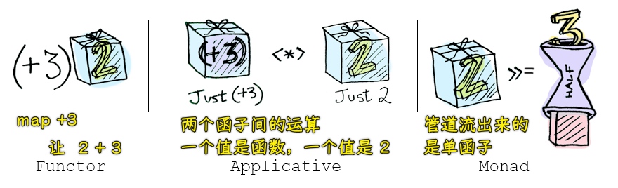

## ★Folktale

函子可以帮我们控制副作用，进行异常处理，还可以处理异步任务

在异步操作中，很容易出现回调地狱，而使用 Task 函子可以避免出现回调嵌套……

因为异步任务的实现过于复杂，我们使用 folktale 这个库中所提供的 Task 函子来进行演示

[folktale](https://folktale.origamitower.com/) 一个标准的函数式编程库，和 lodash、ramda 不同的是，它里边没有提供很多功能性的函数，如 lodash、ramda 中都提供了很多数组和字符串操作相关的方法，但是，folktale 中只提供了一些跟函数式处理相关的操作，例如：`compose`、`curry` 等，还有一些函子 ，如`Task`、`Either`、`MayBe` 等

👇：先演示 folktale 这个库中的`compose`和`curry`使用姿势，之后再演示使用 Task 函子处理异步任务

### <mark>1）compose、curry</mark>

安装`folktale`：

``` js
yarn add folktale
```

使用：

``` js
// folktale 中的 compose、curry
const { compose, curry } = require("folktale/core/lambda");
const { toUpper, first } = require("lodash/fp");

// 第一个参数是确定后边这个函数是要传几个参数，避免错误
let f = curry(2, (x, y) => {
  return x + y
})

console.log(f(1, 2)) // 3
console.log(f(1)(2)) // 3

// 也是右到左
let g = compose(toUpper, first);
console.log(g(["one", "two", "three"])); // 'ONE'
```

👇：演示 folktale 中的 Task 函子如何去处理异步任务

## ★Task 函子

folktale(2.3.2) 2.x 中的 Task 和 1.0 中的 Task 区别很大，1.0 中的用法更接近我们现在演示的函子，如：

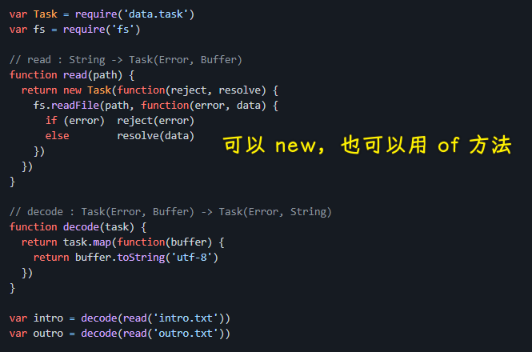

2.x 中，`task`是个函数（一个函数返回一个函子对象），而`1.x`则是个类（需要自己去`new`一个函子对象出来）！

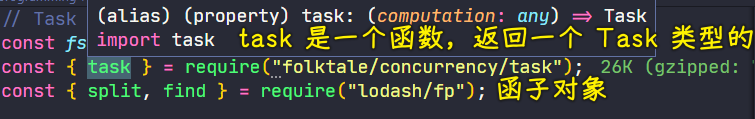

> [Type: Task — Folktale 1.0 documentation](https://folktalegithubio.readthedocs.io/en/latest/api/data/task/Task.html#)、[folktale/data.task](https://github.com/folktale/data.task)

在这里以 2.3.2 来演示：

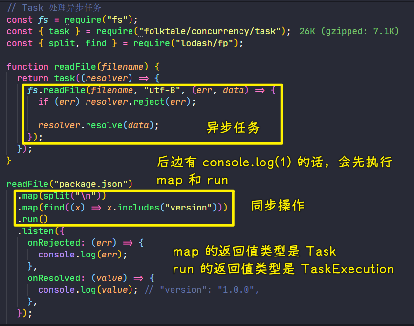

- `task`接收的函数必须固定一个参数`resolver` -> 这一点和 `Promise` 很像！
- `readFile`是`error`优先，数据置后…… -> 和`lodash/fp`联系上了
- 直接`readFile('package.json')`，不`run`，会返回一个`Task`函子 -> 它里边装的是一个匿名函数，被叫做`_computation` -> 可以看到这也是延迟求数据的 -> 当调用`run`时才会执行传给`task`的函数
- `listen`可以监听当前异步任务执行的状态（接收一个对象，有两个属性`onRejected`，`onResolved`） -> 用事件机制提供 -> 都用`on`开头
- 把`map`写在`listen`之前，相当于把两个函数组合起来暂存起来，等到`run`调用会把拿到的文件数据，然后传给组合函数去处理，最后再调用`onResolved` -> 这很像 `IO` 函子 -> 可简单理解成，这两个`map`里边的小函数就是一个小管道，文件数据从第一个`map`的管道开始流入，最后在`onResolved`这个管道输出

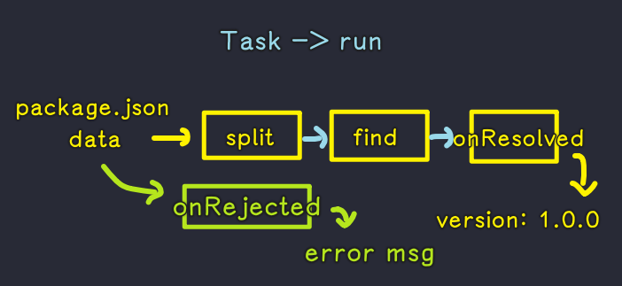

**使用 `Task` 函子的时候，就不要去想它里边的实现机制了**，之前我们自己写函子，以此来了解函子内部的执行机制，而我们在开发的时候，直接使用就好了，不用去想`Task`函子内部是如何实现的！

看看它的执行流程：

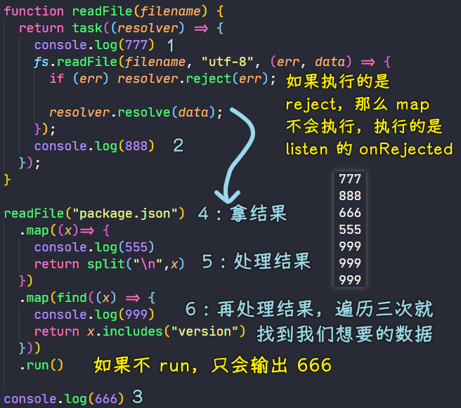

以上就是如何使用`Task`函子来执行异步任务

## ★Pointed 函子

这个函子我们一直在使用，一点都不陌生

Pointed 函子是实现了 `of` 静态方法的函子，我们之前所写的函子都是实现了`of`方法的，所以他们都是 Pointed 函子

我们之前说 `of` 方法是为了避免使用 `new` 来创建对象，即避免我们的代码看起来很面向对象，但是 `of` 方法更深层的含义是 -> 它是用来把值放到一个上下文 `Context` 中（把值放到容器中，使用 map 来处理值），然后我们在上下文中去处理我们的值

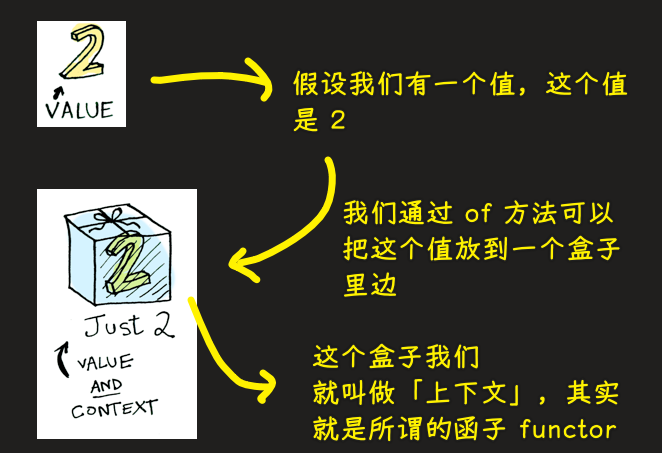

> input & placeholder

Pointer 函子对应的代码：

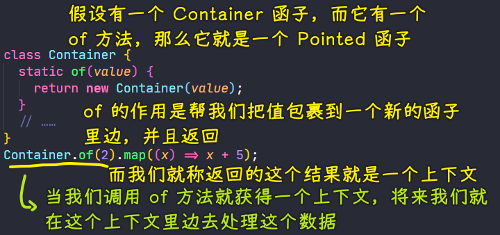

总之，Pointed 函子非常简单，就是一个概念而已 -> 一直在使用，从未刻意去称呼它……也就是说，你知不知道这个概念也没事儿……

## ★IO 函子问题

我们将要学习最后一个函子——Monad（单细胞），我们经常把它翻译成单子

但在学习 Monad 之前，我们先来演示 IO 函子中的一个问题

需求：模拟`cat`命令 -> 读取文件内容，并把这个内容给打印出来

思路：写两个函数 -> 读取函数+打印函数  -> 再把它们俩组合成一个`cat`函数

``` js
// IO 函子的问题
const fs = require('fs')
const fp = require('lodash/fp')

class IO {
  static of (value) {
    return new IO(function () {
      return value
    })
  }

  constructor (fn) {
    this._value = fn
  }

  map (fn) {
    return new IO(fp.flowRight(fn, this._value))
  }
}

// 读取文件时会引起副作用，因此会让这个函数变得不纯
// 所以我们在这儿不直接去读取文件，而是返回一个 IO 函子
let readFile = function (filename) {
  return new IO(function () {
    // 把读取文件这个过程延迟去执行了 -> 在这里同步读，好测试
    return fs.readFileSync(filename, 'utf-8')
  })
}

// 接收要打印的内容
let print = function (x) {
  return new IO(function () {
    // 打印内容，返回内容
    console.log(x)
    return x
  })
}

let cat = fp.flowRight(print, readFile)
// IO(IO(x))
let r = cat('package.json')._value()._value()
console.log(r)
```

执行流程：

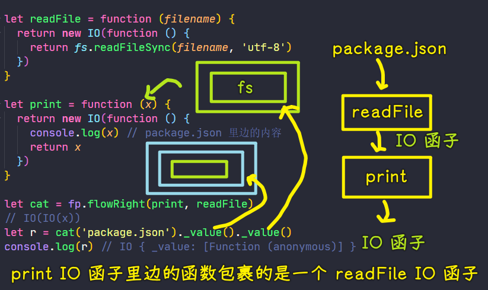

> `IO(IO(x))`像是之前我想的把`data`传给 IO 函子 -> 实际应该是`IO(() => IO(x))`

读文件这个操作是最后一个`_value`做的，第一个`_value`会执行`print IO`函子的函数值，所以这个`x`是`readFile IO`函子，可不是`package.json`的内容 -> `print`的内容是`r`，即`console.log(fs.readFileSync('package.json', 'utf-8'))`

> 写组合函数时是：readFile -> print
> 
> 真正调用 IO 函子的值时是：print IO -> readFile IO

这里边存在的问题：

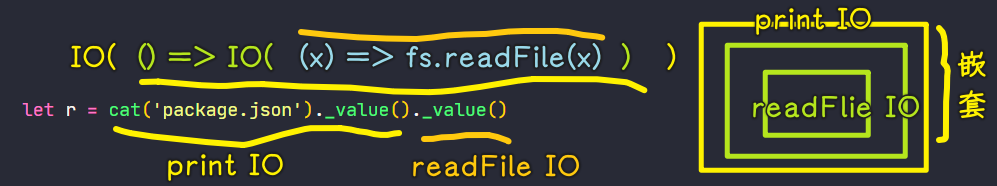

在调用嵌套函子中的函数时是非常不方便的 -> 需要写两次`._value()`

虽然这样写可以拿到数据，但这种 API 风格看起来是很不爽的 -> 所以我们想要把它改造一下，然，如何改造呢？

## ★Monad 函子

> 先了解 Monad 概念，再使用 Monad 来解决上一节的问题！

Monad 函子是可以变扁的 Pointed 函子，Pointed 函子我们之前学过，就是具有静态`of`方法的函子

回过头来，什么是「变扁」呢？

我们上一节演示了，如果函子嵌套了，我们调用起来拿数据是很不方便的

而变扁就是解决函子嵌套的问题

之前我们学过，如果函数嵌套的话，我们可以使用函数组合来解决这个问题，而现在如果函子嵌套的话，我们则可以使用 Monad

如果一个函子同时具有 `join` 和 `of` 两个方法并遵守一些定律的话，那它就是一个 Monad -> `of`我们很熟悉，而`join`其实也不复杂，至于「一些定律」我们可以忽略，因为它们都是一些数学的规律

### <mark>1）join 方法</mark>

`join`方法直接返回函子对`_value`的调用 -> 在 Monad 里边，我们传入一个最终会**返回一个函子的函数**，当我们`this._value()`就会返回一个函子 -> 这样一来就可以解决函子嵌套的问题了！

回顾之前写的 IO 函子：

- 我们定义两个函数`readFile`和`print`
- 把读文件封装成一个函数`readFile` -> 这是一个不纯的操作，因为它要依赖于外部的资源，所以产生了副作用 -> 为了避免副作用，我们直接返回了一个函子，把读文件的操作封装到了函子里边去 -> 以此来保证当前这个`readFIle`操作是纯的，即根据输入可以返回规定的内容——IO 函子（一个对象） -> 总之，`readFile`是纯的，不纯的操作都直接甩锅给 IO 函子，当调用 IO 函子的`_value`方法时才会触发不纯的操作

把 IO 类改造成 Monad 类：

- 有了 `of`方法后，只需要再写一个 `join`方法就好了 -> `join`方法返回的是一个函子 -> 该方法保证了`flatMap`方法总是返回一个单层的函子
- 我们在使用 Monad 的时候，经常会把`map`和`join`联合起来去使用，因为`map`的作用是把其传参`fn`与当前函子的`_value`组合起来并返回一个新的函子，而组合的函数的调用最终也会返回一个函子，所以我们需要调用`join`把它变扁，也就是拍平
- `flatMap`的作用就是同时去调用`map`和`join`
  - `flatMap`方法需要调用`map`方法 -> 需要传一个参数
  - `this.map(fn).join()` -> 把最外层的函子可拍平了，留下组合函数所返回的函子

### <mark>2）代码</mark>

``` js
const fs = require("fs");
const fp = require("lodash/fp");

class IO {
  static of(value) {
    return new IO(function () {
      return value;
    });
  }

  constructor(fn) {
    this._value = fn;
  }

  map(fn) {
    return new IO(fp.flowRight(fn, this._value));
  }

  join() {
    return this._value();
  }

  flatMap(fn) {
    return this.map(fn).join();
  }
}

let readFile = function (filename) {
  return new IO(function () {
    return fs.readFileSync(filename, "utf-8");
  });
};

let print = function (x) {
  return new IO(function () {
    console.log(x);
    return x;
  });
};
```

---

`readFile("package.json").flatMap(print)`的执行过程：

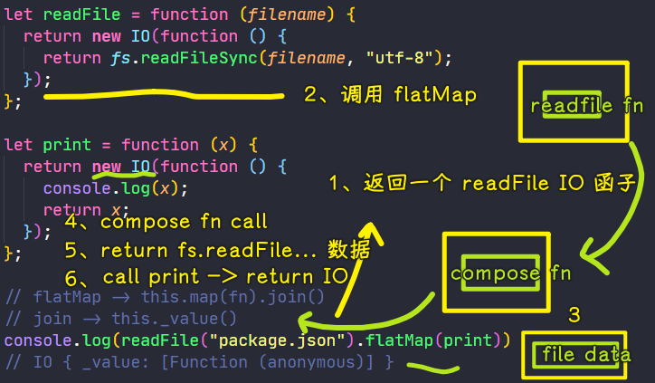

---

处理文件时该怎么做？ -> `readFile`后就直接`.map`就好了！

``` js
let r = readFile("package.json")
  // 原生字符串方法，之后改为 lodash 的 fp 里边的方法
  // .map(x => x.toUpperCase())
  .map(fp.toUpper)
  .flatMap(print)
  .join();

console.log(r);
```

打印两次`package.json`内容

`flatMap(print)`的时候，会得到`package.json`的内容，也就是`data`，`data`被`fp.toUpper`处理返回，再交给`print`返回的 IO 函子，该`data`作为新的 IO 函子的返回值

当我们调用`join`方法，即执行：

``` js
function () {
  console.log(x);
  return x;
}
```

因此打印了两次`package.json`的内容

传给`flatMap`的`print`函数，`print`的返回值就是`flatMap`的返回值 -> 这样保证了此时是单函子的！

分析执行过程的时候，特别麻烦，但在实际的开发过程中，我们并不需要关心它内部的实现 -> **只要关注调用函子的 API 去实现功能即可！**

- `map` -> 处理数据时使用
- `flatMap` -> 返回一个单函子，获取数据时使用 -> 即调用`join`方法

---

总结：

``` js
readFile("package.json").map(fp.toUpper).flatMap(print).join();
```

这种调用方式，要比上一节那种`cat('package.json')._value()._value()`方式要直观很多，而且它具有可读性

回过头来看，什么是 Monad？ -> 就是一个具有静态的`of`方法，并且具有`join`方法和`flatMap`方法的函子

什么时候使用 Monad？ -> 当一个函数返回一个函子的时候，我们就要想到 Monad，Monad 可以帮助我们解决函子嵌套的问题，当我们想要合并一个函数，并且这个函数返回一个值，我们可以调用`map`方法，当我们想要合并一个函数，但这个函数返回一个函子，这个时候我们要用`flatMap`方法

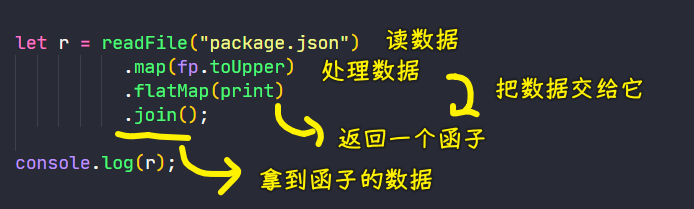

### <mark>3）其它写法</mark>

这是没有`of`方法的：

``` js
const fs = require("fs");
const fp = require("lodash/fp");

const IO = (value) => ({
  value,
  map: (fn) => IO(fp.flowRight(fn, IO(value).value)),
  flatMap: (fn) => IO(value).map(fn).join(),
  join: () => IO(value).value()
});

let readFile = function (filename) {
  return IO(function () {
    return fs.readFileSync(filename, "utf-8");
  });
};

let print = function (x) {
  return IO(function () {
    console.log(x);
    return x;
  });
};

let r = readFile("package.json")
          .map(fp.toUpper)
          .flatMap(print)
          .join();

console.log(r);
```

## ★Ap 函子

- 它是 applicative 函子的简称，又叫做应用函子，是实现了 `ap` 方法的 pointed 函子
- Ap 函子可以让不同的函子可以相互应用，能够把一种函子的函数值应用到另一个函子的值上

### <mark>1）为什么会需要 ap 函子？</mark>

函子里面包含的值，完全有可能是函数。

我们可以想象这样一种情况，一个函子的值是数值，另一个函子的值是函数：

``` js
function addOne(x) {
  return x + 1;
}

const A = Functor.of(1);
const B = Functor.of(addOne)
```

可以看到，函子`A`内部的值是`2`，而函子`B`颞部的值则是函数`addOne`

有时，我们想让函子`B`内部的函数，可以使用函子`A`内部的值进行运算。这时就需要用到 ap 函子（凡是部署了`ap`方法的函子，就是 ap 函子）

### <mark>2）ap 函子</mark>

``` js
const Ap = (number) => ({
  value: number,
  map: (fn) => {
    return Ap(fn(number));
  },
  ap: (F) => F.map(Ap(number).value)
});
```

注意，`ap`方法的参数不是函数，而是另一个函子

当我们进行函子间的运算时，则有：

``` js
const Functor = (number) => ({
  map: (fn) => {
    return Functor(fn(number));
  },
  value: number,
});

function addOne(x) {
  return x + 1;
}

const Ap = (number) => ({
  value: number,
  map: (fn) => {
    return Ap(fn(number));
  },
  ap: (F) => F.map(Ap(number).value)
});

console.log(Ap(addOne).ap(Functor(2))) // AP(3)
```

其实，ap 函子的意义在于，对于那些多参数的函数，我们就可以从多个容器之中取值，实现函子的链式操作

``` js
function add(x) {
  return function (y) {
    return x + y;
  };
}

console.log(Ap(add).ap(Ap(2)).ap(Ap(3))) // Ap(5)
```

上面代码中，函数`add`是柯里化以后的形式，一共需要两个参数。通过 ap 函子，我们就可以实现从两个容器之中取值。它还有另外一种写法

``` js
console.log(Ap(add(2)).ap(Ap(3))) // Ap(5)
console.log(Ap(2).map(add).ap(Ap(5))) // Ap(7)
```

## ★总结

整个函数式编程可以分为 4 部分：

- 认识函数式编程 -> 即 FP 的概念
- 函数相关复习
  - 函数是一等公民
  - 高阶函数
  - 闭包
- 函数式编程基础 
- 函子

### <mark>1）认识 FP</mark>

FP 是一种编程方式或者说是一种编程的思想，它跟 OOP 是同一级别的，我们想要掌握一种编程思想，需要花费很长的时间，可能是半年，或者是更长的时间

目前，我们可以直接把一些已经掌握的东西放到工作中去应用，不需要把程序都使用 FP 的姿势来写，因为这样对于我们来说实在是太困难了！ -> 这跟初学面向对象是一个道理

FP 的核心思想是把运算过程进行抽象成函数，我们在编程的过程中是面向函数进行编程的（可以想一下这个课我们所做的一些案例）

现在我们要学习 FP，是因为像 Vue、React 它们内部都已经使用了部分的 FP 思想，所以学习 FP 也有助于我们去使用 Vue 和 React

### <mark>2）回顾 FP 相关的概念</mark>

- 函数是一等公民 -> 指的是函数也是对象，所以我们可以把函数像值一样去处理，函数也可以作为另一个函数的参数或者是返回值
- 高阶函数 -> 把函数作为参数，或者返回值 -> 我们在使用柯里化和函数组合的时候，其实就是基于高阶函数的
- 闭包 -> 它是无处不在的

### <mark>3）FP 基础</mark>

- lodash -> 一个 FP 库，它里边给我们提供了很多方法，可以辅助我们进行函数式的处理
- 跟 FP 相关的概念
  - 纯函数 -> 给一个函数输入相同的参数，总能得到相同的输出，并且没有任何的副作用 -> 纯函数其实就是数学中的函数，我们可以把一个值映射成另一个值 -> 关于纯函数的好处 -> 可缓存、可测试、方便并行处理
  - 柯里化 -> 可以对函数进行降元处理，也就是可以把多元函数转换成一个一元函数 -> 我们把多元函数转化成一元函数的目的是在函数组合的时候要去使用 -> 在做案例过程的中，就用到柯里化配合函数组合来使用
  - 管道 -> 理解管道之后，对于我们学习函数组合是有帮助的，我们可以把一个函数想象成一个处理数据的管道，我们要给这个管道中输入一个数据，但这个数据经过这个管道之后，我们就会得到一个相应的结果，而我们函数组合其实就是这样来处理的 -> 我们函数组合可以把多个一元的纯函数组合成一个新的函数，组合成一个功能更强大的函数

### <mark>4）函子</mark>

函子可以帮助我们控制副作用、进行异常处理、异步操作等等

函子的概念非常简单 -> 我们可以把函子想象成一个盒子，这个盒子里边包裹着一个值，我们想要对这个值进行处理的话，我们需要调用这个盒子给我们提供的`map`方法，`map`方法接收一个函数类型的参数，我们传递的这个函数就是去处理值的函数

- 我们通过`Functor`（`Container`）演示了函子的基本使用
- 我们创建了`MayBe`函子 -> 其作用 -> 帮我们处理空值的异常，我们想要对异常进行处理的话，我们又创建了一个`Either`函子

这三个函子它内部的`value`都是保存一个值

之后，我们又创建了一个 IO 函子，该函子里边的`value`帮我们存储的是一个函数，使用 IO 函子可以帮我们延迟执行一个函数，使用 IO 函子，我们可以去控制副作用

再往后，我们就演示了 Task 函子，我们在演示 Task 的时候，介绍了一个 FP 库——folktale，这个库没有给我们提供一些功能性的方法，它所提供的方法都是方便我们进行函数式处理的，这个库里边，还给我们提供了一些函子，如 Task

Task 这个函子的作用，就是进行异步处理，帮我们处理异步任务

最后，我们学了 Monad，Monad 这个函子的作用是帮我们解决函子嵌套的问题，如果一个函子有一个`of`静态方法，并且还有一个`join`方法，那么这个函子就是一个 Monad

关于 FP 的介绍就那么多了，当然，这仅仅只是入门罢了，但也够用了！

## ★了解更多

➹：[函数式编程入门教程 - 阮一峰的网络日志](http://www.ruanyifeng.com/blog/2017/02/fp-tutorial.html)

➹：[Taking Things Out of Context: Functors in JavaScript](https://mattfield.github.io/javascript/2013/07/28/taking-things-out-of-context-functors-in-javascript/)

➹：[Why Category Theory Matters · rs.io](https://rs.io/why-category-theory-matters/)

➹：[Functional Programming in JavaScript, Part 3: Introduction to Functors and Monads](https://marmelab.com/blog/2018/09/26/functional-programming-3-functor-redone.html)

➹：[函子（Functor、Pointed、Maybe、Either、Monad、IO、Ap） - 知乎](https://zhuanlan.zhihu.com/p/269513973)
