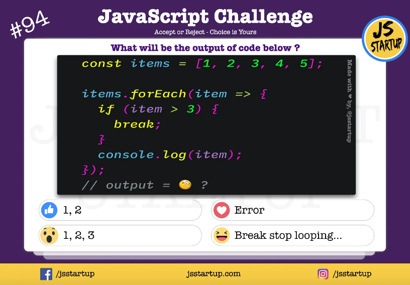
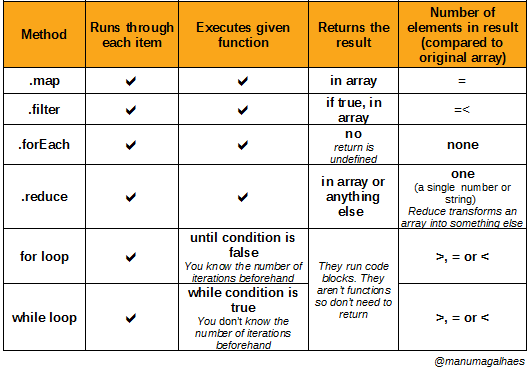
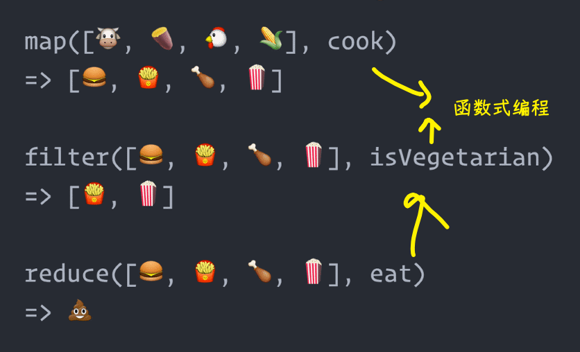
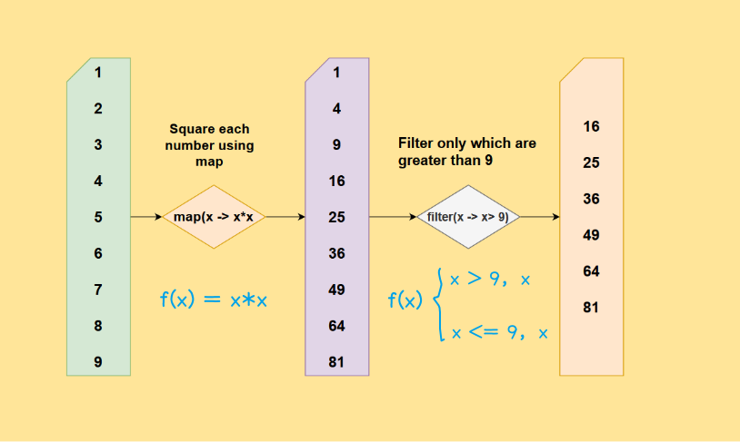
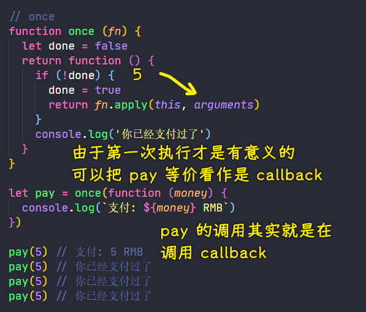
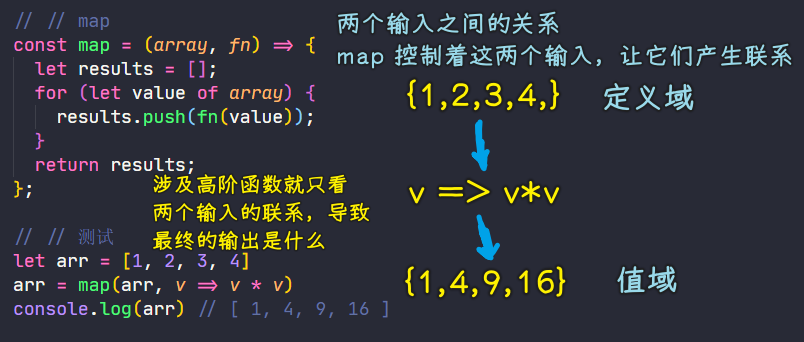
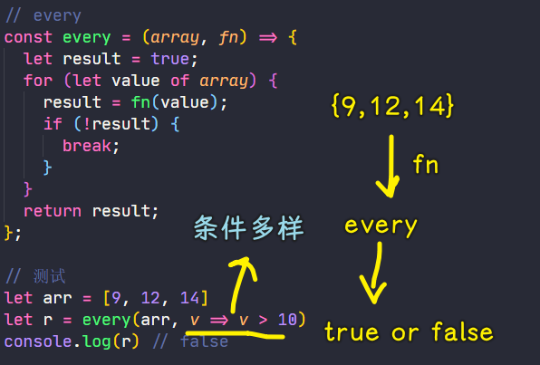
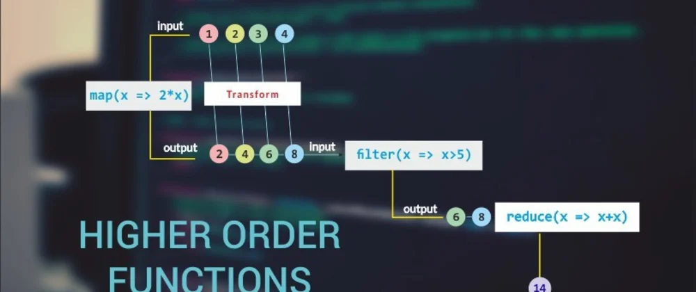
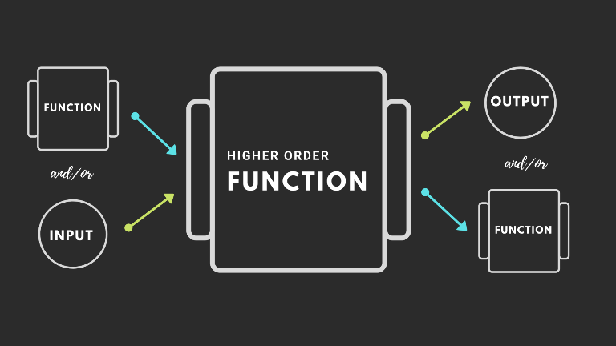
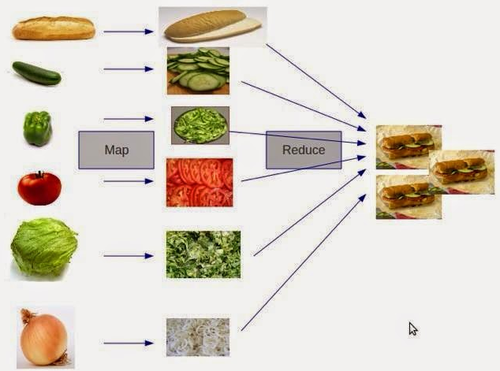

### ✍️ Tangxt ⏳ 2021-06-03 🏷️ functional programming

# 04-2-高阶函数（函数作为参数）、高阶函数（函数作为返回值）、高阶函数的意义、常用的高阶函数

## ★一些简单的认识

- `arr.forEach(()=>{})` -> 面向对象+函数式混合来搞，它们都有各自适合的场景，而且混合起来使用也不是不可以的！
- `forEach` -> 这个方法给我的感觉是，遍历一个数组里边所有的元素，每次我们只拿一个元素交给`callback`去处理，而不是多个元素 -> 其实为了符合数学中函数的定义，我们把`arguments`当作是一个输入，而不是多个输入然后输出一个值

## ★高阶函数（函数作为参数）

回顾 JS 中关于 FP 的第二个概念：高阶函数

讲什么？

1. 介绍一下什么是高阶函数
2. 介绍一下使用它的意义

### <mark>1）介绍一下什么是高阶函数以及它的语法</mark>

高阶函数的英文名叫做「Higher-Order Function」

如果你学过 React，你就会知道 React 中的高阶组件叫做「[Higher-Order Component](https://reactjs.org/docs/higher-order-components.html)」

它们的名字很像，其实 React 提供的高阶组件本质上就是高阶函数

回过头来，高阶函数的定义非常简单：

- 可以把函数作为参数传递给另一个函数 -> 这个函数参数被称为「Callback function」
- 可以把函数作为另一个函数的返回结果 -> 这是函数是一等公民的特性

只要满足其中之一，那么这「另一个函数」就是一个高阶函数

语法示例：

``` js
// Pass a function as an Argument
function sayHello() {
   return "Hello, ";
}
function greeting(helloMessage, name) {
  console.log(helloMessage() + name);
}
// Pass `sayHello` as an argument to `greeting` function
greeting(sayHello, "JavaScript!");

// Return a function
function sayHello1() {
   return function() {
      console.log("Hello!");
   }
}
```

`greeting`和`sayHello1`都是高阶函数

### <mark>2）函数作为参数的示例</mark>

在函数式编程的学习过程中，我们会写很多的函数，我们需要测试这些功能函数的运行结果，但是我们并不需要操作 DOM，所以我们使用 node 的环境来进行测试，总之，我们并不需要创建一个页面来去测试，毕竟用 node 来测试要更方便一些！

数组中其实有很多方法，而它们的参数就是一个函数，比如`forEach`、`filter`、`map`、`sort`等等

接下来通过模拟数组的`forEach`和`filter`来演示函数作为参数

#### <mark>1、forEach</mark>

`forEach`的功能是遍历数组当中的每一个元素，然后对每一个元素来进行相应的处理

模拟这个`forEach`函数：

1. 要接受几个参数
2. 每个参数分别是什么

我们要遍历数组，所以它会有一个数组参数，由于我们遍历这个数组，所以我们需要对数组的每一项做处理，但是每次调用`forEach`的时候，我们处理的方式是不同的，如：

1. 有可能要打印数组中的每一项
2. 也有可能把数组中的每一项赋给页面上指定的元素

所以我们还需要**传一个变化的内容** -> 所以它就是一个函数类型的值

因此，这个`forEach`有两个参数：

- `array`
- `fn`

``` js
function forEach (array, fn) {
  // 遍历数组，用函数处理数组中的每一个元素
  for (let i = 0; i < array.length; i++) {
    fn(array[i])
  }
}

// 测试
let arr = [1, 3, 4, 7, 8]

// 遍历数组 -> 打印数组中的每一个元素
forEach(arr, function (item) {
  console.log(item)
})

// 1
// 3
// 4
// 7
// 8
```

如果我们没有封装这个`forEach`，那么我们要完成这么一个需求就得这样来：

``` js
function fn(item) {
  console.log(item)
}
let array = [1, 3, 4, 7, 8]
for (let i = 0; i < array.length; i++) {
  fn(array[i])
}
```

可以看到，遍历一个数组是很麻烦的，需要使用`for`循环之类的，而现在直接就是调用一个`forEach`然后再进行相应的处理就完事儿了！

用了`forEach`后：

- 不需要使用`for`循环
- 不需要定义循环变量
- 语义也更直观一些，而且代码也更简洁一些

💡：`forEach`可以使用`break`退出循环吗？

> 什么是循环？ -> 循环编程解决了一个非常常见的问题：我需要对所有的这些数据运行相同的代码。 -> 即「一遍又一遍（循环）重复相同的代码，直到达到定义的结束状态。」

`for`循环是可以用`break`的，那`forEach`可以吗？



用了`break`就会报错：`SyntaxError: Illegal break statement`

为啥不能用`break`呢？ -> 因为`break`在`callback`，而`callback`每次执行都会返回一个结果，所以这并不会中断循环，因此，`break`或`continue`对于`forEach`而言，并不是有效语句

---



> The table I wish I had when I learned JavaScript iteration methods.

有很多不同类型的循环，它们都有各种不同的目的，总之，你并不是总是需要`forEach`循环的！ -> `for...in`、`for...of`……

如`forEach`和`map`，`map`会返回一个新的`Array`，而 `forEach`则不会！

> 当你用函数式编程时，`every`或者`some`可以处理你用`break`这种场景 -> `every` 碰到`return false`的时候，循环中止 -> `some` 碰到`return ture`的时候，循环中止

ps：外国似乎都把`map, filter, forEach, reduce + loops`看作是 iteration methods

➹：[Why you can’t break a forEach loop in JavaScript](https://javascript.plainenglish.io/why-you-cant-break-a-foreach-loop-in-javascript-83f270269e1c)

➹：[JavaScript Quiz - can break statement work on array forEach method](https://jsstartup.com/can-break-statement-javascript-array-foreach-method/)

➹：[如何在 Array.forEach 的循环里 break](https://jser.me/2014/04/02/%E5%A6%82%E4%BD%95%E5%9C%A8Array.forEach%E7%9A%84%E5%BE%AA%E7%8E%AF%E9%87%8Cbreak.html)

➹：[Comparing JS iteration methods (map, filter, forEach, reduce + loops) - DEV Community 👩‍💻👨‍💻](https://dev.to/manumagalhaes/comparing-js-iteration-methods-map-filter-foreach-reduce-loops-le)

💡：`for`和`forEach`的性能比较？

我们真得需要考虑它们的性能吗？

> 除非是写引擎一类的性能要求极高的代码，否则用`map`，`filter`，`reduce` 这些可读性高，支持链调用的方法才是更佳选择。

> 首先这种性能测试方法可不可靠太难说了，一般情况下我是首选使用 `forEach/map/find/filter` 的，相比性能，我更在乎代码的语义是否更强， 而 `forEach/map/filter` 很容易让别人知道我是在做遍历、转换、筛选。

➹：[JavaScript Performance: For vs ForEach](https://www.symphonious.net/2010/10/09/javascript-performance-for-vs-foreach/)

➹：[Performance of JavaScript .forEach, .map and .reduce vs for and for..of](https://leanylabs.com/blog/js-forEach-map-reduce-vs-for-for_of/)

➹：[为什么普通 for 循环的性能远远高于 forEach 的性能？](https://juejin.cn/post/6844904159938887687)

💡：`map`、`filter`、`reduce`？





➹：[The JavaScript reduce Method - Nick McCullum](https://nickmccullum.com/javascript/javascript-reduce-method/)

➹：[How to use map, filter, and collect methods of Java Stream API](https://medium.com/javarevisited/how-to-use-streams-map-filter-and-collect-methods-in-java-1e13609a318b)

#### <mark>2、filter</mark>


- `filter`的功能：过滤数组中满足条件的那些元素 -> `filter`内部也有对数组中的每一个元素进行循环遍历，并且把满足条件的那些元素先存储起来，最后再返回
- 如何实现？ -> 同样需要两个参数
  - 第一个参数：要去过滤的数组 -> `array`
  - 第二个参数：要满足什么样的条件 -> `fn`
    - 可能要去找这个数组中所有偶数项的数据
    - 也有可能去找奇数项的数据
    - 还有可能找这个数组中年龄超过 18 的那些人
    - ……
    - 所以我们需要让这个`filter`变得通用？ -> 然如何才能让这个函数变得通用呢？ -> 很简单，在变化的位置传一个函数就可以了，总之，怎么找满足条件的哪些元素？每次调用`filter`的时候是不一样的，因此传入一个函数`fn`就可以自定义条件化来过滤了……在`fn`中，你可以指定满足啥条件都行……

``` js
function filter(array, fn) {
  // 定义一个数组用来存储结果：寻找数组中满足条件的那些元素，然后把它们存储起来
  let results = [];
  // 遍历 array
  for (let i = 0; i < array.length; i++) {
    // 数组的每一项是否满足 fn 指定的条件？
    if (fn(array[i])) {
      results.push(array[i]);
    }
  }
  // 把满足条件的元素都返回出去，就像返回过滤后的东西，颗粒大的就不要了……
  return results;
}

// 测试
let arr = [1, 3, 4, 7, 8]

// 寻找数组中所有偶数的元素
// 要寻找的目标 + 找元素的条件
let r = filter(arr, function (item) {
  return item % 2 === 0
})

console.log(r) // [ 4, 8 ]
```

### <mark>3）总结</mark>

高阶函数中，把函数作为参数的一个好处：

- 可以让我们的`forEach`函数变得更灵活 -> `callback`的不同，可以实现不同的效果
- 调用`forEach`时，不需要考虑它内部是如何实现的，`forEach`这个函数把内部实现的细节帮我们给屏蔽了，而且函数的名字是有实际意义的，如`forEach`由名字可知「它就是要去遍历」，而`filter`就是过滤

## ★高阶函数（函数作为返回值）

> 介绍高阶函数中 -> 函数作为返回值

先通过代码演示函数作为返回值的语法！ -> 之后再说明这样做有什么样的好处

### <mark>1）makeFn</mark>

如果函数作为返回值，其实我们就是**让一个函数去生成一个函数**，通过一个代码来演示一下这个过程

一个函数返回另一个函数的语法是这样的：

``` js
function makeFn () {
  let msg = 'Hello function'
  
  // 返回一个匿名函数 
  return function () {
    console.log(msg)
  }
}

// 两种调用方式

// const fn = makeFn()
// fn()

makeFn()() // Hello function
```

以上就是一个函数作为返回值的一个基本语法的演示

### <mark>2）once</mark>

我们在 jQuery 中看过这个`once`函数，它的作用是给一个 DOM 元素去注册事件，而这个事件只会执行一次

而在 Lodash 中其实也有一个`once`函数 -> 它的作用是对一个函数只执行一次

接下来模拟一下 Lodash 中的`once`函数

我们在做支付的时候，我们一个订单，不管用户点多少次这个按钮，都只会让它执行一次，这个时候我们就可以用到`once`了

回过头来，思考一下一个`once`函数该如何实现？如何让一个函数只执行一次？

``` js
function once (fn) {
  let done = false
  return function () {
    if (!done) {
      done = true
      return fn.apply(this, arguments)
    }
    console.log('你已经支付过了')
  }
}

let pay = once(function (money) {
  console.log(`支付：${money} RMB`)
})

pay(5) // 支付：5 RMB
pay(5) // 你已经支付过了
```

对于这个`once`，我们假设去做支付，当然还有可能去做其它的事情，虽然做的事情不一样，但是我们希望这件事情只被执行一次 -> 所以`once`接收了一个函数参数`fn`

如何控制这个`fn`只执行一次？

1. 定义一个变量`done`作为一个标记，用来记录`fn`是否被执行了 -> 默认是`false`
2. 返回一个函数 -> 在这个函数里边判断`done`是否为`false`，如果是`false`，那就意味着`fn`从来没有被执行过，然后再执行它并标记它为已经执行了

> 关于`apply`的 [第二个参数](https://developer.mozilla.org/en-US/docs/Web/JavaScript/Reference/Global_Objects/Function/apply)，可以是伪数组`arguments`

总之，对`fn`的执行只有一次，第一次执行时，`fn`的返回结果值作为匿名函数返回值，第二次执行，返回的就是`undefined`



执行了很多次`pay`，但`callback`实际上只执行了一次……只有`done`为`true`，那么`callback`就再也不会执行了 -> 其实本质就是用到了闭包！

---

以上就是函数作为返回值的演示了，第一次用这种姿势写代码，可能还不太熟练，甚至有可能不知道在什么地方使用「函数作为返回值」这种姿势 -> 后边学习闭包和函数柯里化的时候会不停地使用函数作为返回值

## ★高阶函数的意义

> 体会一下使用高阶函数的意义

回顾一下函数式编程的核心思想：

> 对运算过程进行抽象

即把运算过程抽象成函数，然后再任何地方都可以去重用这些函数

意义：

- 抽象可以帮我们屏蔽实现的细节，我们以后在调用这些函数的时候，只需要关注我们的目标就可以了
- 而高阶函数就是用来帮我们抽象这些通用的问题

举一个最简单的例子：

如循环打印这个数组中所有的元素

如果使用面向过程的方式：

``` js
// 面向过程的方式
let array = [1, 2, 3, 4];
for (let i = 0; i < array.length; i++) {
  console.log(array[i]);
}
```

需要用到`for`语句，然后定义循环变量，再去判断循环变量是否小于数组的长度，然后还得让循环变量自增`1`，最后再去做具体的事情

可以看到，我们在写循环的时候，我们需要关注循环的所有细节，也就是对循环变量的一种控制

而之前我们封装的`forEach`函数，它的作用其实就是帮我们把循环的过程抽象成一个函数`forEach`，然后我们在使用`forEach`的时候，不需要关注循环的具体实现，也就是不需要关注循环的细节（循环变量以及流程控制）

``` js
// 高阶高阶函数
let array = [1, 2, 3, 4];
forEach(array, (item) => {
  console.log(item);
});
```

总之，我们只需要知道`forEach`内部帮我们完成了循环就 ok 了！

同理，我们之前封装的`filter`也是如此 -> 这个函数的作用是帮我们过滤数组中的元素，该函数其实也非常通用，因为只要是过滤数组就可以使用`filter`，而过滤的条件都是通过你传递一个函数来决定的

总之，我们封装的`forEach`和`filter`都是对通用问题的一个抽象，另外，使用它们俩也不需要关系它们内部所实现的细节，而且也要比我们用「面向过程的方式」所写的代码要简洁很多，所以我们使用 FP 还有一个好处就是「**使代码更简洁**」

总结一下使用高阶函数的意义：

- 让我们的函数变得很灵活，如`forEach`和`filter`
- 抽象可以帮我们屏蔽实现的细节，以后再调用这些函数的时候，我们只要关注我们要实现的目标就可以了！

## ★常用的高阶函数

> 模拟常用的高阶函数：map、every、some

数组的一些常用方法：

* forEach
* map
* filter
* every
* some
* find/findIndex
* reduce
* sort
* ……

这些方法都有一个共同的特点，那就是都需要一个函数作为参数，所以它们都是高阶函数

接下来，模拟`map`、`every`、`some`这三个方法！ -> 为了体会高阶函数的好处

### <mark>1）map</mark>

模拟之前，先明白`map`的作用是什么：

> 遍历 -> 把每次循环的处理结果存储到一个新的数组中，然后返回这个新数组

接着，确定这个函数需要几个参数：

- 由于是对数组的遍历，所以第一个参数是数组
- 遍历过程中需要对每一个元素进行处理，所以第二个参数就是一个函数

``` js
// map
// 用函数表达式，用 const 声明，不希望他人修改这个值
const map = (array, fn) => {
  let results = [];

  // for of 是对 for 循环的抽象，写起来更简洁一些 
  for (let value of array) {
    // 让 callback 去处理数组中的每一个元素
    results.push(fn(value));
  }
  return results;
};

// 测试
let arr = [1, 2, 3, 4]
// 求每个元素的平方
arr = map(arr, v => v * v)
console.log(arr) // [ 1, 4, 9, 16 ]
```



`map`函数是一个高阶函数，它的好处是不光可以对数组中的每一个元素求平方，还可以借助不同的函数变量，来对数组中的每一个元素进行任意的求值 -> 所以函数作为参数，会让`map`函数变得更灵活

### <mark>2）every</mark>

- 作用：判断数组中的每一个元素是否**都**匹配我们所指定的一个条件 -> 条件是灵活，是可变化的，即它是一个函数的形式
- 参数确定：
  - 数组
  - 函数

``` js
// every
const every = (array, fn) => {
  // 1. 假设所有的元素都是匹配指定条件的
  let result = true;
  // 2. 遍历数组，看看数组中的每一个元素是否真得都匹配？ -> 检测是否匹配条件
  for (let value of array) {
    // fn 就相当于是一个条件
    result = fn(value);
    // 如果有一个不满足条件，那就退出循环
    if (!result) {
      break;
    }
  }
  return result;
};

// 测试
let arr = [9, 12, 14]
// 检测数组中的每一个元素是否都大于 10？
let r = every(arr, v => v > 10)
console.log(r) // false
```



`every`函数有一个参数是函数的时候，可以让`every`这个函数变得非常的灵活，因为我们不光可以去检测数组中的元素是否超过 10，也可以去检测数组中的每一个元素是否满足我们任意指定的条件

### <mark>3）some</mark>

- 作用：检查数组中的元素是否**有一个**满足指定条件 -> 与`every`非常相似
- 参数确定：
  - 数组
  - 函数

``` js
// some
const some = (array, fn) => {
  // 1. 假设所有元素都不满足指定条件
  let result = false;
  // 2. 一旦有一个元素满足指定条件，那就退出循环，把结果返回
  for (let value of array) {
    result = fn(value);
    if (result) {
      break;
    }
  }
  return result;
};

// 测试
let arr = [1, 3, 5, 9];
// 检测数组中是否有偶数
let r = some(arr, (v) => v % 2 === 0);
console.log(r); // false
```

---

我们模拟了三个数组方法，它们都可以接收一个函数，因此它们都是高阶函数

通过把一个函数传递给另一个函数，我们可以让这个函数（如`some`）变得更灵活

## ★补充

### <mark>1）一些好图</mark>



> 把高阶函数的参数 1 当作是真正的输入，把参数 2 当作是高阶函数的中间处理器



可视化 `map` 和 `reduce`：



➹：[Higher Order Functions from scratch - Functional JS - DEV Community 👩‍💻👨‍💻](https://dev.to/bhupendra1011/higher-order-functions-from-scratch-functional-js-3ii0)

➹：[Higher Order Functions in Javascript - Geek Culture](https://medium.com/geekculture/higherorderfunctionsjs-b6e9cb22aa42)

➹：[What is Map-Reduce? - Data Science Central](https://www.datasciencecentral.com/forum/topics/what-is-map-reduce)

## ★总结

- 高阶函数：
  - 普通函数怎样才算高阶函数？ -> 输入是函数或输出是函数
  - 意义：让我们处理数组变得更灵活
  - 常用高阶函数：`forEach、filter、map、some、every`……