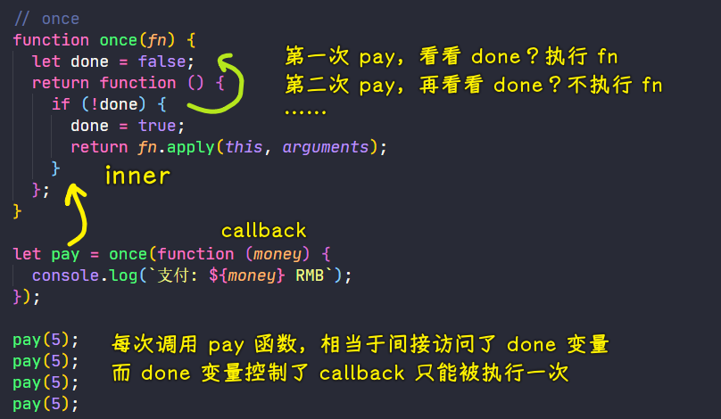

### ✍️ Tangxt ⏳ 2021-06-10 🏷️ functional programming

# 04-3-闭包概念、闭包案例

## ★概述

闭包是 JavaScript 中的一个重要概念。这是一个被广泛讨论的概念 -> 让人感到困惑的概念

Douglas Crockford 给这个概念的定义：

> Closure means that an inner function always has access to the vars and parameters of its outer function, even after the outer function has returned.

闭包意味着，即使在外部函数返回之后，内部函数仍然可以访问其外部函数的变量和参数（外部函数的`arguments`对象不能访问） -> 嵌套函数

``` js
function OuterFunction() {
  var outerVariable = 100;

  function InnerFunction() {
    alert(outerVariable);
  }

  return InnerFunction;
}
var innerFunc = OuterFunction();

innerFunc(); // 100
```

闭包的形式化理解：


> a closure is kind of a box with some contents in it

你有一只猫，你把它和一堆球一起放在一个盒子里边，然后把这个盒子封起来。所以，现在盒子的作用就像一个封闭物（closure）——把猫和球封闭起来。猫仍然可以接触到这些球，当然，它可以随时接触到这些球。

而在 JS 里边，闭包可不是猫和球，而是包含一个函数以及函数声明时作用域中的所有变量 -> `cat`代替了函数，而`balls`代替了作用域中的所有的变量


➹：[JavaScript Closures - Web Code Geeks - 2021](https://www.webcodegeeks.com/javascript/javascript-closures/)

➹：[Closure in JavaScript](https://www.tutorialsteacher.com/javascript/closure-in-javascript)

## ★闭包概念

回顾上一节：

- 把函数作为参数，可以让高阶函数变得更加灵活 -> 这其实就是抽象通用的问题，如
  - `forEach`函数就对循环的抽象
  - `filter`函数可以过滤数组，其实就是对查找数组元素的抽象

在正式开始学习 FP 之前，还要学习一个 JS 中的概念——闭包

闭包这个概念并不复杂，但是它的定义比较绕

如何认识它？

- 先通过一段熟悉的代码来体会闭包的概念
- 然后通过案例再来体会闭包的使用

1）两个案例

我们之前用到了这两个案例：

``` js
// 函数作为返回值
function makeFn() {
  let msg = "Hello function";
  return function () {
    console.log(msg);
  };
}
const fn = makeFn();
fn();
```

``` js
// once
function once(fn) {
  let done = false;
  return function () {
    if (!done) {
      done = true;
      return fn.apply(this, arguments);
    }
  };
}

let pay = once(function (money) {
  console.log(`支付：${money} RMB`);
});

pay(5);
pay(5); //
pay(5);
pay(5); //
```

在这两个案例中，其实就使用到了闭包 -> 我们在写代码的过程中不经意间就会使用到闭包

观察这两段代码：

💡：`makeFn`

``` js
// 函数作为返回值
function makeFn() {
  let msg = "Hello function";
  return function () {
    console.log(msg);
  };
}
const fn = makeFn();
fn();
```

- 如果把`return`去掉，当你调用完`makeFn`，函数里边的`msg`的成员就会比释放掉
- 如果`makeFn`返回了一个函数，并且在这个返回的函数内部又访问了外部函数（`makeFN`）的成员，那其实这就是闭包了！

这与刚刚不一样的地方是，`fn`引用了`makeFn`函数中所返回的这个函数 -> 即外部对函数内部的成员有引用


当外部对`makeFn`函数内部的成员有引用的时候，此时`makeFn`内部的这些成员就不能被释放

当我们调用`fn`，即调用`makeFn`的内部函数，而内部函数被调用的时候，会访问到`msg`，也就是`makeFn`中的变量

这就是跟默认情况不一样的地方 -> 默认情况，函数调用，函数内部成员都得被释放掉

所以闭包的概念其实就是：

> 在`makeFn`和`fn`这个相同作用域下，去调用一个函数的内部的函数（假设称为`inner`），如调用`makeFn`中的内部函数`inner`，`inner`这个内部函数被调用了，`inner`就可以访问到`makeFn`这个函数的作用域中的成员，而这就是闭包了！ -> 换言之，如果不能访问，那这就不是闭包了！

总之，体现闭包的概念，有几个点：


闭包的核心作用其实就是**把`makeFn`中内部成员（如`msg`）的作用范围给它延长了**，正常情况下，`makeFn`执行完成之后，这个`msg`是会被释放掉的，但是如果`makeFn`中返回了一个成员（`inner`），并且外部（`outer`）对这个成员`inner`有引用，那此时的`makeFn`中的这些内部成员在执行完毕之后就不会被释放，因为`inner`内部对它们有引用啊！ -> 外部的函数内部的私有成员有间接引用


---

以上这段代码其实就是演示语法，接下来就来看一下一些有意义的事情！

💡：`once`

``` js
// once
function once(fn) {
  let done = false;
  return function () {
    if (!done) {
      done = true;
      return fn.apply(this, arguments);
    }
  };
}

let pay = once(function (money) {
  console.log(`支付：${money} RMB`);
});

pay(5);
pay(5); //
pay(5);
pay(5); //
```

`once`这个函数的作用 -> 确保传入的`fn`只被执行一次

那如何控制`fn`只被执行一次呢？ -> 需要一个标记来记录这个`fn`是否被执行了，如果这个`fn`被执行之后，以后再调用这个`fn`的时候，由于我们标记它已经被执行了，所以再调用`pay`的时候，`fn`永远不会再次被执行



闭包的核心作用：延迟了`once`函数内部的`done`的作用范围 -> 它还会在`inner`函数内部起作用，它不会因为`once`函数执行完，就会被释放掉，它还有它的价值……而让它体现价值的，是闭包这个东西赐给它的！

2）闭包的本质

闭包的本质：

函数在执行的时候会放到一个执行栈上，当函数执行完毕之后会从执行栈上移除，正常情况下，如果`once`函数它没有去`return`一个函数的话，那么`once`函数执行完后，`once`会从执行栈上被移除，而`once`内部的这些变量也会从内存中移除：


然而，如果外部对`once`内部有引用的话，那情况就不一样了，如：

``` js
function once(fn) {
  let done = false;
  return function () {
    if (!done) {
      done = true;
      return fn.apply(this, arguments);
    }
  };
}
```

当`once`执行完毕后，首先`once`会从执行栈中移除，但是因为外部对这个`once`函数内部的成员有引用，所以`once`内部的成员不会从内存中移除，也就是我们**堆上的作用域成员（`inner`函数）因为被外部`pay`引用所以`done`不能释放**，因此内部函数（`inner`）依然可以访问外部函数（`once`）中的成员

这就是我们闭包的本质了！

关于闭包的概念就介绍到这儿了，对于这个概念，你需要知道的是：

- 从另一个作用域中（`pay`变量所在的作用域）去访问一个函数（如`once`）内部的函数（如`inner`），并且在这个内部函数（`inner`）中可以访问到外部函数（`once`）中的成员`done`
- 闭包的好处是：我们延长了外部函数（`once`）它内部变量的作用范围 -> `done`除了在`once`这个作用域内部起作用以外，还会在`inner`函数内部起作用！

## ★闭包案例
