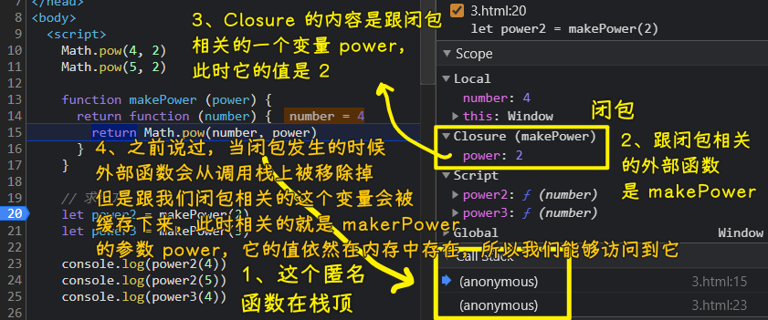

### ✍️ Tangxt ⏳ 2021-06-10 🏷️ functional programming

# 04-3-闭包概念、闭包案例

## ★概述

闭包是 JavaScript 中的一个重要概念。这是一个被广泛讨论的概念 -> 让人感到困惑的概念

Douglas Crockford 给这个概念的定义：

> Closure means that an inner function always has access to the vars and parameters of its outer function, even after the outer function has returned.

闭包意味着，即使在外部函数返回之后，内部函数仍然可以访问其外部函数的变量和参数（外部函数的`arguments`对象不能访问） -> 嵌套函数

``` js
function OuterFunction() {
  var outerVariable = 100;

  function InnerFunction() {
    alert(outerVariable);
  }

  return InnerFunction;
}
var innerFunc = OuterFunction();

innerFunc(); // 100
```

闭包的形式化理解：


> a closure is kind of a box with some contents in it

你有一只猫，你把它和一堆球一起放在一个盒子里边，然后把这个盒子封起来。所以，现在盒子的作用就像一个封闭物（closure）——把猫和球封闭起来。猫仍然可以接触到这些球，当然，它可以随时接触到这些球。

而在 JS 里边，闭包可不是猫和球，而是包含一个函数以及函数声明时作用域中的所有变量 -> `cat`代替了函数，而`balls`代替了作用域中的所有的变量


➹：[JavaScript Closures - Web Code Geeks - 2021](https://www.webcodegeeks.com/javascript/javascript-closures/)

➹：[Closure in JavaScript](https://www.tutorialsteacher.com/javascript/closure-in-javascript)

## ★闭包概念

回顾上一节：

- 把函数作为参数，可以让高阶函数变得更加灵活 -> 这其实就是抽象通用的问题，如
  - `forEach`函数就对循环的抽象
  - `filter`函数可以过滤数组，其实就是对查找数组元素的抽象

在正式开始学习 FP 之前，还要学习一个 JS 中的概念——闭包

闭包这个概念并不复杂，但是它的定义比较绕

如何认识它？

- 先通过一段熟悉的代码来体会闭包的概念
- 然后通过案例再来体会闭包的使用

### <mark>1）两个案例</mark>

我们之前用到了这两个案例：

``` js
// 函数作为返回值
function makeFn() {
  let msg = "Hello function";
  return function () {
    console.log(msg);
  };
}
const fn = makeFn();
fn();
```

``` js
// once
function once(fn) {
  let done = false;
  return function () {
    if (!done) {
      done = true;
      return fn.apply(this, arguments);
    }
  };
}

let pay = once(function (money) {
  console.log(`支付：${money} RMB`);
});

pay(5);
pay(5); //
pay(5);
pay(5); //
```

在这两个案例中，其实就使用到了闭包 -> 我们在写代码的过程中不经意间就会使用到闭包

观察这两段代码：

💡：`makeFn`

``` js
// 函数作为返回值
function makeFn() {
  let msg = "Hello function";
  return function () {
    console.log(msg);
  };
}
const fn = makeFn();
fn();
```

- 如果把`return`去掉，当你调用完`makeFn`，函数里边的`msg`的成员就会比释放掉
- 如果`makeFn`返回了一个函数，并且在这个返回的函数内部又访问了外部函数（`makeFN`）的成员，那其实这就是闭包了！

这与刚刚不一样的地方是，`fn`引用了`makeFn`函数中所返回的这个函数 -> 即外部对函数内部的成员有引用


当外部对`makeFn`函数内部的成员有引用的时候，此时`makeFn`内部的这些成员就不能被释放

当我们调用`fn`，即调用`makeFn`的内部函数，而内部函数被调用的时候，会访问到`msg`，也就是`makeFn`中的变量

这就是跟默认情况不一样的地方 -> 默认情况，函数调用，函数内部成员都得被释放掉

所以闭包的概念其实就是：

> 在`makeFn`和`fn`这个相同作用域下，去调用一个函数的内部的函数（假设称为`inner`），如调用`makeFn`中的内部函数`inner`，`inner`这个内部函数被调用了，`inner`就可以访问到`makeFn`这个函数的作用域中的成员，而这就是闭包了！ -> 换言之，如果不能访问，那这就不是闭包了！

总之，体现闭包的概念，有几个点：


闭包的核心作用其实就是**把`makeFn`中内部成员（如`msg`）的作用范围给它延长了**，正常情况下，`makeFn`执行完成之后，这个`msg`是会被释放掉的，但是如果`makeFn`中返回了一个成员（`inner`），并且外部（`outer`）对这个成员`inner`有引用，那此时的`makeFn`中的这些内部成员在执行完毕之后就不会被释放，因为`inner`内部对它们有引用啊！ -> 外部的函数内部的私有成员有间接引用


---

以上这段代码其实就是演示语法，接下来就来看一下一些有意义的事情！

💡：`once`

``` js
// once
function once(fn) {
  let done = false;
  return function () {
    if (!done) {
      done = true;
      return fn.apply(this, arguments);
    }
  };
}

let pay = once(function (money) {
  console.log(`支付：${money} RMB`);
});

pay(5);
pay(5); //
pay(5);
pay(5); //
```

`once`这个函数的作用 -> 确保传入的`fn`只被执行一次

那如何控制`fn`只被执行一次呢？ -> 需要一个标记来记录这个`fn`是否被执行了，如果这个`fn`被执行之后，以后再调用这个`fn`的时候，由于我们标记它已经被执行了，所以再调用`pay`的时候，`fn`永远不会再次被执行


闭包的核心作用：延迟了`once`函数内部的`done`的作用范围 -> 它还会在`inner`函数内部起作用，它不会因为`once`函数执行完，就会被释放掉，它还有它的价值……而让它体现价值的，是闭包这个东西赐给它的！

### <mark>2）闭包的本质</mark>

闭包的本质：

函数在执行的时候会放到一个执行栈上，当函数执行完毕之后会从执行栈上移除，正常情况下，如果`once`函数它没有去`return`一个函数的话，那么`once`函数执行完后，`once`会从执行栈上被移除，而`once`内部的这些变量也会从内存中移除：


然而，如果外部对`once`内部有引用的话，那情况就不一样了，如：

``` js
function once(fn) {
  let done = false;
  return function () {
    if (!done) {
      done = true;
      return fn.apply(this, arguments);
    }
  };
}
let pay = once(function (money) {
  console.log(`支付：${money} RMB`);
});
```

当`once`执行完毕后，首先`once`会从执行栈中移除，但是因为外部对这个`once`函数内部的成员有引用，所以`once`内部的成员不会从内存中移除，也就是我们**堆上的作用域成员（`inner`函数）因为被外部`pay`引用所以`done`不能释放**，因此内部函数（`inner`）依然可以访问外部函数（`once`）中的成员

返回一个对象也是可以的：


这就是我们闭包的本质了！

关于闭包的概念就介绍到这儿了，对于这个概念，你需要知道的是：

- 从另一个作用域中（`pay`变量所在的作用域）去访问一个函数（如`once`）内部的函数（如`inner`），并且在这个内部函数（`inner`）中可以访问到外部函数（`once`）中的成员`done`
- 闭包的好处是：我们延长了外部函数（`once`）它内部变量的作用范围 -> `done`除了在`once`这个作用域内部起作用以外，还会在`inner`函数内部起作用！

## ★闭包案例

> 通过两个案例来体会闭包 + 通过调试来查看闭包发生的位置

为了方便查看闭包发生的位置 -> 在网页中书写代码，即创建一个`html`文件

### <mark>1）makePower</mark>

假设在一个项目中，经常会求数字的幂，即求数字的多少次方 -> 如经常去求数字的二次方、三次方等等

我们一般的做法是，直接调用`Math.pow`方法，如：

``` js
Math.pow(4, 2) // 16
Math.pow(5, 3) // 125
console.log(Math.pow(6, 4)) // 1296
```

可以看到我们始终要指定第二个参数来求几次方 -> 如果我们经常性的求几次方，那么第二个参数显然是在不停地重复

那么我们就需要把这个过程给简化了！ -> 我们要在求二次方、三次方的时候不需要同时去传递这个`2`和`3`参数！

我们要做的 -> 写一个函数让它生成一个求平方、三次方的函数

做法：

1. 声明一个`makePower`函数
   1. 确定参数 -> 我们的目的是「要生成一个求几次方的函数」，所以第一个参数是`power`，表示你要生成一个多少次方的函数
   2. 返回值 -> 返回一个函数 -> 我们真正去计算的函数
      1. 确定参数 -> 要接收一个数字，该数字被用来求几次方
      2. 返回值 -> 计算的结果

思考一下这个`makePower`函数中会不会发生闭包？


``` js
// Power 就是多少次幂的意思
function makePower(power) {
  return function (number) {
    return Math.pow(number, power);
  };
}

// 求平方
let power2 = makePower(2);
let power3 = makePower(3);

// 测试
// 可以看到在调用的时候，不用同时去指定 2 和 3 了
console.log(power2(4)); // 16
console.log(power2(5)); // 15
console.log(power3(4)); // 64
```

打开浏览器调试上边这个代码：


如何调试？

1. 选定一个点
2. 刷新页面
3. 按`F11`进入一个函数

在调试时，我们要关注两个地方：

- CallStack -> 函数的调用栈 -> 我们此时调用的是`script`标签里边的代码，而这个里边的代码其实都在一个匿名函数中被调用的
- Scope -> 是我们的作用域 -> 当前我们的作用域只有一个`Global`，即全局作用域，而我们的全局作用域其实就是我们的`window`对象

选定断点位置`20`后，第一次按`F11`进入`makePower`函数的情况：


结束第一个`makePower`的执行：


两个`makePower`执行完后，执行`power2(4)`，第一次进入匿名函数：



可以看到，当我们在外部这样`power2(4)`调用`makerPower`的内部函数的时候会发生闭包，这一点通过调试可以清楚的看到闭包发生的位置


`power2(4)`执行完后，就`log`一个结果到控制台上了！

同理，`power3(4)` -> `Closure`缓存的`power`值是`3`

---

通过调试，我们可以看到：

- 函数的调用栈
- 作用域中的成员
- 闭包发生的位置
- 作用域链

### <mark>2）makeSalary</mark>

假设要求员工的工资，我们知道员工的工资由两部分组成，分别是：

- 基本工资
- 绩效工资

员工有很多级别，不同级别的员工，它的基本工资是不一样的，而绩效工资也是不一样的

假设我们已经有了求工资的`getSalary`函数 -> 它接收两个参数：基本工资和绩效工资

级别一的员工（基本工资是`12000`），假设 ta 这个月的绩效工资是`2000`：

``` js
getSalary(12000, 2000)
```

级别二的员工（基本工资是`15000`），假设 ta 这个月的绩效工资是`3000`：

``` js
getSalary(15000, 3000)
```

级别二的员工（基本工资是`15000`），假设 ta 这个月的绩效工资是`4000`：

``` js
getSalary(15000, 4000)
```

上边只罗列了 3 名员工，假设还有很多名级别一的员工以及级别二的员工需要被计算工资 -> 显然每次调用求工资的这个`getSalary`函数，都得传入一个与级别相对应的基本工资，而这个基本工资对同一级别的员工来说，它总是相同的，所以为了调用这个`getSalary`函数的时候，第一个表示基本工资的参数有可能在不停地重复

所以我们需要想一个办法 -> 为不同级别的员工分别去生成一个函数，以此来避免相同的基本工资不停地重复

这个案例跟我们上边的案例基本是一样的

代码：

``` js
// 为不同级别的员工生成一个求工资的函数 -> 返回的是专属于为某个级别求总工资的函数
// 第一个参数，确定级别所对应的基本工资
function makeSalary(base) {
  // 绩效工资 -> 每个人每个月都会有所不同
  return function (performance) {
    return base + performance;
  };
}

// 生成一个计算级别 1 总工资的函数
let salaryLevel1 = makeSalary(12000);
let salaryLevel2 = makeSalary(15000);

// 测试 -> 知道这名员工这个月的绩效工资，调用相应的计算工资函数，就能得知这名员工这个月的工资是多少
console.log(salaryLevel1(2000)); // 14000
console.log(salaryLevel2(3000)); // 18000
console.log(salaryLevel2(4000)); // 19000
```

可以看到，计算工资的调用方式变得更方便了一些 -> 避免了相同基本工资不停地重复

同样在浏览器里边调试这个代码，调试方式与之前一样，只需要观察两个点：

- Call Stack
- Scope -> 观察闭包是什么时候发生的 -> 调用`(salaryLevel1(2000)`就会发生

---

以上就是关于两个闭包案例的演示了！

## ★补充

关于异步 API 的测试：

💡：`setTimeout`？


💡：`setInterval`？


💡：`alert`？


💡：查看闭包的另一种方式？

``` js
let obj = function () {
  let i = 0;

  return {
    setI(k) {
      i = k;
    },

    getI() {
      return i;
    },
  };
};

let x = obj();

console.log(x);
```

Chrome 在`log`的时候提供了`scope variable` -> 为了更好地调试体验


## ★了解更多

➹：[Really Understanding Javascript Closures – CodepediaOrg](https://www.codepedia.org/jhadesdev/really-understanding-javascript-closures/)

➹：[Understanding JavaScript Closures and Scope - TechSlides](http://techslides.com/understanding-javascript-closures-and-scope)

➹：[Closure in JavaScript](https://www.tutorialsteacher.com/javascript/closure-in-javascript)

➹：[Finding Closure in Chrome developer tools - Casper Wang](https://casperwang.com/blog/find-the-closure-in-chrome-developer-tools/)

➹：[看完离编写高性能的 JavaScript 又近了一步 · Ruby China](https://ruby-china.org/topics/34668)

➹：[JavaScript 闭包的底层运行机制 - 回田园](https://blog.leapoahead.com/2015/09/15/js-closure/)

## ★总结

Javascript closures are a powerful feature that is mostly transparent in the day to day use of the language.

> JavaScript 闭包是一个强大的特性，在语言的日常使用中几乎是透明的。（感知不到它的存在，但是确实可观存在的）

They can be a convenient way to reduce the number of parameters passed to a function.

> 它们是减少传递给函数的参数数量的便捷方式

But mostly the fact that the closed variables are inaccessible to outside of the function makes closures a good way to achieve ‘private’ variables and encapsulation in Javascript.

> 但是最主要的是被封闭变量在函数之外是不可访问的，这使得闭包成为 JavaScript 中实现私有变量和封装的好方法。

Mostly the feature ‘just works’ and Javascript functions transparently remember any variables needed for future execution in a convenient way.

> 大多数情况下，这个特性只是在工作，JavaScript 函数能够透明地记住将来执行所需任何的变量。

But beware of the pitfall: closures keep references and not copies (even of primitive values), so make sure that that is really the intended logic.

> 但是要注意陷阱：闭包只保留引用而不保留副本（即使是原始值） ，因此要确保这确实是所预期的逻辑。

## ★Q&A

### <mark>1）如何解释「xxx 是透明的」？</mark>

> 这个操作对用户是透明的 -> 这个操作在发生过程中，用户是看不到和感觉不到的，大概就晕个意思

> 比如说内存的分段和分页之类，都是由操作系统完成的，在 Windows 下工作的普通程序员可以不用管这些，只当作系统有 4G 内存就可以，这就可以说系统的内存管理对程序员是透明的。

> 就像玻璃是透明的，就是说它实际上存在，只不过我们看不到而已。
> 
> 这就是透明的。
> 
> 有的时候你可以当它不存在，比如说你透过窗户观赏风景的时候；
> 
> 有的时候却不行，比如说你想要跳楼的时候。
> 
> “这个过程对于指令来说是透明的。”就是对于单纯的使用指令时可以当它不存在，可是要深入了解 CPU 的工作机制时，却不行。

> 不需要看见，毋需了解

> 透明就是感知不到它的存在，但是确实可观存在的。
> 
> 玻璃是透明的，能看到玻璃后面的事物，此时玻璃像不存在一样；
> 
> 空气是透明的，能看到空气中的事物，那么空气像不存在一样。
> 
> node.js 的模块和包的区别是透明的，使用者不能感知他们的区别，使用是不需要特别区分两者。
> 
> 黑盒不是透明的，使用时你能感知它的存在的。
> 
> 插线板不是透明的，你看不到内部的结构，所以他是一个黑盒子。盒子封装了内部结构，使用时必须带这个盒子，否则插不进去，此时使用者能感知盒子是存在的。
> 
> 透明是感知不到又或者没有；黑盒是明显感知有。
> 
> 政府制定政策需要更加透明，这里的意思理解成政策制定时要让公民透过制定政策的人，看到政策制定过程，实际是让官员更加透明，公民就能直接看到政策制定过程了。

> 透明是强调没有存在感，不需要你管，但有可能是完全开放的
> 
> 黑盒是强调你可以知道或不知道它的存在，但即使你知道，也不允许你探明其内部机制

> 在计算机中，如果从某个角度看不到某特性，则称该特性是透明的。例如，计算机组织对程序员是透明的，是指计算机组织对程序员来说是看不到的，也不需要看到的。这个意义上的“透明”与社会生活中的透明含义恰好相反，生活中使用的“透明”，绝大部分意思是说某个事物公开，可以窥探到里面的秘密。

> 字面理解透明的意思，透明有两种解释：
> 
> 一种是：能看见一个容器里面的详细、具体的内容。
> 
> 二种：整个容器都是透明的，什么也看不见呢
> 
> 两种完全对立的理解，但在程序员的世界里，透明对应的是第二种理解。就是你完全不知道某模块内部实现，也不需要知道，因为无论它的内部是如何实现的，它提供的对外接口是一致的，调用接口的人无需关心其内部实现原理

➹：[求助-请问"透明的"是什么意思？-编程技术-看雪论坛-安全社区](https://bbs.pediy.com/thread-24683.htm)

➹：[在计算机术语中为什么“透明”和“黑盒”这两个词字面意思完全不一样，但是表达的意思却差不多？ - 知乎](https://www.zhihu.com/question/46747673/answer/285679390)

➹：[计算机网络中的"透明"是什么意思？ - 知乎](https://www.zhihu.com/question/24400468)

➹：[“对程序员是透明的”中的“透明”是什么意思？_百度知道](https://zhidao.baidu.com/question/73908486.html)

### <mark>2）Tell me and I forget. Teach me and I remember. Involve me and I learn. © Benjamin Franklin</mark>

> 让我参与进来，我就学会了

有人说这句是中国古谚 (Chinese proverb)：

- 《荀子•儒效篇》里“不闻不若闻之，闻之不若见之；见之不若知之，知之不若行之；学至于行而止矣。”
- “耳闻不如目见，目见不如足践。”

➹：[请问一句西方谚语的出处？ “Tell me and I forget; Show me and I remember. Involve me and I understand” - 知乎](https://www.zhihu.com/question/19962457)

### <mark>3）实践出真知？</mark>

> 理论和实践结合才是真理的双壁，且理论的地位要排在实践之前。也就是说，实践出不了真知只能出部分真理。当然这是对 99%的人说的，不排除万里挑一的天才

➹：[实践出真知的谎言毁了多少人 - 简书](https://www.jianshu.com/p/7173b4835852)

➹：[如何理解“实践决定认识；实践出真知；实践是检验真理的唯一标准”？ - 知乎](https://www.zhihu.com/question/65271471)
