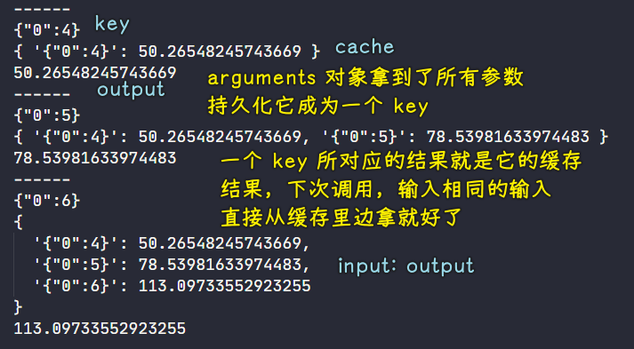

### ✍️ Tangxt ⏳ 2021-06-13 🏷️ functional programming

# 04-4-纯函数概念、Lodash、纯函数的好处、副作用

## ★概述

- 纯函数是这样一种函数，即相同的输入，永远会得到相同的输出，而且没有任何可观察的副作用。
  - `slice` -> 纯的 -> 返回新数组
  - `splice` -> 不纯的 -> 嚼烂调用它的那个数组，然后再吐出来
- 副作用是在计算结果的过程中，系统状态的一种变化，或者与外部世界进行的可观察的交互。
  - “作用”本身并没什么坏处。“副作用”的关键部分在于“副”。就像一潭死水中的“水”本身并不是幼虫的培养器，“死”才是生成虫群的原因。同理，副作用中的“副”是滋生 bug 的温床。
  - 只要是跟函数外部环境发生的交互就都是副作用
  - 这并不是说，要禁止使用一切副作用，而是说，要让它们在可控的范围内发生 -> `functor` 和 `monad`可以让我们学习如何控制副作用，总之请尽量远离这些**阴险的函数**
- 函数是不同数值之间的特殊关系：每一个输入值返回且只返回一个输出值。
  - 纯函数就是数学上的函数，而且是函数式编程的全部
- 纯函数对于其依赖必须要诚实，这样我们就能知道它的目的
  - 通过强迫“注入”依赖，或者把它们当作参数传递，我们的应用也更加灵活
  - `function(Db, Email, attrs){}`
- 面向对象语言的问题是，它们永远都要随身携带那些隐式的环境。你只需要一个香蕉，但却得到一个拿着香蕉的大猩猩…以及整个丛林
- 引用透明性（referential transparency）
  - 如果一段代码可以替换成它执行所得的结果，而且是在不改变整个程序行为的前提下替换的，那么我们就说这段代码是引用透明的。
  - **函数的返回值只依赖于其输入值，这种特性就称为引用透明性（referential transparency）**
- 等式推导（equational reasoning）
  - 用这种技术来分析代码
  - 所谓“等式推导”就是“一对一”替换，有点像在不考虑程序性执行的怪异行为（quirks of programmatic evaluation）的情况下，手动执行相关代码
  - 就是把`(56－2n)(120+6n)`推导成`12(28－n)(20+n)`这种形式 -> 说白了就是简化代码
- 我们可以并行运行任意纯函数。因为纯函数根本不需要访问共享的内存，而且根据其定义，纯函数也不会因副作用而进入竞争态（race condition）
- curry 是一种工具，没有这个工具，那么纯函数程序写起来就有点费力 -> 不得不玩杂耍似的通过到处传递参数来操作数据，而且还被禁止使用状态，更别说“作用”了。
- 函数式编程的无状态
  - 进去的一样……出来的必定一样
  - 进去过的东西不因进去过而改变 -> 数组进去了，没有变化的出来了

## ★纯函数概念

> Pure functions

目前，我们已经了解了与 FP 相关的概念：

- 函数是一等公民
- 高阶函数
- 闭包

我们可以认为它们都是 FP 的基础！

接下来会介绍：

- 纯函数的概念
- Lodash 这个 FP 库的使用
- 使用纯函数的好处
- 副作用

### <mark>1）纯函数</mark>

FP 中第一个重要的概念，它也是整个 FP 中的核心，即「纯函数」

这个概念非常简单 -> FP 中的函数指的就是「纯函数」

纯函数这个概念指的就是：我们使用**相同的输入始终会得到相同的输出**，而且没有任何可观察的副作用

> 什么是副作用？ -> 之后会解释！

💡：关注「对相同的输入始终会得到相同的输出」这句话

纯函数其实就是数学中的函数的概念，它是用来描述输入和输出的映射关系，如这图：


左边是一个集合，这个集合里边的数据，就是我们对一个函数的输入，而右边这个集合，则是这个函数的输出

而`f`这个函数就是用来描述从输入获取输出的这个过程，或者说它用来描述输入和输出之间的关系

我们的 [lodash](https://github.com/lodash/lodash) 其实就是一个纯函数的功能库，它里边提供了对数组、数字、对象、字符串、函数等操作的一些方法 -> 之后会演示这个库里边的一些函数的使用

### <mark>2）纯函数和不纯的函数</mark>

通过数组中的两个方法 `slice` 和 `splice`来演示纯函数和不纯的函数

回顾这两个方法：

- `slice` 返回数组中的指定部分，不会改变原数组 -> 截取数组中的指定部分，相当于对部分元素进行照相，如拍你的手，你的脚，你的全身照……
- `splice` 对数组进行操作返回该数组，会改变原数组 -> 会修改原数组，对数组的操作包含删除和修改

演示它们俩的区别：

``` js
// 纯函数和不纯的函数
// slice / splice

// 定义一个数组并初始化
let array = [1, 2, 3, 4, 5]

// 纯函数
// 包前不包后
console.log(array.slice(0, 3))
console.log(array.slice(0, 3)) 
console.log(array.slice(0, 3))

// [ 1, 2, 3 ]
// [ 1, 2, 3 ] 
// [ 1, 2, 3 ]

// 不纯的函数
// 第二个参数是截取多少个元素，返回值是截取出来的元素，从第三个参数开始都是插入/替换的元素
console.log(array.splice(0, 3))
console.log(array.splice(0, 3)) 
console.log(array.splice(0, 3))

// 即便截取个数超过数组长度，依旧会截取，有多少截多少
// [ 1, 2, 3 ]
// [ 4, 5 ]
// []
```

可以看到`slice`是一个纯函数，因为我们相同的输入始终是相同的，而`splice`则不是这样了，所以它就不是一个纯函数！

---

自己写一个纯函数——求和

``` js
// 纯函数
function getSum (n1, n2) {
  return n1 + n2
}
console.log(getSum(1, 2))
console.log(getSum(1, 2)) 
console.log(getSum(1, 2))

// 3
// 3 
// 3
```

作为一个纯函数，你必须得有输入和输出，你不写形参的话，那这个函数就不是纯函数了！

---

以上案例非常简单，都是一些非常简单的函数，之后会写一些复杂一点的案例！

### <mark>3）小结</mark>

通过一些代码了解到了什么是纯函数 -> 我们要重点理解的是「**相同的输入永远会得到相同的输出**」

- 在函数式编程过程中，我们不会保留计算的中间结果，如`getSum`这个函数，我们在调用这个函数的时候，我们会给它传递两个参数，以此来获取调用它后所执行的结果，而这个函数内部的变量的结果我们是无法获取到的，即它不会保留中间的计算结果（**局部变量除非被闭包了，否则就被释放掉**），所以我们可以认为在 FP 中，它的变量是不可变的，也就是无状态的，说白了**输入不会影响函数内部，进而影响到下一次输入**
- 在基于函数式编程的过程中，我们经常会需要一些**细粒度的**纯函数，如果要我们自己去写这些细粒度的纯函数的话，那就得写非常非常多的纯函数了，所以这是很不方便的 -> 我们不用担心这些细粒度的纯函数怎么来，因为网上有好多这样的函数式编程的库，如 Lodash -> 当我们有了这些细粒度的函数之后，我们后边再去学习函数组合的时候，那我们就可以**把这些细粒度的函数组合成一些功能更强大的函数**，当我们在调用这些函数的过程中，我们就可以把一个函数的执行结果传递给另一个函数继续进行处理。

关于 FP 的概念，就介绍完了！

👇：演示 Lodash 中提供的一些纯函数以及使用纯函数的好处！

## ★Lodash

> 纯函数的代表

官网：[Lodash](https://lodash.com/)

> Lodash：A modern JavaScript utility library delivering modularity, performance & extras.

之前很多人把 Lodash 作为一个功能库来使用，但当 ES5/6 给原生 JS 增加了很多的方法以后，就有很多人讨论「**是否还有使用 Lodash 的必要？**」

其实，Lodash 除了提供一些常用的便捷方法以外，还提供了跟 FP 相关的一些方法，比如函数的柯里化、函数组合等


👇：快速演示几个在 Lodash 中常用的使用方法

💡：安装 Lodash？

1. 初始化`package.json` -> `yarn init -y`
2. `yarn add lodash`

定义一个常量，把 Lodash 引入进来：

``` js
const _ = require('lodash')
```

官网给它的名字约定是下划线`_`

我们要演示的方法大多都是数组的方法：

``` js
first / last / toUpper / reverse / each / includes / find / findIndex
```

通过这些方法的名字，很容易就能猜测到这些方法的作用是什么！

### <mark>1）first / last</mark>

``` js
const array = ['jack', 'tom', 'lucy', 'kate']

console.log(_.first(array))
// head 的 alias 是 first
console.log(_.head(array))
console.log(_.last(array))
console.log(array)

// jack
// jack 
// kate
// [ 'jack', 'tom', 'lucy', 'kate' ]
```

可以看到 Lodash 提供的这些方法都有参数（第一个参数：数组或集合）和返回值

### <mark>2）toUpper / reverse / each</mark>

``` js
console.log(_.toUpper(_.first(array)))

console.log(_.reverse(array))
console.log(array)

const r = _.each(array, (item, index) => {
  console.log(item, index)
})

console.log(r)

// JACK
// [ 'kate', 'lucy', 'tom', 'jack' ]
// [ 'kate', 'lucy', 'tom', 'jack' ] 
// kate 0
// lucy 1
// tom 2
// jack 3
// [ 'kate', 'lucy', 'tom', 'jack' ]
```

数组原生的`reverse`方法，是不传参数的，所以它不是一个纯函数，当然，Lodash 提供的`reverse`方法虽然传了参数，但它并不是一个纯函数，因为其内部就是调用了原生的`reverse`方法，而这是会改变原数组的，即把数组里边的元素给倒序了，总之，Lodash 就是一个功能库，里边提供了一些方便操作数组、字符串等方法，当然，Lodash 中还有`fp`模块，这个模块里边提供的函数才是纯函数

Lodash 也有`forEach`方法，而`each`是它的别名 -> `each`它是有返回值的

### <mark>3）includes / find / findIndex / findLastIndex</mark>

`includes / find / findIndex` -> 这 3 个方法，是 ES6 以后新增的，而 ES6 以前是没有的，如果要使用，要么自己实现，要么用 Lodash 这个库来实现

``` js
const array1 = [
  "jack",
  "tom",
  "lucy",
  "kate",
  { age: 18, name: "one" },
  { age: 19, name: "two" },
];

console.log(_.includes(array1, "jack"));
console.log(_.includes(array1, "tom", 2));
console.log(_.includes(array1, "tom", 1));

// true
// false
// true

// 找元素是对象的

console.log(_.find(array1, "age"));
console.log(_.find(array1, (o) => o.age < 20));
console.log(_.find(array1, { age: 19 }));
console.log(_.find(array1, ["age", 19]));

// { age: 18, name: 'one' }
// { age: 18, name: 'one' } 
// { age: 19, name: 'two' }
// { age: 19, name: 'two' } 

console.log(_.findIndex(array1, "tom"));
console.log(_.findIndex(array1, ["age", 18]));
console.log(_.findIndex(array1, ["age", 19]));

// -1
// 4
// 5

// 从右到左遍历
console.log(_.findLastIndex(array1, "tom"));
console.log(_.findLastIndex(array1, ["age", 18]));
console.log(_.findLastIndex(array1, ["age", 19]));

// -1
// 4
// 5
```

其它方法，具体看文档使用……

### <mark>4）小结</mark>

- Lodash 这个库用起来比较简单，就是提供了一些我们方便操作数据的方法
- 除了这些方法以外，还提供了一些跟 FP 相关的内容 -> 后边学函数柯里化和函数组合的时候会用到！

👇：了解完纯函数的概念后 -> 了解纯函数的好处

## ★纯函数的好处

它的第一个好处是「**可缓存**」

因为纯函数对相同的输入始终会有相同的输出，所以我们可以把纯函数的结果进行缓存

话说，为啥要对结果进行缓存？

如果有一个函数，执行起来特别耗时，我们需要多次调用它，每次调用它都得要等一段时间才能获取到这个结果，所以这对性能来说是有影响的

所以我们想要提高这个性能的话，我们可以在这个函数第一次执行完毕的时候，就把这个结果给缓存起来 -> 当我们第二次再调用这个函数的时候，我们就不需要等待那么长的时间，直接通过缓存获取结果，从而提高性能！

### <mark>1）memoize</mark>

需求：求圆的面积

Lodash 提供了一个带记忆功能的函数 -> `memoize`

``` js
// 记忆函数
const _ = require('lodash')

// 定义一个纯函数
function getArea (r) {
  // 这个 log 是为了演示确实有缓存效果
  console.log(r)
  return Math.PI * r * r
}

// memoize 内部会对纯函数进行处理，会把纯函数的结果进行缓存
// 返回一个带有记忆功能的函数
let getAreaWithMemory = _.memoize(getArea)

// 调用时的传参跟 getArea 是一样的
console.log(getAreaWithMemory(4))

// 第二次调用，可以看到是从缓存里边拿结果的，而不是重新执行 getArea -> 没有 log 半径
console.log(getAreaWithMemory(4)) 
console.log(getAreaWithMemory(4))

// 4
// 50.26548245743669

// 50.26548245743669 
// 50.26548245743669
```

### <mark>2）模拟 memoize 内部的实现</mark>

实现思路？

- 确定参数和返回值：根据`memoize`的调用来推测
  - `memoize`的调用形式：
    - 参数是纯函数
    - 返回一个函数

``` js
function memoize(f) {
  return function() {}
}
```

在`memoize`函数里边，定义一个`cache`对象，把`f`的执行结果给缓存起来，下次再调用就先从`cache`里边获取值！ -> 根据纯函数的定义（**相同的输入永远会得到相同的输出**），我们可以把函数的参数作为对象的键，把函数的执行结果作为对象的值！

``` js
function memoize(f) {
  let cache = {}
  return function() {}
}
```

`f`执行时，其接收到的参数来自于返回的匿名函数 -> 我们把参数当作`ket` -> 我们判断`cache`中是否存在对应的`key`，如果存在，那就直接读缓存里边的`value`，如果不存在那就执行`f` -> 最终的返回值都是从`cache`中读的！

完整代码：

``` js
function memoize(f) {
  let cache = {};
  return function () {
    let arg_str = JSON.stringify(arguments);
    console.log(arg_str);
    cache[arg_str] = cache[arg_str] || f.apply(f, arguments);
    console.log(cache);
    return cache[arg_str];
  };
}

function getArea(r) {
  return Math.PI * r * r;
}
let getAreaWithMemory = memoize(getArea);
console.log('------')
console.log(getAreaWithMemory(4));
console.log('------')
console.log(getAreaWithMemory(5));
console.log('------')
console.log(getAreaWithMemory(6));
```



以上就是纯函数的第一个好处 -> 可缓存！

将来写程序，就可以通过这种方式来提高我们程序的性能！

### <mark>3）可测试</mark>

纯函数的第二个好处是「可测试」 -> 因为纯函数始终有输入和输出，而单元测试就是在断言这个函数的结果，所以所有的纯函数都是可测试的函数

> 纯函数让测试更方便

### <mark>4）并行处理</mark>

纯函数还方便并行处理

那啥是并行处理呢？

- 在多线程环境下并行操作共享的内存数据的时候，如操作全局变量，很可能会发生意外情况 -> 多个线程同时去修改同时去修改同一个变量，那此时这个变量的结果是什么呢？ -> 这是不确定的！ -> 所以多线程环境下在操作共享内存的时候，很可能会出现一些意外的情况
- 而纯函数它是一个封闭的空间，因为纯函数只依赖于参数，纯函数不需要访问共享的内存数据，所以在并行环境下我们可以任意运行纯函数 -> 也许有人会说「这跟 JS 没有太大关系啊！因为 JS 是单线程的啊！」然而，ES6 以后，新增了一个「Web Worker」，Web Worker 可以开启新的线程，也就是在 ES6 后，我们可以开启多线程来提高程序的性能，但是在多数情况下，我们使用 JS 都是用单线程去处理的！

总之，纯函数可以方便并行处理这一点 -> 只需要了解即可！

---

我们还可以把纯函数组合成功能更强大的函数

关于纯函数的内容就介绍完了……

## ★函数的副作用

了解函数的副作用之前，先来回顾一下纯函数：

> 对于相同的输入永远会得到相同的输出，而且没有任何可观察的**副作用**

通过一段代码，看一下后边这句话是什么意思

``` js
// 不纯的
let mini = 18;
function checkAge(age) {
  // 判断用户的年龄是否大于标准值 -> 有些网站需要年龄大于 18 岁才能访问
  return age >= mini;
}
checkAge(20) // true
```

`checkAge(20)` 是否会永远返回`true`？ -> 答案是否定的，因为`checkAge`依赖外界变量`mini`，当外界变量`mini`的值改为`22`, 那么同样的调用`checkAge(20)`就会返回`false`了！ -> 所以这是一个不纯的函数！

把不纯的函数改造成纯函数：

``` js
// 纯的（有硬编码，后续可以通过柯里化解决）
function checkAge(age) {
  let mini = 18;
  return age >= mini;
}
```

> 改造思路非常简单 -> 把全局变量`mini`放到`checkAge`函数内部，变成一个局部变量，那么此时的`checkAge`就是一个纯的函数了！ -> 除了这种办法以外，还有其它办法！

这个`checkAge`还是存在问题 -> `let mini = 18;`是硬编码，因为`mini`的值是一个具体数字，我们知道在写程序的过程中，应该尽量避免硬编码 -> 函数的柯里化可以解决这个硬编码问题！

根据上边的演示代码，我们可以总结一下「什么是副作用」

> 副作用让一个函数变的不纯（如上面的代码），纯函数是根据相同的输入始终返回相同的输出，如果函数依赖于外部的状态就无法保证输出相同，就会带来副作用。

说白了，全局变量`mini`给`checkAge`带来了副作用，让`checkAge`这个函数变得不纯

💡：副作用都有哪些来源？

当函数依赖于外部状态的时候，都会产生副作用，都会让函数变得不纯，如我们之前所演示的 -> 依赖了全局变量`mini`的`checkAge`变得不纯了！ -> 这个全局变量就是我们副作用的来源

除了全局变量以外，副作用的来源还有：

- 配置文件 -> 我们有可能会从配置文件中获取一些信息
- 数据库
- 获取用户的输入
- 打印/log
- DOM 查询
- ……

这些都会带来副作用

总结一下就是：

> 所有的外部交互都有可能带来副作用，另外，副作用也会使得方法的通用性下降，不利于我们将来对程序的扩展和可重用性，同时，副作用也会给程序中带来安全隐患，如获取用户输入的时候，有可能会带来跨站脚本攻击，总之它给程序带来了不确定性。虽然副作用有这么多的缺点，但是副作用又是不可能完全禁止的，如我们总不能把用户名、密码这些信息禁锢到代码里边吧？这些用户名密码信息还是要放到数据库里边去的！所以副作用是不可能完全禁止的，但是我们应该尽可能控制副作用在可控范围内发生。

以上就是关于副作用的一些介绍……

---

- 副作用会让我们的函数变得不纯
- 我们要知道副作用的来源 -> 所有跟外部的交互都会产生副作用 -> 副作用虽然会带来一些负面的影响，但是我们又不可能完全禁止，我们应该尽可能地把它们控制在可控的范围内

## ★总结

- 纯函数
  - 相同输入必有相同输出
  - 没有副作用
- Lodash
  - 有对数据操作的功能模块
  - 也有 FP 模块
  - 看官网学会使用 API
- 纯函数的好处
  - 可缓存 -> 可记忆的函数
  - 可测试 -> 断言某个输入一定会得到某个输出，如果不是，那就证明这个函数有问题了
  - 无伤并行处理 -> 了解即可，一般很少会用到「Web Worker」去搞多线程……

