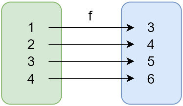

### ✍️ Tangxt ⏳ 2021-06-13 🏷️ functional programming

# 04-4-纯函数概念、Lodash、纯函数的好处、副作用

## ★概述

- 纯函数是这样一种函数，即相同的输入，永远会得到相同的输出，而且没有任何可观察的副作用。
  - `slice` -> 纯的 -> 返回新数组
  - `splice` -> 不纯的 -> 嚼烂调用它的那个数组，然后再吐出来
- 副作用是在计算结果的过程中，系统状态的一种变化，或者与外部世界进行的可观察的交互。
  - “作用”本身并没什么坏处。“副作用”的关键部分在于“副”。就像一潭死水中的“水”本身并不是幼虫的培养器，“死”才是生成虫群的原因。同理，副作用中的“副”是滋生 bug 的温床。
  - 只要是跟函数外部环境发生的交互就都是副作用
  - 这并不是说，要禁止使用一切副作用，而是说，要让它们在可控的范围内发生 -> `functor` 和 `monad`可以让我们学习如何控制副作用，总之请尽量远离这些**阴险的函数**
- 函数是不同数值之间的特殊关系：每一个输入值返回且只返回一个输出值。
  - 纯函数就是数学上的函数，而且是函数式编程的全部
- 纯函数对于其依赖必须要诚实，这样我们就能知道它的目的
  - 通过强迫“注入”依赖，或者把它们当作参数传递，我们的应用也更加灵活
  - `function(Db, Email, attrs){}`
- 面向对象语言的问题是，它们永远都要随身携带那些隐式的环境。你只需要一个香蕉，但却得到一个拿着香蕉的大猩猩…以及整个丛林
- 引用透明性（referential transparency）
  - 如果一段代码可以替换成它执行所得的结果，而且是在不改变整个程序行为的前提下替换的，那么我们就说这段代码是引用透明的。
  - **函数的返回值只依赖于其输入值，这种特性就称为引用透明性（referential transparency）**
- 等式推导（equational reasoning）
  - 用这种技术来分析代码
  - 所谓“等式推导”就是“一对一”替换，有点像在不考虑程序性执行的怪异行为（quirks of programmatic evaluation）的情况下，手动执行相关代码
  - 就是把`(56－2n)(120+6n)`推导成`12(28－n)(20+n)`这种形式 -> 说白了就是简化代码
- 我们可以并行运行任意纯函数。因为纯函数根本不需要访问共享的内存，而且根据其定义，纯函数也不会因副作用而进入竞争态（race condition）
- curry 是一种工具，没有这个工具，那么纯函数程序写起来就有点费力 -> 不得不玩杂耍似的通过到处传递参数来操作数据，而且还被禁止使用状态，更别说“作用”了。
- 函数式编程的无状态
  - 进去的一样……出来的必定一样
  - 进去过的东西不因进去过而改变 -> 数组进去了，没有变化的出来了

## ★纯函数概念

> Pure functions

目前，我们已经了解了与 FP 相关的概念：

- 函数是一等公民
- 高阶函数
- 闭包

我们可以认为它们都是 FP 的基础！

接下来会介绍：

- 纯函数的概念
- Lodash 这个 FP 库的使用
- 使用纯函数的好处
- 副作用

1）纯函数

FP 中第一个重要的概念，它也是整个 FP 中的核心，即「纯函数」

这个概念非常简单 -> FP 中的函数指的就是「纯函数」

纯函数这个概念指的就是：我们使用**相同的输入始终会得到相同的输出**，而且没有任何可观察的副作用

> 什么是副作用？ -> 之后会解释！

💡：关注「对相同的输入始终会得到相同的输出」这句话

纯函数其实就是数学中的函数的概念，它是用来描述输入和输出的映射关系，如这图：



左边是一个集合，这个集合里边的数据，就是我们对一个函数的输入，而右边这个集合，则是这个函数的输出

而`f`这个函数就是用来描述从输入获取输出的这个过程，或者说它用来描述输入和输出之间的关系

我们的 [lodash](https://github.com/lodash/lodash) 其实就是一个纯函数的功能库，它里边提供了对数组、数字、对象、字符串、函数等操作的一些方法 -> 之后会演示这个库里边的一些函数的使用

2）纯函数和不纯的函数

通过数组中的两个方法 `slice` 和 `splice`来演示纯函数和不纯的函数

回顾这两个方法：

- `slice` 返回数组中的指定部分，不会改变原数组 -> 截取数组中的指定部分，相当于对部分元素进行照相，如拍你的手，你的脚，你的全身照……
- `splice` 对数组进行操作返回该数组，会改变原数组 -> 会修改原数组，对数组的操作包含删除和修改

演示它们俩的区别：

``` js
// 纯函数和不纯的函数
// slice / splice

// 定义一个数组并初始化
let array = [1, 2, 3, 4, 5]

// 纯函数
// 包前不包后
console.log(array.slice(0, 3))
console.log(array.slice(0, 3)) 
console.log(array.slice(0, 3))

// [ 1, 2, 3 ]
// [ 1, 2, 3 ] 
// [ 1, 2, 3 ]

// 不纯的函数
// 第二个参数是截取多少个元素，返回值是截取出来的元素，从第三个参数开始都是插入/替换的元素
console.log(array.splice(0, 3))
console.log(array.splice(0, 3)) 
console.log(array.splice(0, 3))

// 即便截取个数超过数组长度，依旧会截取，有多少截多少
// [ 1, 2, 3 ]
// [ 4, 5 ]
// []
```

可以看到`slice`是一个纯函数，因为我们相同的输入始终是相同的，而`splice`则不是这样了，所以它就不是一个纯函数！

---

自己写一个纯函数——求和

``` js
// 纯函数
function getSum (n1, n2) {
  return n1 + n2
}
console.log(getSum(1, 2))
console.log(getSum(1, 2)) 
console.log(getSum(1, 2))

// 3
// 3 
// 3
```

作为一个纯函数，你必须得有输入和输出，你不写形参的话，那这个函数就不是纯函数了！

---

以上案例非常简单，都是一些非常简单的函数，之后会写一些复杂一点的案例！

3）小结

通过一些代码了解到了什么是纯函数 -> 我们要重点理解的是「**相同的输入永远会得到相同的输出**」

- 在函数式编程过程中，我们不会保留计算的中间结果，如`getSum`这个函数，我们在调用这个函数的时候，我们会给它传递两个参数，以此来获取调用它后所执行的结果，而这个函数内部的变量的结果我们是无法获取到的，即它不会保留中间的计算结果（**局部变量除非被闭包了，否则就被释放掉**），所以我们可以认为在 FP 中，它的变量是不可变的，也就是无状态的，说白了**输入不会影响函数内部，进而影响到下一次输入**
- 在基于函数式编程的过程中，我们经常会需要一些**细粒度的**纯函数，如果要我们自己去写这些细粒度的纯函数的话，那就得写非常非常多的纯函数了，所以这是很不方便的 -> 我们不用担心这些细粒度的纯函数怎么来，因为网上有好多这样的函数式编程的库，如 Lodash -> 当我们有了这些细粒度的函数之后，我们后边再去学习函数组合的时候，那我们就可以**把这些细粒度的函数组合成一些功能更强大的函数**，当我们在调用这些函数的过程中，我们就可以把一个函数的执行结果传递给另一个函数继续进行处理。

关于 FP 的概念，就介绍完了！

👇：演示 Lodash 中提供的一些纯函数以及使用纯函数的好处！

## ★Lodash

> 纯函数的代表

官网：[Lodash](https://lodash.com/)

> Lodash：A modern JavaScript utility library delivering modularity, performance & extras.

之前很多人把 Lodash 作为一个功能库来使用，但当 ES5/6 给原生 JS 增加了很多的方法以后，就有很多人讨论「**是否还有使用 Lodash 的必要？**」

其实，Lodash 除了提供一些常用的便捷方法以外，还提供了跟 FP 相关的一些方法，比如函数的柯里化、函数组合等


👇：快速演示几个在 Lodash 中常用的使用方法

💡：安装 Lodash？

1. 初始化`package.json` -> `yarn init -y`
2. `yarn add lodash`

定义一个常量，把 Lodash 引入进来：

``` js
const _ = require('lodash')
```

官网给它的名字约定是下划线`_`

我们要演示的方法大多都是数组的方法：

``` js
first / last / toUpper / reverse / each / includes / find / findIndex
```

通过这些方法的名字，很容易就能猜测到这些方法的作用是什么！

1）first / last

``` js
const array = ['jack', 'tom', 'lucy', 'kate']

console.log(_.first(array))
// head 的 alias 是 first
console.log(_.head(array))
console.log(_.last(array))
console.log(array)

// jack
// jack 
// kate
// [ 'jack', 'tom', 'lucy', 'kate' ]
```

可以看到 Lodash 提供的这些方法都有参数（第一个参数：数组或集合）和返回值

2）toUpper / reverse / each

``` js
console.log(_.toUpper(_.first(array)))

console.log(_.reverse(array))
console.log(array)

const r = _.each(array, (item, index) => {
  console.log(item, index)
})

console.log(r)

// JACK
// [ 'kate', 'lucy', 'tom', 'jack' ]
// [ 'kate', 'lucy', 'tom', 'jack' ] 
// kate 0
// lucy 1
// tom 2
// jack 3
// [ 'kate', 'lucy', 'tom', 'jack' ]
```

数组原生的`reverse`方法，是不传参数的，所以它不是一个纯函数，当然，Lodash 提供的`reverse`方法虽然传了参数，但它并不是一个纯函数，因为其内部就是调用了原生的`reverse`方法，而这是会改变原数组的，即把数组里边的元素给倒序了，总之，Lodash 就是一个功能库，里边提供了一些方便操作数组、字符串等方法，当然，Lodash 中还有`fp`模块，这个模块里边提供的函数才是纯函数

Lodash 也有`forEach`方法，而`each`是它的别名 -> `each`它是有返回值的

3）includes / find / findIndex / findLastIndex

`includes / find / findIndex` -> 这 3 个方法，是 ES6 以后新增的，而 ES6 以前是没有的，如果要使用，要么自己实现，要么用 Lodash 这个库来实现

``` js
const array1 = [
  "jack",
  "tom",
  "lucy",
  "kate",
  { age: 18, name: "one" },
  { age: 19, name: "two" },
];

console.log(_.includes(array1, "jack"));
console.log(_.includes(array1, "tom", 2));
console.log(_.includes(array1, "tom", 1));

// true
// false
// true

// 找元素是对象的

console.log(_.find(array1, "age"));
console.log(_.find(array1, (o) => o.age < 20));
console.log(_.find(array1, { age: 19 }));
console.log(_.find(array1, ["age", 19]));

// { age: 18, name: 'one' }
// { age: 18, name: 'one' } 
// { age: 19, name: 'two' }
// { age: 19, name: 'two' } 

console.log(_.findIndex(array1, "tom"));
console.log(_.findIndex(array1, ["age", 18]));
console.log(_.findIndex(array1, ["age", 19]));

// -1
// 4
// 5

// 从右到左遍历
console.log(_.findLastIndex(array1, "tom"));
console.log(_.findLastIndex(array1, ["age", 18]));
console.log(_.findLastIndex(array1, ["age", 19]));

// -1
// 4
// 5
```

其它方法，具体看文档使用……

4）小结

- Lodash 这个库用起来比较简单，就是提供了一些我们方便操作数据的方法
- 除了这些方法以外，还提供了一些跟 FP 相关的内容 -> 后边学函数柯里化和函数组合的时候会用到！

## ★纯函数的好处

