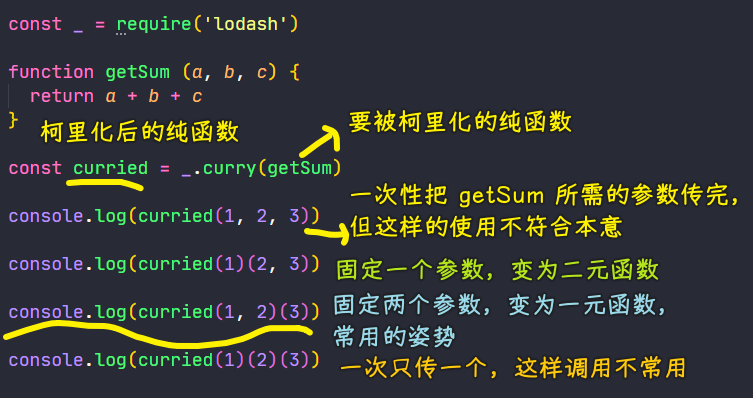
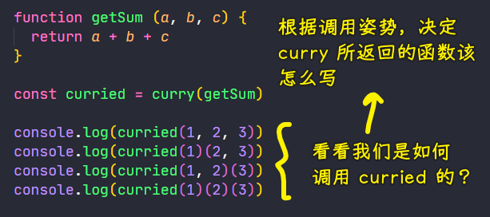
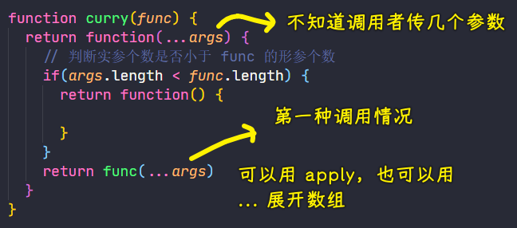
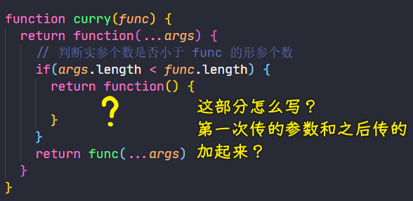
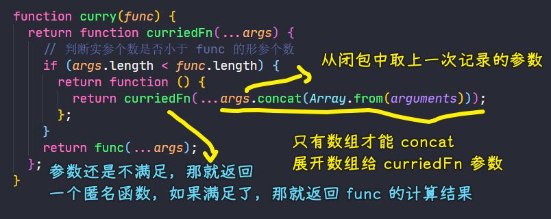
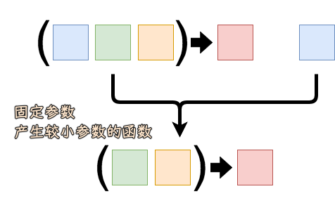

### ✍️ Tangxt ⏳ 2021-06-26 🏷️ functional programming

# 04-5-柯里化、Lodash 中的柯里化方法、柯里化案例、柯里化原理模拟、柯里化总结

## ★概述

- 我父亲以前跟我说过，有些事物在你得到之前是无足轻重的，得到之后就不可或缺了。微波炉是这样，智能手机是这样，互联网也是这样——老人们在没有互联网的时候过得也很充实。对我来说，函数的柯里化（curry）也是这样。 -> **Can’t live if livin’ is without you**
- curry 的概念很简单
  - 只传递给函数一部分参数来调用它，让它返回一个函数去处理剩下的参数 -> `curried(1)(2, 3)`
  - 你可以一次性地调用 curry 函数，也可以每次只传一个参数分多次调用 -> `curried(1, 2, 3)`、`curried(1, 2)(3)`
- 策略性地把要操作的数据`String、Array`放到最后一个参数里
  - `var match = curry(function(what, str) { return str.match(what) })` -> `match(/\s+/g)("hello world")` -> `var hasSpaces = match(/\s+/g); hasSpaces("hello world")`
  - `function(what, replacement, str) {}`
  - `function(f, ary) {}`
  - 这表明的是一种「**预加载**」函数的能力，通过传递一到两个参数调用函数，就能得到一个**记住了这些参数的新函数**
- 只传给函数一部分参数通常也叫做局部调用（partial application、切一刀、闭包的切一刀是一个 Closure 对象），能够**大量减少样板文件代码**（boilerplate code）
- 当我们谈论纯函数的时候，我们说它们接受一个输入返回一个输出。curry 函数所做的正是这样：每传递一个参数调用函数，就返回一个新函数处理剩余的参数。这就是**一个输入对应一个输出**啊。
  - **哪怕输出是另一个函数，它也是纯函数**。当然 curry 函数也允许一次传递多个参数，但这只是出于减少 `()` 的方便。
- 总结
  - curry 函数用起来非常得心应手，每天使用它对我来说简直就是**一种享受**。它堪称**手头必备工具**，能够**让函数式编程不那么繁琐和沉闷**。
  - 通过简单地传递几个参数，就能动态创建实用的新函数；而且还能带来一个额外好处，那就是**保留了数学的函数定义**，尽管参数不止一个。

## ★柯里化

这是 FP 中另一个重要的概念——柯里化（[Currying](https://en.wikipedia.org/wiki/Currying)）

提出这个概念的人是 [Haskell Brooks Curry](https://en.wikipedia.org/wiki/Haskell_Curry)，他是一位数学家，而柯里化就是使用这个人的最后一个名字来命名的！ -> Currying 是一种在数学和计算机科学中用来转换函数的技术

老外的名字一般由 [三部分](https://zhuanlan.zhihu.com/p/37069615) 组成：first name、middle name、last name

而「Haskell Brooks Curry」这个人的名字，这三部分都是一门编程语言的名字

👇：使用柯里化解决上一个案例（checkAge）中硬编码的问题，然后再来解释柯里化的概念

### <mark>1）柯里化演示</mark>

之前有硬编码的`checkAge`：

``` js
function checkAge(age) {
  let min = 18;
  return age >= min;
}
```

> `min`是基准值，它的值是一个具体的数字，这就是硬编码

如何解决硬编码？ -> 很简单，把`min`变量搞成是形参就好了！

把它改成为普通的纯函数：

``` js
// min：基准值 -> age：要比较的年龄
function checkAge(min, age) {
  return age >= min;
}

// 相同的输入始终会得到相同的输出 -> 因为它不再依赖于外部的变量了，并且这里边也没有硬编码
console.log(checkAge(18, 20));
console.log(checkAge(18, 24));
console.log(checkAge(22, 24));
```

当我们调用`checkAge`的时候，如果的基准值经常使用`18`的话，那代码里边的`18`就**经常性的重复**了！ -> 这种情况，在之前学习闭包的时候有遇到过，而且这也有解决的办法！

话说，如何让`18`避免重复？ -> 跟之前的闭包做法一样

``` js
// 用到了闭包和高阶函数 -> 而这其实就是函数的柯里化
// 上边的 checkAge 柯里化成了这个 checkAge
function checkAge(min) {
  return function (age) {
    return age >= min;
  };
}

let checkAge18 = checkAge(18);
let checkAge20 = checkAge(20);

console.log(checkAge18(20));
console.log(checkAge18(24));
```

什么是柯里化？

简单来说 -> 当我`checkAge`有多个参数的时候，我们可以对这个函数进行改造，我们可以调用一个函数`checkAge(min)`只传递部分的参数，并且让这个函数返回新的函数，而这个新的函数可以接收剩余的参数，并且返回相应的结果！ -> 这就是函数的柯里化


用箭头函数重新写这个`checkAge` -> 看看它们写法上的区别：

``` js
let checkAge = (min) => (age) => age >= min;
```

可以看到代码更简洁了！ -> ES5 方式需要写 3 行，而 ES6 只需要写 1 行！

### <mark>2）总结</mark>

总结一下柯里化（Currying）的概念：

- 当一个函数有多个参数的时候，我们可以先传递一部分参数调用它（**这部分参数以后永远不会发生变化**），如上边演示的`checkAge`，它本来是有两个参数的，但我们可以把它改造成只接收一个参数，并且返回一个新的函数 -> 这个新的函数用来接收剩余的参数，并未返回函数执行的结果 -> 这就是函数的柯里化！

上边所演示的案例非常简单，而且也不够通用，因为`checkAge`这种柯里化函数它只能够为`checkAge`服务 -> 之前我们演示纯函数的时候，演示了「可缓存」，我们使用了 Lodash 中的 记忆函数`memoize`，这个方法能够为所有的函数生成带记忆功能的函数 -> 那么 Lodash 中有没有提供一个方法能够让我们把任何一个函数转化成柯里化的函数呢？ -> 答案是有的！

## ★Lodash 中的柯里化方法

回顾上一节：

- 介绍了柯里化的概念
- 通过一个简单的案例演示了柯里化的使用 -> 发现这个案例不够通用

👇：介绍 Lodash 中提供的通用的柯里化的方法，并且通过案例来体会它的使用，最终我们还会自己模拟实现一个通用的柯里化方法

### <mark>1）curry</mark>

> 文档：[_.curry - lodash 中文解析版](https://lodash.shujuwajue.com/function/curry)

Lodash 提供了一个通用的柯里化方法 -> curry

- 语法：`_.curry(func)`
- 功能：创建一个函数（生成一个函数），该函数接收一个或多个 `func` 的参数（传给`func`的参数），如果 `func` 所需要的参数都被提供则执行 `func` 并返回执行的结果。否则继续返回该函数并等待接收剩余的参数。（如果你只传递了部分参数那就继续等）
- 参数：需要柯里化的函数
- 返回值：柯里化后的函数

`curry`这个方法本身就是一个纯函数，如果我们传递的这个`func`也是一个纯函数的话，那它返回的柯里化以后的函数也是一个纯函数

💡：演示 curry 的基本使用？

需求：求参数之和

定义一个三元函数，即有三个参数的函数，同理，二元函数，就是只有两个参数的函数，一元函数就是一个参数的函数

而柯里化可以把一个多元的函数最终转化成一个一元函数 -> 这一点对于之后要学到的函数组合是非常重要的！因此你必须先要理解这一点才行！

测试：

``` js
const _ = require('lodash')

function getSum (a, b, c) {
  return a + b + c
}

const curried = _.curry(getSum)

// 这个测试看起来毫无意义，我们就是对 getSum 进行了一次包装
// 跟直接 getSum(1,2,3) 这样调用毫无区别
console.log(curried(1, 2, 3))

// 传递部分参数，那所返回的新函数会等待接收剩余的参数
console.log(curried(1)(2, 3))

// 只有参数都给了，才会返回最终的结果值 -> 第一次传两个参数，那所返回的新函数就可以看成是一个一元函数了
console.log(curried(1, 2)(3))

// 我们使用柯里化的目的是：把多元函数最终转化成一元函数
console.log(curried(1)(2)(3))
```

可以看到，通过`curry`过后所返回的柯里化后的函数使用起来非常方便 -> 它既可以传 3 个参数，又可以传 2 个参数，还可以传 1 个参数！

---



我们演示了 Lodash 中 `curry` 方法的使用，当我们调用`curry`这个方法的时候，它会返回一个柯里化以后的函数，而这个函数，我们在调用的时候，我们可以给它传递`getSum`所需的所有参数，而传递了所需的所有参数，那么就会立即调用并返回结果，如果在调用的时候，只传递了`getSum`所需的部分参数，那么此时它就会一个函数，以此来等待接收剩余的参数，总之，最重要的一点是，`curried`这个函数可以把任意多参数的函数转化成一个一元函数，如`getSum`需要三个参数，那我们可以先给它传递两个参数，那么它此时就只剩下一个参数了，即变成了一个一元函数

关于 Lodash 中`curry`的基本使用就演示完了……

## ★柯里化案例

> 使用 Lodash 中的 `curry` 方法来做一个案例

需求：

- 判断一个字符中是否有空白字符？或者提取字符串中所有的空白字符 -> 使用字符串的`match`方法
- 提取字符串中的数字

面向过程的方式：

``` js
'ni hao '.match(/\s+/g) // [" ", " "]
'1me2 l2'.match(/\d+/g) // ["1", "2", "2"]
```

如果要提取数组中有空白字符的元素，那这该怎么做呢？ -> 要求重用

为了重用 -> 可以用函数式的方式！ -> 因为 FP 可以让我们最大程度地去重用函数

用函数式的方式来匹配或者提取一个字符串中的指定内容，首先，你得写一个纯函数

这个纯函数 -> 把字符串的`match`方法给封装起来！

``` js
// reg：指定要匹配的内容 -> str：要查找的字符串目标
function match(reg, str) {
  // 返回匹配的结果
  return str.match(reg);
}
```

重复地做 -> 传`/\s+/g`调用`match`方法 -> 这个正则表达式是不停地重复的！

利用柯里化让这个参数不再重复 -> 让一个函数生成一个新的函数 -> 对`match`进行改造，即对它需要柯里化处理！

``` js
const _ = require("lodash");

// 为了减少多余的变量，所以传入了一个匿名函数
// 而不是 const matchCurried = _.curry(match)
const match = _.curry(function (reg, str) {
  return str.match(reg);
});
```

这样做之后，调用`match`方法，你可以传入一个参数来固定一个值，而第二个参数就是动态的目标

``` js
const haveSpace = match(/\s+/g);
// haveSpace 会把字符串中的空白字符串给提取出来 -> 返回的是一个数组形式 -> 如果没有空白字符，那就返回 null
// 根据返回值是否为 null，来判断字符串中是否有空白字符
console.log(haveSpace('ni hao ')) // [ ' ', ' ' ]
```

💡：通过`match`方法，生成一个用来判断字符串中是否有数字的函数

``` js
// 任意多的数字，全部匹配
const haveNumber = match(/\d+/g);
console.log(haveNumber('1me2 l2')) // [ '1', '2', '2' ]
```

---

可以看到，通过柯里化后的`match`函数，生成了两个具有特定功能的**小函数**：

- haveSpace
- haveNumber

💡：过滤一个数组，找到一个数组中所有具有空白字符的元素？

对数组进行过滤 -> 可以利用数组中的`filter`方法

同理，我们可以把`filter`方法封装成一个纯函数的形式：

``` js
// func：指定如何对数组进行过滤 -> callback
// array：目标对象
const filter = _.curry(function (func, array) {
  return array.filter(func);
});
```

测试：

``` js
// 一次性使用
console.log(filter(haveSpace, ["John Connor", "John_Donne"])); // [ 'John Connor' ]

// 生成具有特定功能的小函数
const findSpace = filter(haveSpace);
console.log(findSpace(["John Connor", "John_Donne"])); // [ 'John Connor' ]
```

---

以上的需求都是用函数式的方式来实现的，也许你会认为这样做很麻烦，还不如自己直接调用`match`方法来实现 -> 其实，你没有意识到，像`findSpace`这样的小函数，将来是可以重复使用的

我们之前说过，FP 的一大好处就是：让我们最大程度地去重用这些小函数，如只需要定义一次`haveSpace`，就可以无限地重用了！

## ★柯里化实现原理

你不只要会使用 Lodash 中的`curry`方法，你还得知道其内部的实现原理！

如何模拟`curry`方法？

1. 看看 Lodash 中的`curry`，我们是如何调用的？
   1. 传递一个参数 -> 纯函数 -> 需要柯里化处理的函数
   2. 返回一个函数 -> 柯里化以后的函数
2. 先完成形式，再去分析其内部是如何实现的

``` js
function curry(func) {
  return function() {
    
  }
}
```

如何处理返回的这个函数？



1. 第一种调用情况：`getSum`有多少个参数，你就对`curried`传多少个参数 -> 这会立即返回计算结果
2. 第二种调用情况：调用`curried`的时候，只传递`getSum`所需要的部分参数 -> 此时会返回一个新的函数，并等待接收`getSum`所需的其它参数

总共就两种调用形式 -> 我们要做的就是实现这两种调用形式！

分析可知：

- `curry`所返回的函数，其接收的参数个数是不固定的
  - 我们需要获取传给它参数
  - 在其内部还得判断传递给它的参数是否和`getSum`的形参个数相同

代码碎片：

- 剩余参数 -> 获取用户输入的不固定参数 -> `...args` -> 实参个数
- 对比形参个数（`getSum`的形参）和实参个数（`args`）
  - 如果实参小于形参？ -> 返回一个新函数
  - 如果实参大于等于形参？ -> 调用`func` -> 被柯里化的函数

完成第一种调用情况：



💡：第二种调用情况？



- 利用闭包 -> 缓存第一次传的参数 -> `args`会记录下来 -> 所以你使用到`args`
- 内部调用`curry`所返回的函数 -> 要给它起名字 -> `curriedFn`（柯里化以后的函数）



---

这个模拟的`curry`是否 ok？还得测试一下

测试：

``` js
function getSum(a, b, c) {
  return a + b + c;
}

const curried = curry(getSum);

console.log(curried(1, 2, 3, 4));
console.log(curried(1)(2, 3));
console.log(curried(1, 2)(3));
console.log(curried(1)(2)(3));
```

测试可知，结果跟之前一样……

💡：小结？

模拟`curry`这个函数的过程中：

1. 看 Lodash 中`curry`是如何调用的？
2. 根据`curry`的调用形式，先把模拟的`curry`的形式写完
3. 分析`curry`返回后的函数是如何调用的？ -> 有两种调用形式
   1. 实参个数大于等于`getSum`的形参个数 -> 那就会直接调用`getSum`
   2. 小于的话？（只传部分参数） -> 那就返回一个新的匿名函数
4. 新的匿名函数干啥？ -> 等待接收你传递的剩余的参数
   1. 利用闭包，合并之前的参数，传给`curriedFn`来调用
      1. 如果还是不满足，那就继续返回一个新的匿名函数
      2. 如果满足了，那就返回`func`计算结果

以上就是`curry`的内部实现了……

👇：总结一下函数的柯里化

## ★柯里化总结

- 函数的柯里化可以让我们给一个函数传递较少的参数得到一个已经记住了某些固定参数的新函数 -> 这句话信息量比较大，我们一点一点来看
  - 柯里化可以让我们生成一个新的函数 -> 如`match`生成了`havaSpace` -> 这个新函数内部其实就使用了闭包，记住了我们传递给`match`的正则表达式 -> 这是柯里化的核心
  - 这个新函数已经记住了某些固定参数
- 柯里化内部使用了闭包对**函数参数**进行了「**缓存**」
- 柯里化让函数变的更灵活，因为可以通过一个函数生成一些粒度更小的函数 -> 这样做的目的，是为了在「组合」时使用！
- 使用柯里化可以把多元函数（有多个参数的函数）转换成一元函数（只有一个参数的函数），后边，在使用「组合」时，会使用到很多这种一元函数，我们可以把这些一元函数组合成功能更强大的函数

👇：柯里化介绍完了，下一节介绍函数的组合！

## ★了解更多

➹：[「译」理解 JavaScript 的柯里化 - 知乎](https://zhuanlan.zhihu.com/p/50247174)

➹：[一文搞懂 Javascript 中的函数柯里化（currying） - 知乎](https://zhuanlan.zhihu.com/p/120735088)

➹：[柯里化在工程中有什么好处？- 知乎](https://www.zhihu.com/question/37774367)

➹：[柯里化对函数式编程有何意义？ - 知乎](https://www.zhihu.com/question/20037482)

➹：[如何理解 functional programming 里的 currying 与 partial application? - 知乎](https://www.zhihu.com/question/30097211/answer/46785556)

## ★总结

- 柯里化是一个把具有较多 arity 的函数转换成具有较少 arity 函数的过程 -- Kristina Brainwave
  - 这是一个逐次消元的过程，当把函数的元全消掉，就得到了值，值就是零元函数
- Curry: A function that takes a function with multiple parameters as input and returns a function with exactly one parameter.
  - Curry：接受一个有多个参数的函数作为输入，返回一个只有一个参数的函数。
- Partial Application：一种函数，它接受一个具有多个参数的函数，并返回一个参数较少的函数。

## ★Q&A

### <mark>1）partial application？</mark>



在计算机科学中， partial application（或 partial function application) 指的是将一些参数固定到一个函数上，从而产生另一个更小的函数的过程。

> 有人把它译作「偏函数」

➹：[Partial application - Wikipedia](https://en.wikipedia.org/wiki/Partial_application)

➹：[Curry or Partial Application?. The Difference Between Partial…](https://medium.com/javascript-scene/curry-or-partial-application-8150044c78b8)

➹：[Javascript- Currying VS Partial Application](https://towardsdatascience.com/javascript-currying-vs-partial-application-4db5b2442be8)
