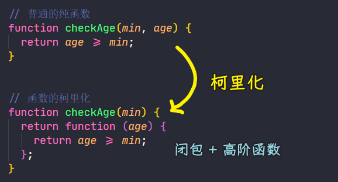

### ✍️ Tangxt ⏳ 2021-06-26 🏷️ functional programming

# 04-5-柯里化、Lodash 中的柯里化方法、柯里化案例、柯里化原理模拟、柯里化总结

## ★概述

- 我父亲以前跟我说过，有些事物在你得到之前是无足轻重的，得到之后就不可或缺了。微波炉是这样，智能手机是这样，互联网也是这样——老人们在没有互联网的时候过得也很充实。对我来说，函数的柯里化（curry）也是这样。 -> **Can’t live if livin’ is without you**
- curry 的概念很简单
  - 只传递给函数一部分参数来调用它，让它返回一个函数去处理剩下的参数 -> `curried(1)(2, 3)`
  - 你可以一次性地调用 curry 函数，也可以每次只传一个参数分多次调用 -> `curried(1, 2, 3)`、`curried(1, 2)(3)`
- 策略性地把要操作的数据`String、Array`放到最后一个参数里
  - `var match = curry(function(what, str) { return str.match(what) })` -> `match(/\s+/g)("hello world")` -> `var hasSpaces = match(/\s+/g); hasSpaces("hello world")`
  - `function(what, replacement, str) {}`
  - `function(f, ary) {}`
  - 这表明的是一种「**预加载**」函数的能力，通过传递一到两个参数调用函数，就能得到一个**记住了这些参数的新函数**
- 只传给函数一部分参数通常也叫做局部调用（partial application、切一刀、闭包的切一刀是一个 Closure 对象），能够**大量减少样板文件代码**（boilerplate code）
- 当我们谈论纯函数的时候，我们说它们接受一个输入返回一个输出。curry 函数所做的正是这样：每传递一个参数调用函数，就返回一个新函数处理剩余的参数。这就是**一个输入对应一个输出**啊。
  - **哪怕输出是另一个函数，它也是纯函数**。当然 curry 函数也允许一次传递多个参数，但这只是出于减少 `()` 的方便。
- 总结
  - curry 函数用起来非常得心应手，每天使用它对我来说简直就是**一种享受**。它堪称**手头必备工具**，能够**让函数式编程不那么繁琐和沉闷**。
  - 通过简单地传递几个参数，就能动态创建实用的新函数；而且还能带来一个额外好处，那就是**保留了数学的函数定义**，尽管参数不止一个。

## ★柯里化

这是 FP 中另一个重要的概念——柯里化（[Currying](https://en.wikipedia.org/wiki/Currying)）

提出这个概念的人是 [Haskell Brooks Curry](https://en.wikipedia.org/wiki/Haskell_Curry)，他是一位数学家，而柯里化就是使用这个人的最后一个名字来命名的！ -> Currying 是一种在数学和计算机科学中用来转换函数的技术

老外的名字一般由 [三部分](https://zhuanlan.zhihu.com/p/37069615) 组成：first name、middle name、last name

而「Haskell Brooks Curry」这个人的名字，这三部分都是一门编程语言的名字

👇：使用柯里化解决上一个案例（checkAge）中硬编码的问题，然后再来解释柯里化的概念

1）柯里化演示

之前有硬编码的`checkAge`：

``` js
function checkAge(age) {
  let min = 18;
  return age >= min;
}
```

> `min`是基准值，它的值是一个具体的数字，这就是硬编码

如何解决硬编码？ -> 很简单，把`min`变量搞成是形参就好了！

把它改成为普通的纯函数：

``` js
// min：基准值 -> age：要比较的年龄
function checkAge(min, age) {
  return age >= min;
}

// 相同的输入始终会得到相同的输出 -> 因为它不再依赖于外部的变量了，并且这里边也没有硬编码
console.log(checkAge(18, 20));
console.log(checkAge(18, 24));
console.log(checkAge(22, 24));
```

当我们调用`checkAge`的时候，如果的基准值经常使用`18`的话，那代码里边的`18`就**经常性的重复**了！ -> 这种情况，在之前学习闭包的时候有遇到过，而且这也有解决的办法！

话说，如何让`18`避免重复？ -> 跟之前的闭包做法一样

``` js
// 用到了闭包和高阶函数 -> 而这其实就是函数的柯里化
// 上边的 checkAge 柯里化成了这个 checkAge
function checkAge(min) {
  return function (age) {
    return age >= min;
  };
}

let checkAge18 = checkAge(18);
let checkAge20 = checkAge(20);

console.log(checkAge18(20));
console.log(checkAge18(24));
```

什么是柯里化？

简单来说 -> 当我`checkAge`有多个参数的时候，我们可以对这个函数进行改造，我们可以调用一个函数`checkAge(min)`只传递部分的参数，并且让这个函数返回新的函数，而这个新的函数可以接收剩余的参数，并且返回相应的结果！ -> 这就是函数的柯里化



用箭头函数重新写这个`checkAge` -> 看看它们写法上的区别：

``` js
let checkAge = (min) => (age) => age >= min;
```

可以看到代码更简洁了！ -> ES5 方式需要写 3 行，而 ES6 只需要写 1 行！

2）总结

总结一下柯里化（Currying）的概念：

- 当一个函数有多个参数的时候，我们可以先传递一部分参数调用它（**这部分参数以后永远不会发生变化**），如上边演示的`checkAge`，它本来是有两个参数的，但我们可以把它改造成只接收一个参数，并且返回一个新的函数 -> 这个新的函数用来接收剩余的参数，并未返回函数执行的结果 -> 这就是函数的柯里化！

上边所演示的案例非常简单，而且也不够通用，因为`checkAge`这种柯里化函数它只能够为`checkAge`服务 -> 之前我们演示纯函数的时候，演示了「可缓存」，我们使用了 Lodash 中的 记忆函数`memoize`，这个方法能够为所有的函数生成带记忆功能的函数 -> 那么 Lodash 中有没有提供一个方法能够让我们把任何一个函数转化成柯里化的函数呢？ -> 答案是有的！

## ★Lodash 中的柯里化方法

回顾上一节：

- 介绍了柯里化的概念
- 通过一个简单的案例演示了柯里化的使用 -> 发现这个案例不够通用

👇：介绍 Lodash 中提供的通用的柯里化的方法，并且通过案例来体会它的使用，最终我们还会自己模拟实现一个通用的柯里化方法

1）curry

> 文档：[_.curry - lodash 中文解析版](https://lodash.shujuwajue.com/function/curry)

Lodash 提供了一个通用的柯里化方法 -> curry

- 语法：`_.curry(func)`
- 功能：创建一个函数（生成一个函数），该函数接收一个或多个 `func` 的参数（传给`func`的参数），如果 `func` 所需要的参数都被提供则执行 `func` 并返回执行的结果。否则继续返回该函数并等待接收剩余的参数。（如果你只传递了部分参数那就继续等）
- 参数：需要柯里化的函数
- 返回值：柯里化后的函数

`curry`这个方法本身就是一个纯函数，如果我们传递的这个`func`也是一个纯函数的话，那它返回的柯里化以后的函数也是一个纯函数

💡：演示 curry 的基本使用？

需求：求参数之和

定义一个三元函数，即有三个参数的函数，同理，二元函数，就是只有两个参数的函数，一元函数就是一个参数的函数

而柯里化可以把一个多元的函数最终转化成一个一元函数 -> 这一点对于之后要学到的函数组合是非常重要的！因此你必须先要理解这一点才行！

测试：

``` js
const _ = require('lodash')

function getSum (a, b, c) {
  return a + b + c
}

const curried = _.curry(getSum)

// 这个测试看起来毫无意义，我们就是对 getSum 进行了一次包装
// 跟直接 getSum(1,2,3) 这样调用毫无区别
console.log(curried(1, 2, 3))

// 传递部分参数，那所返回的新函数会等待接收剩余的参数
console.log(curried(1)(2, 3))

// 只有参数都给了，才会返回最终的结果值 -> 第一次传两个参数，那所返回的新函数就可以看成是一个一元函数了
console.log(curried(1, 2)(3))

// 我们使用柯里化的目的是：把多元函数最终转化成一元函数
console.log(curried(1)(2)(3))
```

可以看到，通过`curry`过后所返回的柯里化后的函数使用起来非常方便 -> 它既可以传 3 个参数，又可以传 2 个参数，还可以传 1 个参数！

---


我们演示了 Lodash 中 `curry` 方法的使用，当我们调用`curry`这个方法的时候，它会返回一个柯里化以后的函数，而这个函数，我们在调用的时候，我们可以给它传递`getSum`所需的所有参数，而传递了所需的所有参数，那么就会立即调用并返回结果，如果在调用的时候，只传递了`getSum`所需的部分参数，那么此时它就会一个函数，以此来等待接收剩余的参数，总之，最重要的一点是，`curried`这个函数可以把任意多参数的函数转化成一个一元函数，如`getSum`需要三个参数，那我们可以先给它传递两个参数，那么它此时就只剩下一个参数了，即变成了一个一元函数

关于 Lodash 中`curry`的基本使用就演示完了……

## ★柯里化案例
