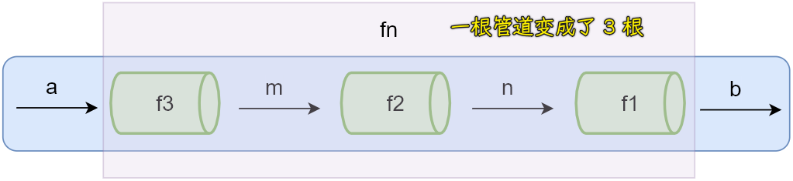

### ✍️ Tangxt ⏳ 2021-06-28 🏷️ functional programming

# 04-6-函数组合概念、Lodash 中的组合函数、组合函数原理模拟

## ★概述

- `组合`看起来像是在饲养函数。你就是饲养员，选择两个有特点又遭你喜欢的函数，让它们结合，产下一个崭新的函数。
- 组合某种类型（如函数）的两个元素本就该生成一个该类型的新元素。把两个乐高积木组合起来绝不可能得到一个林肯积木
  
  
  
- 尽管我们可以定义一个从左向右的版本，但是**从右向左执行更加能够反映数学上的含义**——是的，组合的概念直接来自于数学课本
- 所有的组合都有的一个特性，这个特性就是结合律（associativity），符合结合律意味着不管你是把 `g` 和 `h` 分到一组，还是把 `f` 和 `g` 分到一组都不重要
  - `var associative = compose(f, compose(g, h)) == compose(compose(f, g), h); // true`
  - `compose(toUpperCase, compose(head, reverse));`
  - `compose(compose(toUpperCase, head), reverse);`
- 关于如何组合，并没有标准的答案——我们只是以自己喜欢的方式搭乐高积木罢了。通常来说，最佳实践是**让组合可重用**，就像 `last` 和 `angry` 那样。如果熟悉 Fowler 的《[重构](https://martinfowler.com/books/refactoring.html)》一书的话，你可能会认识到这个过程叫做 “[extract method](https://refactoring.com/catalog/extractFunction.html)”——只不过不需要关心对象的状态
  
  
  
- Pointfree style -> never having to say your data -> Love means never having to say you’re sorry -> 这意味着函数从不提及它们所操作的数据。First class functions, currying, 和 composition 都很好地结合在一起创造了这种风格。
  - `not pointfree because we mention the data: word` -> `const snakeCase = word => word.toLowerCase().replace(/\s+/ig,'_');`
  - `pointfree` -> `const snakeCase = compose(replace(/\s+/ig,'_'), toLowerCase);`
  - Pointfree 模式能够帮助我们**减少不必要的命名**，**让代码保持简洁和通用**。对于函数式代码来说，Pointfree 是一个很好的试金石（试金石是指一种可用来鉴别黄金的石块，矿物学名称为碧玄岩），因为它让我们知道我们有一些「可以从输入到输出的」小的函数。 -> 例如，我们不能组合 `while` 循环。
- Debugging -> `var dasherize = compose(join('-'), toLower, trace("after split"), split(' '), replace(/\s{2,}/ig, ' '));` -> 插入的`trace`在手递手传输入给下一个小函数，而`trace`只是在`log`这次输入的是啥？

💡：Extract Function？


``` js
function printOwing(invoice) {
  printBanner();
  let outstanding  = calculateOutstanding();

  //print details
  console.log(`name: ${invoice.customer}`);
  console.log(`amount: ${outstanding}`);  
}

// Extract Method

function printOwing(invoice) {
  printBanner();
  let outstanding  = calculateOutstanding();
  printDetails(outstanding);

  function printDetails(outstanding) {
    console.log(`name: ${invoice.customer}`);
    console.log(`amount: ${outstanding}`);
  }
}
```

💡：范畴论？

➹：[如何评价阮一峰老师的函数式编程/范畴论教程？ - 杨博的回答 - 知乎](https://www.zhihu.com/question/278267469/answer/401128713)

➹：[【函数式编程】范畴论完全装逼手册 / Grokking Monad_厚积薄发者，轻舟万重山-CSDN 博客](https://blog.csdn.net/reliveIT/article/details/82959858)

➹：[JS 函数式编程 - 函子和范畴论 - SegmentFault 思否](https://segmentfault.com/a/1190000016829296)

💡：组合与排列？

- 我的水果沙拉是苹果、葡萄和香蕉的组合 -> 如果次序不重要，就叫**组合**
- 保险箱的密码是 472 -> 如果次序重要就叫**排列**

**排列是有序的组合**

➹：[组合与排列](https://www.shuxuele.com/combinatorics/combinations-permutations.html)

## ★函数式编程，Haskell，范畴论的关系

> 在我刚开学习函数式编程的时候，我对函数式编程的理解就是：函数式是非常简单的世界，只有普通数据和函数。其实函数式编程并没这么简单，**如果函数式编程就是掌握使用函数那其实大家都是会函数式编程的**。
> 
> **函数式编程远没这么简单，还有一个数学分支理论范畴论 (category theory) 在背后支持着它**。函数式编程，Haskell，范畴论三者之间的关系大概是这样的。范畴论是支持函数式编程的理论之一，而 Haskell 是一门纯函数式语言。
> 
> 为什么使用范畴论呢？是这样的，**范畴论主要关注组合 (composition)**。稍微资深一点的程序员就会发现，平时编程的时候，**如果你能把程序切成很多小的模块，然后组合这些模块成为想要的程序是一个非常好的编程思路**。所以**组合，或者说分而治之，的思想是很重要的**。因为人的大脑并不是万能的，一个模块如果过于复杂，维护起来就非常难，体现在编程上就是，我们开发进度越来越慢，开发功能的速度越来越接近 bug 产生的速度 O.O。
> 
> ok，既然**范畴论只是关于组合的理论**，不过我们的早就用上模块化的范式了。比如面想对象编程不就是把程序分成很多个对象，然后组合对象吗。是的，不过这些模块化不够安全，各个模块之间很多情况下都是互相影响的（也就是说，模块不独立，测试的时候绕不开互相影响的其他模块）。而**函数的组合，互相之间是不会影响的**。**在函数式编程中，最基本的组合是函数的组合**，在 Haskell 一个非常基本的操作符 `.` , 就是用来组合函数的。这个 `.` 与我们上学时候学习的复合函数是一个东西，`(f . g)(x) = f(g(x))`。
> 
> 函数式编程，Haskell，范畴论这三个概念如果展开讲其实讲一天一个月都讲不完，所以暂时就讲到这里。看完这篇文章肯定对于这些概念还是比较模糊的，我还会继续写一些别的文章补充这方面的内容。

> 范畴论是关于组合的。把这个组合一般化后，其实文章也是可以组合的。一篇文章如果非常冗长，很大的可能性是这个文章涵盖了很多要讲的东西，这其实容易让人分散注意力。所以我决定尽可能的把所有文章都切得比较细，这样看起来也容易抓到重点。

➹：[函数式编程，Haskell，范畴论的关系 - 知乎](https://zhuanlan.zhihu.com/p/31508545)

➹：[category theory 简介_Zhe Hu 的博客-CSDN 博客](https://blog.csdn.net/weixin_43801661/article/details/84670359)

## ★函数组合概念

> Compose

学习函数组合之前，先来看一个问题：

> 我们使用纯函数和柯里化很容易写出洋葱代码 `h(g(f(x)))`

### <mark>1）洋葱代码</mark>

话说，什么是洋葱代码呢？

想想洋葱的样子，一层包一层的，而`h(g(f(x)))`也是一层包一层的 -> 把`f(x)`的结果交给`g`去处理，`g`处理完的结果，再交给`h`去处理


更实际一点的案例就是：

- 获取数组的最后一个元素再转换成大写字母 -> `_.toUpper(_.first(_.reverse(array)))`

可以看到这个需求里边，方法的调用是一层包裹着一层的……而这就是洋葱代码！

那如何避免这种情况出现呢？ -> 使用函数组合可以避免这样的代码出现！

函数组合的意义：

> 函数组合可以让我们把**细粒度的**函数重新组合生成一个新的函数

比如，`_.toUpper(_.first(_.reverse(array)))`这个代码，我们通过函数组合的方式，就可以生成一个新的函数来实现相同的功能！

在理解函数的组合之前，我们先来理解一个概念——数据的管道

### <mark>2）数据的管道</mark>

什么是「数据的管道」？


`fn`就是一个数据的管道，它的作用就是对输入的数据进行处理，然后输出一个相应的结果

话说，如果这个管道特别长，如就像家里边的水管一样 -> 如果某个地方出现漏水，我们是很难找到出现漏水的地方的！毕竟，这管道特别长啊！

所以，这该咋整呢？

我们可以把这个`fn`管道变短，如把一个管道变成 3 个管道：



`fn`是个特别大的函数，或者说是一个特别长的管道，我们可以把一个管道拆分成三个比较短的管道，也就是说，我们可以把一个大的函数拆分成 3 个比较小的函数 -> 将来有数据输入的时候，会先经过第一个管道`f3`，`f3`处理完得到`m` -> `m`会作为下一个管道`f2`的输入，`f2`处理完后会得到结果`n` -> 同理，`n`作为`f1`的输入，会得到最终的完成结果`b`

这样拆分的好处 -> 将来「输出」出现问题的时候，找到问题所在就简单多了！

顺便说一句，一个大的拆分成 3 个小的函数，会多出来一些中间结果，如`m`和`n`，然而在函数的组合过程中，是不需要考虑这个中间结果的！

使用伪代码描述`fn`与`f3、f2、f1`之间关系：

``` js
fn = compose(f1, f2, f3)
b = fn(a)
```

`compose`是一个组合函数，它的作用是，把传递进来的 3 个函数组合成一个新的函数`fn`，当我们调用`fn`的时候，我们只需要传入它所需要的参数 -> `fn(a)`处理完成之后，最后会返回一个结果`b`，当然，我们知道，`fn`其内部真正处理`a`，其实是通过`f1、f2、f3`这 3 个小的函数来处理的！这 3 个小函数在处理的过程中，会得到一些中间结果，而这些中间结果我们不需要去理会！

总之，我们的函数组合其实就相当于这些管道处理数据！

### <mark>3）函数组合</mark>

概念：

> 函数组合 (compose)：如果一个函数要经过多个函数处理才能得到最终值，这个时候可以把中间过程的函数合并成一个函数，而在处理的过程中，这些中间函数会得到相应的中间结果 -> 这些中间结果，我们不需要关注

- 函数就像是一个数据的管道，数据通过这些管道会得到相应的结果，而**函数组合就是把这些管道连接起来**，让数据穿过多个管道最终获得我们所期望的结果
- **函数组合默认情况下是从右到左执行** -> 这一点尤其需要注意！ -> 如`fn = compose(f1, f2, f3)`，`fn(a)`执行时，会先执行`f3`，然后`f2`，最后`f1`

👇：通过代码演示什么是函数组合？

演示如何使用函数的组合……

演示思路：

1. 需要一个函数，该函数可以把多个函数组合成一个新的函数
2. 定义一个`compose`函数，它可以接收多个函数类型的参数，然后把它们组合成一个新的函数
3. 如何实现`compose`？ -> 简化一下，先处理两个函数参数 -> 返回的函数需要接收一个输入，毕竟返回的函数就是一个数据的管道，而且还得有输出


你可以发现，其实洋葱代码并没有减少，只是我们把它封装起来了罢了！

用`compose`解决一个实际问题：用函数的组合求数组中最后一个元素 -> 这个需求很简单，但为了演示函数的组合，就稍微搞复杂点

思路：翻转+获取第一个元素

我们知道函数的组合，需要一些小的函数，即细粒度的函数，所以我们得有两个小函数：

- `reverse`：翻转的函数
- `first`：获取数组第一个元素的函数

总之，使用函数组合之前，首先得需要一些辅助的函数：


函数的组合测试：


可以看到这很麻烦，我们要求数组中最后一个元素，有 N 种比它更简单的姿势，如：

``` js
function last(arr) {
  return arr[arr.length-1]
}

let arr = [1,2,3,4]
console.log(last(arr)) // 4
```

但是我们要清楚的一件事是，这些辅助函数可以任意的去组合，任意的去调用 -> **所以说 FP 可以让函数最大程度地被重用**

至此，函数组合的概念以及代码就演示完了！

回顾一下函数组合：

> 可以让多个函数组合生成一个新的函数


## ★Lodash 中的组合函数

我们之前实现的`compose`函数，只能接收两个函数，即只能把两个函数组合成一个新的函数

那如果我们想要把更多的函数组合成一个新的函数 -> 咋办？

这个时候我们可以使用 Lodash 中提供的组合函数！

Lodash 中提供了两个组合函数：

- `flow()` -> 从左到右运行
- `flowRight()` -> 从右到左运行，使用的更多一些

> flow 这个单词是流动的意思 -> 我们可以理解为数据流动的方向

它们都可以组合多个函数

👇：演示`flowRight`如何组合多个函数

需求：获取数组最后一个元素，并把它转化为大写


> `toUpper`的执行结果，就是`f`的执行结果

相较于我们之前写的`compose`函数，它可以接收多个函数

## ★组合函数原理模拟

之前演示了如何使用`flowRight`，然而，我们不光要会使用它，还得知道它内部的实现原理

如何模拟？

依旧是老套路 -> 分析`flowRight`的调用（参数个数和返回值） -> 搞个形式 -> 完善细节

1. 分析参数：参数不固定，并且都是函数，而且都是纯的！
2. 分析返回值：`flowRight`调用完，会把函数参数们组合成一个新的函数，所以返回值也是一个函数，并且这个函数还得接收一个参数，因为这要开启对数据的处理啊！ -> 一条大管子
   1. 处理的数据的时候，从最右边的小函数开始，依次把数据传递下去
3. 函数命名 -> 习惯`compose`这个名字，毕竟它就是「组合」之意

Step 1：完成函数的形式

``` js
function compose(...args) {
  return function(value) {

  }
}
```

Step 2：我们在所返回的这个函数里边做什么？

会返回最终的结果 -> 关键点：数据的流通方向是从右到左依次调用函数


> `fn`是用来处理每次汇总完的结果`acc`

测试 ok！

改造这个`compose` -> 因为这看起来太绕了！（有 3 个`return`在递进呢）

箭头函数姿势：

``` js
const compose = (...args) => value => args.reverse().reduce((acc, fn) => fn(acc), value)
```

可以看到代码少了很多 -> 这种做法在 FP 里边经常会用到，因为用了箭头函数会让代码更简洁，而且这会让我们更关注于输入和输出！

💡：`reduce`？

这个方法的作用 -> 对数组中的每一个元素执行我们所提供的`callback`，并把将其汇总成一个单个的结果

参数：

- 第一个是`callback`
- 第二个是可选的`initialValue`

``` js
const arr = [1, 2, 3, 4, 5, 6];

arr.reduce((total, currentVal, currentIndex, arr) => {
  console.log(total, currentVal, currentIndex);
  return total + currentVal;
});
arr.reduce((total, currentVal, currentIndex, arr) => {
  console.log(total, currentVal, currentIndex);
  return total + currentVal;
}, 100);

// 1 2 1
// 3 3 2
// 6 4 3
// 10 5 4
// 15 6 5

// 100 1 0
// 101 2 1
// 103 3 2
// 106 4 3
// 110 5 4
// 115 6 5
```

➹：[JavaScript Array reduce() Method](https://www.w3schools.com/jsref/jsref_reduce.asp)

---

其它模拟：

💡：redux 的 `compose.js` 模块？

``` js
function compose(...funcs) {
  if (funcs.length === 0) {
    return arg => arg
  }

  if (funcs.length === 1) {
    return funcs[0]
  }

  return funcs.reduce((a, b) => (...args) => a(b(...args)))
}

const f = compose(toUpper, first, reverse);
f(["one", "two", "three"])
```

这个不好懂，它深刻地应用了闭包 -> 返回值用到了`a`和`b`

- `f`的返回值是`(...args) => a(b(...args)`
- 输入的数组参数 -> `[["one", "two", "three"]]`

在求`f`的时候，在这里会保存两份闭包，毕竟遍历了：


在`f(["one", "two", "three"])`求值的时候，由于根据闭包来确定`a`和`b`的值

💡：从左到右版？

``` js
function compose(...funcs) {
  return function(...args) {
    let result,
      len = funcs.length;
    if (len === 0) {
      result = args;
    } else if (len === 1) {
      result = funcs[0](...args);
    } else {
      result = funcs.reduce((x, y) => {
        return typeof x === 'function' ? y(x(...args)) : y(x);
      });
    }
    return result;
  }
}
```

## ★了解更多

➹：[zf-fe - 如果岁月可回头](https://ppambler.github.io/zf-fe/02-JS/11.html)

➹：[十分钟理解函数组合-函数式编程 - 知乎](https://zhuanlan.zhihu.com/p/341367154)

➹：[JavaScript 专题之函数组合 · Issue #45 · mqyqingfeng/Blog](https://github.com/mqyqingfeng/Blog/issues/45)

➹：[函数式编程--函数组合 (Function composition) - 知乎](https://zhuanlan.zhihu.com/p/356984124)

➹：[Pointfree 编程风格指南 - 阮一峰的网络日志](http://www.ruanyifeng.com/blog/2017/03/pointfree.html)
