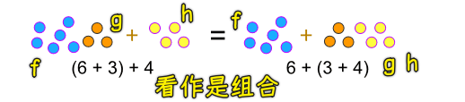
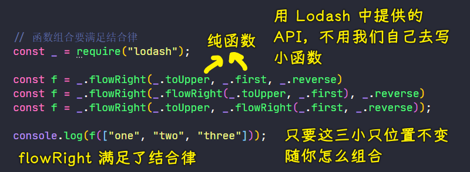
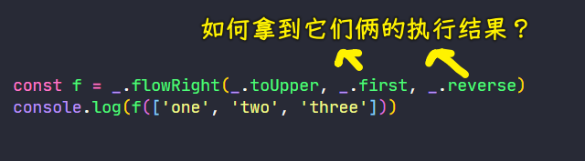
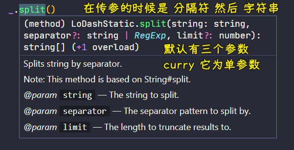
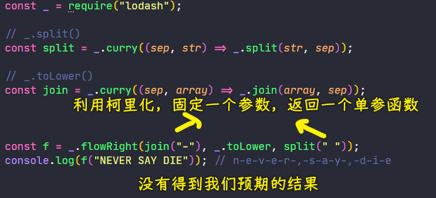
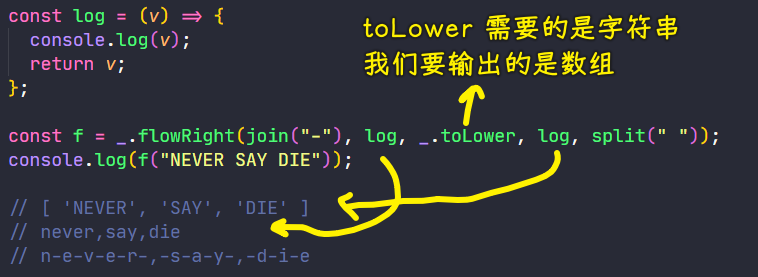
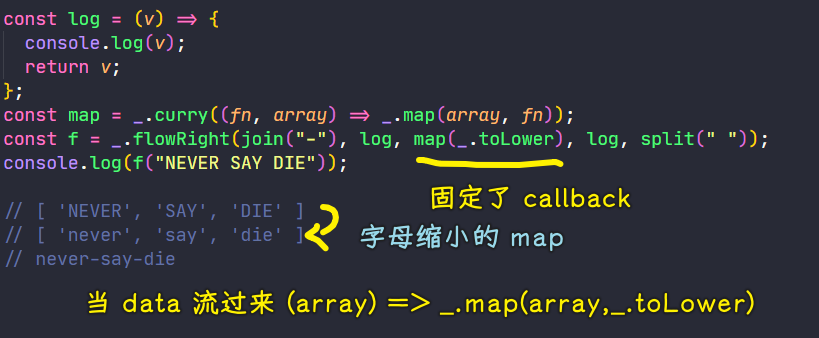
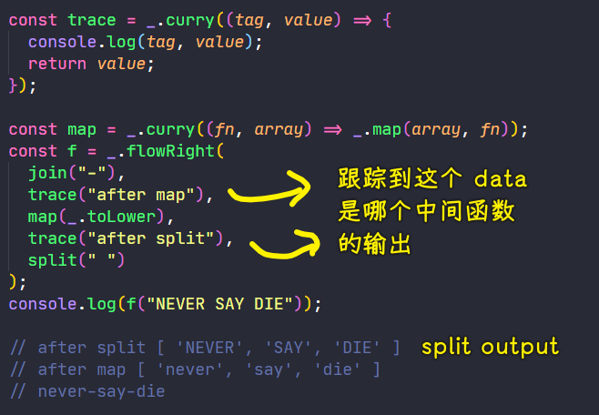
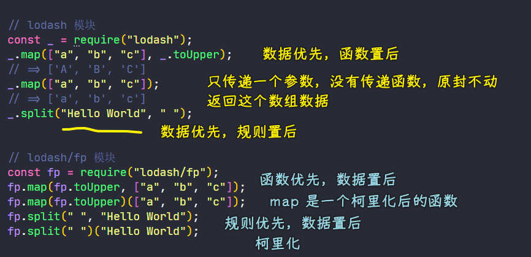
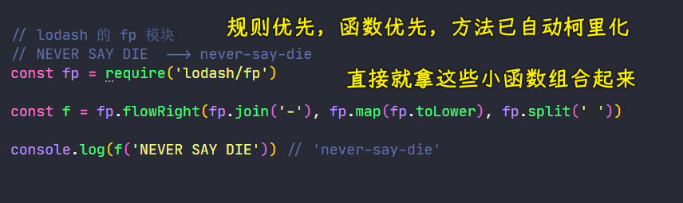

### ✍️ Tangxt ⏳ 2021-06-30 🏷️ functional programming

# 04-7-函数组合-结合律、函数组合-调试、Lodash-fp 模块、Lodash-map 方法的小问题

## ★函数组合-结合律

函数组合满要满足一个特点——**结合律**（associativity）

啥意思？ -> 数学中的 [结合律](https://www.shuxuele.com/associative-commutative-distributive.html) 是啥意思，它就是啥意思



简单来说就是：

> 我们既可以把 `g` 和 `h` 组合，还可以把 `f` 和 `g` 组合，结果都是一样的

``` js
// 结合律（associativity）
let f = compose(f, g, h);
let associative = compose(compose(f, g), h) == compose(f, compose(g, h));
// true
```

👇：用 Lodash 里边的 API 演示这个结合律



这个结合律其实就是数学中的结合律 -> 先结合前两个数或者先结合后两个数 -> 结果都是一样的

## ★函数组合-调试

目前，我们可以使用组合解决一些简单的问题

那么问题来了，当我们使用函数组合的时候，如果函数执行的结果跟我们预期的不一致，那这个时候我们该如何调试呢？



👇：演示如何调试组合函数

需求：`'NEVER SAY DIE' --> 'never-say-die'`

思路：根据空格分割它，小写化，再用`-`连接

用很多种做法，可以做到，如：

``` js
'NEVER SAY DIE'.split(' ').map((v,k)=>{ return v.toLowerCase() }).join('-') // "never-say-die"
```

但在这里我们先演示一个有 bug 的版本：

> 注意：在函数组合的时候 -> 需要的是一些只有一个参数的纯函数

Step 1：确定小函数

- `_.split`需要接收多个参数，我们要把它改造成只接受一个参数的函数，而且数据比需要放在最后一位，默认的`split`，数据是第一位，而分割符是第二位 -> 需要用柯里化
  
  
  
- `_.toLower`是单参数的函数，不需要柯里化它
- `_.join`需要两个参数 -> 第一个是数组，第二个是分隔符 -> 封装它，让这两个参数的位置交换一下，毕竟我们要最后传递数据

``` js
// _.split()
const split = _.curry((sep, str) => _.split(str, sep))

// _.toLower()
const join = _.curry((sep, array) => _.join(array, sep))
```

👇：把这些小函数组合成一个新的函数来满足我们的需求

Step 2：把小函数组合起来



可以看到输出结果跟我们预期的结果相差很远

所以这问题是出在哪儿呢？是`split`的问题？`toLower`的问题？还是`join`的问题？ -> 不知道，而且目前也不知道如何调试……

如何调试？



``` js
console.log([ 'NEVER', 'SAY', 'DIE' ].toString().toLowerCase())
console.log(Array.from('never,say,die'))
console.log(Array.from('never,say,die').join('-'))

// never,say,die
// [
//   'n', 'e', 'v', 'e',
//   'r', ',', 's', 'a',
//   'y', ',', 'd', 'i',
//   'e'
// ]
// n-e-v-e-r-,-s-a-y-,-d-i-e
```

如何解决这个 bug？ -> 让`toLower`的返回值是一个数组呗！ -> 使用`map`函数遍历，为每个元素`toLower`一下

做法：

`_.map` -> 需要接收两个参数（数组和`callback`） -> 参数位置互换、二次封装、柯里化它 -> 在组合时固定一个`callback`



> `array.map(function(currentValue, index, arr), thisValue)`

总之，我们通过`log`这个辅助函数，可以观察到每一个中间函数执行的结果

然而，现在还是有一个问题的，那就是如果组合的函数比较多，这中间结果就比较多了，这时候看`log`会分不清这个值是属于哪个中间函数的输出了！

定义一个`trace`函数：



可以看到用了这个`trace`函数后，调试结果更清晰了 -> 其实如果有一个类似 Vue 调试工具就好了，我们不用写`trace`，就能通过小工具知道每个小函数的输出结果是什么了……

小结：

- Lodash 中的小函数符合我们平时使用函数的习惯，但是在用组合的过程中，我们不能这样直接的使用它们，所以我们对它们进行了改造 -> 也许你会感到很不方便，毕竟需要二次封装然后`curry`它们 -> Lodash 中提供的 `fp` 模块里边，也有这些小函数，我们在组合的时候，可以直接使用它们，无须二次封装再`curry`

## ★Lodash-fp 模块

在使用函数组合的时候，会使用到 Lodash 中提供的一些方法，但是，这些方法如果有多个参数的时候，我们就需要对这些方法进行柯里化的处理了 -> 这些方法我们需要重新包装，而且稍微有些麻烦

如何解决这个问题？ -> Lodash 中的`fp`模块可以解决！

1）lodash/fp

- Lodash 的 `fp` 模块提供了实用的对函数式编程更加友好的方法
- 提供了`immutable auto-curried iteratee-first data-last` 的方法 -> 如果一个方法的参数是函数，那就会要求函数优先，数据滞后

👇：用代码演示`fp`模块下方法的特点

💡：lodash 模块 vs lodash/fp 模块



给`fp.split`传递了一个参数，其返回值也是一个函数，可以看到`fp.split`是一个已经柯里化后的函数

至此，我们已经了解到 lodash/fp 模块中提供的这些方法该如何去使用以及`auto-curried iteratee-first data-last`这三个特性！

👇：使用 lodash/fp 模块中的方法做一个案例

💡：'NEVER SAY DIE' --> 'never-say-die'

原先的做法 -> 很麻烦 -> 需要二次封装方法，改造成函数优先，数据置后，而且还得柯里化这个封装的方法

现在的做法 -> 直接拿小函数去组合就完事了！



小结：

- `fp`模块
  - 提供了对函数式编程友好的方法
  - 提供的这些方法都是已经被柯里化的
  - 如果参数是多个的，都是函数优先，数据置后
  - 这些方法都可以在函数组合的时候，直接使用

## ★Lodash-map 方法的小问题

💡：`parsetInt`？

- 作用：解析给定的字符串 -> 返回一个指定基数的十进制整数
- 语法：`parseInt(string)`、`parseInt(string, radix)`
  - `string`：要解析的值，非字符串内部会先转化为字符串处理，开头结尾的空格会被忽略
  - `radix`：可选参数，数字基数，可以理解为进制，范围为`2~36`

``` js
parseInt("123", 6)  //51 把字符串看作是 6 进制，6 进制转 10 进制
parseInt("123", 10) //123 按十进制处理
parseInt("123", 16) //291 按十六进制处理
```

如果：

- `radix`不填，则默认把字符串看作是 10 进制，注意`10`并不是默认值，因为如果字符串是以`0x`开头的，那么此时默认值就是`16`了 -> `parseInt("123", 16) === parseInt("0x123")`
- 字符串以`0`开头，从 ES5 开始都处理为 `10` 进制，现在大部分浏览器都处理为 `10` 进制
- `radix`为`x`，字符串中的数字有超过了 `radix` 填写的进制数字`x`，如`x`为`2`，那字符中出现了大于`1`的字符，那这该如何处理呢？ -> 从第一位开始看，一直看到不是大于`1`的字符，如果第一位就不满足了，那就返回`NaN`
  - `parseInt("123", 2) // 1`
  - `parseInt("213", 2) // NaN`
  - `parseInt("113", 2) // 3`
- `radix`超过范围
  - 如`37`，不管字符串如何，都返回`NaN`
    - `parseInt("123", 37) // NaN`
  - 如`1`，同上
    - `parseInt("123", 1) // NaN`
  - `0`是特殊情况，会把`123`看作是`10`进制，如果是`0x`开头，那就`16`进制
    - `parseInt("123", 0) // 123`
    - `parseInt("0x123", 0) // 291`
  - 如`undefined`或`null` -> 跟不写第二个参数没啥区别，当然`0`也是如此
    - `parseInt("123", undefined) // 123`
    - `parseInt("0x123", undefined) // 291`
    - `parseInt("123", null) // 123`
    - `parseInt("0x123", null) // 291`

`["1", "2", "3"].map(parseInt)`的输出：`[1, NaN, NaN]`

原因：[可选参数](http://www.wirfs-brock.com/allen/posts/166) 是危险的

``` js
// parseInt -> (string,radix) => {}
// map 定义的 callback -> (currentValue[, index[, array]]) => {}

["1", "2", "3"].map(parseInt)
// <=> 
["1", "2", "3"].map((string,radix) => { })
```
