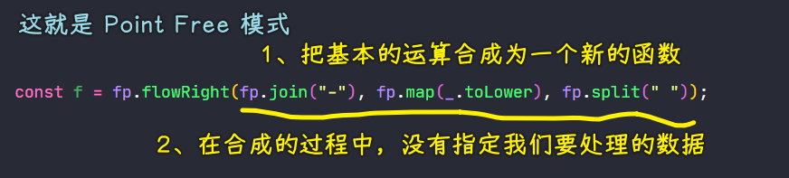
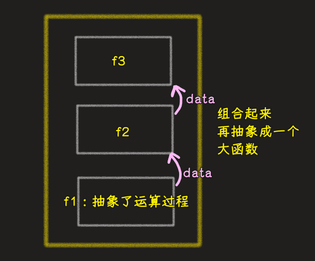
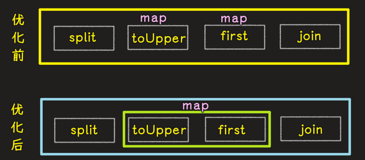

### ✍️ Tangxt ⏳ 2021-07-01 🏷️ functional programming

# 04-8-Pointfree、Pointfree-案例

## ★Point Free

Point Free 是一种编程风格，它的具体实现是函数的组合，而它更抽象一些

> 类似接口与实现

### <mark>1）概念</mark>

Point Free：

> 我们可以把数据处理的过程定义成与数据无关的合成运算，而在这个过程中，我们不需要用到代表数据的那个参数，我们只需要把简单的运算步骤合成（合并）到一起（**这其实就是函数的组合**），而在使用这种模式之前我们需要定义一些辅助的基本运算函数。

我们在使用函数组合的时候，也是需要提前定义一些基本的运算函数，当然，在 Lodash 里边也给我们提供了很多这样的基本函数

这个概念的内容比较绕口，我们可以把这段话提成三点：

- 不需要指明处理的数据
- **只需要合成运算的过程**
- 需要定义一些辅助的基本运算函数

之前我们在使用函数组合去处理问题的时候，其实就是一种 Point Free 模式

如：



👇：通过案例演示非 Point Free 模式和 Point Free 模式

需求：`Hello World => hello_world`

💡：非 Point Free 模式？

如何实现？ -> 按照传统思维方式，我们会先定义一个函数来接收要处理的数据 -> 在函数里边对数据进行处理，然后得到我们想要的结果 -> 这就是非 Point Free 模式

``` js
// 非 Point Free 模式
function f(word) {
  return word.toLowerCase().replace(/\s+/g, "_");
}
```

💡：Point Free 模式？

用 Point Free 模式解决这个问题：

1. 定义一些基本的运算函数
2. 把小函数合成为一个新的函数 -> 合成过程中，不需要指明我们要处理的数据

``` js
// Point Free
const fp = require("lodash/fp");
// replace 的三个参数 -> 正则、要替换的内容、要处理的数据
const f = fp.flowRight(fp.replace(/\s+/g, "_"), fp.toLower);
console.log(f("Hello World"));
```

可以看到在函数组合的过程中，是不需要指明要处理的数据的！

💡：回顾函数式编程的核心？

FP 的核心其实就是把运算过程抽象成函数，而 Point Free 模式就是把我们抽象出来的函数再合成成一个新的函数，而这个合成的过程其实又是一个抽象的过程，在这个抽象的过程中，我们依然是不用关心数据的



💡：小结？

从上边的案例中，我们可以看到，Point Free 的实现方式其实就是函数的组合！

👇：使用 Point Free 模式做一个案例

## ★Point Free 案例

需求：把一个字符串中的首字母提取并转换成大写，使用`. `作为分隔符，如`world wild web ==> W. W. W`

思路：

1. 字符串 -> 以空格为字符串的切割点 -> 数组
2. 数组 -> `map` -> 让每个元素都大写 -> 数组
3. 数组 -> `map` -> 拿到每个元素的大写首字母 -> 数组
4. 数组 -> 用`. `来`join`这些数组元素们为一个字符串 -> 字符串

> 在这个运算过程中，用到的这些方法，也许 Lodash 提供了，如果没有提供，那就自己实现呗！

实现代码：

``` js
const fp = require("lodash/fp");

// 函数的名字要有实际的意义，不要再像之前写个 f 就完事儿了
// 合意的名字对于 FP 来说非常重要
// 名字一定要有自描述性，毕竟这个函数将来还是要去使用的，甚至还会把这个函数重新组合成一个新的函数
const firstLetterToUpper = fp.flowRight(
  fp.join(". "),
  fp.map(fp.first),
  fp.map(fp.toUpper),
  fp.split(" ")
);

console.log(firstLetterToUpper("world wild web")); // W. W. W
```

目前，这个代码有一个小小的问题，那就是调用了两次`map` -> 意味着对数组做了两次循环，这样性能就会比较低一些

所以，如何只做一次循环呢？

改进后的代码：

``` js
const firstLetterToUpper = fp.flowRight(
  fp.join(". "),
  fp.map(fp.flowRight(fp.first, fp.toUpper)),
  fp.split(" ")
);
```

💡：对比两次组合？



## ★了解更多

➹：[Pointfree 编程风格指南 - 阮一峰的网络日志](http://www.ruanyifeng.com/blog/2017/03/pointfree.html)

➹：[Favoring Curry](https://fr.umio.us/favoring-curry/)

➹：[What's Point-free Programing? (point-free function syntax)](http://xahlee.info/comp/point-free_programing.html)

## ★总结

- Pointfree 模式能够帮助我们减少不必要的命名，让代码保持简洁和通用
- 对于函数式代码来说，Pointfree 是一个很好的试金石，因为它让我们知道我们有一些小函数，它们将输入转换为输出。例如，我们不能编写 `while` 循环
- Pointfree 是一把双刃剑（double-edged sword），有时会模糊意图
- 并非所有的函数式代码都是 Pointfree 的，不过这没关系。可以使用它的时候就使用，不能使用的时候就用普通函数
