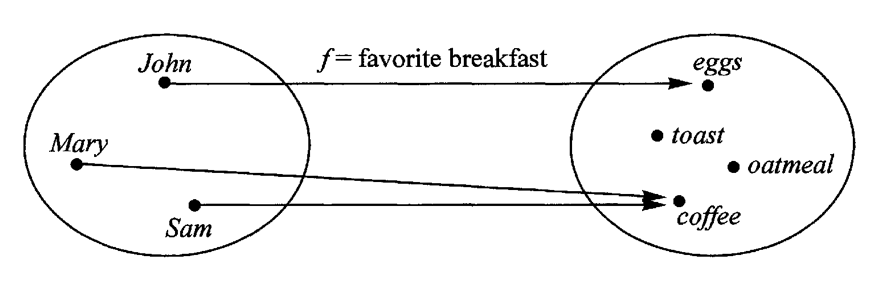
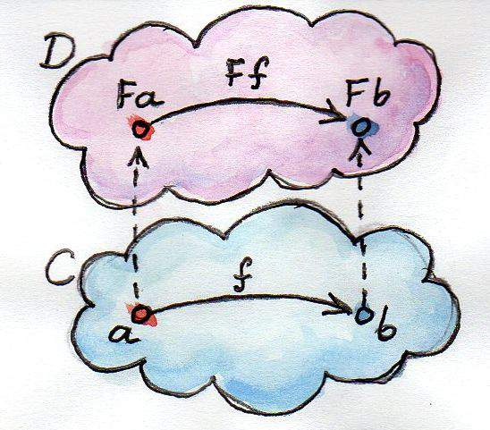

### ✍️ Tangxt ⏳ 2021-07-03 🏷️ functional programming

# 04-9-Functor、Functor 总结、MayBe 函子、Either 函子、IO 函子

## ★概述

函数不仅可以用于同一个范畴之中值的转换，还可以用于将一个范畴转成另一个范畴。这就涉及到了函子（Functor）。

1）函子的概念

函子是函数式编程里面最重要的数据类型，也是基本的运算单位和功能单位。

它首先是一种范畴，也就是说，是一个容器，包含了值和变形关系。**比较特殊的是，它的变形关系可以依次作用于每一个值，将当前容器变形成另一个容器**。

上图中，左侧的圆圈就是一个函子，表示人名的范畴。外部传入函数`f`，会转成右边表示早餐的范畴。

下面是一张更一般的图。

上图中，函数`f`完成值的转换（`a`到`b`），将它传入函子，就可以实现范畴的转换（`Fa`到`Fb`）。

💡：函子的代码实现？

- 任何具有`map`方法的数据结构，都可以当作函子的实现
- **一般约定，函子的标志就是容器具有`map`方法。该方法将容器里面的每一个值，映射到另一个容器**
- 函数式编程里面的运算，都是通过函子完成，即**运算不直接针对值，而是针对这个值的容器----函子**。函子本身具有对外接口（`map`方法），**各种函数就是运算符**，通过接口接入容器，引发容器里面的值的变形
- **学习函数式编程，实际上就是学习函子的各种运算**。由于可以把运算方法封装在函子里面，所以又衍生出各种不同类型的函子，有多少种运算，就有多少种函子。函数式编程就变成了运用不同的函子，解决实际问题

➹：[函数式编程入门教程 - 阮一峰的网络日志](http://www.ruanyifeng.com/blog/2017/02/fp-tutorial.html)

2）范畴，函子，张量

> 以前的数学是建立在集合论基础上的，遇到一个代数结构，总是取它的一个元素，然后再做各种操作，后来我们发现，其实我们研究的代数结构的性质，其实很多时候都是一些交换图表（最好的栗子就是同调代数：简直就是图集）。
> 
> 所以我们完全可以像电子地图一样，缩小一下，不要去看元素这么小的东西，看一个个集合就好了。以前元素是我们的点，现在一个个代数结构成为了新的点。那怎么用新的观点的语言来刻画这些点原来的性质呢？通过它和其它点之间的关系——映射来刻画，这就是所谓的万有性质。
> 
> 打个比方，把一个人比作一个代数结构，以前我们的研究方法是，看这个人衣服上有粉笔灰，我们猜测他是可能是个教书的；看他头发斑白，我们猜测他可能年事已高。现在我们的方法是，把这个人看作一个点，放到整个社会中去：他有一堆学生，所以他应该是个老师；有人管他叫爷爷，所以他年龄应该不小了。
> 
> **范畴（category）**就是所有这样的点（**对象，object**）和它们之间的关系（**态射，morphism**）这些数据构成的一个数据库，我们通过分析这些数据，得到一个个点的信息。
> 
> 但是代数学多了就知道，一旦我们定义了一种结构，我们就会研究结构和结构之间的映射。范畴也是一个结构呀（虽然大了点），所以两个范畴之间是不是也要有个映射什么的，于是就有了**函子（functor）**。
> 
> 两个范畴之间有很多函子，那这些个函子是不是也是一个个点，我们是不是又有了一个新的范畴，函子范畴，这个范畴里的态射是什么呢？我们再起个名字，叫**自然变换（natural transformation）**好了。
> 
> 范畴化的语言虽然有点 abstract nonsense 的嫌疑，但的确是很好用，它省去了很多重复劳动。
> 
> 至于张量积，就是一个范畴上再多加的一个结构罢了，不是那么本质的一个东西。

➹：[谁来介绍一下范畴，函子，张量？ - zero 的回答 - 知乎](https://www.zhihu.com/question/29915060/answer/47808872)

3）集合论

➹：[以数学史的观点来看，集合论是如何成为数学基础的？ - 知乎](https://www.zhihu.com/question/292487405/answer/483086345)

4）公理化

> 把我们的知识变成能让理想计算机识别的东西的过程，从某种意义上讲，就是“公理化”的过程

什么是公理化？

> 公理化思想就是任何真正的科学都始于原理，以它们为基础，并由之而导出一切结果。随着假设演绎模型法的进一步发展，经济学日益走向公理化方法。 公理化是一种数学方法。最早出现在二千多年前的欧几里德几何学中，当时认为“公理’（如两点之间可连一直线）是一种不需要证明的自明之理，而其他所谓“定理” （如三对应边相等的两个三角形全等）则是需要由公理出发来证明的，18 世纪德国哲学家康德认为，欧几里德几何的公理是人们生来就有的先验知识，19 世纪末，德国数学家希尔伯特 (David Hilbert) 在他的几何基础研究中系统地提出数学的公理化方法。

这与「三段论」有联系

> 三段论由三个部分组成：大前提、小前提和结论。逻辑上，结论是于小前提之上应用大前提得到的。大前提是一般性的原则，小前提是一个特殊陈述。

---

> “价格围绕价值波动”这个理念不能作为公理，**一个不证自明且不能再被推导的真命题才能作为公理，认识的原点**。这个不是真命题，每个人对价值的评判标准不一样，比如，为什么不是“波动的价格即价值”？投资做的难道不是差价？

Link

➹：[公理化方法_百度百科](https://baike.baidu.com/item/%E5%85%AC%E7%90%86%E5%8C%96%E6%96%B9%E6%B3%95)

➹：[公理化思维——结论正确的思考模式 - 知乎](https://zhuanlan.zhihu.com/p/148219861)

➹：[三段论 - 维基百科，自由的百科全书](https://zh.wikipedia.org/wiki/%E4%B8%89%E6%AE%B5%E8%AB%96)

➹：[直言三段论 - 维基百科，自由的百科全书](https://zh.wikipedia.org/wiki/%E7%9B%B4%E8%A8%80%E4%B8%89%E6%AE%B5%E8%AE%BA)

➹：[逻辑学 这个推论为什么不成立？- 知乎](https://www.zhihu.com/question/392002075)

➹：[三段论解决逻辑推理，你学会了吗？ - 知乎](https://zhuanlan.zhihu.com/p/48585269)

➹：[科学网-刘瑞祥：周延对三段论的作用-孙冰的博文](http://wap.sciencenet.cn/blog-3388899-1263013.html?mobile=1)

➹：[什么是亚里士多德的三段论？ - 知乎](https://www.zhihu.com/question/28975945)

➹：[什么是三段论的格？ - 知乎](https://zhuanlan.zhihu.com/p/65022482)

➹：[既然哥德尔已经证明了数学不能公理化，为什么物理学家还相信大一统呢？ - 知乎](https://www.zhihu.com/question/28078123)

➹：[谈方法论：公理化方法 - 知乎](https://zhuanlan.zhihu.com/p/34143450)

5）现代代数

➹：[有点基础的本科生应该如何理解现代代数？ - 知乎](https://www.zhihu.com/question/285161246/answer/512710419)

## ★Functor
