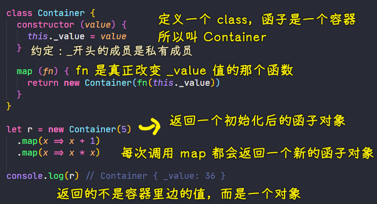

### ✍️ Tangxt ⏳ 2021-07-03 🏷️ functional programming

# 04-9-Functor、Functor 总结、MayBe 函子、Either 函子、IO 函子

## ★概述

函数不仅可以用于同一个范畴之中值的转换，还可以用于将一个范畴转成另一个范畴。这就涉及到了函子（Functor）。

### <mark>1）函子的概念</mark>

函子是函数式编程里面最重要的数据类型，也是基本的运算单位和功能单位。

它首先是一种范畴，也就是说，是一个容器，包含了值和变形关系。**比较特殊的是，它的变形关系可以依次作用于每一个值，将当前容器变形成另一个容器**。


上图中，左侧的圆圈就是一个函子，表示人名的范畴。外部传入函数`f`，会转成右边表示早餐的范畴。

下面是一张更一般的图。


上图中，函数`f`完成值的转换（`a`到`b`），将它传入函子，就可以实现范畴的转换（`Fa`到`Fb`）。

💡：函子的代码实现？

- 任何具有`map`方法的数据结构，都可以当作函子的实现
- **一般约定，函子的标志就是容器具有`map`方法。该方法将容器里面的每一个值，映射到另一个容器**
- 函数式编程里面的运算，都是通过函子完成，即**运算不直接针对值，而是针对这个值的容器----函子**。函子本身具有对外接口（`map`方法），**各种函数就是运算符**，通过接口接入容器，引发容器里面的值的变形
- **学习函数式编程，实际上就是学习函子的各种运算**。由于可以把运算方法封装在函子里面，所以又衍生出各种不同类型的函子，有多少种运算，就有多少种函子。函数式编程就变成了运用不同的函子，解决实际问题

➹：[函数式编程入门教程 - 阮一峰的网络日志](http://www.ruanyifeng.com/blog/2017/02/fp-tutorial.html)

### <mark>2）范畴，函子，张量</mark>

> 以前的数学是建立在集合论基础上的，遇到一个代数结构，总是取它的一个元素，然后再做各种操作，后来我们发现，其实我们研究的代数结构的性质，其实很多时候都是一些交换图表（最好的栗子就是同调代数：简直就是图集）。
> 
> 所以我们完全可以像电子地图一样，缩小一下，不要去看元素这么小的东西，看一个个集合就好了。以前元素是我们的点，现在一个个代数结构成为了新的点。那怎么用新的观点的语言来刻画这些点原来的性质呢？通过它和其它点之间的关系——映射来刻画，这就是所谓的万有性质。
> 
> 打个比方，把一个人比作一个代数结构，以前我们的研究方法是，看这个人衣服上有粉笔灰，我们猜测他是可能是个教书的；看他头发斑白，我们猜测他可能年事已高。现在我们的方法是，把这个人看作一个点，放到整个社会中去：他有一堆学生，所以他应该是个老师；有人管他叫爷爷，所以他年龄应该不小了。
> 
> **范畴（category）**就是所有这样的点（**对象，object**）和它们之间的关系（**态射，morphism**）这些数据构成的一个数据库，我们通过分析这些数据，得到一个个点的信息。
> 
> 但是代数学多了就知道，一旦我们定义了一种结构，我们就会研究结构和结构之间的映射。范畴也是一个结构呀（虽然大了点），所以两个范畴之间是不是也要有个映射什么的，于是就有了**函子（functor）**。
> 
> 两个范畴之间有很多函子，那这些个函子是不是也是一个个点，我们是不是又有了一个新的范畴，函子范畴，这个范畴里的态射是什么呢？我们再起个名字，叫**自然变换（natural transformation）**好了。
> 
> 范畴化的语言虽然有点 abstract nonsense 的嫌疑，但的确是很好用，它省去了很多重复劳动。
> 
> 至于张量积，就是一个范畴上再多加的一个结构罢了，不是那么本质的一个东西。

一个人是否牛逼，靠同行衬托……

➹：[谁来介绍一下范畴，函子，张量？ - zero 的回答 - 知乎](https://www.zhihu.com/question/29915060/answer/47808872)

### <mark>3）集合论</mark>

➹：[以数学史的观点来看，集合论是如何成为数学基础的？ - 知乎](https://www.zhihu.com/question/292487405/answer/483086345)

### <mark>4）公理化</mark>

> 把我们的知识变成能让理想计算机识别的东西的过程，从某种意义上讲，就是“公理化”的过程

什么是公理化？

> 公理化思想就是任何真正的科学都始于原理，以它们为基础，并由之而导出一切结果。随着假设演绎模型法的进一步发展，经济学日益走向公理化方法。 公理化是一种数学方法。最早出现在二千多年前的欧几里德几何学中，当时认为“公理’（如两点之间可连一直线）是一种不需要证明的自明之理，而其他所谓“定理” （如三对应边相等的两个三角形全等）则是需要由公理出发来证明的，18 世纪德国哲学家康德认为，欧几里德几何的公理是人们生来就有的先验知识，19 世纪末，德国数学家希尔伯特 (David Hilbert) 在他的几何基础研究中系统地提出数学的公理化方法。

这与「三段论」有联系

> 三段论由三个部分组成：大前提、小前提和结论。逻辑上，结论是于小前提之上应用大前提得到的。大前提是一般性的原则，小前提是一个特殊陈述。

---

> “价格围绕价值波动”这个理念不能作为公理，**一个不证自明且不能再被推导的真命题才能作为公理，认识的原点**。这个不是真命题，每个人对价值的评判标准不一样，比如，为什么不是“波动的价格即价值”？投资做的难道不是差价？

<details>
<summary style='padding-bottom: 0.5em;'>Link</summary>

<p>

➹：[公理化方法_百度百科](https://baike.baidu.com/item/%E5%85%AC%E7%90%86%E5%8C%96%E6%96%B9%E6%B3%95)

➹：[公理化思维——结论正确的思考模式 - 知乎](https://zhuanlan.zhihu.com/p/148219861)

➹：[三段论 - 维基百科，自由的百科全书](https://zh.wikipedia.org/wiki/%E4%B8%89%E6%AE%B5%E8%AB%96)

➹：[直言三段论 - 维基百科，自由的百科全书](https://zh.wikipedia.org/wiki/%E7%9B%B4%E8%A8%80%E4%B8%89%E6%AE%B5%E8%AE%BA)

➹：[逻辑学 这个推论为什么不成立？- 知乎](https://www.zhihu.com/question/392002075)

➹：[三段论解决逻辑推理，你学会了吗？ - 知乎](https://zhuanlan.zhihu.com/p/48585269)

➹：[科学网-刘瑞祥：周延对三段论的作用-孙冰的博文](http://wap.sciencenet.cn/blog-3388899-1263013.html?mobile=1)

➹：[什么是亚里士多德的三段论？ - 知乎](https://www.zhihu.com/question/28975945)

➹：[什么是三段论的格？ - 知乎](https://zhuanlan.zhihu.com/p/65022482)

➹：[既然哥德尔已经证明了数学不能公理化，为什么物理学家还相信大一统呢？ - 知乎](https://www.zhihu.com/question/28078123)

➹：[谈方法论：公理化方法 - 知乎](https://zhuanlan.zhihu.com/p/34143450)

</p>

</details>

### <mark>5）现代代数</mark>

➹：[有点基础的本科生应该如何理解现代代数？ - 知乎](https://www.zhihu.com/question/285161246/answer/512710419)

## ★Functor

目前，我们学习了 FP 的一些基础，比如纯函数、柯里化、函数组合等，而 FP 其实就是把一些运算抽象成函数，而将来这些函数可以做到最大化的重用！

另外，我们还知道了 FP 是建立在数学思想上的，如我们的纯函数其实就是数学中的函数

我们现在要学的函子其实也是建立在坚实的数学理论基础上的 -> 建立在范畴论的基础上 -> 关于范畴论，比较复杂，在这里就不细说了……

### <mark>1）为什么要学习函子？</mark>

我们在学习 FP 的过程中，还会去学习如何控制副作用，因为副作用可以让函数变得不纯，虽然副作用不好，但我们又没有办法完全避免它，所以我们应该尽可能地把副作用控制在可控的范围内 -> **我们可以通过函子来控制副作用，当然，除了这一点以外，我们还可以通过函子来去处理异常、进行异步操作等等……**

### <mark>2）什么是函子？</mark>


函子的英文叫「Functor」，要理解函子前，先来理解一下「什么是容器？」

💡：什么是容器？

一个容器它会包含值以及值的变形关系（这个值的变形关系其实就是一个函数），简单来说，一个容器里边包含了值，以及处理这个值的函数

💡：函子到底是啥？


函子，其实就是一个特殊的容器，我们可以把函子想象成一个盒子，而这个盒子里边有一个值，并且这个盒子要对外公布一个方法，而这个方法就叫做`map`，`map`方法会去接收一个参数，而这参数是一个对值进行处理的函数（变形关系），而这就是函子的基本概念了！

> 函子：是一个特殊的容器，通过一个普通的对象来实现，该对象具有 `map` 方法，`map` 方法可以运行一个函数对值进行处理（变形关系）

👇：用代码演示函子

### <mark>3）示例</mark>



目前，这个代码，每次要去创建函子的时候，都要去调用`new`来处理！ -> 这有点不方便，而且这很不像函数式编程，毕竟`new`操作符是面向对象编程的标志！

避免`new`关键字：


如果你需要打印容器里边的值 ，那就在`callback`里边打印就好了，而不是直接从函子对象里边取，如`r._value`

上边的示例，是可以让我们不停地`.`的 -> 这是链式编程

💡：不用`class`的写法？

``` js
const NumberBox = (number) => ({
  map: (fn) => {
    return NumberBox(fn(number));
  },
  value: number,
});

console.log(
  NumberBox(5)
    .map((x) => x ** 2)
    .map((x) => x + 5)
); // { map: [Function: map], value: 30 }
```

> 我比较喜欢这种写法，因为这更像 FP，毕竟没有`class`关键字！

💡：小结？

- 函子是一个具有`map`方法的对象
  - 我们在函子里边要维护一个值，而这个值永远不对外公布，就像是这个值被包裹在一个盒子里边
  - 想要对这个值进行处理，那就调用`map`方法，通过`map`方法传递一个处理值的函数，而`map`方法执行完会返回一个新的函子，所以我们就可以链式调用，不停地`.map`了！

## ★Functor 总结

* 函数式编程的运算不直接操作值，而是由函子来完成
* 函子就是一个实现了 `map` 契约的对象，也就是说所有的函子都有一个`map`对象
* 我们可以把函子想象成一个盒子，这个盒子里封装了一个值
* 如果我们想要去处理盒子中的值，那我们就需要给盒子的 `map` 方法传递一个处理值的函数（纯函数），由这个函数来对值进行处理 -> 该纯函数会返回一个值，这个值就是新的盒子里边的值
* 最终 `map` 方法返回一个包含新值的盒子（新的函子） -> 意味着可以链式调用
* 我们可以把不同的运算方法封装到函子中，所以我们可以衍生出很多不同类型的函子 -> 有多少运算就有多少函子，最终我们可以使用不同的函子来解决实际的问题

👇：演示目前所写的这个函子所存在的问题

问题：如果给函子的初始值是一个`null`，当`map`时，这会发生什么问题呢？

给`null`值可不是为了测试而故意传递的，这有可能是我们发送请求没有获取到值所传递进来的

我们期望容器里的是字符串，所以我们用了`toUpperCase`


这个代码执行出现了异常，意味着`callback`是不纯的，因为纯函数始终会对相同的输入有相同的输出，而此时为`null`时，居然没有输出，而且出现了异常，而这意味着我们所传入的`null`其实就是一个副作用，或者说引起副作用的东西，就像是你吃了一颗药拉肚子了

如何解决这个问题？或者说如何控制这个副作用？

👇：通过新的函子来处理空值的问题

## ★MayBe 函子

> 当可能会是空值的情况，我们可以通过 MayBe 函子来处理

当使用 Functor 函子的时候，我们传入了空值，当你调用其`map`方法时，会出现异常，而 MayBe 函子可以帮我们去处理空值的这种情况

简单来说：

* 我们在编程的过程中可能会遇到很多错误，需要对这些错误做相应的处理
* MayBe 函子的作用就是可以对外部的空值情况做处理（控制副作用在允许的范围） -> 外部传递空值，我们可以认为这是一种副作用，而 MayBe 函子可以控制这种副作用的发生

👇：演示 MayBe 函子

> 创建一个 MayBe 函子，要么 `new` `MayBe` 这个类，要么使用`MayBe`的静态方法`of` -> 反正 MayBe 函子是一个对象 -> `map`方法返回一个新的函子

``` js
// MayBe 函子
class MayBe {
  static of(value) {
    return new MayBe(value);
  }

  constructor(value) {
    this._value = value;
  }
  // 如果对空值变形的话直接返回 值为 null 的函子
  // 不然，就危险了……
  map(fn) {
    return this.isNothing() ? MayBe.of(null) : MayBe.of(fn(this._value));
  }

  isNothing() {
    return this._value === null || this._value === undefined;
  }
}

// 传入具体值
MayBe.of("Hello World").map((x) => x.toUpperCase());
// 传入 null 的情况
MayBe.of(null).map((x) => x.toUpperCase());
// => MayBe { _value: null }

// MayBe 函子的问题，虽然不会出现异常，但在执行过程中会出现 null
// 而什么位置出现 null，通过 log 的结果，我们是很难确定的，这里直接返回一个 null 是直接模拟一个复杂处理的返回 null 的情况，尤其当我们调用很多次 map 的时候，这 bug 所在是很难确定位置的！
let r = MayBe.of("hello world")
  .map((x) => x.toUpperCase())
  .map((x) => null)
  .map((x) => x.split(" "));
console.log(r); // MayBe { _value: null }
```

`MayBe`函子的运行过程：


`MayBe`函子的问题：

虽然我们可以去处理空值的问题，但是如果我们多次调用`map`方法的时候 -> 它哪一次出现空值，我们是不太明确的！

总之，在 `MayBe` 函子中，我们很难确认是哪一步产生的空值问题

如何解决这个问题？ -> 通过 `Either` 函子可以解决这个问题！

💡：其它写法？

``` js
const MayBeStringBox = (string) => ({
  map: (fn) => {
    return MayBeStringBox(string).isNothing()
      ? MayBeStringBox(null)
      : MayBeStringBox(fn(string));
  },
  isNothing: () => {
    return (
      MayBeStringBox(string).value === null ||
      MayBeStringBox(string).value === undefined
    );
  },
  value: string,
});
```

测试：

``` js
let r1 = MayBeStringBox("hello world")
  .map((x) => x.toUpperCase())
  .map((x) => null)
  .map((x) => x.split(" "));
console.log(r1);

// { map: [Function: map], isNothing: [Function: isNothing], value: null }

let r2 = MayBeStringBox("hello world").map((x) => x.toUpperCase());
console.log(r2);

// {
//   map: [Function: map],
//   isNothing: [Function: isNothing],
//   value: 'HELLO WORLD'
// }
```

当我看到这个测试，这传了一个对象：

``` js
const user = {
  name: "Holmes",
  address: { street: "Baker Street", number: "221B" },
};
console.log(
  MayBeStringBox(user)
    .map((u) => u.address)
    .map((a) => a.street).value
); // 'Baker Street'

const homelessUser = { name: "The Tramp" };
console.log(
  MayBeStringBox(homelessUser)
    .map((u) => u.address)
    .map((a) => a.street).value
); // null
```

我就把它的名字给改成`MayBe`了：

``` js
const MayBe = (string) => ({
  map: (fn) => {
    return MayBe(string).isNothing()
      ? MayBe(null)
      : MayBe(fn(string));
  },
  isNothing: () => {
    return (
      MayBe(string).value === null ||
      MayBe(string).value === undefined
    );
  },
  value: string,
});
```

大佬写的`Maybe`函子：

``` js
const isNothing = (value) => value === null || typeof value === "undefined";

const Maybe = (value) => ({
  map: (fn) => (isNothing(value) ? Maybe(null) : Maybe(fn(value))),
  value,
});
```

非常的简洁！

---

为啥叫`Maybe`？

当你这样写：

``` js
const street = user.address.street;
```

显然，会很容易发生报错，如


因此，就会有这样的校验代码：

``` js
const street = user && user.address && user.address.street;
```

于是，就有了`Maybe`函子：

> I can use the functor pattern to handle such cases. The idea is to create a placeholder to hold sometimes a value, and sometimes nothing. Let's call this functor `Maybe`.

有时盒子里边会占有一个值，有时啥也没有！ -> 也许它里边有一颗糖，也许它里边啥也没有 -> 啥也没有的时候，意味着你不能从「无的盒子」映射出「有的盒子」，即你不能凭空诞生出一个东西来！ -> 一次为`null`，下次次都为`null` -> `null`没有可以被计算的价值……

## ★Either

`Either`这个单词的意思是「两者中的任何一个」，使用`Either`去处理问题的时候，就类似于 `if...else...`的处理过程

之前使用`Maybe`函子的时候，当我们传入`null`的时候，我们不会去处理`map`的参数`fn`，仅仅返回一个值为`null`的函子，而且，不会给出任何有效的信息，不会告诉我们哪块出了什么问题

而我们现在就使用`Either`函子来解决这个问题 -> 当出现问题的时候，`Either`函子会给出有效的提示信息

一个函数中如果出现异常会让这个函数变的不纯，而`Either` 函子也可以用来做异常处理

👇：如何实现 `Either` 函子？

由于是二选一，所以需要定义两种类型 -> `Left`和`Right`

实现：


使用这两个类（找出它们俩的区别）：


`map`方法对`Left`函子的值没有做任何处理！

然，为啥要不处理呢？


使用`map`测试，更进一步来理解为啥`Left`函子不处理？


---

小结：

通过`Either`函子去处理异常，并且我们可以在一个`Left`函子中记录这个出错的信息…… -> `Either Right or Wrong`

💡：其它写法？

为什么需要`Either`函子？

有这样一段代码：

``` js
const validateEmail = (value) => {
  if (!value.match(/\S+@\S+\.\S+/)) {
    throw new Error("The given email is invalid");
  }
  return value;
};

validateEmail("foo@example.com"); // 'foo@example.com'
validateEmail("foo@example"); // throw Error('The given email is invalid')
```

这样抛出异常，会中断执行流程，即直接在控制台弹出一个红红的错误信息，我们想要的是它不会抛出错误，而是可能会返回一个值或一个错误

问题来了，如何用函子来做到这一点呢？

1. 基于`try/catch`，返回一个不同`functor`
   1. 一个允许我继续`map`的函子 -> `Right`
   2. 另一个则是不管我如何继续`map`都不会更改其值的函子（如果这是一个错误） -> `Left`

``` js
const validateEmail = value => {
  if (!value.match(/\S+@\S+\.\S+/)) {
    return Left(new Error("The given email is invalid"));
  }
  return Right(value);
};
```

`Left`函子不应该再改变它的值了，无论传递给它的`map`的函数是什么：

``` js
const Left = value => ({
  map: fn => Left(value),
  value,
});

Left(5).map(v => v * 2).value; // 5
```

至于`Right`函子，它只是简单的将一个函数透明地应用到它的值上，当然，你也可以称它为`Identify`函子：

``` js
const Right = value => ({
  map: fn => Right(fn(value)),
  value,
});

Right(5).map(v => v * 2).value; // 10
```

现在，我们就可以对`email`值进行链式的`map`调用了：


回到开头那个问题：


---

左函子（`Left`）和右函子（`Right`）构成了我们称之为“非此即彼”（`Either`）函子

💡：进一步理解`Either`函子？

`validateEmail` 返回一个结果或一个错误，但这不允许我在出现错误时做一些特定的事情。例如，我可能希望捕获 `Error` 并记录它的 `message` 属性

向左函子和右函子添加一个`catch()`函数来实现这一点：


为了更好地重用，我将这些左右函子组合成一个通用的 `tryCatch` 函数：

``` js
const tryCatch = fn => value => {
  try {
    return Right(fn(value)); // everything went fine we go right
  } catch (error) {
    return Left(error); // oops there was an error let's go left.
  }
};
```

现在，我可以使用这个新的`tryCatch`函数来修饰`validateEmail`的初始实现，并返回一个左函子或右函子。

``` js
const Right = (value) => ({
  map: (fn) => Right(fn(value)),
  catch: () => Right(value),
  value,
});

const Left = (value) => ({
  map: (fn) => Left(value),
  catch: (fn) => Right(fn(value)),
  value,
});

// 高阶函数
const tryCatch = (fn) => (value) => {
  try {
    return Right(fn(value)); // everything went fine we go right
  } catch (error) {
    return Left(error); // oops there was an error let's go left.
  }
};

const validateEMail = tryCatch((value) => {
  if (!value.match(/\S+@\S+\.\S+/)) {
    throw new Error("The given email is invalid");
  }
  return value;
});

// 闭包
const get = (key) => (value) => value[key];

let r = validateEMail("foo@example.com")
  .map((v) => "Email: " + v)
  .catch(get("message")).value;

console.log(r); // 'Email: foo@example.com'

let r1 = validateEMail("foo@example")
  .map((v) => "Email: " + v)
  .catch(get("message")).value;
console.log(
  typeof validateEMail("foo@example").map((v) => "Email: " + v).value
); // 'object'
console.log(new Error("The given email is invalid").message); // "The given email is invalid"
// 把 get('message') 看作是：盒子里边的值是对象，拿到该对象的 message 属性值，并把该值作为新盒子的 value 值
console.log(r1); // 'The given email is invalid'
```

## ★IO 函子

目前，我们对函子已经有了一个简单的认识，我们可以把函子想象成一个盒子，盒子里头保存一个值，然后调用盒子的`map`方法，我们可以传入一个函数，通过这个函数对盒子里边的值进行处理，再把这个函数处理的返回值作为新函子的值！

👇：学习一个新的函子——IO 函子

### <mark>1）IO 函子</mark>

IO 是 Input Output 的意思，即输入输出

IO 函子跟我们之前学过的函子不同在于：

- 它内部的 `_value` 始终是一个函数，因为函数是一等公民，所以在这里是把函数作为值来处理的
- IO 函子可以把不纯的动作都给它存储到 `_value` 中，`_value`中存储的是函数，在函子内部并没有调用这个函数，通过 IO 函子我们其实是延迟执行了这些不纯的操作（也就是相当于是惰性执行），我们通过 IO 函子先包装一些函数，当我们需要的时候，再来执行这些函数 -> 为啥这样做？ -> 因为 IO 函子中存储的这个函数有可能是不纯的！但是通过 IO 函子把它包装起来之后，那么我们当前的操作就是一个纯的操作了！ -> **我们把不纯的操作延迟到调用的时候** -> 总之，**有了 IO 函子，我们就可以把各种不纯的操作装进盒子（笼子）里**，但是，这些不纯的操作最终都要去执行的 -> 我们可以**把这些不纯的操作交给调用者来处理** -> 这很像我们工作时的甩锅现象

💡：IO 函子的实现？

``` js
// IO 函子
const fp = require("lodash/fp");

class IO {
  // value 是一个数据
  static of(value) {
    // 给创建的 IO 函子传递的是一个函数，该函数把值包裹起来了！
    return new IO(function () {
      // 把求值的过程延迟处理了，想要这个数据，那就调用 IO 函子的 value 函数
      return value;
    });
  }
  // fn 是一个函数
  constructor(fn) {
    this._value = fn;
  }

  map(fn) {
    // 把当前的 value 和 传入的 fn 组合成一个新的函数，该新函数作为新 IO 函子的值
    return new IO(fp.flowRight(fn, this._value));
  }
}

// 调用
// 把 process 这个数据包装到 IO 函子的 _value 里边，即函数里边
// 当我们需要这个 process 数据时，那就调用 _value 呗！
let r = IO.of(process).map((p) => p.execPath);
console.log(r);
console.log(r._value());
console.log(process.execPath);

// IO { _value: [Function (anonymous)] }
// D:\nodejs\node.exe 
// D:\nodejs\node.exe
```

IO 函子的`map`过程：


总结：


IO 函子内部帮我们包装了一些函数，我们传递给`map`的函数，有可能这个函数是一个不纯的操作，但我们不管这个函数是纯的还是不纯的，因为`IO.of……`在执行的过程中，所返回的结果`r`始终是一个纯的操作，总之，IO 函子中有可能包裹着不纯的操作，但是，当前`IO.of(process).map((p) => p.execPath)`这个代码的执行始终是一个纯的操作，即调用`map`方法始终会返回一个 IO 函子，但 IO 函子里边的这个`_value`里边所保存的函数，由于它是一个组合了很多函数的函数，所以`_value`里边有可能是不纯的，因此，我们把这些不纯的操作，延迟到了`r._value()`这样调用的时候，也就是说**我们通过 IO 函子控制了副作用在可控的范围内发生**

💡：其它写法？

第一次想的写法：

``` js
const IO = (data) => ({
  value: () => data,
  map: (fn) => IO(fp.flowRight(fn, IO(data).value)),
});

let r = IO(process).map((p) => p.execPath);
console.log(r);
console.log(r.value()());
console.log(process.execPath);
```

显然是不行的……`IO`函子这个盒子里边存的值是一个函数啊！

第二次想的写法：

``` js
const fp = require("lodash/fp");
const path = require("path");

const IO = (value) => ({
  value,
  map: (fn) => IO(fp.flowRight(fn, IO(value).value)),
});

let r = IO(() => process)
  .map((p) => p.execPath)
  .map((p) => p.split(path.sep).join("/"))
  .map((p) => p.replace(/^([a-zA-Z]:)/, `/${p.toLowerCase()[0]}`));
console.log(r);
console.log(r.value());
console.log(process.execPath);

// { value: [Function (anonymous)], map: [Function: map] }
// /d/nodejs/node.exe
// D:\nodejs\node.exe
```

➹：[Nodejs 小知识--- Linux 与 Windows 下路径分隔符问题 - 知乎](https://zhuanlan.zhihu.com/p/115746564)

➹：[Path - Node.js v16.4.2 Documentation](https://nodejs.org/api/path.html#path_path_sep)

💡：POSIX 是什么标准？

POSIX，Portable Operating System Interface -> 定义了一套操作系统必须实现的 API

`/d/nodejs/node.exe`的路径分隔符是 POSIX 标准下的

Windows 支持这个 POSIX 标准，意味着很多只有在 Linux、Unix、MAC 等操作系统的应用程序都可以在 Windows 下使用 -> 更多的应用，就代表着更多的用户

➹：[POSIX 是什么标准？为什么 Windows 也要支持他？ - 知乎](https://www.zhihu.com/question/21048638)

➹：[POSIX 是什么？让我们听听 Richard Stallman 的诠释 - 知乎](https://zhuanlan.zhihu.com/p/78080748)
