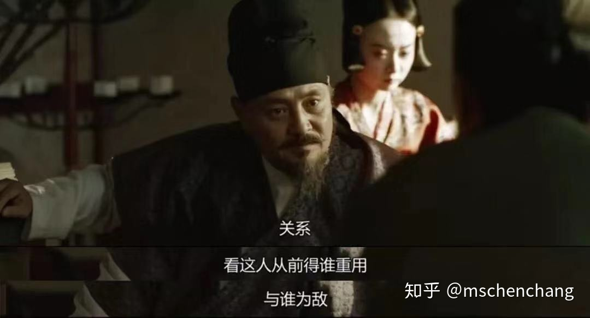
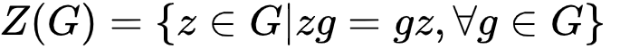

### ✍️ Tangxt ⏳ 2021-06-03 🏷️ faq

# 04-FAQ

1）范畴论和函数式编程？

对一个 object 的认识，可以是看 ta 的组成（细分再细分：分子，原子，原子核，等等...），这是集合论的思想，但是也可以是看 ta 与其他 object 的关系，这是范畴论的思想。其实这个思想对于中国人而言，倒是真的不陌生，远在唐朝时期， 我们就知道：

下属当然困惑，既然你这不信，那不信，“那当如何断人？” **林右相回答**：

举例，集合论的观点与范畴学的观点的区别: 比如说，中心，这个概念，我们熟悉的定义是， 一个群 G 的中心是：

所以说，用范畴学的观点将一件事情说清楚之所以难，就是我们的祖先说的只可意会，不可言传，将意会的东西说清楚，就需要很多很多的铺垫，背景。

> 可以用集合论的思想来看 OOP，而 FP 则可以用范畴论的思想来看！

➹：[范畴学--精神与细节 - 知乎](https://zhuanlan.zhihu.com/p/76517907)

➹：[语言学和范畴论是什么关系？ - 知乎](https://www.zhihu.com/question/294295690)

➹：[怎样学范畴论？ - 知乎](https://www.zhihu.com/question/20448295)