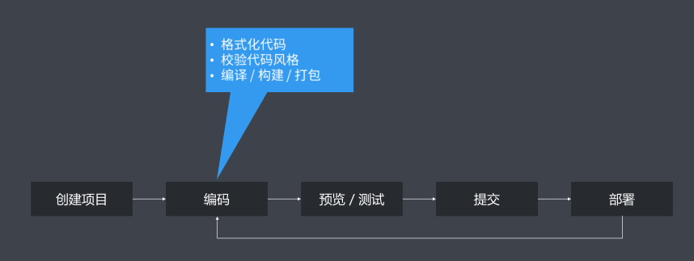

### ✍️ Tangxt ⏳ 2021-10-21 🏷️ 工程化

# 01-工程化的定义和主要解决的问题、一个项目过程中工程化的表现、工程化不等于工具、工程化与 Node.js

## ★工程化的定义和主要解决的问题

### <mark>1）工程化的定义</mark>

前端工程化是指遵循一定的标准和规范，通过工具去提高效率，降低成本的一种手段。

这些年被广泛的关注和探讨，究其原因，主要是因为前端应用现在功能要求不断提高，业务逻辑日益复杂。作为当下互联网时代唯一不可或缺的技术，前端可以说是占据了整个开发行业的半壁江山。从传统的网站到现在的 H5、移动 App 、桌面应用以及小程序，前端技术几乎是无所不能的全面覆盖。

在这些表象的背后，实际上是前端行业对我们开发人员的要求发生了天翻地覆的变化。

以往这种写 Demo、套模板，然后再去调页面，这种刀耕火种的方式已经完全不符合当下对开发效率的要求了，而前端工程化就是在这样一个背景下被提上台面，成为咱们前端工程师必备的手段之一。

### <mark>2）主要解决的问题</mark>

我们都说技术往往是为了解决问题而存在的，前端工程化也不例外。

我这里先列举一些大家在日常开发过程当中经常会面临的一些问题。

#### <mark>1、我这样写，浏览器真得能支持吗？</mark>

比如我们想要在开发过程当中使用 ES6、 ES7 这些新的特性去提高我们的编码效率，但我们实际去用的时候会发现兼容有问题。

再比如我们想要去使用 Less 或者 Sass 或者 PostCSS 这样的工具去提高我们 CSS 的编程性，但是这种工具在我们的运行环境当中是没有办法直接被支持的。

再一个就是我们想要去使用像模块化或者组件化的方式去提高我们项目的可维护性。但是这两种方式，在我们实际运行环境当中同样也不能直接被支持。

#### <mark>2、我与重复不共戴天</mark>

除了这些支持的工作以外，还有一些我们在开发过程当中经常会手动去做的一些重复性工作也比较明显。

比如我们像做部署上线之前，我们需要去手动的去压缩资源文件。在部署过程，我们又需要把代码手动的上传到服务器，而这些手动的操作实际上经常会出现各种各样的问题，如果用机器去取代人去做这种重复性的手动操作，这实际上是非常合理的，因为机器不会像人一样经常犯错误。

除了这些之外，还有就是我们在做多人协同开发的时候，我们很难去硬性统一大家的代码风格。另外，从仓库当中`pull`回来的代码质量也没有办法保证，有时候经常会出现我们从仓库当中把代码拉回来，拉回来会发现我们原本好好的一个项目现在又崩溃了，这都是一些问题。

除了这些我们在编码过程当中的问题，还有就是我们在去开发具体功能的时候，会发现有很多的功能我们需要去等待后端接口服务提前完成，我们才可以去做具体的编码，那这个都是我们在没有工程化之前，我们经常面临的一些比较典型的问题。当然这不仅仅包含这些。

### <mark>3）总结</mark>

我这儿将这些问题归纳总结成以下这么几点。

- 第一点就是传统语言或者语法带来的弊端
- 再一个就是我们没有办法直接去使用模块化或者组件化这样的方式去组织我们的代码
- 还有就是我们在日常开发过程当中有大量的重复式的机械的工作
- 还有就是我们很难去统一各个开发人员之间的编码风格以及对我们仓库的代码做质量保证
- 最后就是我们在开发的过程当中，整个前端项目对后端的依赖是非常严重的。这不仅仅是我们在编码的时候，还有我们在部署的时候，因为我们需要把我们的项目打包放到后端项目当中才可以去做部署工作，那这些都是我们产生对后端强依赖的这样一个原因

接下来我们就要去看一看有了工程化过后，这样的一些问题怎么样被得到解决或者说工程化在这样一些问题的解决过程当中，它是如何表现的？

## ★一个项目过程中工程化的表现

接下来我们就以最简单的项目开发流程为例，来去看一看前端工程化在这个过程当中的表现，让大家先从整体的角度对前端工程化有一个全面的认识。

我们从项目的这个创建，到编码，再到预览，再到提交，最后到部署，而这每一个环节我们实际上都可以通过工程化的方式大大提高我们的效率。

### <mark>1）创建项目</mark>

具体来说我们可以在创建项目的过程当中，使用脚手架工具，自动地去帮我们完成基础结构的搭建。

### <mark>2）编码</mark>

再到编码环节，我们可以借助于工程化的工具，自动化地去帮我们做一些代码格式化以及代码风格的校验，从而去确保我们每一个开发人员写出来代码都是相同的风格。

除此之外，我们还可以借助一些编译工具，让我们在开发阶段可以直接去使用一些新的特性来提高我们代码编码的这个效率。

### <mark>3）预览 / 测试</mark>

到了预览环节，传统的预览环节，我们可能需要借助于阿帕奇（Apache）或者像 Nginx 这样的 Web 服务器去提供一个基础的 Web 服务，让我们的应用可以在上面运行起来，但是这种传统的 Web 服务，它是没有办法提供一些热更新的体验的，所以我们可以借助于一些现代化的 Web server 提供这种热更新的体验 -> 热更新具体来说就是我们在编码完成过后，就可以在浏览器里面直接看到最新的结果，不用我们自己手动的去刷新 -> 这个实际上是一个非常友好的开发体验。

除此之外还有就是我们在开发阶段肯定会用到编译，而编译就涉及到我们在实际编写的代码和最终运行的代码，然后它们之间有一个转换。那这个时候如果说你实际运行过程当中出现了一些问题，那你就需要去定位源代码对应的位置，所以我们就需要借助于像 Source Map 这样的工具去完成。

除此之外，我们还可以有一些 mock 的方式去解决我们在后端服务未完成的情况下，我们怎么样去提前开发我们具体的业务功能。那这个实际上也就是我们常说的**写假接口**的方式，只不过这个假接口是跟我们真实的后端接口是以**相同的规格**存在的。

### <mark>4）提交</mark>

到了代码提交环节，我们就可以使用像 Git Hooks 这样的方式去自动化的在我们代码提交之前去做项目整体的检查。这个包括**项目质量的检查**以及**项目代码风格的检查**。这就确保我们不会把有问题的代码提交到仓库当中，这样也就解决了我们之前所说的从仓库当中拉回来代码有问题的这种情况。

除了我们可以对项目的质量做检查之外，我们甚至连提交的提交日志，也就是我们说的 Git Log 也都可以做严格的格式限制。那这样一来，我们就可以在日后做这个回滚的时候有很大的一个参考价值了。

### <mark>5）部署环节</mark>

在部署环节，我们工程化表现的地方就更多了，我们可以用一行命令去代替传统的 FTP 上传，甚至还可以去实现在代码提交过后，自动化的通过持续集成或者持续部署的方式来自动将我们的代码部署到服务器，那这也就避免了我们自己手动人为去操作产生那些不稳定因素。

---

以上就是这个工程化在一个非常简单的项目过程当中所表现的一些具体事项。那接下来，我们要去看一些过程化相关的一些细节。

## ★工程化不等于工具

这里有一个需要单独跟大家强调的问题，那就是工程化并不等于某一个具体的工具。

### <mark>1）为什么说「工程化不等于工具」？</mark>

为什么这样说呢？

因为在现阶段有部分的工具它过于强大。你比如说像 Webpack，那就导致了很多新手就误认为工程化就是指 Webpack，你只要用了 Webpack 就代表有了工程化，其实不是这样的。**工具，并不是工程化的核心**。

工程化的核心应该是**对项目整体的一种规划或者架构**，而工具在这个过程当中只是用来去帮我们落地去实现这种规划或架构的一种手段。

### <mark>2）完成一个非常普通的项目，我们需要规划哪些东西？</mark>

我们以一个非常普通的项目为例：

我们落实工程化的第一件事应该是像我图中所给出来的这样：

我们去规划一个项目整体的工作流架构，那这其中就包括我们要去规划文件的组织结构，我们源代码的开发范式 -> 开发范式指的就是我们使用什么样的语法、什么样的规范、什么样的标准去编写我们的代码。

再一个就是我们要通过什么样的方式去做前后端的分离。我们是基于 Ajax 去做分离，还是基于中间层去做分离？那这一些都是我们在一开始的时候先明确的一个规划。

有了这些整体的规划过后，我们再具体去考虑我们应该选择搭配哪些工具，做哪些具体的配置选项，来去实现我们工程化整体的一个规划，这才是一个工程化应该有的过程。

### <mark>3）不知道怎么搞工程化？</mark>

当然，你也可以从一些成熟的集成式的工程化方案当中找到一些思路。你比如像 create-react-app、vue-cli、 angular-cli 还有像 gatsby-cli 这样的工具。

很多人说这些工具实际上就是官方给出的脚手架，其实不是这样的。不同于我们之前提到的工具，这里我们列出来的工具，它其实应该属于特定类型的项目官方给出的**集成式工程化方案**。

为什么这样说呢？

我们就拿 vue-cli 来给大家举个例子，你 vue-cli 它不仅仅帮我们创建了项目，它更多的是**约定**了我们 Vue 的项目应该是一个什么样的结构，比如它有什么 `public` 目录、有 `src` 目录以及有一些特定的文件，而这是 vue-cli 提供的一个约定。除了这个约定之外，它还给你提供了一些工具，让你可以有热更新的开发服务，还有自动的去编译 Vue 单文件组件以及一些其他的模块文件。

除此之外还可以去做一些代码风格的校验，也就是我们说的 lint ，那这些实际上都是集成在 vue-cli 内部的一些 service 当中的。

我们再回来去看 vue-cli，我们就会发现**它主要做的并不是帮我们创新项目，更多的还是后面那一系列的东西，而那一系列的东西实际上就是我们刚刚所说工程化里面最主要的几个维度**。

所以说像这些工具，我们可以把它称之为**工程化的集成**。

了解了这个过后，你再来去反观（反过来看；从相反的角度来观察）工程化是不是等于一个工具，你就应该很清晰了。

## ★工程化与 Node.js 

当然了，我认为工程化的一切都应该归功于 Node。

之前有人说 Ajax 给前端带来了新的生命力，那我个人就觉得 Node 对于前端而言，它除了让 JavaScript 有了一个新的舞台，它更多的是让我们整个前端行业进行了一次工业革命。可以毫不夸张地说，没有 Node.js 就没有今天的前端，而且在接下来很长一段时间当中，我们用到的工具几乎都是用 Node.js 去开发的，所以说我认为前端工程化是由 Node.js 强力驱动的。

除了这一些以为，工程化在我看来实际上是一个非常庞大的概念，而且这个过程它也不断的在成长和发展。那值得强调的是，**不管它如何发展，它始终都是为了解决问题而存在的，切莫为了技术而技术**。

接下来我们会通过架手架工具开发、自动化构建系统、模块化打包以及项目代码规范化，还有自动化部署这五个专题，去具体学习如何在这些维度去落实（落到实处，得到实现 -> 也就是实现）前端工程化。
