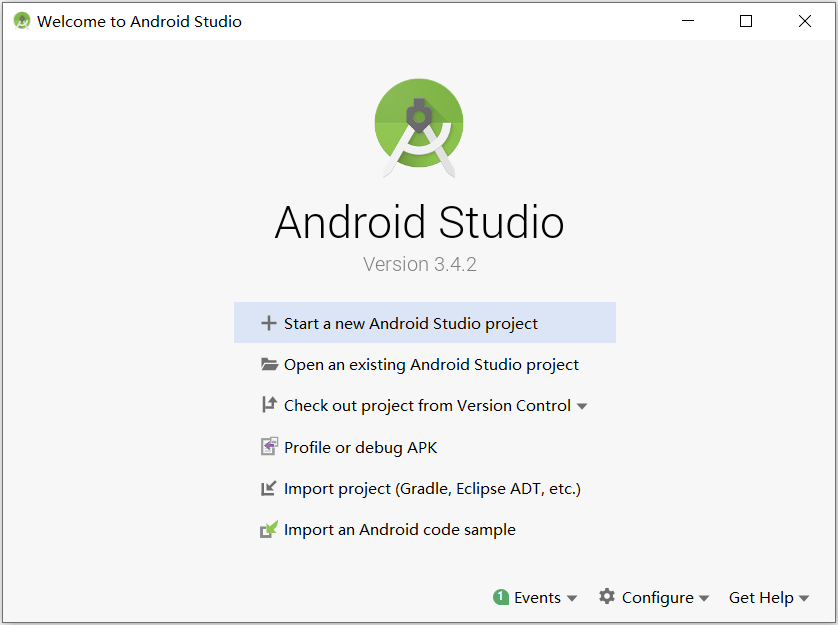
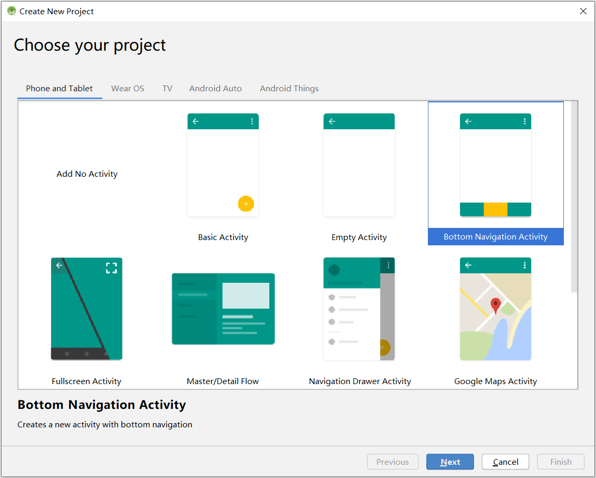
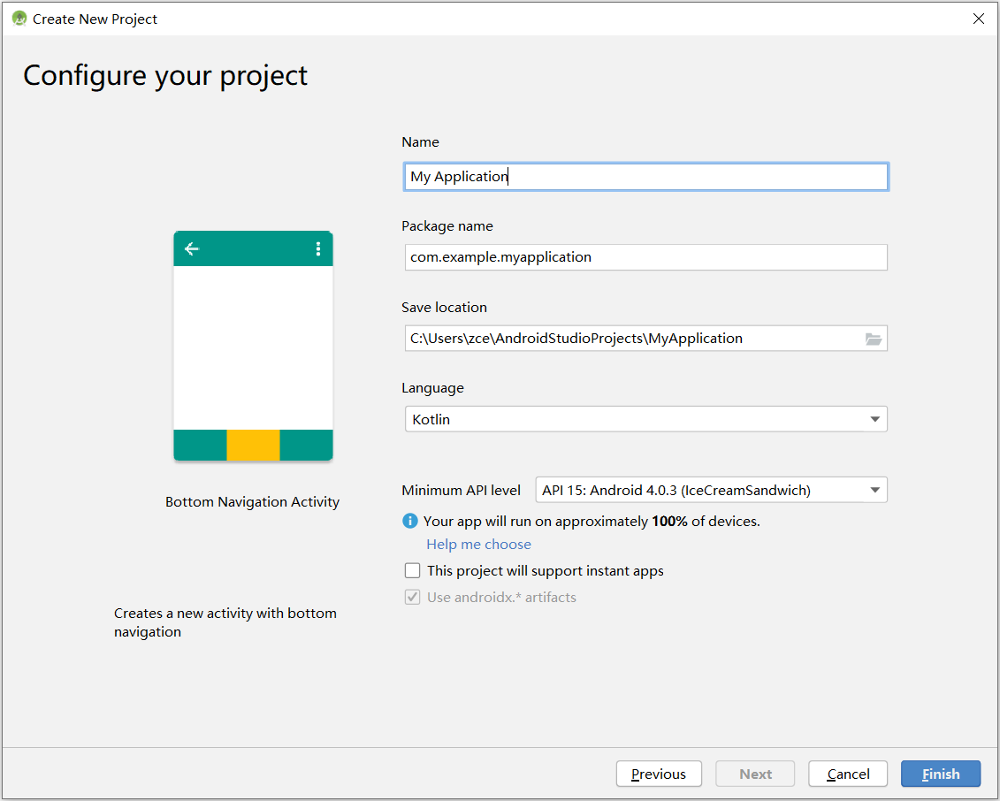
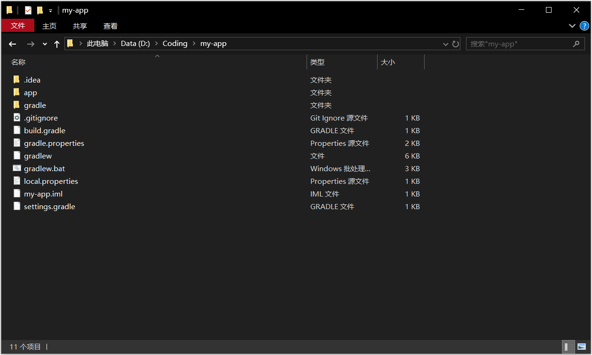
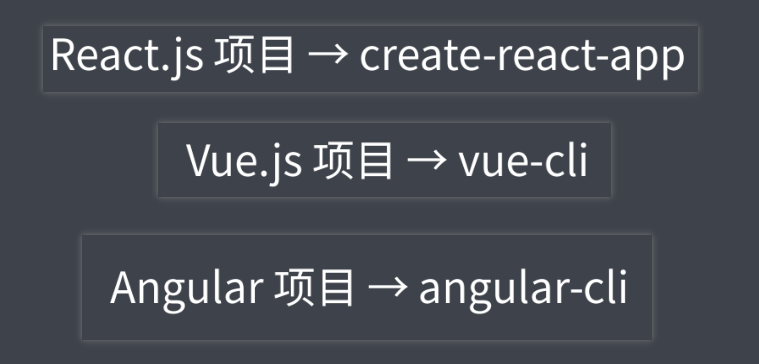

### ✍️ Tangxt ⏳ 2021-10-22 🏷️ 工程化

# 02-脚手架工具概要、常用的脚手架工具

## ★脚手架工具概要

在对前端工程化的整体有了初步的认识之后，我们就顺着一个项目的开发过程，先从脚手架开始去探讨前端工程化在项目创建环节当中的表现。

### <mark>1）脚手架是什么？</mark>

脚手架可以简单的理解为 -> 就是用来**自动地**去帮我们创建项目基础文件的**一个工具**。

这看似很普通的一个需求，其背后却包含一定的哲学。因为除了创建文件，它更重要的是**提供给开发者一些约定和规范**。通常，我们再去开发相同类型的项目时，都会有一些相同的约定。这其中包括我们会有相同的文件组织结构、相同的代码开发范式、相同的模块依赖，甚至还会有一些工具的配置是一样的，在最后甚至连一些基础的代码，我们在这些项目当中都是一样的。这样一来就会出现我们**在搭建新项目时有大量的重复工作要做**。脚手架工具就是用来去解决这样一类问题的，我们可以通过脚手架工具去**快速搭建特定类型的项目骨架**，然后去**基于这骨架进行后续的开发工作**。

### <mark>2）能不能具体解释一下「什么是脚手架？」</mark>

如果你用过一些类似于 VS Studio 或者是 Eclipse 这样大型的 IDE 的话，那他们创建项目的过程实际上就是一个脚手架的工作流程。

我们这儿以 Android Studio 为例，从点击创建新项目开始，就进入了这个 Android Studio 内置的一个脚手架工作流程。

然后我们可以先去选择一个项目的类型：

再去填写一些项目相关的属性和配置：

最后我们就可以得到一个 Android 项目最基础的一个骨架 -> 这里面默认的一些代码和结构都会自动的去帮我们生成。

### <mark>3）前端脚手架</mark>

而在前端项目创建过程当中，由于前端技术**选型比较多样**，另外又**没有一个统一的标准**，所以前端方向的脚手架一般不会集成在某一个 IDE 当中，它都是**以一个独立的工具存在**，而且相对会复杂一些，但是本质上脚手架的目标都是一样的，因为它们都是**为了解决我们在创建项目过程当中那些复杂的工作**。

接下来我们就先对一些常用的脚手架工具去做一些全面的介绍，然后我们再通过对一款通用的脚手架工具进行剖析，最后我们去开发一款自己的脚手架工具。

通过这么几个环节，增强大家对于脚手架工具的一个理解和使用。

## ★常用的脚手架工具

在这里先跟大家介绍几个常用的脚手架工具。

### <mark>1）你用什么框架，那你就用该框架给你提供给的脚手架工具呗</mark>

目前市面上有很多成熟的前端脚手架工具，但是这大都是**为了特定项目类型服务**的。

例如：

- 我们在 React.js 项目当中，我们可以使用 create-react-app 
- 在 Vue.js 项目当中，我们可以使用 vue-cli
- 在 Angular 项目当中，我们使用 angular-cli

这些工具它们的实现方式都大同小异，无外乎都是**根据你提供的一些信息，自动去生成一些项目所需要的特定文件以及相关的一些配置**。

不过，他们**一般只适用于自身所服务的那个框架的项目**。

### <mark>2）Yeoman</mark>

还有一类，是以像 Yeoman 这样的工具为代表的**通用型项目脚手架工具**。

他们可以根据一套模板生成一个对应的项目结构。这种类型的脚手架**一般都很灵活，而且很容易扩展**。

### <mark>3）Plop</mark>

除了以上说的这种在创建项目时才会用到的脚手架工具以外，还有一类脚手架也非常有用。

代表性的工具叫做 Plop，他们用来在项目开发过程当中，用于去创建一些特定类型的文件。

例如我们要想在一个组件化的项目当中，我们去创建一个新的组件或者是在一个模块化的项目当中，我们要去创建一个新的模块。那这些模块和组件一般是由特定的几个文件组成的，而且每一个文件都有一些基本的代码结构。所以这相对于我们手动一个一个去创建的话，显然，脚手架会提供更为便捷、更为稳定的一种操作方式。

---

了解了这些工具过后，接下来我们挑几个有代表性的工具做深入的探究。

