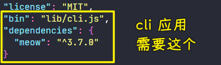

### ✍️ Tangxt ⏳ 2021-10-22 🏷️ 工程化

# 03-Yeoman 简介、Yeoman 基础使用、Sub Generator、Yeoman 使用步骤总结

## ★Yeoman 简介


时至当下 React.js 和 Vue.js 还有 Angular 大行其道（指某种思想主张或行为方式等一时非常流行） -> 这些框架的官方都提供了更为集成的脚手架工具链。所以说大家在谈论到脚手架时，往往最先想到的都是像 angular-cli 和 vue-cli 这样的工具。

对于这一类的工具，因为它太过针对于某一个框架，而且在使用上也非常的普及，我们这儿就不做过多的介绍。

这里我们着重的去探讨 Yeoman 这样一款工具。因为 Yeoman 作为最老牌、最强大、最通用的一款脚手架工具，它有更多值得我们借鉴和学习的地方。

Yeoman 官方的定义是说它是一款用于创造现代化 web 应用的脚手架工具。不同于 vue-cli 这样的工具，Yeoman 更像是一个脚手架的运行平台，我们可以通过 Yeoman 搭配不同的 generator 去创建任何类型的项目，也就是说我们可以通过创建自己的 generator 从而去定制属于我们自己的前端脚手架。当然，Yeoman 的优点同样也是它的缺点，在很多专注基于框架开发的人眼中，Yeoman 它过于通用、不够专注，所以他们更愿意使用像 vue-cli 这一类的脚手架，这也是像 vue-cli 这一类的工具它为什么现在变得这么成功，但是这个并不妨碍我们去学习 Yeoman。


那么接下来我们就快速去了解一下 Yeoman 的用法以及 generator 的工作原理，为我们后面去开发自己的脚手架做出准备。

## ★Yeoman 基础使用


接下来我们具体来看 Yeoman 这款通用型脚手架工具的基本使用。

### <mark>1）检查 node、npm 版本</mark>

我们之前都知道了 Yeoman 它是一款基于 Node.js 开发的一个工具模块。那使用 Yeoman 的第一步自然是通过 npm 在全局范围去安装它。

当然，使用 npm 去安装模块的前提是你需要在机器上正常的安装 node 环境。我们得先去明确一下我们的 node 环境没有任何问题，同理，npm 的版本也是如此，npm 也没有任何问题后，不过，后续我会在使用 npm 的时候，通过另外一个工具去取代它，即 yarn 这款工具。yarn 跟 npm 在很多使用上面都是类似的，只不过它的体验我个人觉得会更加好一点。所以说我们在后续使用 npm 模块的时候，我都会采用 yarn 去安装。


### <mark>2）安装 yo</mark>

yarn 全局范围安装模块的命令是：

``` bash
yarn global add yo
```

yo 这款工具就是 Yeoman 的工具模块的名字，我们回车安装。


等待 Yeoman 去安装过后，我们就可以使用 Yeoman 去帮我们创建我们的项目了。但是，在之前我们的介绍我们应该知道，单有 yo 这个模块是不够的，因为 Yeoman 它是搭配特定的 generator 才能去使用。所以我们要想去使用 Yeoman 去帮我们创建项目的话，那我们必须要找到对应项目类型的 generator。

例如我们要想去生成一个 node module 的项目，也就是一个 node 的模块。那我们可以使用 generator-node 这样一个模块儿。那使用这个 generator 方式，也是先把它通过全局范围安装的方式安装到我们的本地。

### <mark>3）安装 generator</mark>

``` bash
yarn global add generator-node
```


有了这样两款模块安装到本地过后，我们就可以使用 yarn 去运行我们刚刚所安装的这个 `generator-node`的 generator ，也就是生成器会自动的去帮我们创建一个全新的 node module。

### <mark>4）生成一个 node module 项目</mark>

我们可以先定位到我们项目所在的目录，我们创建一个`my-module`目录，该目录就作为我们新创建的这个模块项目的一个根目录。

在这个目录下面，我们可以通过 Yeoman 所提供的这个 `yo` 命令去运行我们刚刚所安装的那个`generator-node`的这个生成器，而运行特定的 `generator` 就是把`generator-node`的`generator-`这样一个前缀给它去掉，然后回车：


在这个过程当中，Yeoman 会提出一些问题，我们可以在命令行当中，通过命行交互的方式把它填写进去。

- 首先它第一个会问你的模块叫什么名字，我们就叫 `my-module` 
- 第二个它会告诉你，你这个模块儿其实在 npm 上已经存在了，那是否要选择另外一个？那这个时候，实际上也就是你的这个生成器，它自动的去检查了你这个包名是否可用。那我这儿就选择 `yes` ，选择完 `yes` 过后，它可以让你重新选择一个新的包名。由于我们这儿是演示，我们就使用`my-module`这样一个名字，然后我们选择 `no`，即不再去选择别的名字了。
- 最后它会让你再去输入一个 `description`，也就是你项目的一个描述。我们可以叫做 `awesome node module`
- 这个填完后再去填写一下项目的主页。那我们可以填写一个 github 仓库的地址`https://github.com/zce/my-module`
- 这个完了过后就是项目的作者的名字`zce`、邮箱`w@zce.me`、主页`https://zce.me`，还有就是你这个模块的一些关键词，那这个关键词我们就随便给一些了，比如`module, node`，而多个关键词之间，因为我们这给过去的实际上应该是一个数组，所以多个关键词之间用逗号分割就可以了
- 最后它会问你是否去发送你的这个代码覆盖率的报告到一个平台上。那这个实际上是我们在后续要跟大家介绍持续集成和代码质量保证的时候会跟大家介绍的一些工具。我们这儿先不去使用它，所以选择`n`
- 最后它会让你去输入一个 node 的版本，指的是我们当前这个模块支持 node 的哪个版本。如果我们不去输入的话，它默认支持全部版本。 -> 选择不输入，即直接回车
- 接着它还会要你输入 github 的用户名`zce`
- 最后一个就是项目的 license，我们选择 MIT

这一些所有输入的信息都会影响到我们最终生成出来的这个项目的基础结构。

当你把所有的选项都输入完成过后，它会在咱们当前这个目录下面去创建一些基础的文件，并且帮我们在项目根目录下去运行 `npm install` 去安装这个项目必要的一些依赖。


我们可以看到这个项目的目录结构：


这里面默认的这些文件都是通过`yo`这款脚手架工具帮我们创建的。

此时此刻，其实我们应该也能感受到`yo`的一个优势。我这通过 VS Code 打开当前这样一个目录，在这个目录下面的这些文件，除了基本的文件帮我们创建之外，另外，内部的一些基础代码包括一些基础的配置，它都是提前帮我们配好的，而这个其实也就是脚手架工具的一个优势。


对了，这儿还有一个需要跟大家强调的，就是在你生成项目的过程当中，当你生成完了，它会有一个环节会告诉你让你去 Travis CI 上去启用这个项目。


那个时候命令行会卡死在那，你敲一下回车，就可以结束整个脚手架的工作流程了。那这样的话整个脚手架的工作流程就结束了。

项目基本搭建结束过后，其实刚刚我们已经说过了，脚手架的整个工作流程主要的目的就是**让我们得到这样一个基础的项目结构，以及一些基础的项目代码**。

### <mark>5）总结</mark>

总结一下，我们在使用 `yo` 的时候，我们先需要在全局范围去安装一个 `yo` 的工具。然后有了 `yo` 这个工具过后，我们还需要去安装特定类型的 `generator`，因为不同的`generator`就用来帮我们生成不同的项目。那我们此时演示的是一个生成 node 的项目的一个叫做`generator-node` 这样一个模块。在使用的过程当中，你去运行 yo 、空格，然后就是我们`generator`的名字这样一个命令，自动的去启动我们刚刚所安装的生成器。那这个生成器运行过程当中会问你一些问题，问到你的问题，你通过你的输入完成过后就可以得到一个你想要的项目结构。


> yo 是用来管理生成器的命令，生成器是帮我们生成复用代码的具体工具

> 举例：yo 是医院院长，生成器是具体医生。医院院长管理医生，不同的医生应对不同的场景（儿科，妇科，眼科。....）

## ★Sub Generator


有时候我们并不需要去创建完整的项目结构，可能我们只是需要在已有的项目基础之上去创建一些特定类型的文件。

例如我们给一个已经存在的项目去创建`README`，又或者是我们在一个原有的项目支持上去添加某些类型的配置文件，比如说 ESLint 或者是 Babel 的 配置文件。

而这些配置文件它都有一些基础代码，如果你自己手动去写的话，这会很容易配错。那我们就可以通过生成器自动帮我们去生成，那这样的话就会提高我们的一个效率了。

如果说你需要这样的一些需求话，那你可以使用 Yeoman 所提供的 Sub Generator 这样一个特性来实现。

具体来看就是，我们通过在项目目录下去运行一个特定的 Sub Generator 命令去生成对应的文件。

我们这儿就可以使用 generator-node 里面所提供的一个子级的生成器叫做`cli`的生成器，去帮我们生成一个 cli 应用所需要的一些文件。这个时候让我们这个模块变成一个 cli 应用，那我们可以尝试去做一下叫`yo node:cli`，运行 Sub Generator 的方式，就是在原有的 generator 名字后面冒号跟上 Sub Generator 名字，然后回车


这里它会提示我们是否要重写`package.json`这样一个文件。原因是因为我们在去添加 cli 支持的时候，它会添加一些新的模块和配置。那这个地方我们选择 yes。

完成过后，它提示我们重写了 `package.json`以及创建了一个新的文件叫做`cli.js`文件。

我们回到编辑器当中来看，在`package.json`当中，最底下我们出现了一个 `bin` 的配置以及一个新的 `dependencies` -> 这个都是我们在 cli 应用当中所需要的。



除此之外，我们在 `lib` 目录下的这个 cli 里面提供了一些 cli 应用的一个基础的代码结构。


有了这一些，我们就可以将我们的这个模块作为一个全局的命令行模块去使用了。而本地的这个模块，我们可以通过`yarn link`到全局范围：


`link` 到全局范围过后，我们就可以通过这个模块的名字去运行我们刚刚所加进来的这个模块了：


然而报错了，当然，因为我们刚刚在新加的这个配置文件过后，我们并没有去安装相应的依赖，我们可以通过`yarn`去运行一下安装操作，把咱们依赖项里面的模块全部安装进来。


> 可能因为这是一个 node 模块，所以才用 `npm` 来安装 -> 我之后创建一个 webapp 项目，`yo webapp`默认用的是`yarn`

安装完成过后，我们再来去试用一下我们刚刚所创建的这个 `my-module` 这样一个命令，然后回车。


那这个时候，你就会发现我们这个 cli 应用就正常的工作了 -> 这个就是 Generator 的一个子级的 Generator 它的一个特性了。

这值得注意的是什么呢？并不是每一个 Generator 它都提供子级的生成器。所以我们在使用之前，我们需要通过你所使用的这个 Generator 的官方文档来去明确这个 Generator 下面有没有一个子级的生成器。例如我们这儿使用的这个 generator-node，它就提供了这样一些 Sub generator。


> [yeoman/generator-node: Create a Node.js module](https://github.com/yeoman/generator-node)

## ★Yeoman 使用步骤总结


Yeoman 它是一款通用型的脚手架工具，所以说我们几乎可以使用它去创建任何类型的项目。

这儿我们就总结一下，使用 Yeoman 一般需要去遵循哪几个步骤？


- 首先你先得明确你自己的需求，你到底是需要做一个什么样类型的项目
- 然后根据你的需求去找到合适的 Generator 
- 再然后就是通过全局范围去安装你所找到的这款 Generator
- 再然后我们就要通过`yo`这个命令去运行对应的 generator 
- 最后通过命令行交互的方式去填写这个 generator 里面对应的一些配置选项
- 最后就得到了我们所需要的项目结构

具体来说，例如我们需要去创建一个网页应用，那我们首先应该通过 Yeoman 的 [官网](https://yeoman.io/generators/) 找到到对应的 generator：


我们这儿使用的 generator 叫做 `webapp`，然后到命令行当中，我们通过`yarn`去安装这样一个模块。

``` bash
yarn global add generator-webapp
```


安装完成过后，我们可以通过 `yo` 去运行这个 generator，也就是`webapp`，那此时它会提供给你一些问题，你可以去输入你对应的一些选项。

例如我们需不需要使用 Sass、需不需要使用 Bootstrap、需不需要使用其他的一些库？


我们可以根据你自己的选项，然后生成对应的一个项目结构。


最后它会自动的去帮你安装这个项目所对应的一些依赖。


这里需要注意的就是我们在使用这个生成器生成的项目当中，它会依赖一些 c++ 的模块 -> 这些模块它需要在安装的过程当中去下载一些二进制的文件，而这些文件，并不能通过 npm 镜像去加速，所以速度相对会慢一点。

如果你对 npm 的安装有一些心得的话，那你应该知道我们可以通过配置对应的镜像去提高这些二进制下载的速度。比如说`node-sass`我们可以通过淘宝镜像源去做一些加速 -> 这个加速的配置我们呈现一下：

``` bash
# mirror config
sharp_dist_base_url = https://npm.taobao.org/mirrors/sharp-libvips/v8.9.1/
profiler_binary_host_mirror = https://npm.taobao.org/mirrors/node-inspector/
fse_binary_host_mirror = https://npm.taobao.org/mirrors/fsevents
node_sqlite3_binary_host_mirror = https://npm.taobao.org/mirrors
sqlite3_binary_host_mirror = https://npm.taobao.org/mirrors
sqlite3_binary_site = https://npm.taobao.org/mirrors/sqlite3
sass_binary_site = https://npm.taobao.org/mirrors/node-sass
electron_mirror = https://npm.taobao.org/mirrors/electron/
puppeteer_download_host = https://npm.taobao.org/mirrors
chromedriver_cdnurl = https://npm.taobao.org/mirrors/chromedriver
operadriver_cdnurl = https://npm.taobao.org/mirrors/operadriver
phantomjs_cdnurl = https://npm.taobao.org/mirrors/phantomjs
python_mirror = https://npm.taobao.org/mirrors/python
registry = https://registry.npm.taobao.org/
disturl = https://npm.taobao.org/dist
```

> `C:\Users\xxx`目录下 -> `xxx`是你的电脑用户名

最终我们就可以在项目的根目录下去得到一个 Web 应用的基础结构。


## ★了解更多

➹：[手把手教你用 Yeoman 构建 Web 应用-InfoQ](https://www.infoq.cn/article/c*jeqvvjok5vmgqa8euz)

➹：[脚手架工具 - Yeoman - 知乎](https://zhuanlan.zhihu.com/p/344778467)

➹：[Managing Dependencies - Yeoman](https://yeoman.io/authoring/dependencies.html)

➹：[管理依赖 - Yeoman 中文网](https://yowebapp.github.io/authoring/dependencies.html)

➹：[gucong3000/mirror-config-china: Mirrors in China about node.js](https://github.com/gucong3000/mirror-config-china)

➹：[npm 的 .npmrc 文件在哪里？缓存及全局包文件在什么位置？ - SegmentFault 思否](https://segmentfault.com/a/1190000018955305)

➹：[关于 npmrc 文件的配置详解 - SegmentFault 思否](https://segmentfault.com/a/1190000039150806)