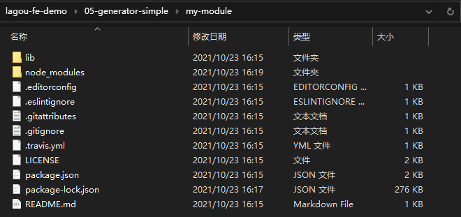

### ✍️ Tangxt ⏳ 2021-10-22 🏷️ 工程化

# 03-Yeoman 简介、Yeoman 基础使用、Sub Generator、Yeoman 使用步骤总结

## ★Yeoman 简介


时至当下 React.js 和 Vue.js 还有 Angular 大行其道（指某种思想主张或行为方式等一时非常流行） -> 这些框架的官方都提供了更为集成的脚手架工具链。所以说大家在谈论到脚手架时，往往最先想到的都是像 angular-cli 和 vue-cli 这样的工具。

对于这一类的工具，因为它太过针对于某一个框架，而且在使用上也非常的普及，我们这儿就不做过多的介绍。

这里我们着重的去探讨 Yeoman 这样一款工具。因为 Yeoman 作为最老牌、最强大、最通用的一款脚手架工具，它有更多值得我们借鉴和学习的地方。

Yeoman 官方的定义是说它是一款用于创造现代化 web 应用的脚手架工具。不同于 vue-cli 这样的工具，Yeoman 更像是一个脚手架的运行平台，我们可以通过 Yeoman 搭配不同的 generator 去创建任何类型的项目，也就是说我们可以通过创建自己的 generator 从而去定制属于我们自己的前端脚手架。当然，Yeoman 的优点同样也是它的缺点，在很多专注基于框架开发的人眼中，Yeoman 它过于通用、不够专注，所以他们更愿意使用像 vue-cli 这一类的脚手架，这也是像 vue-cli 这一类的工具它为什么现在变得这么成功，但是这个并不妨碍我们去学习 Yeoman。


那么接下来我们就快速去了解一下 Yeoman 的用法以及 generator 的工作原理，为我们后面去开发自己的脚手架做出准备。

## ★Yeoman 基础使用


接下来我们具体来看 Yeoman 这款通用型脚手架工具的基本使用。

1）检查 node、npm 版本

我们之前都知道了 Yeoman 它是一款基于 Node.js 开发的一个工具模块。那使用 Yeoman 的第一步自然是通过 npm 在全局范围去安装它。

当然，使用 npm 去安装模块的前提是你需要在机器上正常的安装 node 环境。我们得先去明确一下我们的 node 环境没有任何问题，同理，npm 的版本也是如此，npm 也没有任何问题后，不过，后续我会在使用 npm 的时候，通过另外一个工具去取代它，即 yarn 这款工具。yarn 跟 npm 在很多使用上面都是类似的，只不过它的体验我个人觉得会更加好一点。所以说我们在后续使用 npm 模块的时候，我都会采用 yarn 去安装。


2）安装 yo

yarn 全局范围安装模块的命令是：

``` bash
yarn global add yo
```

yo 这款工具就是 Yeoman 的工具模块的名字，我们回车安装。


等待 Yeoman 去安装过后，我们就可以使用 Yeoman 去帮我们创建我们的项目了。但是，在之前我们的介绍我们应该知道，单有 yo 这个模块是不够的，因为 Yeoman 它是搭配特定的 generator 才能去使用。所以我们要想去使用 Yeoman 去帮我们创建项目的话，那我们必须要找到对应项目类型的 generator。

例如我们要想去生成一个 node module 的项目，也就是一个 node 的模块。那我们可以使用 generator-node 这样一个模块儿。那使用这个 generator 方式，也是先把它通过全局范围安装的方式安装到我们的本地。

3）安装 generator

``` bash
yarn global add generator-node
```


有了这样两款模块安装到本地过后，我们就可以使用 yarn 去运行我们刚刚所安装的这个 `generator-node`的 generator ，也就是生成器会自动的去帮我们创建一个全新的 node module。

4）生成一个 node module 项目

我们可以先定位到我们项目所在的目录，我们创建一个`my-module`目录，该目录就作为我们新创建的这个模块项目的一个根目录。

在这个目录下面，我们可以通过 Yeoman 所提供的这个 `yo` 命令去运行我们刚刚所安装的那个`generator-node`的这个生成器，而运行特定的 `generator` 就是把`generator-node`的`generator-`这样一个前缀给它去掉，然后回车：


在这个过程当中，Yeoman 会提出一些问题，我们可以在命令行当中，通过命行交互的方式把它填写进去。

- 首先它第一个会问你的模块叫什么名字，我们就叫 `my-module` 
- 第二个它会告诉你，你这个模块儿其实在 npm 上已经存在了，那是否要选择另外一个？那这个时候，实际上也就是你的这个生成器，它自动的去检查了你这个包名是否可用。那我这儿就选择 `yes` ，选择完 `yes` 过后，它可以让你重新选择一个新的包名。由于我们这儿是演示，我们就使用`my-module`这样一个名字，然后我们选择 `no`，即不再去选择别的名字了。
- 最后它会让你再去输入一个 `description`，也就是你项目的一个描述。我们可以叫做 `awesome node module`
- 这个填完后再去填写一下项目的主页。那我们可以填写一个 github 仓库的地址`https://github.com/zce/my-module`
- 这个完了过后就是项目的作者的名字`zce`、邮箱`w@zce.me`、主页`https://zce.me`，还有就是你这个模块的一些关键词，那这个关键词我们就随便给一些了，比如`module, node`，而多个关键词之间，因为我们这给过去的实际上应该是一个数组，所以多个关键词之间用逗号分割就可以了
- 最后它会问你是否去发送你的这个代码覆盖率的报告到一个平台上。那这个实际上是我们在后续要跟大家介绍持续集成和代码质量保证的时候会跟大家介绍的一些工具。我们这儿先不去使用它，所以选择`n`
- 最后它会让你去输入一个 node 的版本，指的是我们当前这个模块支持 node 的哪个版本。如果我们不去输入的话，它默认支持全部版本。 -> 选择不输入，即直接回车
- 接着它还会要你输入 github 的用户名`zce`
- 最后一个就是项目的 license，我们选择 MIT

这一些所有输入的信息都会影响到我们最终生成出来的这个项目的基础结构。

当你把所有的选项都输入完成过后，它会在咱们当前这个目录下面去创建一些基础的文件，并且帮我们在项目根目录下去运行 `npm install` 去安装这个项目必要的一些依赖。


我们可以看到这个项目的目录结构：



这里面默认的这些文件都是通过`yo`这款脚手架工具帮我们创建的。

此时此刻，其实我们应该也能感受到`yo`的一个优势。我这通过 VS Code 打开当前这样一个目录，在这个目录下面的这些文件，除了基本的文件帮我们创建之外，另外，内部的一些基础代码包括一些基础的配置，它都是提前帮我们配好的，而这个其实也就是脚手架工具的一个优势。


对了，这儿还有一个需要跟大家强调的，就是在你生成项目的过程当中，当你生成完了，它会有一个环节会告诉你让你去 Travis CI 上去启用这个项目。


那个时候命令行会卡死在那，你敲一下回车，就可以结束整个脚手架的工作流程了。那这样的话整个脚手架的工作流程就结束了。

项目基本搭建结束过后，其实刚刚我们已经说过了，脚手架的整个工作流程主要的目的就是**让我们得到这样一个基础的项目结构，以及一些基础的项目代码**。

5）总结

总结一下，我们在使用 `yo` 的时候，我们先需要在全局范围去安装一个 `yo` 的工具。然后有了 `yo` 这个工具过后，我们还需要去安装特定类型的 `generator`，因为不同的`generator`就用来帮我们生成不同的项目。那我们此时演示的是一个生成 node 的项目的一个叫做`generator-node` 这样一个模块。在使用的过程当中，你去运行 yo 、空格，然后就是我们`generator`的名字这样一个命令，自动的去启动我们刚刚所安装的生成器。那这个生成器运行过程当中会问你一些问题，问到你的问题，你通过你的输入完成过后就可以得到一个你想要的项目结构。


> yo 是用来管理生成器的命令，生成器是帮我们生成复用代码的具体工具

> 举例：yo 是医院院长，生成器是具体医生。医院院长管理医生，不同的医生应对不同的场景（儿科，妇科，眼科。....）

## ★Sub Generator

