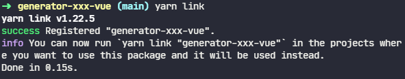

### ✍️ Tangxt ⏳ 2021-10-23 🏷️ 工程化

# 04-自定义 Generator、创建 Generator 模块、根据模板创建文件、接收用户输入、Vue Generator 案例、发布 Generator

## ★自定义 Generator


通过前面对 Yeoman 的基本使用的一个介绍，我们发现不同的 Generator 可以用来生成不同的项目。那也就是说**我们可以通过创造自己的 Generator 去帮我们生成自定义的项目结构**。

即便市面上已经有了很多的 Generator 了，但我们还是有创造自己 Generator 的必要。因为市面上的 Generator 它都是通用的，而我们在实际开发过程当中会出现**一部分基础代码甚至业务代码在相同类型项目时还是会是重复的**。那我们这个时候就可以**把公共的部分都放到脚手架当中去生成**，让脚手架工具去发挥更大的价值。

例如我们在创建 Vue.js 项目的时候，官方默认的脚手架工具，它只会去创建一个最基础的项目骨架，但是这并不包含我们经常要用到的一些模块，例如 axios 或者是 vue-router 或者是 vuex ，所以你就得需要在每次创建完项目过后，再去手动的引入这些模块，并且去编写一些基础的使用代码。

试想一下，如果我们把这些也放到脚手架当中，那么就不存在我们刚刚说的这样一个问题了。

所以，自定义 Generator 该如何去实现呢？

那接下来我们就通过自定义一个带有一定基础代码的 Vue.js 项目脚手架来跟大家具体介绍。

## ★创建 Generator 模块


创建 Generator 实际上就是创建一个 npm 的模块。但是 Generator 它有特定的结构，它需要在根目录下有一个叫 `generators` 的一个文件夹，然后在这个文件夹下面再去存放一个叫 `app` 的文件夹，用于去存放我们生存器对应的代码。


如果你需要提供多个的 Sub Generator，那你可以在 `app` 的同级目录再去添加一个新的生成器目录。例如我们这里添加一个叫做 `component` 的目录。那此时我们的模块就有了一个叫做 `component` 的子生成器，除了特定的结构，还有一个与普通 npm 所不同的是 ->  Yeoman 的 Generator 它的模块名称必须是`generator-<name>`这样一种格式。


如果你在具体开发的时候没有去使用这样一个格式的名称，那 Yeoman 在后续工作的时候就没有办法找到你所提供的这个生成器模块。

接下来我们来做一些具体的演示。

首先我们通过`mkdir`去创建一个叫做`generator-sample`这样一个文件夹，作为我们生成器模块的目录

然后我们在这个目录下面通过`yarn init`的方式去创建一个 `package.json`


再然后我们需要去安装一个 `yeoman-generator` 的一个模块。这个模块它提供了我们生成器的一个基类。那这个基类当中提供了一些工具函数，让我们可以在创建生成器的时候更加便捷。


安装完依赖过后，我们通过 VS Code 打开这个目录。然后我们在这个目录下按照项目结构要求去创建一个`generators`的文件夹，在这个目录下去创建一个 `app` 目录，然后在下面创建`index.js`文件：


那这个文件会**作为 Generator 的核心入口**，它需要去导出一个继承自 Yeoman Generator 的一个类型。而 Yeoman Generator 在工作的时候，会自动调用我们导出的这个类型当中的一些生命周期方法。那我们可以在这个文件当中，通过调用父类提供的一些工具方法去实现一些功能，比如文件写入。

在这儿，我们首先通过 `require` 的方式去载入 `yeoman-generator`，然后我们需要去导出一个类型，让这个类型继承 `Generator`，在这个类型当中，我们需要定义一个 `writing` 方法，因为这个方法在 Yeoman 工作的时候，它会在生成文件的阶段自动调用我们这个类型当中的 `writing` 方法。那在这个方法当中，顾名思义，我们可以通过文件读写的方式，往往我们生成的这个目录下去写入文件。那这儿我们通过父类当中的一个 `fs` 模块去写入文件到我们的生成目录。那需要注意的是，这里的 `fs` 模块与我们在 node 当中用的 `fs` 它是不一样的，这个是一个高度封装的 File System 模块，这相对于原生的那个 `fs` 模块儿，其功能会更加强大一些。


这里的 `write` 方法有两个参数，一个是写入文件的绝对路径，另外一个是写入文件的内容。那文件的绝对路径，我们可以借助于父类的 `destinationPath` 这样一个方法去自动获取生成项目目录下对应的文件路径。然后文件的内容，我们这用 `Math` 的 `random` 生成一个随机数代替。

这样一来，我们一个简单的 Generator 就完成了。

这时候我们回到命令行，我们通过 `npm link`（或者`yarn link`） 的方式把这个模块链接到全局范围，使之成为一个全局模块包。这样的话， Yeoman 它在工作的时候就可以找到我们自己写的这个`generator-sample`了。


准备就绪后，我们就可以通过 Yeoman 去运行这个生成器。那具体的操作方式就是通过 `yo sample` (`sample` 就是我们刚刚这个生成器的名字），然后回车。


那这个时候我们就可以看到提示我们创建了一个叫做 `temp.txt` 的文件。

我们打开这个文件：


我们会发现这个文件就是我们刚刚通过代码写入的一个内容，而这就是我们一个最基本的 Yeoman 生成器的一个开发过程了。

## ★根据模板创建文件


很多时候，我们需要自动去创建的文件有很多，而且文件的内容也相对复杂。那在这样的一种情况下，我们就可以使用模板去创建文件，因为这样可以更加便捷一些。

具体来看就是：

### <mark>1）创建模板</mark>


我们首先在生成器的这个目录下去添加一个 `templates` 目录，然后将我们需要去生成的文件都放入 `templates` 目录作为模板 -> 模板中是完全遵循 `EJS` 模板引擎的模板语法，那也就是说我们可以通过尖括号百分号（`<%`）输出的这种方式，去动态输出一些数据，也可以去做一些判断、循环之类的操作。


### <mark>2）处理模板</mark>

有了模板过后，我们在生成文件时，就不用再去借助于 `fs` 的 `write` 方法去写入文件了，而是借助于 `fs` 当中有一个专门使用模板引擎的方法，叫做 `copy template` 的方式。

这具体使用的时候它有三个参数，分别是我们模板文件的路径以及我们输出文件的路径，还有一个就是模板数据的一个上下文。

模板文件路径，我们可以借助于 `templatePath` 这样一个方法，自动地去获取当前生成器下 `templates`目录下面的文件路径

然后输出路径我们还是使用 `destinationPath` 

在模板数据上下文这一块，我们就只需要去定义一个对象就可以了。

我们将这三个参数通过`copyTpl`方法传入。那这个方法会自动的去把我们的模板文件映射到生成的这个输出文件上。

### <mark>3）使用模板</mark>

我们回到命令行，再次通过 Yeoman（`yo`）去运行我们这个 generator，此时，Yeoman 的运行过程当中就会自动使用模板引擎去渲染模板，将渲染过后的结果放到我们的输出目录。


相对于手动去创建每一个文件，模板的方式，大大提高效率，特别是在文件比较多、比较复杂的情况下。


## ★接收用户输入


### <mark>1）创建模板</mark>


对于模板当中的一些动态数据，例如项目的标题、项目的名称，而这样的数据，我们一般**通过命令行交互的方式去询问我们的使用者**，以此来得到。

### <mark>2）处理模板</mark>


在 Generator 当中想要发起一个命令行交互的询问，我们可以通过实现 Generator 这个类型当中的 `prompting`方法。

在这个方法当中，我们可以去调用父类所提供的 `prompt` 方法，发出对用户的命令行询问。

这个方法，它返回一个 `Promise`，也就是说它是一个 Promise 方法。那我们在`this.prompt()`这个地方需要对它进行 `return`，这样的话，Yeoman 在工作的时候就有更好的异步流程控制。

`prompt`这个方法它接收一个数组参数，数组的每一项都是一个问题对象。这个问题对象具体的我们可以去传入`type` 、`name` 还有 `message`以及还有它的 `default`：

- 这里的 `type` 我们选用了 `input`，也就是说使用用户输入的方式去接收用户提交信息。
- `name` 就是我们最终得到结果的一个键。
- `message` 是在界面上给用户的一个提示，也就是我们所谓的问题。
- `default` 在我们这儿取用的是一个叫`appname`的一个数据。这个属性实际上是父类当中自动帮我们拿到的当前生成项目的这个目录的文件夹的名字，那它会作为我们这一个问题的默认值。

在这个 Promise 执行完了过后，我们可以得到一个 `answers` -> 这个 `answers` 里面就是我们当前这个问题在接收完用户输入过后的一个结果，那它会以一个对象的形式出现 -> 对象里面的键就是我们刚刚 prompt 的 `name`，值就是用户输入的 `value` -> 我们将这个值挂载到 `this` 对象上面，以便于我们后面在 writing 的时候去使用它。

有了这一个 answers 的数据过后，我们就可以在 writing 的时候去传入给我们的模板引擎，使用`this.answers`这个数据去作为模板数据的上下文。

### <mark>3）使用模板</mark>

回到命令行当中，我们再次运行`yo sample`，那这个时候它会提示我们一个问题，叫做 `your project name` 


> 我的项目名没拼对，我一直以为是`proj`，其实是`ploj`

那此时我们就可以根据我们的需要去输入，输入完的结果，会作为数据出现在我们的数据上下文当中，最终在模板当中被渲染出来。


这个就是我们在 Yeoman 当中如何动态去接收用户输入数据的一种实现方式。

## ★Vue Generator 案例


接下来我们就按照之前的设想去自定义一个带有一定基础代码的 Vue.js 项目脚手架。

### <mark>1）你想要的 Vue.js 项目结构</mark>

首先我们先按照原始的方式去创建一个理想的项目结构：


在这个项目结构当中把你需要重复使用的基础代码全部包含在`src`目录里面。然后我们再去封装一个全新的 Generator 用于去生成我们这样一个理想的项目结构。

### <mark>2）创建 Generator</mark>


我们首先打开命令行窗口，然后通过 `mkdir` 去创建一个全新的 generator 目录 -> 我们叫做 `generator-zce-vue` -> 进入到这个目录。

有了这个目录过后，我们再通过`yarn init`的方式去初始化一个`package.json`，然后我们再去安装一下 Yeoman 的依赖：

``` bash
yarn add yeoman-generator
```

安装完成过后，我们用 VS Code 打开当前`generator-zce-vue`这样一个项目。

### <mark>3）写 Generator 的主入口文件</mark>

#### <mark>1、创建主入口文件</mark>

接下来我们新建一个 Generator 的主入口文件，也就是 `generators` 下的 `app` 下的 `index.js`文件。


#### <mark>2、定义 `prompting` 方法</mark>

在这个文件当中，我们还是跟之前一样，通过 `require` 方式载入`yeoman-generator`这样一个基类，然后导出一个类型，这个类型它继承自 `Generator`。

在这个类型当中，我们需要去定义一个 `prompting` 方法，用于以命令行交互的方式询问用户一些问题。那我们这里的问题就比较简单，就是一个项目的名称。

在 `prompting` 的 `then` 里面，我们需要去拿到这个 `prompt` 的返回值，也就是用户输入的数据，我们把这些数据同样也是挂载到 `this` 上面，这样的话我们在后续 writing 的时候可以使用到它。


#### <mark>3、定义 `writing` 方法</mark>

紧接着我们定义一下 `writing` 方法。

这个时候的 `writing` 方法它不再像咱们之前只是写入单个文件，它需要批量的把我们刚刚所提前准备好的那样一个结构，给它批量生成 -> 所以我们先去创建一个 `templates` 目录，把我们项目的一个结构拷贝到这个 `templates` 当中作为模板。


> 这个`templates`目录，我放错位置了，它在`app`目录下，可不是在根目录下

有了模板过后，我们需要把这个项目结构里面一些可能会发生变化的地方，通过模板引擎语法的方式去挖坑。我们在`prompting`接收的只有一个项目的名称，所以我们得把模板里边能替换这个项目名称的地方 -> 全部给大家替换成 EJS 的模板标记。


替换完成模板过后，我们再回到我们的代码当中，那这个时候我们按道理应该是一个一个的去生成每一个文件，把它生成到对应的目标路径。那我们这个地方通过一个数组循环的方式去批量的生成每一个文件。

我们这儿先把我提前定义好的一个数组给它拷贝过来。


这个数组实际上就是我们`templates`下的每一个文件的相对路径。

有了这样一个数组过后，我们就可以通过 `templates.forEach`去遍历这个数组当中的每一个路径，从而为每一个模板去生成它在目标目录当中的对应文件。


这里我们同样使用`fs`的`copyTpl`方法去把我们每一个路径对应的模板生成到对应的目标文件。

### <mark>4）把模块注册到全局</mark>

接下来，我们回到命令行当中，我们通过`yarn link`的方式，同样把咱们这个`generator-zce-vue`的这样一个模块，作为全局的模块 `link` 到全局：



### <mark>5）使用模板</mark>

然后我们定位到一个全新的目录，然后尝试通过 Yeoman 去运行我们刚刚所创建的这样一个 Generator


这时候它会需要我们输入一个项目的名称，这个是因为我们定义了一个命令行交互问题。

回车过后，它报了一个错误。


那这个错误提示我们什么呢？ -> 我们找不到一个叫`yarn.lock` 的一个源文件。

这个可能是我之前犯了一个错误 -> 我在这个数组当中定义了一个`yarn.lock`文件，而我的模板当中并没有这样一个文件。所以我们把数组当中的 `yarn.lock`给它删除就可以了。


回过头来我们再次重新运行，同样需要输入项目的名称。这个时候它又报了一个错误 -> 这个错误主体的信息是`BASE_URL is a not defined`


那这个错误说的是什么呢？ -> 说的是咱们在模板当中 `public` 这个目录下的`index.html`文件当中有一个模板标记，而这个模板标记它正好是一个 EJS 的模板标记，而它并不像下面的这个 `name` 是我们在模板当中正常使用的这个数据输出，它是需要原封不动的输出的。那这个时候原封不动的去输出一个 EJS 的模板标记的方式，就是我们在尖括号百分号后面再加上一个百分号，那这样的话，这一个 EJS 的模板标记就会被转译，它就不会再有问题了。


我们再次回到命令行当中，我们再次去执行。


那这个时候它就会重新去帮我们生成对应这个新的项目结构。而在这个新的项目结构当中，我们那些需要被替换的这个数据已经正常被替换掉了。


那这样的话，我们一个原始的项目结构就可以被复用起来了。当然，你在后续去做的时候，你可以加上更多的选项，让我们的项目脚手架可以更加灵活，更加通用。

## ★发布 Generator


因为 Generator 实际上就是一个 npm 的模块，所以说我们去发布 Generator 实际上就是去发布一个 npm 的模块。

我们只需要将自己已经写好的 Generator 模块儿通过 `npm publish` 这样一个命令去发布成一个公开的模块就可以了。

具体在做之前，我们一般会将这个项目的源代码托管到一个公开的源代码仓库上面。

### <mark>1）创建本地仓库</mark>

那这儿我们通过命令行先去创建一个本地的仓库。

我们打开命令行，在创建本地仓库之前，我们先去创建一个 gitignore 用于去忽略一下我们项目的 `node_modules` 这样一个目录：

``` bash
echo node_modules > .gitignore
```

有了这样一个文件过后，我们再通过 `git init` 去初始化一个本地的空仓库。

有了本地空仓库过后，我们可以通过 `git status` 去看一下本地仓库的一个状态 -> 这里面这些文件默认没有被跟踪：


那我们可以通过 `git add .` 跟踪当前目录下所有的文件（也就是说将内容从工作目录添加到暂存区）

完事过后，我们需要去创建一次提交，也就是通过 `git commit -m "feat: initial commit"`


### <mark>2）创建远程仓库</mark>

创建完提交过后，接下来我们就需要有一个远端的仓库，我们把本地的提交日志给它同步到远端。那这个时候我们打开 github 去创建一个新的仓库。

那仓库的名字我们就叫 `generator-xxx-vue` -> 关于我们的描述，你可以根据自己的需要去填写 -> 我们这儿直接点击 `create repository`


得到了一个远端的空仓库过后，我们把远端仓库的这个地址复制下来：


回到命令行当中。我们通过 `git remote add origin 远端的这个地址`，这样的话就为我们本地的这个仓库添加一个远端仓库的别名。这样一来，我们在 `push` 的时候就可以使用这个别名 `origin`：

``` bash
git push -u origin master
```

我们就把本地 `master` 分支的代码推送到远端的 `master` 分支。


### <mark>3）发布这个`generator-xxx-vue`模块</mark>

在创建完这个仓库过后，紧接着我们就可以在项目根目录下，通过 `npm publish` 的方式去发布这个模块。

不过我一直用的是`yarn`，所以说我们这儿使用 `yarn publish` -> 效果上是一样的。

在 `publish` 的时候，它会提示你是否要去对你的这个 `package.json` 当中的这个版本做一个修改。


那我这儿就不做任何的修改了，直接回车就好了

然后它会提示我让我输入用户名和密码。如果说你是第一次使用的话，它会让你输入用户名，否则，我们就直接输入密码就好了。


在输入完用户名密码过后，我们会发现它这提示了一个错误，原因是因为我们在国内的开发者一般会使用淘宝的 npm 镜像源去取代官方的镜像。那这个时候你在往 npm 的这个仓库上去发布代码的时候就会出现问题，因为淘宝的镜像它是一个只读镜像。


> 报错信息跟视频里不一样


那这个时候我们可以怎么办呢？可以先去修改一下你本地的镜像配置，或者是我们通过 `publish` 的时候，跟上一个 `registry` 的一个参数，让它等于官方的镜像，因为我用的是`yarn`，所以说我们使用的是 `yarn` 的镜像：

``` bash
yarn publish --registry=https://registry.yarnpkg.com
```


回车后，那这个时候我就会自动的去推送我的这个项目到 yarn 的官方镜像。而 yarn 的官方镜像跟 npm 它是保持同步的。所以说这个时候就已经把我们的这个模块发布成功了，我们回到 npm 的官网上去刷新一下这样一个地址。


那这个时候我们刚刚所创建的这个模块就已经被推送上来了。

有了这样一个模块，我们就可以在全局范围通过 npm 或者 yarn 的方式去安装，然后再通过 Yeoman 去使用它。

那这儿还有一个需要注意的是什么呢？如果说你需要你的这个 Generator 在官方的这个仓库列表当中也会出现的话，那你可以为你的这个项目添加一个 `yeoman-generator` 关键词。那这个时候，Yeoman 的官方就会发现到你的这个项目，不过我们这只是一个测试，所以我们就不做这样一个操作了。

## ★了解更多

➹：[EJS -- 嵌入式 JavaScript 模板引擎 - EJS 中文文档](https://ejs.bootcss.com/#install)

➹：[10 分钟入门 ejs 模板语法 - 谢家和的网络日志](https://xiejiahe.com/blog/detail/5a74106674aaca06bbdb7d25)

➹：[搭建一个通用的脚手架 · Issue #23 · jiangtao/blog](https://github.com/jiangtao/blog/issues/23)

## ★Q&A

#### <mark>1）自己添加笔记时的模板？</mark>

- 创建一个分类的模板 -> 笔记本
- 创建一个课程的模板 -> 一个个课程

我尝试了一下，还是手动创建方便！毕竟文件数量就一两个！ -> 而生成模板时，相较于手动创建的时间，要更久一点！

#### <mark>2）关于命令行参数规范？</mark>

> 命令行只是为了实现某种功能的文本描述 -> 为了减少在终端交互模式下的输入成本和开发的规范性，衍化出了这些概念（`arguments、flags、options`）

在 Linux 的 shell 中，我们把 `-` 和 `--` 加上一个字符（字符串）叫做命令行参数，主流的有下面几种风格：

* Unix 风格参数，前面加单破折线 `-`：`ls -l`、`git commit -am "xxx"`
* BSD 风格参数，前面不加破折线：`ps aux` -> `aux`是三个参数
* GNU 风格参数，前面加双破折线 `--`：`npm install lodash --save`、`npm install express --save-dev` -> 双减号后面就是一个参数，单减号在这里就是一个连字符的作用，就是为了把两个单词隔开，为了美观

关于`-`，比如 `ls -a` 和 `ls --all` 意思是一样的。`-h` 往往对应 `--help` 。`-v(-V)` 对应 `--version`。但是也有一些非主流的例外。

> 为啥会出现全拼单词？因为单独字母的数量毕竟有限，会不够用，而且表达的意思不够明确，所以出现了`help`这样的全拼，而`h`这样的字母数量有限！

不用记这个命令行应用有哪些参数选项？ -> `-h`、`--help`


> `函数名` 等价于命令名 -> `形参名` 等价于 options（可选的，就像多选框一样，你想打钩就打钩） -> `传入的实参` 等价于 arguments
> 
> 假设 `options` 不需要传值，是不是只需要利用 `flags` 这样的字段作为某一功能的使能标志位就好了？ -> 所以我们会看到 `flags` 有时也叫 `options`
> 
> `./yourcmdtool -host 127.0.0.1 -port 80 run get` -> `host` 和 `port` 即为 flags or options、`run get` 即为 args

注意：

> `--`或者`-`独立存在（即后面没有紧跟着单词或字母）这种情况也是存在的，有时是为了分隔`[选项]`与`[参数]`，因为可能会产生歧义，bash，git 等很多命令就是这样

有一些单中划线`-`则代表把内容输出到 stdout，典型的比如：

``` bash
wget -O - https://www.baidu.com/
```

这里的单`-`代表输出到 stdout

甚至有些时候可以把这个`-`跟前面的部分完全连起来：

``` bash
wget -O- https://www.baidu.com/
```

wget 默认是把文件写入当前目录，加上这个`-O` `-`就相当于 `curl` 的默认效果了

还有时是为了给前一个程序的`[选项/参数里的程序传参数]`，比如

``` bash
# 这里 -- 后面的参数其实是传给 a.js 的
pm2 start a.js -- --port 80
```

总之不一定所有程序都是一致的，需要的时候文档里面找就可以了

➹：[命令行选项标准 - imbAnt's blog](https://imbant.github.io/blog/2020/05/08/%E5%91%BD%E4%BB%A4%E8%A1%8C%E9%80%89%E9%A1%B9%E6%A0%87%E5%87%86/)

➹：[命令行参数前的「-」和「--」有什么区别？ - 知乎](https://www.zhihu.com/question/267095526)

➹：[基础概念——命令的约定格式规范](https://www.cnblogs.com/grooovvve/p/12977210.html)

➹：[如何区分命令行下的 arguments、flags、options? - SegmentFault 思否](https://segmentfault.com/q/1010000011077731)

#### <mark>3）Yeoman？install？</mark>

`install`方法设置在文件 copy 完成之后执行的命令，例如

``` js
module.exports = class extends Generator {
install() {
this.installDependencies({
    bower: true,
    npm: true,
    yarn: false,
    callback: function () {
      this.log('Everything is ready!');
    }
  });
  }
};
```

之前就有得疑问 -> 使用`xxx-vue`生成一个 Vue 项目过程中，居然自动用`npm`安装依赖了！

➹：[Yeoman-脚手架搭建工具《三》 - SegmentFault 思否](https://segmentfault.com/a/1190000038438168)

➹：[Yeoman](https://gist.github.com/orangeyyy/c3dd0a3e7c2c288559b18a6936b048e5)

➹：[yeoman-generator 深入使用- 进击的前端工程狮](https://www.xiaolai.cc/2019/06/11/yeoman-generator/)

➹：[使用 Yeoman 定制前端脚手架 - 掘金](https://juejin.cn/post/6844903491157114888)
