### ✍️ Tangxt ⏳ 2021-10-25 🏷️ 工程化

# 05-Plop 简介、Plop 的基本使用、脚手架的工作原理

## ★Plop 简介

除了像 Yeoman 这样大型的脚手架工具，还有一些小型的脚手架工具也非常出色。

这里跟大家安利一款我个人经常使用的一个小型的脚手架工具——Plop

Plop 它其实是一款主要用于去创建项目中特定类型的文件的一个小工具，它有点儿类似于 Yeoman 当中的 Sub Generator，不过它一般不会独立去使用，一般我们都会把 Plop 集成到项目当中，用来自动化的去创建同类型的项目文件。

接下来我们来通过两个案例的对比去体会一下 Plop 的具体作用以及它的优势。

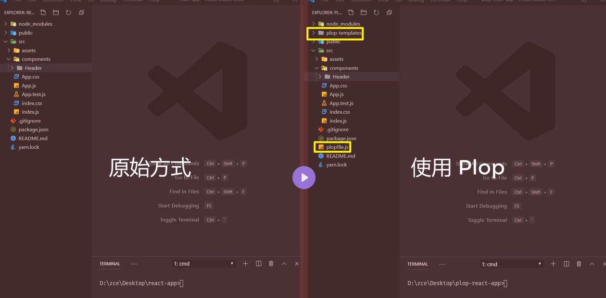

屏幕上给出的是两个相同的 React 项目。有所不同的是，右侧项目当中我们集成了 Plop 工具，那它们之间具体的差异 -> 我们需要从日常开发中经常面临的一个问题说起 -> 那就是我们在开发过程当中经常需要去重复创建相同类型的文件。

例如在我们今天的这个案例当中，每一个页面上的组件都会有三个文件去组成，这分别是一个 JS 文件、一个 CSS 文件，还有一个`test.js`文件。

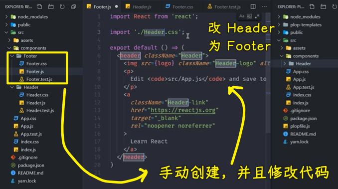

如果我们需要去创建一个新的 React 组件，那我们就需要去创建三个文件，而且每一个文件当中都还有一些基础的代码。那整个过程非常的繁琐，而且我们很难统一每一个组件文件当中那些基础的代码。

相对于左侧的项目，右侧的项目中使用了 Plop，那面对相同的问题，使用 Plop 就会方便很多。我们只需要在命令行当中去运行 Plop，那命令行就会根据我们之前 Plop 的一些配置，自动的去询问我们一些信息，然后根据我们所输入的结果自动的去帮我们创建对应的这些文件：

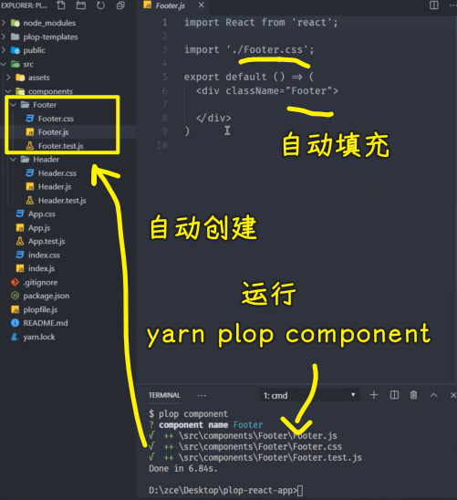

那这样就确保了我们每次创建的文件都是统一的，而且整个过程是自动化的，那这样就**大大提高了我们在项目当中每次去创建重复文件时的效率**了。

## ★Plop 的基本使用

接下来，我们一起在一个 React 项目当中去加入 Plop 的集成，去了解一下 Plop 它该如何具体使用。

1）准备一个用来测试的 React 项目

这是一个非常基础的 React 项目：

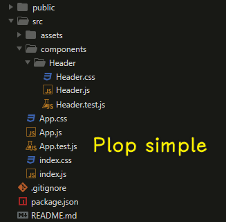

2）安装开发依赖：plop

我们使用 Plop 的第一件事就是将 Plop 作为一个 npm 的模块安装到我们的开发依赖当中。

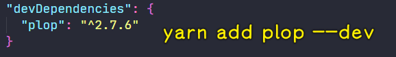

3）根目录下新建 `plopfile.js` 文件

安装完成过后，我们需要在项目的根目录下去新建一个`plopfile.js`的一个文件。

1、导出一个函数

这个文件是 Plop 工作的一个入口文件，它需要去导出一个函数，而且这个函数当中它可以接收一个叫做 `plop` 的对象。那这个对象里面提供了一系列的工具函数，用于去帮我们创建生成器的任务。

具体来做就是通过 `module.export` 导出这样一个函数。

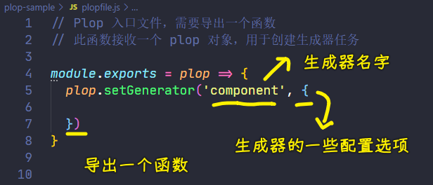

在这个函数当中，我们接收 `plop` 这样一个形式参数。 `plop` 它内部有一个成员叫做 `setGenerator`，`setGenerator` 它需要接收两个参数：

- 第一个参数是我们这个生成器的名字
- 第二个参数是生成器的一些配置选项

2、配置选项

💡：指定描述

在配置选项当中，我们需要去指定一下我们这个生成器的一个描述`description`。比如我们这儿这个生成器的名字是`component`，那它的作用就是创建一个 `component`

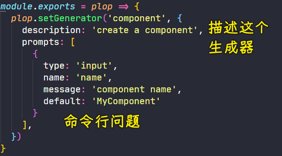

💡：指定命令行问题

除了 description 之外，我们还可以在这个 Generator 当中去指定我们 Generator 工作的时候会发出的命令行问题。

这些问题也会像我们之前看到的那些命令行交互问题一样，即出现在命令行交互环节，我们可以通过：

- `type` 去指定这个问题的输入方式
- `name` 去指定这一个问题的一个返回值的一个键
- `message` 是屏幕上给出的一个提示。
- `default` 是我们这个命令的默认答案。

💡：指定任务动作

有了命令行交互问题过后，我们还可以去指定一个`actions`，`actions`顾名思义，它就是咱们这个生成器在完成命令行交互过后需要执行的一些动作。

它可以是一个数组，在这个数组当中，每一个对象就是一个动作对象 -> 这个动作对象我们可以通过 `type` 去指定我们的这个动作的类型 -> 我们此处用的类型是 `add`，它代表添加一个全新的文件

然后我们可以通过 `path` 属性去指定我们需要添加的这个文件会被添加到哪一个具体的路径 -> 那我们这儿就添加到 `src` 下面的 `components` 下面对应的文件中 -> 需要注意的是，我们在这个路径当中可以使用双花括号这种插值表达式的方式去插入我们刚刚在命令行交互当中得到的数据 -> 此处我们用的双花括号 `name`，它代表的就是我们刚刚在命令行交互当中的 `name` 取值：

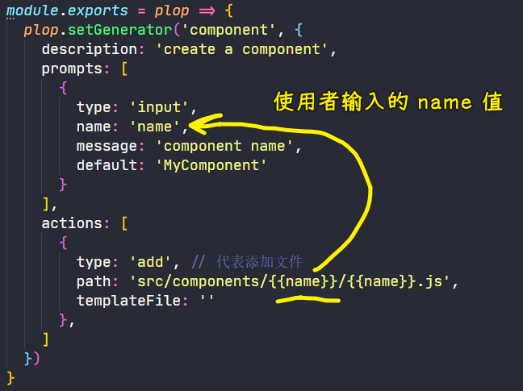

除了`path` 之外，我们还需要去指定一下本次去添加的这个文件，它的模板文件是什么？ -> 我们可以通过 `templateFile` 属性去指定，那这个时候我们就需要去添加一个对应的模板

4）添加模板文件

一般我们会把 Plop 的模板放在项目根目录下的一个叫做`plop-templates`一个文件夹下面。

在这个目录下，我们可以通过`handlebars`模板引擎的方式去创建一些模板文件 -> 这些模板都是遵循 handlebars 模板语法的 -> 在这个文件`component.hbs`当中，我们可以通过双花括号这种小胡子语法去插入对应的数据

有了这样一个模板过后：

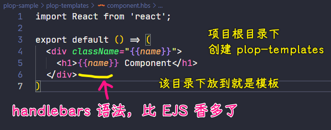

💡：指定模板路径

我们就可以回到 `templateFile` 当中去填写这样一个路径 -> 此时我们的 `templateFile` 就是 `plop-templates`下的`component.hbs`

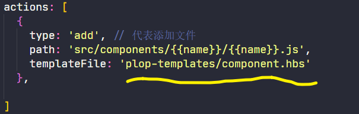

一切准备就绪后，我们这个 Plop 就基本上完成了。

5）用 `yarn` 启动这个 `plop` CLI，让它去执行生成器 `Component`

在完成了这个 Plop 的任务定义过后，我们可以回到命令行，因为我们在安装这个 Plop 模块的时候，Plop 它提供了一个 CLI 程序：

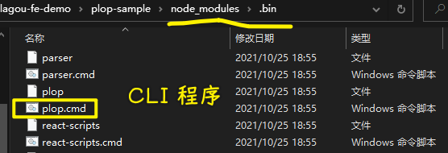

我们可以通过 yarn 去启动这个 Plop 程序。

这具体的使用方式就是通过`yarn plop`然后后面跟上我们生成器`component`的名字 -> 这儿需要跟大家补充一下的就是`yarn`会自动找到`node_modules`下面的`bin`目录下的命令行工具。

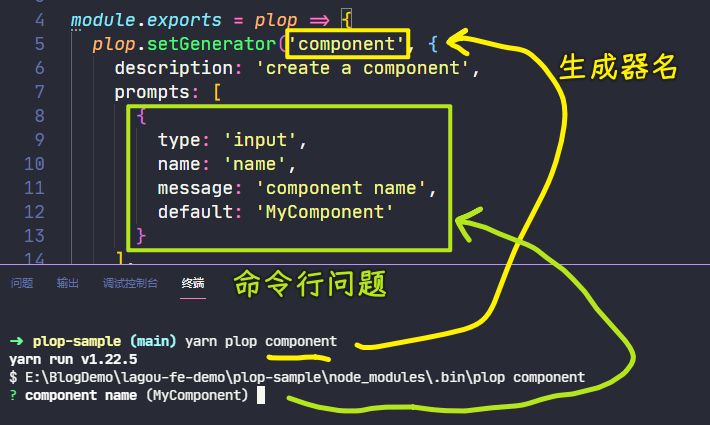

6）根据模板创建新文件成功

回过头来，我们可以看到它会像我们之前使用 Yeoman 一样去发出一些命令行的问题 -> 不过这个地方的命令行问题，我们是通过刚刚的`plopfile.js` 去定义的

在输入完这个问题过后，我们就可以得到一个新文件的创建，我们可以看到有一个文件就会根据我们的模板去创建成功：

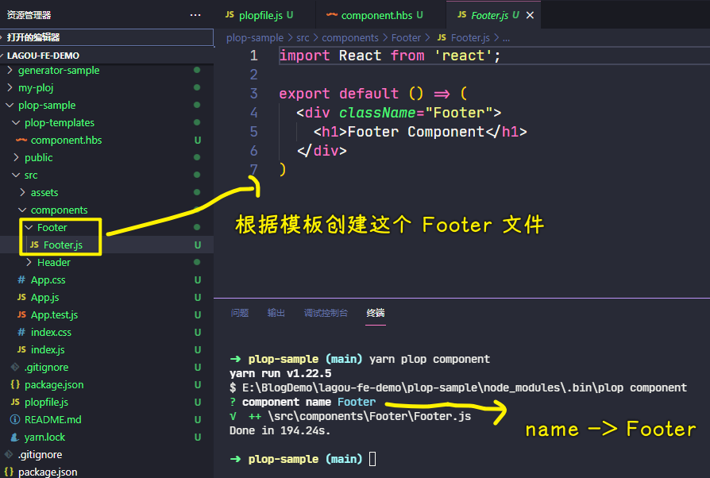

7）追加`css`和`test`这两个模板文件

有了这样一个最基础的体验过后，那接下来我们可以尝试着为这个生成器添加多个模板，因为在 React 当中，组件是由多个文件组成的，所以我们这儿各自为组件的 css 文件和 test 文件去添加相应的模版。

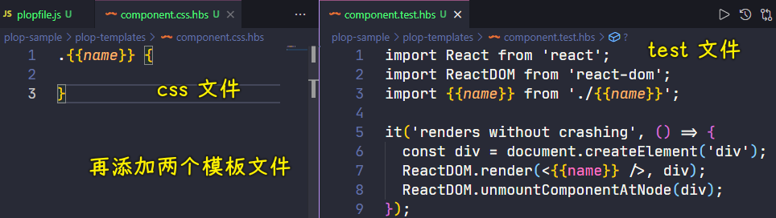

有了这些模板过后，我们就可以回到`plopfile.js`当中去添加多个 `action`，同样，每一个 `action` 我们的 `type` 都是 `add`，因为我们这一次都是要根据模板去创建新的文件。

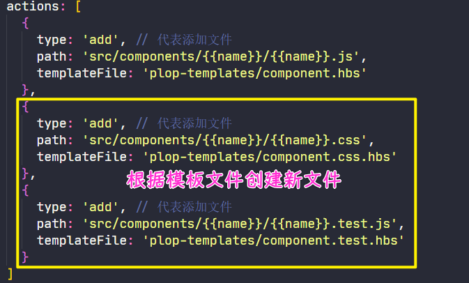

官网当中它介绍了更多的 `type`，那你可以根据自己的需要去找。

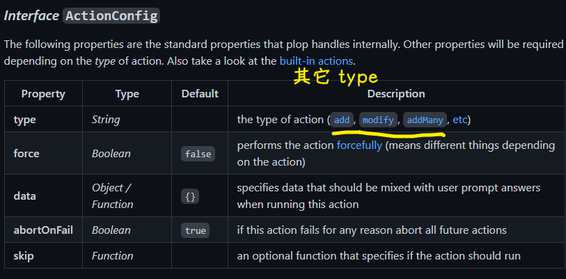

> [plopjs/plop: Consistency Made Simple](https://github.com/plopjs/plop#interface-actionconfig)

8）再次启动 `plop` CLI

完成过后我们回到命令行，此时我们重新运行这样一个 Plop 的生成器。

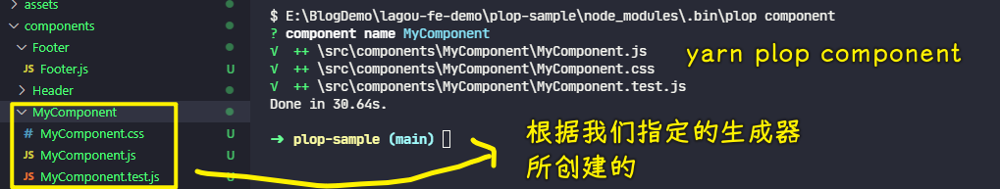

生成完成过后，它会自动去帮我们创建三个文件 -> 因为这三个文件就是我们刚刚在 `action` 里面指定的三个任务。

以上就是 Plop 的一个基本的使用了。

在这个过程当中，我们基本上就会发现 Plop 它用来去创建我们项目当中同类型的文件，还是非常方便的。

9）总结

总结一下我们在一个项目当中具体去使用 Plop 需要这么几个步骤：

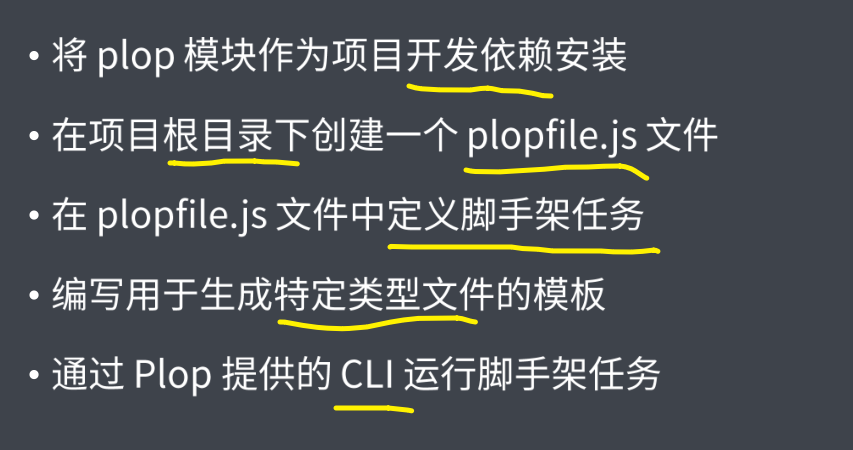

- 首先我们需要将 Plop 模块作为项目的开发依赖去安装。
- 然后我们需要在项目的根目录下去新建一个`plopfile.js`文件。在有了这个`plopfile.js`文件过后，我们需要在这个文件当中去定义一些脚手架的任务。
- 最后我们去编写一些用于生成特定类型文件的模板。

这一切都完成过后，我们需要通过 Plop 所提供的 CLI 去运行我们刚刚制定的脚手架任务，从而去生成我们在项目当中的一些特定类型的文件。

## ★脚手架的工作原理